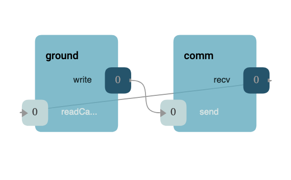
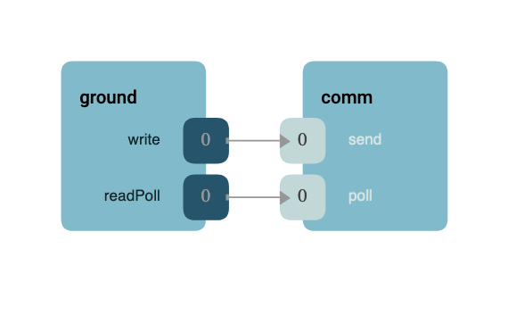
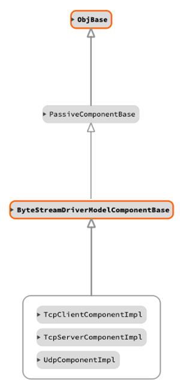

\page DrvByteStreamDriverModel Drv::ByteStreamDriverModel Byte Stream Driver Model
# Drv::ByteStreamDriverModel Byte Stream Driver Model

The byte stream driver is a generic model for drivers implementing a "stream of bytes" interface. Typically these
drivers operate with an outgoing stream and an incoming stream. The outgoing stream is represented by the "send" port
and the incoming stream is either polled using the "poll" port or return asynchronously via the "readCallback" port.

## Design

The manager component (typically the ground interface) initiates the transfer of send data by calling the "send" port.
The caller will provide a `Fw::Buffer` containing the data to send and the port call will return a status of that send.
These responses are an enumeration whose values are described in the following table:

| Value | Description |
|---|---|
| Drv::SEND_OK    | Send functioned normally. |
| Drv::SEND_RETRY | Send should be retried, but a subsequent send should return SEND_OK. |
| Drv::SEND_ERROR | Send produced an error, future sends likely to fail. |

**Note:** in either formation described below, send will operate as described here.

### Callback Formation

In the callback formation, the byte stream driver component initiates the transfer of received data by calling the
"readCallback" output port. This port transfers any read data in a `Fw::Buffer` along with a status for the receive.
This status is an enumeration whose values are described in the following table:

| Value | Description |
|---|---|
| Drv::RECV_OK    | Receive functioned normally buffer contains valid data. |
| Drv::RECV_ERROR | Receive produced an error and buffer contains no valid data. |

The following components implement the byte stream model using a callback formation:
- `DrvTcpClient`: a F´ component wrapper of the tcp client
- `DrvTcpServer`: a F´ component wrapper of the tcp server
- `DrvUdp`: a F´ component wrapper of the udp

### Polling Formation

In the polling formation, the manager component (typically the ground interface) initiates the transfer of received
data by calling the "poll" input port. This port fills in the provided `Fw::Buffer` along with a status for the poll.
This status is an enumeration whose values are described in the following table:

| Value | Description |
|---|---|
| Drv::POLL_OK    | Poll functioned normally buffer contains valid data. |
| Drv::POLL_RETRY | Poll should be retried and a subsequent send should return POLL_OK. |
| Drv::POLL_ERROR | Poll produced an error and buffer contains no valid data. |

**Note:**  there are no known implementers of the polling formation, although this formation is best suited for
implementations running on baremetal machines.

## Class Diagram

## Requirements

| Name | Description | Validation |
|---|---|---|
| BYTEDRV-001 | The ByteStreamDriverModel shall provide the capability to send bytes | inspection |
| BYTEDRV-002 | The ByteStreamDriverModel shall provide the capability to poll for bytes | inspection |
| BYTEDRV-003 | The ByteStreamDriverModel shall provide the capability to produce bytes | inspection |
