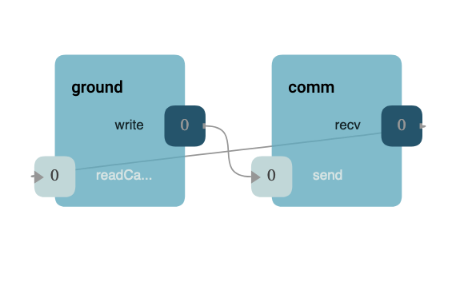
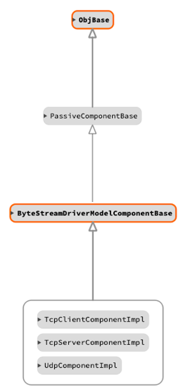

# Drv::ByteStreamDriverModel Byte Stream Driver Model

The byte stream driver is a generic model for drivers implementing a "stream of bytes" interface. Typically these drivers operate with an outgoing stream and an incoming stream.  
The outgoing stream is represented by the input `send` port; other components can invoke this port to send data through the driver. The incoming stream is represented by the output `recv` port; the driver will call this port to send data to the component that is receiving data from the driver.

## Design

The manager component (for example a radio manager) initiates the transfer of send data by calling the "send" port.
The caller will provide a `Fw::Buffer` containing the data to send. The driver component **must** perform a callback on its `dataReturnOut` to return the status of that send as well as returning ownership of the `Fw::Buffer` to the caller.
These responses are an enumeration whose values are described in the following table:

| Value | Description | Buffer Ownership |
|---|---|---|
| Drv::OP_OK    | Send functioned normally. | Ownership of the `Fw::Buffer` passes to the byte stream driver. |
| Drv::SEND_RETRY | Send should be retried, but a subsequent send should return OP_OK. | The caller retains ownership of the `Fw::Buffer`. |
| Drv::OTHER_ERROR | Send produced an error, future sends likely to fail. | Ownership of the `Fw::Buffer` passes to the byte stream driver. |

### Callback Formation

In the callback formation, the byte stream driver component initiates the transfer of received data by calling the
"recv" output port. This port transfers any read data in a `Fw::Buffer` along with a status for the receive.
This status is an enumeration whose values are described in the following table:

| Value | Description |
|---|---|
| Drv::OP_OK    | Receive functioned normally and buffer contains valid data. |
| Drv::RECV_NO_DATA    | Receive worked, but there was no data  |
| Drv::OTHER_ERROR | Receive produced an error and buffer contains no valid data. |

The following components implement the byte stream model using a callback formation:
- `DrvTcpClient`: a F´ component wrapper of the tcp client
- `DrvTcpServer`: a F´ component wrapper of the tcp server
- `DrvUdp`: a F´ component wrapper of the udp

## Class Diagram

## Requirements

| Name | Description | Validation |
|---|---|---|
| BYTEDRV-001 | The ByteStreamDriverModel shall provide the capability to send bytes | inspection |
| BYTEDRV-002 | The ByteStreamDriverModel shall provide the capability to produce bytes | inspection |
