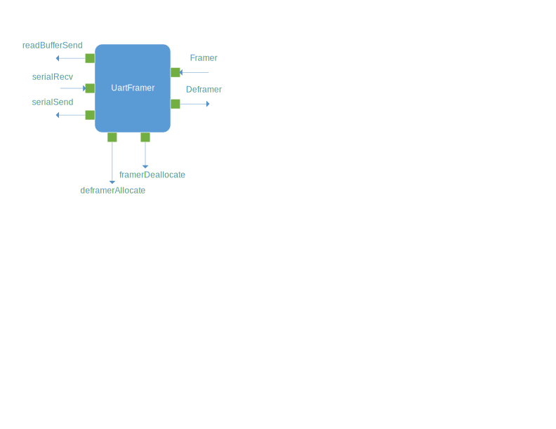
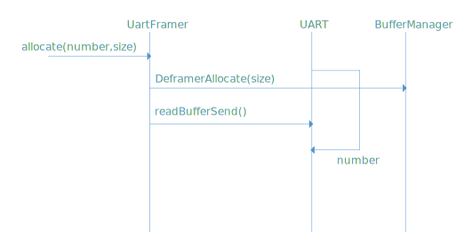
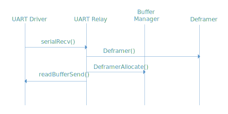
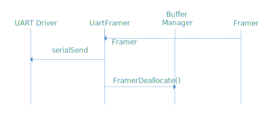
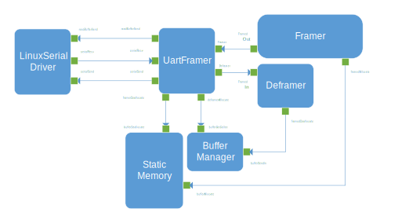

\page DrvUartFramerComponent Drv::UartFramer Component
# Drv::UartFramer UART Framer Component

The UART Framer Component is used to bridge the [Framer](../../Svc/Framer/docs/sdd.md) and 
[Deframer](../../Svc/Deframer/docs/sdd.md) components to the [Linux Serial Driver](../LinuxSerialDriver/) component.
Another UART driver could be used as long as it supports the same interfaces as the Linux Serial Driver.
This allows a connection to the F Prime [ground system](https://github.com/fprime-community/fprime-gds) via a standard
UART connection. The component is defined as passive, since it acts as a pass-through and doesn't require its own
thread.

## Design

### Component Diagram



### Port List

|Port Name|Description|
|---|---|
|DeframerAllocate|Allocates buffers for the UART driver to send to the deframer via the UartFramer.|
|FramerDeallocate|Deallocate buffers sent by the framer|
|Framer|Receives packets for downlink|
|Deframer|Sends received packets for uplink|
|readBufferSend|Sends buffers to UART driver receive buffer pool|
|serialRecv|Receives uplink buffers from UART driver|
|serialSend|Sends downlink buffers to UART driver|

### Initialization

During initialization, the `UartFramer` component supplies an initial set of buffers to the UART driver to act as a receive pool for received data.

The initialization call is as follows:

```
void allocate(NATIVE_UINT_TYPE number, NATIVE_UINT_TYPE size);
```

The arguments are as follows:

|Argument|Description|
|---|---|
|number|The number of buffers to allocate. This should be defined to cover any anticipated surges in data that could temporarily outpace processing|
|size|The size of each buffer. Should match the size of buffers used for `Framer` and `Deframer`.

The component invokes the `DeframerAllocate` port enough times to allocate the number of buffers in the `number` parameter, with a requested size of `size`. For each of those invocations, the buffer is passed to the UART driver for the receive pool via the `readBufferSend` port.

In order for the allocation call to work, all ports should be connected before invoking `allocate()`.



## Uplink

When packets arrive via the UART, the UART driver connected to `UartFramer` will get a buffer from the pool of buffers that were initially allocated and fill it with the packet data. The packets are then sent to `UartFramer` via the `serialRecv` port. The buffer is forwarded to the `Deframer` component for processing via the `Deframer` port.
The `Deframer` component will deallocate it when complete. After the packet is forwarded to the `Deframer` component, another packet is allocated via the `DeframerAllocate` port and sent to the UART driver to replenish the pool of receive buffers.




## Downlink

The `Framer` component allocates a packet and fills it with data. The packet gets sent to `UartFramer`, which sends it to the UART driver via the `serialSend` port. When the port call returns (see requirement #4 below), the buffer is deallocated via an invocation of the `FramerDeallocate` port.



## Error handling

The `UartFramer` component converts the UART receive error status to the corresponding `Deframer` error status.

If the `UartFramer` cannot allocate an additional buffer for the serial receive pool, it will issue a `WARNING_HI` event. In this case, the receive pool will permanently lose a buffer.

## Interconnections

The following is a diagram of how the `UartFramer` would be connected to the `Framer` and `Deframer` and LinuxSerialDriver components in a typical topology. Note that the types are in the diagram rather than instance names which would be in the actual topology specification.



## FPP examples

An example instance of the `LinuxSerialDriver` in the topology is as follows:

```
instance gndUart: Drv.LinuxSerialDriver \
    base id 2000 \
  {

  phase Fpp.ToCpp.Phases.configComponents """
  bool openStat = gndUart.open("/dev/ttyUL1",
    Drv::LinuxSerialDriverComponentImpl::BAUD_115K,
    Drv::LinuxSerialDriverComponentImpl::NO_FLOW,
    Drv::LinuxSerialDriverComponentImpl::PARITY_NONE,
    true
    );
  FW_ASSERT(openStat);
  
  """

  phase Fpp.ToCpp.Phases.startTasks """
  gndUart.startReadThread();
  """

  phase Fpp.ToCpp.Phases.stopTasks """
  gndUart.quitReadThread();
  """

  }
```

The `LinuxSerialDriver` FPP is included as an illustration of how to initialize the UART driver and to relate to the FPP topology code below.

An example instance of the `UartFramer` in the topology FPP is as follows:

```
instance gndUartFramer: Drv.UartFramer \
    base id 2100 \
  {

  phase Fpp.ToCpp.Phases.startTasks """
  gndUartFramer.allocate(10,1024);
  """

  }
```

This code pre-allocates 10 1K buffers for the UART driver. It places this call in the initialization phase where component tasks are started, where we know all connections have been completed.

An example set of connections in the topology FPP is as follows:

```
  connections SomeDeployment {

    gndUart.serialRecv[0] -> gndUartFramer.serialRecv[0]
    gndUartFramer.serialSend[0] -> gndUart.serialSend[0]
    gndUartFramer.readBufferSend[0] -> gndUart.readBufferSend[0]

    gndUartFramer.DeframerAllocate[0] -> gndBufferManager.bufferGetCallee[0]
    gndUartFramer.FramerDeallocate[0] -> staticMemory.bufferDeallocate[1]

    gndUartFramer.Deframer[0] -> uplink.framedIn[0]
    uplink.framedDeallocate[0] -> gndBufferManager.bufferSendIn[0]

    downlink.framedOut[0] -> gndUartFramer.Framer[0]
    downlink.framedAllocate[0] -> staticMemory.bufferAllocate[1]

    ...
```

This matches the diagram above where instance names are used as opposed to type names in the diagram.

## Requirements

| Name | Description | Validation |
|---|---|---|
| UART-FRAMER-COMP-001 | The `UartFramer` component shall pass the `Framer` downlink buffers to UART driver | unit test |
| UART-FRAMER-COMP-002 | The `UartFramer` component shall pass buffers received by the UART to the `Deframer` | unit test |
| UART-FRAMER-COMP-003 | The `UartFramer` component shall supply the UART driver with a specified number of receive buffers at initialization time| unit test |
| UART-FRAMER-COMP-003 | The `UartFramer` component shall pass any receive failure statuses to the `Deframer` | unit test |
| UART-FRAMER-COMP-003 | The `UartFramer` component shall allocate a buffer and pass it back to the UART for every buffer received| unit test |

## Requirements on other components or topologies

1\. Packets allocated for the UART receive pool with the `DeframerAllocate` port and sent to the UART driver are the same ones returned in the `serialRecv` port call.

2\. Packets sent to the `Deframer` component are returned to the same buffer pool that is connected to the `DeframerAllocate` port.

3\. Packets sent by the `Framer` component are allocated from the same pool as the `FramerDeallocate` port is connected to.

4\. The UART driver is finished with the transmit buffer after the return of the `serialSend` port invocation so it can be returned to the buffer pool.

## Change Log

| Date | Description |
|---|---|
| 2021-02-03 | Initial Release |
