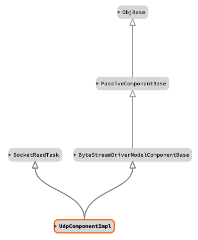

\page DrvUdp Drv::Udp Component
# Drv::Udp UDP Component

The UDP client component bridges the byte stream driver model interface to a remote UDP port to which this udp component
sends/receives bytes. It implements the callback formation (shown below) using a thread to receive data and producing
the callback port call.  Udp does not require bidirectional operation and can be used in a single direction.

For more information on the supporting UDP implementation see: Drv::UdpSocket.
For more information on the ByteStreamModelDriver see: Drv::ByteStreamDriverModel.

## Design

The manager component (typically the ground interface) initiates the transfer of send data by calling the "send" port.
The caller will provide a `Fw::Buffer` containing the data to send and the port call will return a status of that send.
These responses are an enumeration whose values are described in the following table:

| Value | Description |
|---|---|
| Drv::SEND_OK    | Send functioned normally. |
| Drv::SEND_RETRY | Send should be retried, but a subsequent send should return SEND_OK. |
| Drv::SEND_ERROR | Send produced an error, future sends likely to fail. |

This data is immediately sent out to the remote tcp server with a configured send timeout. See Usage described below.

**Callback Formation**


In the callback formation, the byte stream driver component initiates the transfer of received data by calling the
"readCallback" output port. This port transfers any read data in a `Fw::Buffer` along with a status for the receive.
This status is an enumeration whose values are described in the following table:

| Value | Description |
|---|---|
| Drv::RECV_OK    | Receive functioned normally buffer contains valid data. |
| Drv::RECV_ERROR | Receive produced an error and buffer contains no valid data. |

## Usage

The Drv::TcpClientComponentImpl must be configured with the address of the remote connection, and the socket must be
open to begin. Usually, the user runs the Drv::TcpClientComponentImpl engaging its read thread, which will automatically
open the  connection. The component is passive and has no commands meaning users should `init`,
`configureSend`/`configureRecv`, and `startSocketTask`. Upon shutdown, the `stopSocketThread` and `joinSocketThread`
methods should be called to ensure proper resource deallocation. This typical usage is shown in the C++ snippet below.

Since UDP support single or bidirectional communication, configuring each direction is cone separately using the two
methods `configureSend` and `configureRecv`. The user is not required to call both.

```c++
Drv::TcpClientComponentImpl comm = Drv::TcpClientComponentImpl("UDp Client");

bool constructApp(bool dump, U32 port_number, char* hostname) {
    ...
    comm.init(0);
    ...
    if (hostname != nullptr && port_number != 0) {
        Os::TaskString name("ReceiveTask");
        comm.configureSend(hostname, port_number);
        comm.configureRecv(hostname, port_number);
        // Needed for receiving only, remove if not configuring to receive
        comm.startSocketTask(name);
    }
}

void exitTasks() {
    ...
    comm.stopSocketTask();
    (void) comm.joinSocketTask(nullptr);
}
```
## Class Diagram



## Requirements

| Name | Description | Validation |
|---|---|---|
| UDP-COMP-001 | The udp component shall implement the ByteStreamDriverModel  | inspection |
| UDP-COMP-002 | The udp component shall provide a read thread | unit test |
| UDP-COMP-003 | The udp component shall provide single and bidirectional communication across udp | unit test |

## Change Log

| Date | Description |
|---|---|
| 2020-12-21 | Initial Draft |
| 2021-01-28 | Updated |
