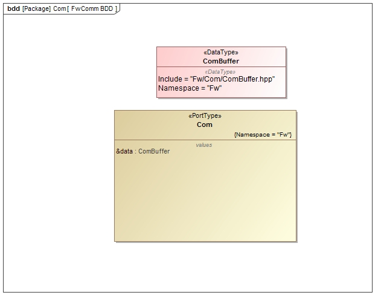

# Fw::Com Port

## 1. Introduction

The `Fw::Com` port is used to pass binary data to a service for transporting data out of the system. 
Incoming and outgoing packets are serialized into these buffers.

## 2. Design

### 2.1 Context

#### 2.1.1 Port Diagram

The `Fw::Com` port has the following port diagram:

#### 2.1.2 Serializables

##### 2.1.2.1 Fw::ComPacket 

The `Fw::ComPacket` class is a base class for other packet classes. It provides type identification for packet subtypes.

##### 2.1.2.2 Fw::ComBuffer

The `Fw::ComBuffer` class represents a buffer to store data for transmission. It is used as a destination buffer for serialization of `Fw::ComPacket` subtypes.

## 3. Change Log

Date | Description
---- | -----------
6/22/2015 |  Initial Version

