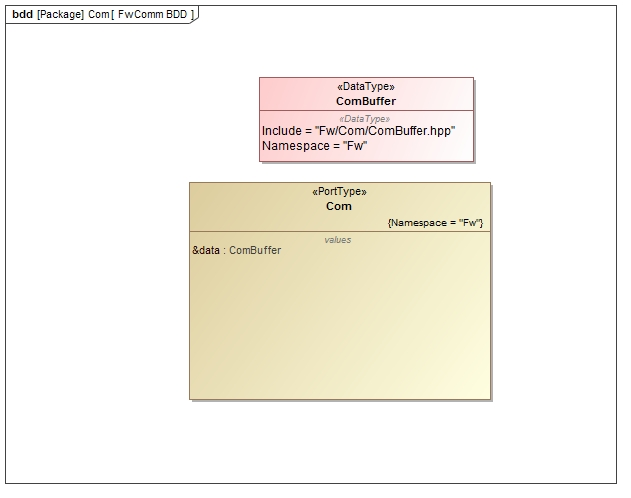

# Fw::Com Module

## 1. Introduction

The `Fw::Com` module defines the core types and ports used to pass binary
communication packets through the F´ communications (Com) stack. Application
components serialize commands, telemetry, events, and file data into a
`Fw::ComBuffer` (or `Fw::Buffer`) and hand it to the Com layer for framing and
transport out of the system; the reverse path delivers received packets back to
the application.

This module is the home for the transport-layer ports that move packets between
the application and the Com layer, together with the buffer/packet types those
ports carry.

## 2. Design

### 2.1 FPP Types

The FPP definitions live in [`Com.fpp`](../Com.fpp).

| Type | Kind | Description |
|------|------|-------------|
| `Fw.ComBuffer` | type | Abstract FPP type backed by the C++ `Fw::ComBuffer` class (see below). A statically sized, fully serialized packet buffer. |
| `Fw.Com` | port | Legacy transport port. Carries a `ComBuffer` plus a `U32 context`. In this format the packet type (`FwPacketDescriptorType`) is serialized at the front of the `ComBuffer`. |
| `Fw.ComBufferSend` | port | Transport port for a `Fw.ComBuffer`. Carries the packet type as an explicit `packetType: ComCfg.Apid` argument (rather than prepended into the buffer), plus a `U32 context`. |
| `Fw.ComPacketSend` | port | Transport port for a `Fw.Buffer` (dynamically managed memory, requires careful ownership handling). Carries the packet type as an explicit `packetType: ComCfg.Apid` argument. |

`Fw.ComBufferSend` and `Fw.ComPacketSend` are the modern transport ports: they
pass the packet type (APID) alongside the data instead of prepending a
`FwPacketDescriptorType` into the buffer the way the legacy `Fw.Com` port does.
The `Svc::ComToComBufferAdapter` / `Svc::ComBufferToComAdapter` components bridge
between the legacy `Fw.Com` format and `Fw.ComBufferSend` for backwards
compatibility.

### 2.2 C++ Types

| Type | Header | Description |
|------|--------|-------------|
| `Fw::ComBuffer` | [`ComBuffer.hpp`](../ComBuffer.hpp) | A `LinearBufferBase` with a fixed internal storage of `FW_COM_BUFFER_MAX_SIZE` bytes. Used as the destination buffer for serializing `Fw::ComPacket` subtypes and as the payload type for the `Fw.Com` / `Fw.ComBufferSend` ports. |
| `Fw::ComPacket` | [`ComPacket.hpp`](../ComPacket.hpp) | Base class for packet types (telemetry, events, commands, files). Provides `serializeBase` / `deserializeBase`, which (de)serialize the packet type identifier as a `FwPacketDescriptorType`. The type identifier is aliased as `Fw::ComPacketType = ComCfg::Apid::T`. |

#### 2.2.1 Fw::ComPacket

`Fw::ComPacket` is a base class for other packet classes. It provides type
identification for packet subtypes: `serializeBase` writes the packet type as a
`FwPacketDescriptorType`, and `deserializeBase` reads it back.

#### 2.2.2 Fw::ComBuffer

`Fw::ComBuffer` represents a buffer to store data for transmission. It is used as
a destination buffer for serialization of `Fw::ComPacket` subtypes. Its capacity
is fixed at `FW_COM_BUFFER_MAX_SIZE`.

### 2.3 Port Diagram

The `Fw::Com` port has the following port diagram:

## 3. Change Log

Date | Description
---- | -----------
6/22/2015 |  Initial Version
| (this change) | Moved `ComBufferSend` / `ComPacketSend` ports into the `Fw.Com` module (from `Svc`); documented the module's FPP and C++ types. |
