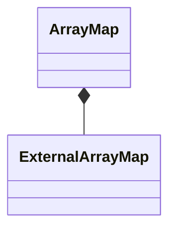

# ArrayMap

`ArrayMap` is a `final` class template
defined in [`Fw/DataStructures`](sdd.md).
It represents an array-based map with internal storage.

## 1. Template Parameters

`ArrayMap` has the following template parameters.

|Kind|Name|Purpose|
|----|----|-------|
|`typename`|`K`|The type of a key in the map|
|`typename`|`V`|The type of a value in the map|
|`FwSizeType`|`C`|The capacity, i.e., the maximum number of keys that the map can store|

`ArrayMap` statically asserts that `C > 0`.

## 2. Base Class

`ArrayMap` is publicly derived from
[`MapBase<K, V>`](MapBase.md).

<a name="Public-Types"></a>
## 3. Public Types

`ArrayMap` defines the following public types:

|Name|Definition|
|----|----------|
|`Entry`|Alias of [`SetOrMapIterator<K, V>`](SetOrMapIterator.md)|
|`Iterator`|Alias of [`MapIterator<K, V>`](MapIterator.md)|

## 4. Private Member Variables

`ArrayMap` has the following private member variables.

|Name|Type|Purpose|Default Value|
|----|----|-------|-------------|
|`m_extMap`|[`ExternalArrayMap<K, V>`](ExternalArrayMap.md)|The external map implementation|C++ default initialization|
|`m_entries`|`Entry[C]`|The array providing the backing memory for `m_extMap`|C++ default initialization|

The type `Entry` is defined [here](ArrayMap.md#Public-Types).



## 5. Public Constructors and Destructors

### 5.1. Zero-Argument Constructor

```c++
ArrayMap()
```

Initialize each member variable with its default value.

_Example:_
```c++
ArrayMap<U16, U32, 10> map;
```

### 5.2. Copy Constructor

```c++
ArrayMap(const ArrayMap<K, V, C>& map)
```

Set `*this = map`.

_Example:_
```c++
ArrayMap<U16, U32, 10> m1(entries, capacity);
// Insert an item
const U16 key = 0;
const U32 value = 42;
const auto status = m1.insert(key, value);
ASSERT_EQ(status, Success::SUCCESS);
// Call the copy constructor
ArrayMap<U16, U32, 10> m2(m1);
ASSERT_EQ(m2.getSize(), 1);
```

### 5.3. Destructor

```c++
~ArrayMap() override
```

Defined as `= default`.

## 6. Public Member Functions

### 6.1. operator=

```c++
ArrayMap<K, V, C>& operator=(const ArrayMap<K, V, C>& map)
```

Return `m_extMap.copyDataFrom(map)`.

_Example:_
```c++
ArrayMap<U16, U32, 10> m1(entries, capacity);
// Insert an item
U16 key = 0;
U32 value = 42;
const auto status = m1.insert(key, value);
ASSERT_EQ(status, Success::SUCCESS);
// Call the default constructor
ArrayMap m2;
ASSERT_EQ(m2.getSize(), 0);
// Call the copy assignment operator
m2 = m1;
ASSERT_EQ(m2.getSize(), 1);
value = 0;
status = m2.find(key, value);
ASSERT_EQ(status, Success::SUCCESS);
ASSERT_EQ(value, 42);
```

### 6.2. clear

```c++
void clear() override
```

Call `m_extMap.clear()`.

### 6.3. find

```c++
Success find(const K& key, V& value) override
```

Return `m_extMap.find(key, value)`.

### 6.4. getCapacity

```c++
FwSizeType getCapacity() const override
```

Return `m_extMap.getCapacity()`.

### 6.5. getHeadIterator

```c++
const Iterator* getHeadIterator const override
```

The type `Iterator` is defined [here](ArrayMap.md#Public-Types).

Return `m_extMap.getHeadIterator()`.

### 6.6. getSize

```c++
FwSizeType getSize() const override
```

Return `m_extMap.getSize()`.

### 6.7. insert

```c++
Success insert(const K& key, const V& value) override
```

Return `m_extMap.insert(key, value)`.

### 6.8. remove

```c++
Success remove(const K& key, V& value) override
```

Return `m_extMap.remove(key, value)`.

## 7. Public Static Functions

### 7.1. getStaticCapacity

```c++
static constexpr FwSizeType getStaticCapacity()
```

Return the static capacity `C`.

_Example:_
```c++
using Map = ArrayMap<U16, U32, 3>;
const auto capacity = Map::getStaticCapacity();
ASSERT_EQ(capacity, 3);
```
