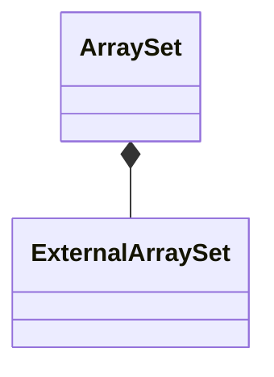

# ArraySet

`ArraySet` is a `final` class template
defined in [`Fw/DataStructures`](sdd.md).
It represents an array-based set with internal storage.

## 1. Template Parameters

`ArraySet` has the following template parameters.

|Kind|Name|Purpose|
|----|----|-------|
|`typename`|`T`|The type of an element in the set|
|`FwSizeType`|`C`|The capacity, i.e., the maximum number of elements that the set can store|

`ArraySet` statically asserts that `C > 0`.

## 2. Base Class

`ArraySet` is publicly derived from
[`SetBase<T>`](SetBase.md).

<a name="Public-Types"></a>
## 3. Public Types

`ArraySet` defines the following public types:

|Name|Definition|
|----|----------|
|`Entry`|Alias of [`SetOrMapIterator<T, Nil>`](SetOrMapIterator.md)|
|`Iterator`|Alias of [`MapIterator<T>`](MapIterator.md)|

The type `Nil` is defined [here](Nil.md).

## 4. Private Member Variables

`ArraySet` has the following private member variables.

|Name|Type|Purpose|Default Value|
|----|----|-------|-------------|
|`m_extSet`|[`ExternalArraySet<T>`](ExternalArraySet.md)|The external set implementation|C++ default initialization|
|`m_entries`|`Entry[C]`|The array providing the backing memory for `m_extSet`|C++ default initialization|

The type `Entry` is defined [here](ArraySet.md#Public-Types).



## 5. Public Constructors and Destructors

### 5.1. Zero-Argument Constructor

```c++
ArraySet()
```

Initialize each member variable with its default value.

_Example:_
```c++
ArraySet<U32, 10> set;
```

### 5.2. Copy Constructor

```c++
ArraySet(const ArraySet<T, C>& set)
```

Set `*this = set`.

_Example:_
```c++
ArraySet<U32, 10> m1(entries, capacity);
// Insert an item
const U32 element = 42;
const auto status = m1.insert(element);
ASSERT_EQ(status, Success::SUCCESS);
// Call the copy constructor
ArraySet<U32, 10> m2(m1);
ASSERT_EQ(m2.getSize(), 1);
```

### 5.3. Destructor

```c++
~ArraySet() override
```

Defined as `= default`.

## 6. Public Member Functions

### 6.1. operator=

```c++
ArraySet<T, C>& operator=(const ArraySet<T, C>& set)
```

Return `m_extSet.copyDataFrom(set)`.

_Example:_
```c++
ArraySet<U32, 10> m1(entries, capacity);
// Insert an item
U32 element = 42;
const auto status = m1.insert(element, value);
ASSERT_EQ(status, Success::SUCCESS);
// Call the default constructor
ArraySet m2;
ASSERT_EQ(m2.getSize(), 0);
// Call the copy assignment operator
m2 = m1;
ASSERT_EQ(m2.getSize(), 1);
status = m2.find(element);
ASSERT_EQ(status, Success::SUCCESS);
```

### 6.2. clear

```c++
void clear() override
```

Call `m_extSet.clear()`.

### 6.3. find

```c++
Success find(const K& element, V& value) override
```

Return `m_extSet.find(element, value)`.

### 6.4. getCapacity

```c++
FwSizeType getCapacity() const override
```

Return `m_extSet.getCapacity()`.

### 6.5. getHeadIterator

```c++
const Iterator* getHeadIterator const override
```

The type `Iterator` is defined [here](ArraySet.md#Public-Types).

Return `m_extSet.getHeadIterator()`.

### 6.6. getSize

```c++
FwSizeType getSize() const override
```

Return `m_extSet.getSize()`.

### 6.7. insert

```c++
Success insert(const T& element) override
```

Return `m_extSet.insert(element)`.

### 6.8. remove

```c++
Success remove(const T& element) override
```

Return `m_extSet.remove(element)`.

## 7. Public Static Functions

### 7.1. getStaticCapacity

```c++
static constexpr FwSizeType getStaticCapacity()
```

Return the static capacity `C`.

_Example:_
```c++
using Set = ArraySet<U32, 3>;
const auto capacity = Set::getStaticCapacity();
ASSERT_EQ(capacity, 3);
```
