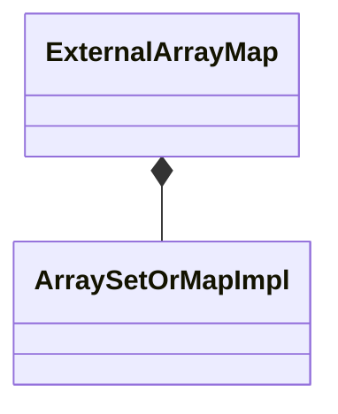

# ExternalArrayMap

`ExternalArrayMap` is a `final` class template
defined in [`Fw/DataStructures`](sdd.md).
It represents an array-based map with external storage.
Internally it maintains an [`ArraySetOrMapImpl`](ArraySetOrMapImpl.md)
as the map implementation.

## 1. Template Parameters

`ExternalArrayMap` has the following template parameters.

|Kind|Name|Purpose|
|----|----|-------|
|`typename`|`K`|The type of a key in the map|
|`typename`|`V`|The type of a value in the map|

## 2. Base Class

`ExternalArrayMap` is publicly derived from
[`MapBase<K, V>`](MapBase.md).

<a name="Public-Types"></a>
## 3. Public Types

`ExternalArrayMap` defines the following public types:

|Name|Definition|
|----|----------|
|`Entry`|Alias of [`SetOrMapEntry<K, V>`](SetOrMapEntry.md)|
|`Entry`|Alias of [`MapEntry<K, V>`](MapEntry.md)|

## 4. Private Member Variables

`ExternalArrayMap` has the following private member variables.

|Name|Type|Purpose|Default Value|
|----|----|-------|-------------|
|`m_impl`|[`ArraySetOrMapImpl<K, V>`](ArraySetOrMapImpl.md)|The map implementation|C++ default initialization|



## 5. Public Constructors and Destructors

### 5.1. Zero-Argument Constructor

```c++
ExternalArrayMap()
```

Initialize each member variable with its default value.

_Example:_
```c++
ExternalArrayMap<U16, U32> map;
```

### 5.2. Constructor Providing Typed Backing Storage

```c++
ExternalArrayMap(Entry* entries, FwSizeType capacity)
```

`entries` must point to a primitive array of at least `capacity`
elements of type [`Entry`](ExternalArrayMap.md#Public-Types).

Call `setStorage(entries, capacity)`.

_Example:_
```c++
constexpr FwSizeType capacity = 10;
ExternalArrayMap<U16, U32>::Entry entries[capacity];
ExternalArrayMap<U16, U32> map(entries, capacity);
```

### 5.3. Constructor Providing Untyped Backing Storage

```c++
ExternalArrayMap(ByteArray data, FwSizeType capacity)
```

`data` must be aligned according to 
[`getByteArrayAlignment()`](#getByteArrayAlignment) and must
contain at least [`getByteArraySize(size)`](#getByteArraySize) bytes.

Call `setStorage(data, capacity)`.

_Example:_
```c++
constexpr FwSizeType capacity = 10;
constexpr U8 alignment = ExternalArrayMap<U16, U32>::getByteArrayAlignment();
constexpr FwSizeType byteArraySize = ExternalArrayMap<U16, U32>::getByteArraySize(capacity);
alignas(alignment) U8 bytes[byteArraySize];
ExternalArrayMap<U16, U32> map(ByteArray(&bytes[0], sizeof bytes), capacity);
```

### 5.4. Copy Constructor

```c++
ExternalArrayMap(const ExternalArrayMap<K, V>& map)
```

Set `*this = map`.

_Example:_
```c++
constexpr FwSizeType capacity = 3;
ExternalArrayMap<U16, U32>::Entry entries[capacity];
// Call the constructor providing backing storage
ExternalArrayMap<U16, U32> m1(entries, capacity);
// Insert an item
const U16 key = 0;
const U32 value = 42;
const auto status = m1.insert(key, value);
ASSERT_EQ(status, Success::SUCCESS);
// Call the copy constructor
ExternalArrayMap<U16, U32> m2(m1);
ASSERT_EQ(m2.getSize(), 1);
```

### 5.5. Destructor

```c++
~ExternalArrayMap() override
```

Defined as `= default`.

## 6. Public Member Functions

### 6.1. operator=

```c++
ExternalArrayMap<K, V>& operator=(const ExternalArrayMap<K, V>& map)
```

1. If `&map != this`

    1. Set `m_impl = map.m_impl`.

1. Return `*this`.

_Example:_
```c++
constexpr FwSizeType capacity = 3;
ExternalArrayMap<U16, U32>::Entry entries[capacity];
// Call the constructor providing backing storage
ExternalArrayMap<U16, U32> m1(entries, capacity);
// Insert an item
U16 key = 0;
U32 value = 42;
const auto status = m1.insert(key, value);
ASSERT_EQ(status, Success::SUCCESS);
// Call the default constructor
ExternalArrayMap m2;
ASSERT_EQ(m2.getSize(), 0);
// Call the copy assignment operator
m2 = m1;
ASSERT_EQ(m2.getSize(), 1);
value = 0;
status = m2.find(key, value);
ASSERT_EQ(status, Success::SUCCESS);
ASSERT_EQ(value, 42);
```

### 6.2. clear

```c++
void clear() override
```

Call `m_impl.clear()`.

_Example:_
```c++
constexpr FwSizeType capacity = 10;
ExternalArrayMap<U16, U32>::Entry entries[capacity];
ExternalArrayMap<U16, U32> map(entries, capacity);
const auto status = map.insert(0, 3);
ASSERT_EQ(map.getSize(), 1);
map.clear();
ASSERT_EQ(map.getSize(), 0);
```

### 6.3. find

```c++
Success find(const K& key, V& value) override
```

Return `m_impl.find(key, value)`.

_Example:_
```c++
constexpr FwSizeType capacity = 10;
ExternalArrayMap<U16, U32>::Entry entries[capacity];
ExternalArrayMap<U16, U32> map(entries, capacity);
U32 value = 0;
auto status = map.find(0, value);
ASSERT_EQ(status, Success::FAILURE);
status = map.insert(0, 1);
ASSERT_EQ(status, Success::SUCCESS);
status = map.find(0, value);
ASSERT_EQ(status, Success::SUCCESS);
ASSERT_EQ(value, 1);
```

### 6.4. getCapacity

```c++
FwSizeType getCapacity() const override
```

Return `m_impl.getCapacity()`.

_Example:_
```c++
constexpr FwSizeType capacity = 10;
ExternalArrayMap<U16, U32>::Entry entries[capacity];
ExternalArrayMap<U16, U32> map(entries, capacity);
ASSERT_EQ(map.getCapacity(), capacity);
```

### 6.5. getHeadEntry

```c++
const Entry* getHeadEntry const override
```

The type `Entry` is defined [here](ExternalArrayMap.md#Public-Types).

Return `m_impl.getHeadEntry()`.

_Example:_
```c++
constexpr FwSizeType capacity = 10;
ExternalArrayMap<U16, U32>::Entry entries[capacity];
ExternalArrayMap<U16, U32> map(entries, capacity);
const auto* e = map.getHeadEntry();
FW_ASSERT(e == nullptr);
map.insert(0, 1);
e = map.getHeadEntry();
FW_ASSERT(e != nullptr);
ASSERT_EQ(e->getKey(), 0);
ASSERT_EQ(e->getValue(), 1);
```

### 6.6. getSize

```c++
FwSizeType getSize() const override
```

Return `m_impl.getSize()`.

_Example:_
```c++
constexpr FwSizeType capacity = 10;
ExternalArrayMap<U16, U32>::Entry entries[capacity];
ExternalArrayMap<U16, U32> map(entries, capacity);
auto size = map.getSize();
ASSERT_EQ(size, 0);
const auto status = map.insert(0, 3);
ASSERT_EQ(status, Success::SUCCESS);
size = map.getSize();
ASSERT_EQ(size, 1);
```

### 6.7. insert

```c++
Success insert(const K& key, const V& value) override
```

Return `m_impl.insert(key, value)`.

_Example:_
```c++
constexpr FwSizeType capacity = 10;
ExternalArrayMap<U16, U32>::Entry entries[capacity];
ExternalArrayMap<U16, U32> map(entries, capacity);
auto size = map.getSize();
ASSERT_EQ(size, 0);
const auto status = map.insert(0, 1);
ASSERT_EQ(status, Success::SUCCESS);
size = map.getSize();
ASSERT_EQ(size, 1);
```

### 6.8. remove

```c++
Success remove(const K& key, V& value) override
```

Return `m_impl.remove(key, value)`.

_Example:_
```c++
constexpr FwSizeType capacity = 10;
ExternalArrayMap<U16, U32>::Entry entries[capacity];
ExternalArrayMap<U16, U32> map(entries, capacity);
auto size = map.getSize();
ASSERT_EQ(size, 0);
auto status = map.insert(0, 1);
ASSERT_EQ(status, Success::SUCCESS);
size = map.getSize();
ASSERT_EQ(size, 1);
// Key does not exist
U32 value = 0;
status = map.remove(10, value);
ASSERT_EQ(status, Success::FAILURE);
ASSERT_EQ(size, 1);
// Key exists
status = map.remove(0, value);
ASSERT_EQ(status, Success::SUCCESS);
ASSERT_EQ(size, 0);
ASSERT_EQ(value, 1);
```

### 6.9. setStorage (Typed Data)

```c++
void setStorage(Entry* entries, FwSizeType capacity)
```

`entries` must point to a primitive array of at least `capacity`
elements of type `Entry`.
The type `Entry` is defined [here](ExternalArrayMap.md#Public-Types).

Call `m_impl.setStorage(entries, capacity)`.

_Example:_
```c++
constexpr FwSizeType capacity = 10;
ExternalArrayMap<U16, U32> map;
ExternalArrayMap<U16, U32>::Entry entries[capacity];
map.setStorage(entries, capacity);
```

### 6.10. setStorage (Untyped Data)

```c++
void setStorage(ByteArray data, FwSizeType capacity)
```

`data` must be aligned according to 
[`getByteArrayAlignment()`](#getByteArrayAlignment) and must
contain at least [`getByteArraySize(size)`](#getByteArraySize) bytes.

1. Call `m_entries.setStorage(data, capacity)`.

1. Call `clear()`.

```c++
constexpr FwSizeType capacity = 10;
constexpr U8 alignment = ExternalArrayMap<U16, U32>::getByteArrayAlignment();
constexpr FwSizeType byteArraySize = ExternalArrayMap<U16, U32>::getByteArraySize(capacity);
alignas(alignment) U8 bytes[byteArraySize];
ExternalArrayMap<U16, U32> map;
map.setStorage(ByteArray(&bytes[0], sizeof bytes), capacity);
```

## 7. Public Static Functions

<a name="getByteArrayAlignment"></a>
### 7.1. getByteArrayAlignment

```c++
static constexpr U8 getByteArrayAlignment()
```

Return `ArraySetOrMapImpl<K, V>::getByteArrayAlignment()`.

<a name="getByteArraySize"></a>
### 7.2. getByteArraySize

```c++
static constexpr FwSizeType getByteArraySize(FwSizeType capacity)
```

Return `ArraySetOrMapImpl<K, V>::getByteArraySize(capacity)`.
