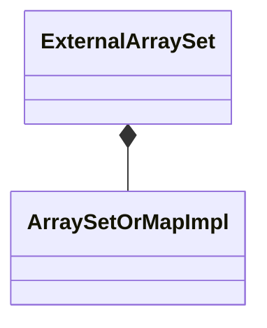

# ExternalArraySet

`ExternalArraySet` is a `final` class template
defined in [`Fw/DataStructures`](sdd.md).
It represents an array-based set with external storage.
Internally it maintains an [`ArraySetOrMapImpl<Entry>`](ArraySetOrMapImpl.md)
as the set implementation.

## 1. Template Parameters

`ExternalArraySet` has the following template parameters.

|Kind|Name|Purpose|
|----|----|-------|
|`typename`|`T`|The type of an element in the set|

## 2. Base Class

`ExternalArraySet` is publicly derived from
[`SetBase<T>`](SetBase.md).

## 3. Private Member Variables

`ExternalArraySet` has the following private member variables.

|Name|Type|Purpose|Default Value|
|----|----|-------|-------------|
|`m_setImpl`|[`ArraySetOrMapImpl<Entry>`](ArraySetOrMapImpl.md)|The set implementation|C++ default initialization|

The type `Entry` is defined [in the base class](MapBase.md#2-publictypes).



## 4. Public Constructors and Destructors

### 4.1. Zero-Argument Constructor

```c++
ExternalArraySet()
```

Initialize each member variable with its default value.

_Example:_
```c++
ExternalArraySet<U32> set;
```

### 4.2. Constructor Providing Typed Backing Storage

```c++
ExternalArraySet(Entry* entries, FwSizeType capacity)
```

Call `m_setImpl.setStorage(entries, capacity)`.

_Example:_
```c++
constexpr FwSizeType capacity = 10;
ExternalArraySet<U32>::Entry entries[capacity];
ExternalArraySet<U32> set(entries, capacity);
```

### 4.3. Constructor Providing Untyped Backing Storage

```c++
ExternalArraySet(ByteArray data, FwSizeType capacity)
```

`data` must be aligned according to 
[`getByteArrayAlignment()`](#61-getbytearrayalignment) and must
contain at least [`getByteArraySize(size)`](#62-getbytearraysize) bytes.

Call `m_setImpl.setStorage(data, capacity)`.

_Example:_
```c++
constexpr FwSizeType capacity = 10;
constexpr U8 alignment = ExternalArraySet<U32>::getByteArrayAlignment();
constexpr FwSizeType byteArraySize = ExternalArraySet<U32>::getByteArraySize(capacity);
alignas(alignment) U8 bytes[byteArraySize];
ExternalArraySet<U32> set(ByteArray(&bytes[0], sizeof bytes), capacity);
```

### 4.4. Copy Constructor

```c++
ExternalArraySet(const ExternalArraySet<T>& set)
```

Set `*this = set`.

_Example:_
```c++
constexpr FwSizeType capacity = 3;
ExternalArraySet<U32>::Entry entries[capacity];
// Call the constructor providing backing storage
ExternalArraySet<U32> m1(entries, capacity);
// Insert an item
const auto status = m1.insert(42);
ASSERT_EQ(status, Success::SUCCESS);
// Call the copy constructor
ExternalArraySet<U32> m2(m1);
ASSERT_EQ(m2.getSize(), 1);
```

### 4.5. Destructor

```c++
~ExternalArraySet() override
```

Defined as `= default`.

## 5. Public Member Functions

### 5.1. operator=

```c++
ExternalArraySet<T>& operator=(const ExternalArraySet<T>& set)
```

1. If `&set != this`

    1. Set `m_setImpl = set.m_setImpl`.

1. Return `*this`.

_Example:_
```c++
constexpr FwSizeType capacity = 3;
ExternalArraySet<U32>::Entry entries[capacity];
// Call the constructor providing backing storage
ExternalArraySet<U32> m1(entries, capacity);
// Insert an item
const auto status = m1.insert(42);
ASSERT_EQ(status, Success::SUCCESS);
// Call the default constructor
ExternalArraySet m2;
ASSERT_EQ(m2.getSize(), 0);
// Call the copy assignment operator
m2 = m1;
ASSERT_EQ(m2.getSize(), 1);
```

### 5.2. at

```c++
const V& at(FwSizeType index) const
```

Return `m_setImpl[index]`.

_Example:_
```c++
constexpr FwSizeType capacity = 3;
ExternalArraySet<U32>::Entry entries[capacity];
ExternalArraySet<U32> set(entries, capacity);
const auto status = set.insert(42);
ASSERT_EQ(status, Success::SUCCESS);
ASSERT_EQ(set.at(0), 42);
ASSERT_DEATH(set.at(1), "Assert");
```

### 5.3. clear

```c++
void clear() override
```

Call `m_setImpl.clear()`.

_Example:_
```c++
constexpr FwSizeType capacity = 10;
ExternalArraySet<U32>::Entry entries[capacity];
ExternalArraySet<U32> set(entries, capacity);
const auto status = set.insert(42);
ASSERT_EQ(set.getSize(), 1);
set.clear();
ASSERT_EQ(set.getSize(), 0);
```

### 5.4. find

```c++
Success find(const T& element) override
```

1. Return `m_setImpl.find(element, Nil())`.

_Example:_
```c++
constexpr FwSizeType capacity = 10;
ExternalArraySet<U32>::Entry entries[capacity];
ExternalArraySet<U32> set(entries, capacity);
auto status = set.find(42);
ASSERT_EQ(status, Success::FAILURE);
status = set.insert(42);
ASSERT_EQ(status, Success::SUCCESS);
status = set.find(42);
ASSERT_EQ(status, Success::SUCCESS);
```

### 5.5. getCapacity

```c++
FwSizeType getCapacity() const override
```

Return `m_setImpl.getCapacity()`.

_Example:_
```c++
constexpr FwSizeType capacity = 10;
ExternalArraySet<U32>::Entry entries[capacity];
ExternalArraySet<U32> set(entries, capacity);
ASSERT_EQ(set.getCapacity(), capacity);
```

### 5.6. getHeadIterator

```c++
const Iterator* getHeadIterator const override
```

The type `Iterator` is defined [in the base class](SetBase.md#2-publictypes).

Return `m_impl.getHeadIterator()`.

_Example:_
```c++
constexpr FwSizeType capacity = 10;
ExternalArraySet<U32>::Entry entries[capacity];
ExternalArraySet<U32> set(entries, capacity);
const auto* e = set.getHeadIterator();
FW_ASSERT(e == nullptr);
set.insert(42);
e = set.getHeadIterator();
FW_ASSERT(e != nullptr);
ASSERT_EQ(e->getElement(), 42);
```

### 5.7. getSize

```c++
FwSizeType getSize() const override
```

Return `m_setImpl.getSize()`.

_Example:_
```c++
constexpr FwSizeType capacity = 10;
ExternalArraySet<U32>::Entry entries[capacity];
ExternalArraySet<U32> set(entries, capacity);
auto size = set.getSize();
ASSERT_EQ(size, 0);
const auto status = set.insert(42);
ASSERT_EQ(status, Success::SUCCESS);
size = set.getSize();
ASSERT_EQ(size, 1);
```

### 5.8. insert

```c++
Success insert(const T& element) override
```

Return `m_setImpl.insert(key, Nil())`.

_Example:_
```c++
constexpr FwSizeType capacity = 10;
ExternalArraySet<U32>::Entry entries[capacity];
ExternalArraySet<U32> set(entries, capacity);
auto size = set.getSize();
ASSERT_EQ(size, 0);
const auto status = set.insert(42);
ASSERT_EQ(status, Success::SUCCESS);
size = set.getSize();
ASSERT_EQ(size, 1);
```

### 5.9. remove

```c++
Success remove(const T& element) override
```

1. Set `Nil nil = {}`.

1. Return `m_setImpl.remove(key, nil)`.

_Example:_
```c++
constexpr FwSizeType capacity = 10;
ExternalArraySet<U32>::Entry entries[capacity];
ExternalArraySet<U32> set(entries, capacity);
auto size = set.getSize();
ASSERT_EQ(size, 0);
auto status = set.insert(42);
ASSERT_EQ(status, Success::SUCCESS);
size = set.getSize();
ASSERT_EQ(size, 1);
// Element does not exist
status = set.remove(0);
ASSERT_EQ(status, Success::FAILURE);
ASSERT_EQ(size, 1);
// Element exists
status = set.remove(42, value);
ASSERT_EQ(status, Success::SUCCESS);
ASSERT_EQ(size, 0);
```

### 5.10. setStorage (Typed Data)

```c++
void setStorage(Entry* entries, FwSizeType capacity)
```

Call `m_setImpl.setStorage(entries, capacity)`.

_Example:_
```c++
constexpr FwSizeType capacity = 10;
ExternalArraySet<U32> set;
ExternalArraySet<U32>::Entry entries[capacity];
set.setStorage(entries, capacity);
```

### 5.11. setStorage (Untyped Data)

```c++
void setStorage(ByteArray data, FwSizeType capacity)
```

`data` must be aligned according to 
[`getByteArrayAlignment()`](#61-getbytearrayalignment) and must
contain at least [`getByteArraySize(size)`](#62-getbytearraysize) bytes.

1. Call `m_entries.setStorage(data, capacity)`.

1. Call `clear()`.

```c++
constexpr FwSizeType capacity = 10;
constexpr U8 alignment = ExternalArraySet<U32>::getByteArrayAlignment();
constexpr FwSizeType byteArraySize = ExternalArraySet<U32>::getByteArraySize(capacity);
alignas(alignment) U8 bytes[byteArraySize];
ExternalArraySet<U32> set;
set.setStorage(ByteArray(&bytes[0], sizeof bytes), capacity);
```

## 6. Public Static Functions

### 6.1. getByteArrayAlignment

```c++
static constexpr U8 getByteArrayAlignment()
```

Return `ArraySetOrMapImpl<Entry>::getByteArrayAlignment()`.

### 6.2. getByteArraySize

```c++
static constexpr FwSizeType getByteArraySize(FwSizeType capacity)
```

Return `ArraySetOrMapImpl<Entry>::getByteArraySize(capacity)`.
