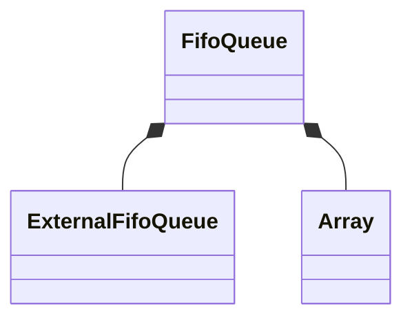

# FifoQueue

`FifoQueue` is a `final` class template
defined in [`Fw/DataStructures`](sdd.md).
It represents a FIFO queue with internal storage.
Internally it maintains an [`Array`](Array.md)
for storing the items on the queue.

## 1. Template Parameters

`FifoQueue` has the following template parameters.

|Kind|Name|Purpose|
|----|----|-------|
|`typename`|`T`|The type of a queue item|
|`FwSizeType`|`C`|The queue capacity in items|

`FifoQueue` statically asserts that `C > 0`.

## 2. Base Class

`ExternalFifoQueue<T>` is publicly derived from 
[`FifoQueueBase<T>`](FifoQueueBase.md).

## 3. Private Member Variables

`FifoQueue` has the following private member variables.

|Name|Type|Purpose|Default Value|
|----|----|-------|-------------|
|`m_extQueue`|`ExternalFifoQueue<T>`|The external queue implementation|C++ default initialization|
|`m_array`|`Array<T, C>`|The array providing the backing memory for `m_extQueue`|C++ default initialization|



## 4. Public Constructors and Destructors

### 4.1. Zero-Argument Constructor

```c++
FifoQueue()
```

Defined as `= default`.

_Example:_
```c++
FifoQueue<U32, 10> queue;
```

### 4.2. Copy Constructor

```c++
FifoQueue(const FifoQueue<T, S>& queue)
```

Set `*this = queue`.

_Example:_
```c++
FifoQueue<U32, 10> q1;
auto status = q1.enqueue(3);
ASSERT_EQ(status, Success::SUCCESS);
FifoQueue<U32, 10> q2(q1);
ASSERT_EQ(q2.size(), 1);
U32 value = 0;
status = q2.dequeue(value);
ASSERT_EQ(status, Success::SUCCESS);
ASSERT_EQ(value, 3);
```

### 4.3. Destructor

```c++
~FifoQueue() override
```

Defined as `= default`.

## 5. Public Member Functions

### 5.1. operator=

```c++
FifoQueue<T>& operator=(const FifoQueue<T>& queue)
```

Call `m_extQueue.copyDataFrom(queue)`.

_Example:_
```c++
FifoQueue<U32, 10> q1;
auto status = q1.enqueue(3);
ASSERT_EQ(status, Success::SUCCESS);
FifoQueue<U32, 10> q2;
ASSERT_EQ(q2.size(), 0);
q2 = q1;
ASSERT_EQ(q2.size(), 1);
U32 value = 0;
status = q2.dequeue(value);
ASSERT_EQ(status, Success::SUCCESS);
ASSERT_EQ(value, 3);
```

### 5.2. clear

```c++
void clear() override
```

Call `m_extQueue.clear()`.

### 5.3. enqueue

```c++
Success enqueue(const T& e) override
```

Return `m_extQueue.enqueue(e)`.

### 5.4. dequeue

```c++
Success dequeue(T& e) override
```

Return `m_extQueue.dequeue(e)`.

### 5.5. getSize

```c++
FwSizeType getSize() const override
```

Return `m_extQueue.getSize()`.

### 5.6. getCapacity

```c++
FwSizeType getCapacity() const override
```

Return `m_extQueue.getCapacity()`.

## 6. Public Static Functions

### 6.1. getStaticCapacity

```c++
static constexpr FwSizeType getStaticCapacity()
```

Return the static capacity `C`.

_Example:_
```c++
const auto capacity = FifoQueue<U32, 3>::getStaticCapacity();
ASSERT_EQ(capacity, 3);
```

## 7. Private Member Functions

### 7.1. getItemAtIndex

```c++
const T& getItemAtIndex(FwSizeType index) const override
```

Return `m_extQueue.getItemAtIndex(index)`.
