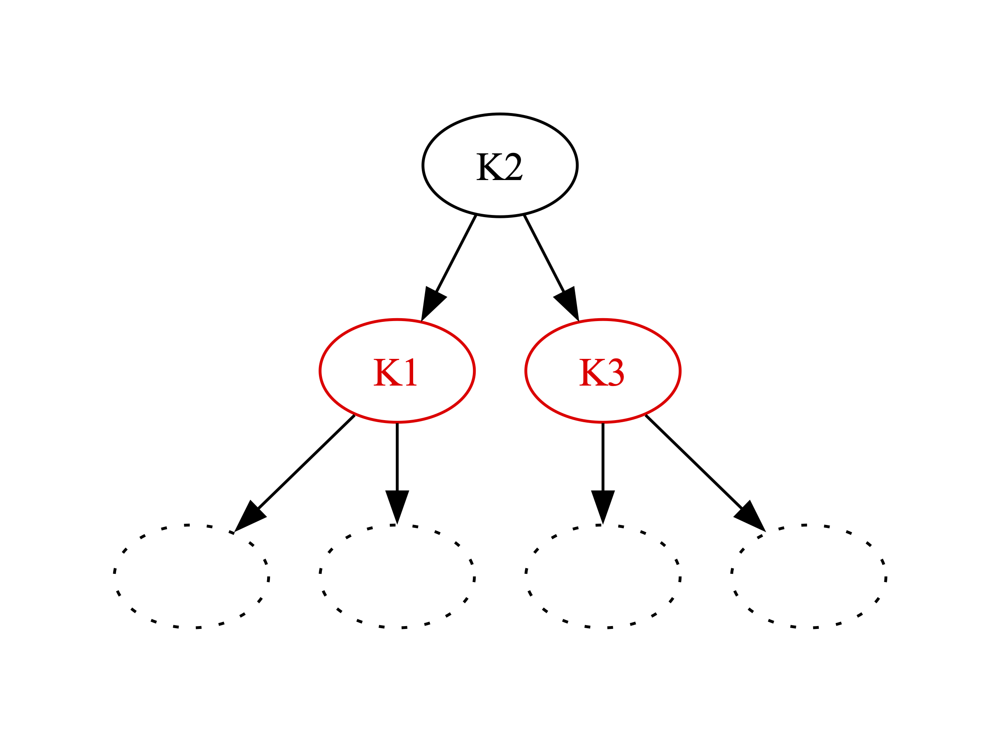
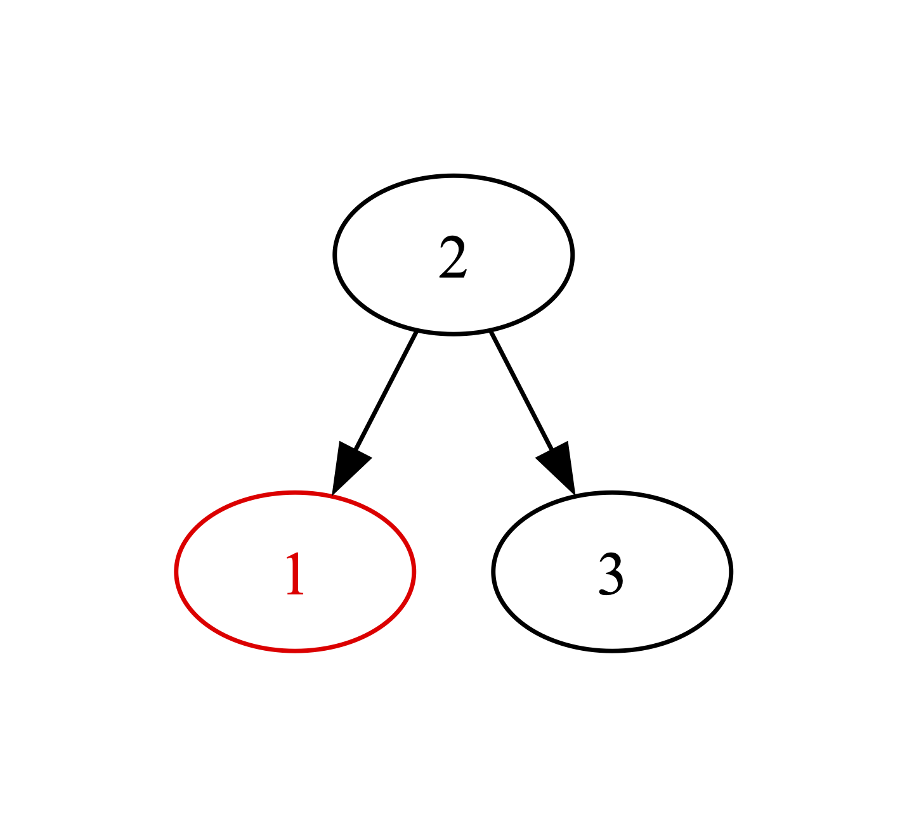
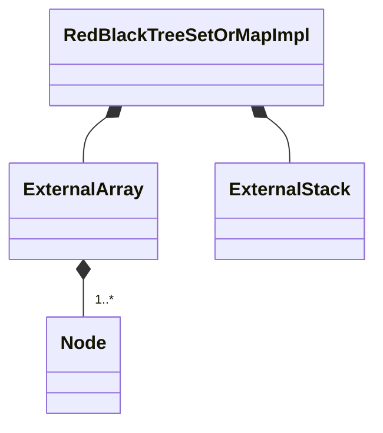
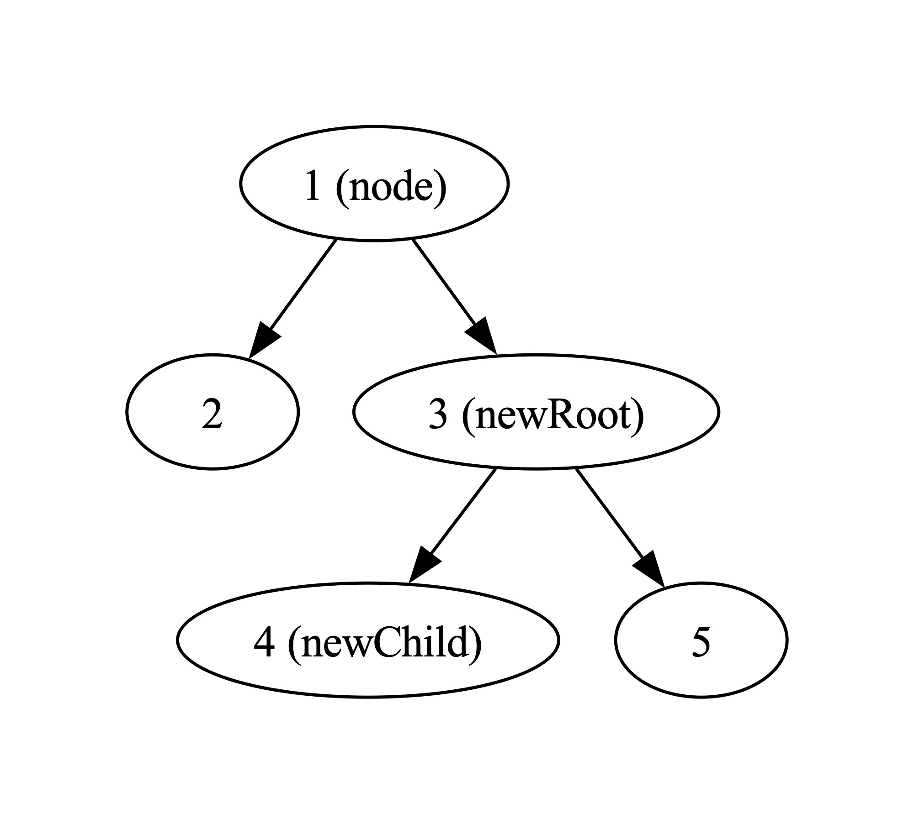
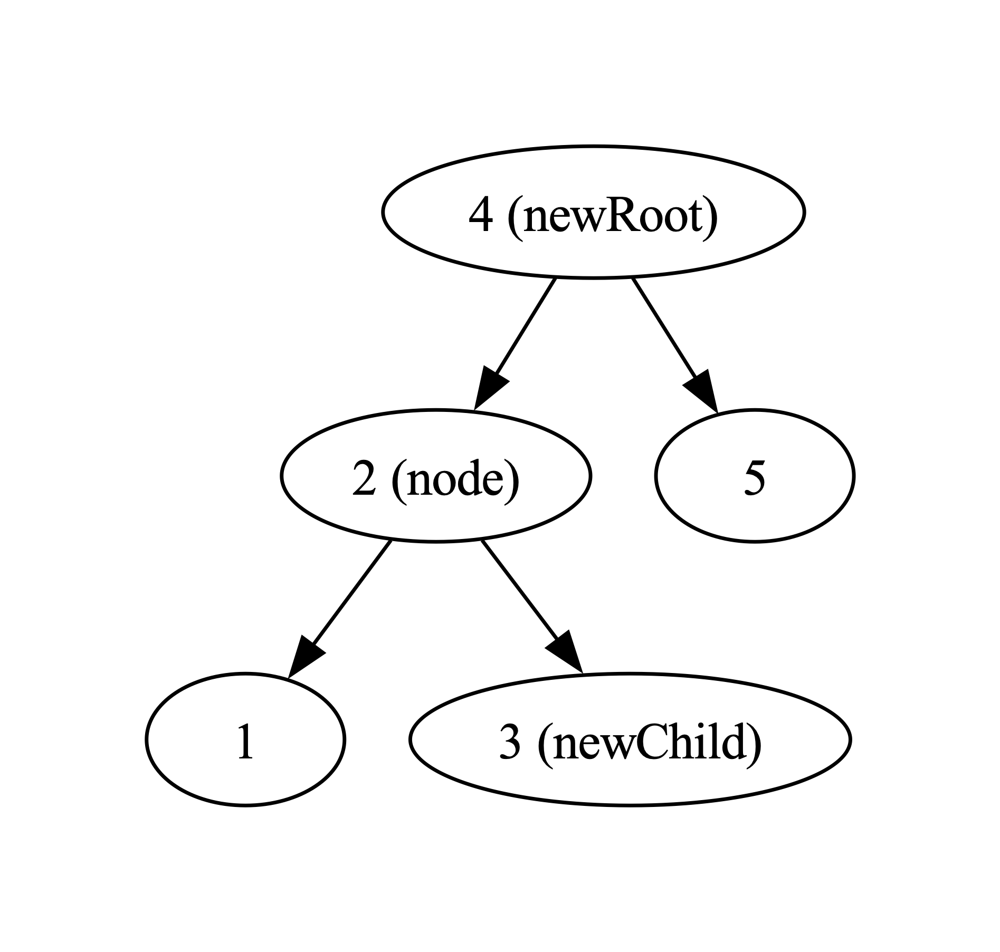

# RedBlackTreeSetOrMapImpl

`RedBlackTreeSetOrMapImpl` is a `final` class template
defined in [`Fw/DataStructures`](sdd.md).
It represents a set or map implementation based on a red-black tree.
Internally it maintains an [`ExternalArray`](ExternalArray.md)
of tree nodes and an [`ExternalStack`](ExternalStack.md) of
indices pointing into the array.
The implementation uses the algorithm described here:
https://en.wikipedia.org/wiki/Red%E2%80%93black_tree.

## 1. Red-Black Trees

A red-black tree is a binary search tree (BST) _T_ together with
a **red-black coloring**, i.e., an assignment of a color (red or
black) to each node of _T_, such that the following constraints
are satisfied:

1. All null nodes of _T_ are black.

1. No red node of _T_ has a red child.

1. For each node _N_ in _T_, every path from _N_ to any leaf
   node under _N_ passes through the same number of black nodes.

For example, this tree is a valid red-black tree (search keys in the BST
shown, null nodes implicit):

<center>
<div>

</div>
</center>

Note that each of nodes 1 and 3 has two null children,
and these children are colored black.

This tree is not a valid red-black tree because constraint 3 is not satisfied:

<center>
<div>

</div>
</center>

The red-black coloring guarantees that no path from the root
of the tree to a leaf gets too long.
This guarantee ensures that search in the BST is fast.

Naively inserting or deleting a node can invalidate the
red-black coloring.
Therefore, when inserting or deleting a node, the algorithm performs
a **rebalancing**, i.e., a transformation that rearranges
links and recolors nodes to maintain
the BST property and produce another red-black coloring.

## 2. Template Parameters

`RedBlackTreeSetOrMapImpl` has the following template parameters.

|Kind|Name|Purpose|
|----|----|-------|
|`typename`|`KE`|The type of a key in a map or the element of a set|
|`typename`|`VN`|The type of a value in a map or `Nil` for set|

<a name="Types"></a>
## 3. Types

### 3.1. Entry

`Entry` is a public member of `RedBlackTreeSetOrMapImpl`.
It is an alias for [`SetOrMapImplEntry<KE, VN>`](SetOrMapImplEntry.md).

### 3.2. Node

`Node` is a struct defined as a private member of `RedBlackTreeSetOrMapImpl`.
It represents a node of the red-black tree.

#### 3.2.1. Public Types

`Node` defines the following public types.

|Name|Definition|Purpose|
|----|----------|-------|
|`Color`|An enumeration with values `BLACK` and `RED`|A node color|
|`Direction`|An enumeration with values `LEFT` and `RIGHT`|A tree direction|
|`Index`|`FwSizeType`|An array index representing a tree node|

#### 3.2.2. Public Constants

`Node` defines the following constants.

|Name|Type|Purpose|Value|
|----|----|-------|-------------|
|`NONE`|`Index`|An out-of-bounds index value corresponding to no node|`std::numeric_limits<FwSizeType>::max()`|

#### 3.2.3. Public Member Variables

`Node` has the following private member variables.

|Name|Type|Purpose|Default Value|
|----|----|-------|-------------|
|`parent`|`Node::Index`|The index of the parent of this node|`Node::NONE`|
|`left`|`Node::Index`|The index of the left child of this node|`Node::NONE`|
|`right`|`Node::Index`|The index of the right child of this node|`Node::NONE`|
|`color`|`Color`|The color of this node|`Color::BLACK`|
|`entry`|`Entry`|The set or map entry stored in this node|C++ default initialization|

#### 3.2.4. Public Member Functions

##### 3.2.4.1. getChild

```c+++
Node::Index getChild(Direction direction)
```

**Overview:**
Gets the child of `this` in direction `direction`.

**Algorithm:**
Return `(direction == LEFT) ? left : right`.

##### 3.2.4.2. setChild

```c++
void setChild(Direction direction, Index node)
```

**Overview:**
Sets the child of `this` in direction `direction`.

**Algorithm:**
`(direction == LEFT) ? (this.left = node) : (this.right = node)`.

**Overview:**

#### 3.2.5. Public Static Methods

##### 3.2.5.1. getOppositeDirection

```c+++
static Direction oppositeDirection(Direction direction)
```

**Overview:**
Returns the opposite direction.

**Algorithm:**
Return `(direction == LEFT) ? RIGHT : LEFT`.

### 3.3. Nodes and FreeNodes

`RedBlackTreeSetOrMapImpl` defines the following private type aliases.

|Name|Definition|Purpose|
|----|----------|-------|
|`Nodes`|Alias for [`ExernalArray<Node>`](ExternalArray.md)|The type of the array for storing the tree nodes|
|`FreeNodes`|Alias for [`ExernalStack<Node::Index>`](ExternalStack.md)|The type of the stack of indices of free nodes.|

### 3.4. ConstIterator

`ConstIterator` is a public inner class of `RedBlackTreeSetOrMapImpl`.
It provides non-modifying iteration over the elements of a `RedBlackTreeSetOrMapImpl`
instance.
It is a base class of [`SetOrMapImplConstIterator<KE,
VN>`](SetOrMapImplConstIterator.md).

**State:**
`ConstIterator` maintains the following state:

1. A pointer to a `RedBlackTreeSetOrMapImpl` instance.

1. A `Node::Index` value.

**Operations:**
To create the iterator in the `begin` state, we use
[`getOuterNodeUnder`](#getOuterNodeUnder) to traverse the
tree to the leftmost node under the root, and we set the node index to point to
that node.
To set the iterator to the `end` state, we set the node index
to `NONE`.
Incrementing the iterator works as follows:

1. If the node index is `NONE`, then do nothing.

1. Otherwise if the current node has a non-null right child,
   then use [`getOuterNodeUnder`](#getOuterNodeUnder) to traverse to the leftmost
   element under the right child.
   Set the node index to point to this node.

1. Otherwise traverse the tree upwards, stopping when
   we have traversed through a left child or the node index is `NONE`.

## 4. Private Member Variables

`RedBlackTreeSetOrMapImpl` has the following private member variables.

|Name|Type|Purpose|Default Value|
|----|----|-------|-------------|
|`m_nodes`|`Nodes`|The array for storing the tree nodes|C++ default initialization|
|`m_freeNodes`|`FreeNodes`|The stack of indices of free nodes. The indices point into `m_nodes`.|C++ default initialization|
|`m_root`|`Node::Index`|The index of the root node|Node::NONE|



## 5. Public Constructors and Destructors

### 5.1. Zero-Argument Constructor

```c++
RedBlackTreeSetOrMapImpl()
```

Initialize each member variable with its default value.

### 5.2. Constructor Providing Typed Backing Storage

```c++
RedBlackTreeSetOrMapImpl(Node* nodes, FwSizeType* freeNodes, FwSizeType capacity)
```

Each of `nodes` and `freeNodes` must point to at least `capacity` items.

Call [`setStorage(nodes, freeNodes, capacity)`](#setStorageTyped).

### 5.3. Constructor Providing Untyped Backing Storage

```c++
RedBlackTreeSetOrMapImpl(ByteArray data, FwSizeType capacity)
```

`data` must be aligned according to
[`getByteArrayAlignment()`](#getByteArrayAlignment) and must
contain at least [`getByteArraySize(capacity)`](#getByteArraySize) bytes.

Call [`setStorage(data, capacity)`](#setStorageUntyped).

### 5.4. Copy Constructor

```c++
RedBlackTreeSetOrMapImpl(const RedBlackTreeSetOrMapImpl<KE, VN>& map)
```

Set `*this = map`.

### 5.5. Destructor

```c++
~RedBlackTreeSetOrMapImpl()
```

Defined as `= default`.

## 6. Public Member Functions

### 6.1. operator=

```c++
RedBlackTreeSetOrMapImpl<KE, VN>& operator=(const RedBlackTreeSetOrMapImpl<KE, VN>& impl)
```

1. If `&impl != this`

    1. Set `m_nodes = impl.m_nodes`.

    1. Set `m_freeNodes = impl.m_freeNodes`.

    1. Set `m_root = impl.m_root`.

1. Return `*this`.

### 6.2. begin

```c++
ConstIterator begin() const
```

Return `ConstIterator(*this)`.

### 6.3. clear

```c++
void clear()
```

1. Call `m_freeNodes.clear()`.

1. For each `i` in the range `[0, getCapacity())`

    1. Let `status = m_freeNodes.push(i)`.

    1. Assert `status == SUCCESS`.

### 6.4. end

```c++
ConstIterator end() const
```

1. Set `it = begin()`.

1. Call `it.setToEnd()`.

1. Return `it`.

### 6.5. find

```c++
Success find(const KE& keyOrElement, VN& valueOrNil) const
```

1. Set `node = NONE`.

1. Set `direction = LEFT`.

1. Set `status = FAILURE`.

1. Let `findStatus = findNode(keyOrElement, node, direction)`.

1. If `findStatus == SUCCESS`

    1. Set `valueOrNil = m_nodes[node].entry.getValue()`.

    1. Set `status = SUCCESS`.

1. Return `status`.

### 6.6. getCapacity

```c++
FwSizeType getCapacity() const
```

Return `m_nodes.getSize()`.

### 6.7. getSize

```c++
FwSizeType getSize() const
```

1. Let `capacity = getCapacity()`.

1. Let `freeNodesSize = m_freeNodes.getSize()`.

1. Assert `freeNodesSize <= capacity`.

1. Return `capacity - freeNodesSize`.

### 6.8. insert

```c++
Success insert(const KE& keyOrElement, const VN& valueOrNil)
```

1. Set `node = NONE`.

1. Set `direction = LEFT`.

1. Set `status = FAILURE`.

1. Let `findStatus = findNode(keyOrElement, node, direction)`.

1. If `findStatus == SUCCESS`

    1. Call `m_nodes[node].setValue(valueOrNil)`.

    1. Set `status = SUCCESS`.

1. Otherwise

   1. Set `parent = node`.

   1. Set `status = m_freeNodes.pop(node)`.

   1. If `status == SUCCESS`

       1. Set `m_nodes[node] = Node()`.

       1. Call `m_nodes[node].entry.setKey(keyOrElement)`.

       1. Call `m_nodes[node].entry.setValue(valueOrNil)`.

       1. Call `insertNode(node, parent, direction)`.

1. Return `status`.

### 6.9. remove

```c++
Success remove(const KE& keyOrElement, VN& valueOrNil)
```

1. Set `node = NONE`.

1. Set `direction = LEFT`.

1. Let `status = findNode(keyOrElement, node, direction)`.

1. If `status == SUCCESS`

    1. Set `valueOrNil = m_nodes[node].entry.getValue()`.

    1. Set `removedNode = NONE`.

    1. Call `removeNode(node, removedNode)`.

    1. Let `pushStatus = m_freeNodes.push(removedNode)`.

    1. Assert `pushStatus == SUCCESS`.

1. Return `status`.

<a name="setStorageTyped"></a>
### 6.10. setStorage (Typed Data)

```c++
void setStorage(Node* nodes, FwSizeType* freeNodes, FwSizeType capacity)
```

Each of `nodes` and `freeNodes` must point to at least `capacity` items.

1. Call `m_nodes.setStorage(nodes, capacity)`.

1. Call `m_freeNodes.setStorage(freeNodes, capacity)`.

1. Call `clear()`.

<a name="setStorageUntyped"></a>
### 6.11. setStorage (Untyped Data)

```c++
void setStorage(ByteArray data, FwSizeType capacity)
```

`data` must be aligned according to
[`getByteArrayAlignment()`](#getByteArrayAlignment) and must
contain at least [`getByteArraySize(size)`](#getByteArraySize) bytes.

1. Call `m_nodes.setStorage(data, capacity)`.

1. Let `nodesSize = ExternalArray<Node>::getByteArraySize`.

1. Let `freeNodesOffset` be the smallest integer greater than or equal to `nodesSize`
that is aligned for `ExternalStack<FwSizeType>::getByteArrayAlignment()`.

1. Let `freeNodesSize = ExternalArray<Node>::getByteArraySize(capacity)`.

1. Assert that `freeNodesOffset + freeNodesSize <= data.size`.

1. Let `freeNodesData = ByteArray(&data.bytes[freeNodesOffset], freeNodesSize)`.

1. Call `m_freeNodes.setStorage(freeNodesData, capacity)`.

1. Call `clear()`.

## 7. Public Static Functions

<a name="getByteArrayAlignment"></a>
### 7.1. getByteArrayAlignment

```c++
static constexpr U8 getByteArrayAlignment()
```

Return `Nodes::getByteArrayAlignment()`.

<a name="getByteArraySize"></a>
### 7.2. getByteArraySize

```c++
static constexpr FwSizeType getByteArraySize(FwSizeType capacity)
```

1. Let `nodesSize = Nodes::getByteArraySize(capacity)`.

1. Let `freeNodesAlignment = FreeStack::getByteArrayAlignment()`.

1. Let `freeNodesSize = FreeStack::getByteArraySize(capacity)`.

1. Return `nodesSize + freeNodesAlignment + freeNodesSize`.

##### 7.2.0.1. getNodeColor

```c++
static Color getColor(Index index)
```

return `index == NONE ? BLACK : m_nodes[index].color`.

## 8. Private Helper Functions

<a name="findNode"></a>
### 8.1. findNode

```c++
Success findNode(const KE& keyOrElement, Node::Index& node, Direction& direction) const
```

**Overview:**
This function tries to find a node whose key or element _ke_ matches
`keyOrElement`.
On return from the function:

1. If the function found such a node _N_, then the return value is `SUCCESS`,
and `node` stores the index of _N_.

1. Otherwise

    1. The return value is `FAILURE`.

    1. If the tree is empty, then `node` holds `NONE`.

    1. Otherwise `node` stores the index of the node _N_ containing the `NONE`
       child where _ke_ should be inserted, and
       `direction` stores the direction of the child in _N_ (left or right).

**Algorithm:**

1. Set `result = FAILURE`.

1. Set `direction = LEFT`.

1. Set `node = m_root`.

1. Set `done = false`.

1. In a for loop bounded by `getCapacity()`:

    1. Compare `keyOrElement` to the key or element in the entry stored in `m_nodes[node]`.

    1. If the comparison result is equality, then set `done = true`,
       set `result = SUCCESS`, and break out of the loop.

    1. Otherwise if the comparison result is less and `m_nodes[node].left == Node::NONE`, then
       set `done = true` and break out of the loop.

    1. Otherwise if the comparison result is less, then set `node = m_nodes[node].left`.

    1. Otherwise if `m_nodes[node].right == Node::NONE`, then set `done = true`,
       set `direction = RIGHT`, and break out of the loop.

    1. Otherwise set `node = m_nodes[node].right`.

1. Assert `done == true`.

1. Return `result`.

<a name="getOuterNodeUnder"></a>
### 8.2. getOuterNodeUnder

```c++
Node::Index getOuterNodeUnder(Node::Index node, Direction direction) const
```

**Overview:**
Get the outer node under `node` in the specified direction.
If `node` has no child in that direction, then the result is `node`.

**Algorithm:**

1. Set `child = (node != NONE) ? m_nodes[node].getChild(direction) : NONE`.

1. Set `done = false`.

1. In a for loop bounded by `getCapacity()`

    1. If `child == NONE` then set `done = true` and break out of the loop.

    1. Set `node = child`.

    1. Set `child = m_nodes[child].getChild(direction)`.

1. Assert `done == true`.

1. Return `node`.


### 8.3. getParentDirection

```c++
Direction getParentDirection(Node::Index node) const
```

**Overview:** Get the parent direction for a node, i.e.,
the direction (left or right) to follow from the parent
of `node` to get to `node`.
`node` must not be `NONE`.
The parent of `node` must not be `NONE`.

**Algorithm:**

1. Set `parent = m_nodes[node].parent`.

1. Set `parentRight = m_nodes[parent].right`.

1. Return `node == parentRight ? RIGHT : LEFT`.

### 8.4. getPredecessorOfNone

```c++
Node::Index getPredecessorOfNone(Node::Index node, Direction direction) const
```

**Overview:**
This function gets the predecessor of a `NONE` node, specified as
(1) a node, which is either `NONE` itself or a node with a `NONE` child;
and (2) a direction.
The predecessor of a node is the predecessor in the inorder traversal of the
tree.

If `node` is `NONE`, then the function returns `NONE` and ignores `direction`.
Otherwise, the function returns the predecessor of the
the child of `node` in the direction `direction`, assuming that the
child is `NONE`.

**Algorithm:**

1. Set `result = node`.

1. If `node != NONE`

    1. Set `parent = m_nodes[node].parent`.

    1. If `parent == NONE` and `direction == LEFT` then set `result = NONE`.

    1. If `parent != NONE` and `m_nodes[parent].direction != direction` then set `result = parent`.

1. Return `result`.

### 8.5. insertNode

```c++
void insertNode(Node::Index node, Node::index parent, Direction direction)
```

**Overview:**
This function inserts `node` into the tree as a left or right
child of `parent`, according to `direction`.
It rebalances the tree as needed to maintain the red-black
invariant.

It is permissible for `parent` to be `NONE`.
In this case we are inserting at the root of the tree, and `direction` is
ignored.

It is not permissible for `node` to be `NONE`.

**Algorithm:**

1. Let `oppositeDirection = Node::getOppositeDirection(direction)`.

1. Set `m_nodes[node].color = RED`.

1. Set `m_nodes[node].parent = parent`.

1. If `parent == NONE` then set `m_root = node`.

1. Otherwise

    1. Set `done = false`.

    1. Call `m_nodes[parent].setChild(direction, node)`.

    1. In a for loop bounded by `getCapacity()`:

        1. Let `grandparent = m_nodes[parent].parent`.

        1. If `m_nodes[parent].color == BLACK` then set `done = true`.

        1. Otherwise if `grandparent == NONE` then

            1. Set `m_nodes[parent].color = BLACK`.

            1. Set `done = true`.

        1. Otherwise

            1. Let `parentDirection = getParentDirection(parent)`.

            1. Let `parentOppositeDirection = Node::getOppositeDirection(parentDirection)`.

            1. Let `uncle = m_nodes[grandparent].getChild(parentOppositeDirection)`.

            1. If `getNodeColor(uncle) == BLACK` then

                1. If `parent.getChild(parentOppositeDirection) == node`

                    1. Call `rotateSubtree(parent, parentDirection)`.

                    1. Set `node = parent`.

                    1. Set `parent = m_nodes[grandparent].getChild(parentDirection)`.

                1. Call `rotateSubtree(grandparent, parentOppositeDirection)`.

                1. Set `m_nodes[parent].color = BLACK`.

                1. Set `m_nodes[grandparent].color = RED`.

                1. Set `done = true`.

            1. Otherwise

                1. Set `m_nodes[parent].color = BLACK`.

                1. Set `m_nodes[uncle].color = BLACK`.

                1. Set `m_nodes[grandparent].color = RED`.

                1. Set `node = grandparent`.

                1. Set `parent = m_nodes[node].parent`.

                1. If `parent == NONE` then set `done = true`.

        1. If `done` then break out of the loop.

    1. Assert `done`.

### 8.6. removeNode

```c++
void removeNode(Node::Index node, Node::Index& removedNode)
```

**Overview:**
This function removes a node of the tree.
On entry, `node` stores the key and value to be removed.
It must not be `NONE`.
On return, `removedNode` stores the node that was actually removed.

**Algorithm:**

1. If `m_nodes[node].left != NONE` and `m_nodes[node].right != NONE`
   then call `removeNodeWithTwoChildren(node, removedNode)`.

1. Otherwise

   1. Call `removeNodeWithAtMostOneChild(node)`.

   1. Set `removedNode = node`.

### 8.7. removeBlackLeafNode

```c++
void removeBlackLeafNode(Node::Index node)
```

**Overview:**
This function removes a node that is colored black and
is a leaf node (i.e., it has no children) and is not the root.
`node` stores the node to remove.
It must not be `NONE`.

**Algorithm:**

1. Assert `m_nodes[node].color == BLACK`.

1. Assert `node != m_root`.

1. Set `parent = m_nodes[node].parent`.

1. Set `sibling = NONE`.

1. Set `closeNephew = NONE`.

1. Set `distantNephew = NONE`.

1. Set `direction = getParentDirection(node)`.

1. Set `oppositeDirection = Node::getOppositeDirection(direction)`.

1. Call `m_nodes[parent].setChild(direction, NONE)`.
   This step performs the deletion.
   The next steps are for rebalancing.

1. Set `done = false`.

1. For each `i` in the range `[0, getCapacity())`

    1. Set `sibling = m_nodes[parent].getChild(oppositeDirection)`.

    1. Set `distantNephew = m_nodes[sibling].getChild(oppositeDirection)`.

    1. Set `closeNephew = m_nodes[sibling].getChild(direction)`.

    1. If `m_nodes[sibling].color == RED`

        1. Call `rotateSubtree(parent, direction)`.

        1. Set `m_nodes[parent].color = RED`.

        1. Set `m_nodes[sibling].color = BLACK`.

        1. Set `sibling = closeNephew`.

        1. Set `closeNephew = m_nodes[sibling].getChild(direction)`.

        1. Set `distantNephew = m_nodes[sibling].getChild(oppositeDirection)`.

        1. If `distantNephew != NONE` and `m_nodes[distantNephew].color == RED`
           then call `removeBlackLeafNodeHelper2(parent, sibling, distantNephew, direction)`.

        1. Otherwise if `closeNephew != NONE` and `m_nodes[closeNephew].color == RED`

            1. Call `removeBlackLeafNodeHelper1(closeNephew, direction, sibling, distantNephew)`.

            1. Call `removeBlackLeafNodeHelper2(parent, sibling, distantNephew, direction)`.

        1. Otherwise

            1. Set `m_nodes[sibling].color = RED`.

            1. Set `m_nodes[parent].color = BLACK`.

        1. Set `done = true`.

    1. Otherwise if `m_nodes[distantNephew] != NONE` and `m_nodes[distantNephew].color == RED`

        1. Call `removeBlackLeafNodeHelper2(parent, sibling, distantNephew, direction)`.

        1. Set `done = true`.

    1. Otherwise if `m_nodes[closeNephew] != NONE` and `m_nodes[closeNephew].color == RED`

        1. Call `removeBlackLeafNodeHelper1(closeNephew, direction, sibling, distantNephew)`.

        1. Call `removeBlackLeafNodeHelper2(parent, sibling, distantNephew, direction)`.

        1. Set `done = true`.

    1. Otherwise if `m_nodes[parent].color == RED`

        1. Set `m_nodes[sibling].color = RED`.

        1. Set `m_nodes[parent].color = BLACK`.

        1. Set `done = true`.

    1. Otherwise if `parent == NONE` then set `done = true`.

    1. Otherwise

        1. Set `m_nodes[sibling].color = RED`.

        1. Set `node = parent`.

        1. Set `parent = m_nodes[node].parent`.

        1. If `parent == NONE`

            1. Call `removeBlackLeafNodeHelper1(closeNephew, direction, sibling, distantNephew)`.

            1. Call `removeBlackLeafNodeHelper2(parent, sibling, distantNephew, direction)`.

            1. Set `done = true`.

    1. If `done == true` then break out of the loop.

    1. Otherwise set `direction = getParentDirection(node)`.

1. Assert `done == true`.

### 8.8. removeBlackLeafNodeHelper1

```c++
void removeBlackLeafNodeHelper1(
    Node::Index closeNephew,
    Direction direction
    Node::Index& sibling,
    Node::Index& distantNephew,
)
```

**Overview:**
This is a helper function for `removeBlackLeafNode`.
`sibling` and `distantNephew` are in-out parameters (they are both read and
written).

**Algorithm:**

1. Call `rotateSubtree(sibling, Node::getOppositeDirection(direction))`.

1. Set `m_nodes[sibling].color = RED`.

1. Set `m_nodes[closeNephew].color = BLACK`.

1. Set `distantNephew = sibling`.

1. Set `sibling = closeNephew`.

### 8.9. removeBlackLeafNodeHelper2

```c++
void removeBlackLeafNodeHelper2(
    Node::Index parent,
    Node::Index sibling,
    Node::Index distantNephew,
    Direction direction
)
```

**Overview:**
This is a helper function for `removeBlackLeafNode`.

**Algorithm:**

1. Call `rotateSubtree(parent, direction)`.

1. Set `m_nodes[sibling].color = m_nodes[parent].color`.

1. Set `m_nodes[parent].color = Color::BLACK`.

1. Set `m_nodes[distantNephew].color = Color::BLACK`.

### 8.10. removeNodeWithAtMostOneChild

```c++
void removeNodeWithAtMostOneChild(Node::Index node)
```

**Overview:**
This function removes a node of the tree with at most one child.
On entry, `node` stores the node to be removed.
It must not be `NONE`.

**Algorithm:**

1. If `m_nodes[node].left != NONE` then
   call `removeNodeWithOneChild(node, LEFT)`.

1. Otherwise if `m_nodes[node].right != NONE` then
   call `removeNodeWithOneChild(node, RIGHT)`.

1. Otherwise if `node == m_root` then set `m_root = NONE`.

1. Otherwise if `m_nodes[node].color == RED` then call
   `removeRedLeafNode(node)`.

1. Otherwise call `removeBlackLeafNode(node)`.

### 8.11. removeNodeWithOneChild

```c++
void removeNodeWithOneChild(Node::Index node, Direction, direction)
```

**Overview:**
This function removes a node of the tree with exactly one
child.
`node` stores the node to remove.
It must not be `NONE`.
`direction` stores the direction of the child.

**Algorithm:**

1. Assert `m_nodes[node].color == BLACK`.

1. Let `parent = m_nodes[node]`.

1. Let `child = m_nodes[node].getChild(direction)`.

1. Assert `m_nodes[child].color == RED`.

1. If `parent == NONE` then set `m_root = child`.

1. Otherwise

    1. Let `parentDirection = getParentDirection(node)`.

    1. Call `m_nodes[parent].setChild(parentDirection, child)`.

1. Set `m_nodes[node].color = BLACK`.

### 8.12. removeNodeWithTwoChildren

```c++
void removeNodeWithTwoChildren(Node::Index node, Node::Index& removedNode)
```

**Overview:**
This function removes a node of the tree that has two children.
On entry, `node` stores the key and value to be removed.
It must not be `NONE`.
On return, `removedNode` stores the node that was actually removed.

**Algorithm:**

1. Let `successor` be the successor of `node`.
   This is the leftmost node under the right child of `node`.
   Use [`getOuterNodeUnder`](#getOuterNodeUnder) to compute it.

1. Call `m_nodes[node].setKeyOrElement(m_nodes[successor].getKey())`.

1. Call `m_nodes[node].setValueOrNil(m_nodes[successor].getValue())`.

1. Call `removeNodeWithAtMostOneChild(successor)`.

### 8.13. removeRedLeafNode

```c++
void removeRedLeafNode(Node::Index node)
```

**Overview:**
This function removes a node that is colored red and
is a leaf node (i.e., it has no children) and is not the root.
`node` stores the node to remove.
It must not be `NONE`.

**Algorithm:**

1. Assert `m_nodes[node].color == RED`.

1. Assert `node != m_root`.

1. Let `parent = m_nodes[node].parent`.

1. Let `parentDirection = getParentDirection(node)`.

1. Call `m_nodes[parent].setChild(parentDirection, NONE)`.

### 8.14. rotateSubtree

```c++
void rotateSubtree(Node::Index node, Direction direction)
```

**Overview:**
This function performs a left or right rotation on the subtree
whose root is `node`.
The following invariants must hold on entry to this function,
or an assertion failure will occur:

1. `node` must not be `NONE`.

1.  The child of `node` in the direction opposite
    `direction` must not be `NONE`.

**Algorithm:**

1. Let `parent = m_nodes[node].parent`.

1. Let `oppositeDirection = Node::getOppositeDirection(direction)`.

1. Let `newChild = m_nodes[newRoot].getChild(direction)`.

1. Let `newRoot = m_nodes[node].getChild(oppositeDirection))`.

1. Call `m_nodes[node].setChild(oppositeDirection, newChild)`.

1. If `newChild != NONE` then set `m_nodes[newChild].parent = node`.

1. Call `m_nodes[newRoot].setChild(direction, node)`.

1. Set `m_nodes[newRoot].parent = parent`.

1. Set `m_nodes[node].parent = newRoot`.

1. If `parent != NONE` then

    1. Let `parentDirection = getParentDirection(node)`.

    1. Call `m_nodes[parent].setChild(parentDirection, newRoot)`.

1. Otherwise set `m_root = newRoot`.

**Example:**
Here is an example of applying `rotateSubtree` to do a left rotation.
Before applying the function, the tree looks like this
(search keys shown, parent pointers and colors omitted, variable names shown):

<center>
<div>

</div>
</center>

After applying the function, the tree looks like this:

<center>
<div>

</div>
</center>
