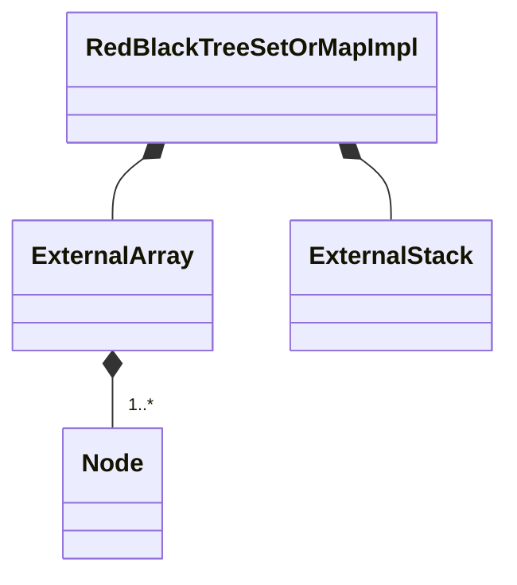

# RedBlackTreeSetOrMapImpl

`RedBlackTreeSetOrMapImpl` is a `final` class template
defined in [`Fw/DataStructures`](sdd.md).
It represents a set or map implementation based on a red-black tree.
Internally it maintains an [`ExternalArray`](ExternalArray.md)
of tree nodes and an [`ExternalStack`](ExternalStack.md) of
indices pointing into the array.

## 1. Template Parameters

`RedBlackTreeSetOrMapImpl` has the following template parameters.

|Kind|Name|Purpose|
|----|----|-------|
|`typename`|`KE`|The type of a key in a map or the element of a set|
|`typename`|`VN`|The type of a value in a map or `Nil` for set|

<a name="Public-Types"></a>
## 2. Public Types

`RedBlackTreeSetOrMapImpl` defines the following public types.

|Name|Definition|Purpose|
|----|----------|-------|
|`Entry`|Alias for [`SetOrMapIterator<KE, VN>`](SetOrMapIterator.md)|An entry in the set or map|
|`Iterator`|Alias for [`SetOrMapIterator<KE, VN>`](SetOrMapIterator.md)|An iterator for the set or map|

## 3. Private Types

<a name="Node-Struct"></a>
### 3.1. The Node Struct

`Node` is a struct defined as a private member of `RedBlackTreeSetOrMapImpl`.
It represents a node of the red-black tree.

#### 3.1.1. Public Types

`Node` defines the following public types.

|Name|Definition|Purpose|
|----|----------|-------|
|`Color`|An enumeration with values `BLACK` and `RED`|A node color|
|`Direction`|An enumeration with values `LEFT` and `RIGHT`|A tree direction|
|`Index`|`FwSizeType`|An array index representing a tree node|

#### 3.1.2. Public Constants

`Node` defines the following constants.

|Name|Type|Purpose|Value|
|----|----|-------|-------------|
|`NONE`|`Index`|An out-of-bounds index value corresponding to no node|`std::numeric_limits<FwSizeType>::max()`|

#### 3.1.3. Public Member Variables

`Node` has the following private member variables.

|Name|Type|Purpose|Default Value|
|----|----|-------|-------------|
|`parent`|`Node::Index`|The index of the parent of this node|`Node::NONE`|
|`predecessor`|`Node::Index`|The index of the predecessor of this node|`Node::NONE`|
|`successor`|`Node::Index`|The index of the successor of this node|`Node::NONE`|
|`left`|`Node::Index`|The index of the left child of this node|`Node::NONE`|
|`right`|`Node::Index`|The index of the right child of this node|`Node::NONE`|
|`color`|`Color`|The color of this node|`Color::BLACK`|
|`entry`|`Entry`|The set or map entry stored in this node|C++ default initialization|

#### 3.1.4. Public Member Functions

### 3.2. getChild

```c+++
Node::Index getChild(Direction direction)
```

**Overview:**
Gets the child of `this` in direction `direction`.

**Algorithm:**
Return `(direction == LEFT) ? left : right`.

### 3.3. setChild

```c++
void setChild(Direction direction, Index node)
```

**Overview:**
Sets the child of `this` in direction `direction`.

**Algorithm:**
`(direction == LEFT) ? (this.left = node) : (this.right = node)`.

### 3.4. getOppositeDirection

```c+++
static Direction oppositeDirection(Direction direction)
```

**Overview:**
Returns the opposite direction

**Algorithm:**
Return `(direction == LEFT) ? RIGHT : LEFT`.

### 3.5. Type Aliases

`RedBlackTreeSetOrMapImpl` defines the following private type aliases.

|Name|Definition|Purpose|
|----|----------|-------|
|`Nodes`|Alias for [`ExernalArray<Node>`](ExternalArray.md)|The type of the array for storing the tree nodes|
|`FreeNodes`|Alias for [`ExernalStack<Node::Index>`](ExternalStack.md)|The type of the stack of indices of free nodes.|

## 4. Private Member Variables

`RedBlackTreeSetOrMapImpl` has the following private member variables.

|Name|Type|Purpose|Default Value|
|----|----|-------|-------------|
|`m_nodes`|`Nodes`|The array for storing the tree nodes|C++ default initialization|
|`m_freeNodes`|`FreeNodes`|The stack of indices of free nodes. The indices point into `m_nodes`.|C++ default initialization|
|`m_root`|`Node::Index`|The index of the root node|Node::NONE|
|`m_size`|`FwSizeType`|The number of nodes in the tree|0|



## 5. Public Constructors and Destructors

### 5.1. Zero-Argument Constructor

```c++
RedBlackTreeSetOrMapImpl()
```

Initialize each member variable with its default value.

### 5.2. Constructor Providing Typed Backing Storage

```c++
RedBlackTreeSetOrMapImpl(Node* nodes, FwSizeType* freeNodes, FwSizeType capacity)
```

Each of `nodes` and `freeNodes` must point to at least `capacity` items.

Call `setStorage(nodes, freeNodes, capacity)`.

### 5.3. Constructor Providing Untyped Backing Storage

```c++
RedBlackTreeSetOrMapImpl(ByteArray data, FwSizeType capacity)
```

`data` must be aligned according to 
[`getByteArrayAlignment()`](#getByteArrayAlignment) and must
contain at least [`getByteArraySize(size)`](#getByteArraySize) bytes.

Call `setStorage(data, capacity)`.

### 5.4. Copy Constructor

```c++
RedBlackTreeSetOrMapImpl(const RedBlackTreeSetOrMapImpl<KE, VN>& map)
```

Set `*this = map`.

### 5.5. Destructor

```c++
~RedBlackTreeSetOrMapImpl()
```

Defined as `= default`.

## 6. Public Member Functions

### 6.1. operator=

```c++
RedBlackTreeSetOrMapImpl<KE, VN>& operator=(const RedBlackTreeSetOrMapImpl<KE, VN>& impl)
```

1. If `&impl != this`

    1. Set `m_nodes = impl.m_nodes`.

    1. Set `m_freeNodes = impl.m_freeNodes`.

    1. Set `m_root = impl.m_root`.

    1. Set `m_size = impl.m_size`.

1. Return `*this`.

### 6.2. clear

```c++
void clear()
```

1. Set `m_size = 0`.

1. Call `m_freeNodes.clear()`.

1. For each `i` in the range `[0, getCapacity())`

    1. Let `status = m_freeNodes.push(i)`.

    1. Assert `status == SUCCESS`.

### 6.3. find

```c++
Success find(const KE& keyOrElement, VN& valueOrNil) const
```

1. Set `node = NONE`.

1. Set `direction = LEFT`.

1. Set `status = FAILURE`.

1. Let `findStatus = findNode(keyOrElement, node, direction)`.

1. If `findStatus == SUCCESS`

    1. Set `valueOrNil = m_nodes[node].entry.getValue()`.

    1. Set `status = SUCCESS`.

1. Return `status`.

### 6.4. getCapacity

```c++
FwSizeType getCapacity() const
```

Return `m_nodes.getSize()`.

### 6.5. getHeadIterator

```c++
const Iterator* getHeadIterator() const
```

TODO

### 6.6. getSize

```c++
FwSizeType getSize()
```

Return `m_size`.

### 6.7. insert

```c++
Success insert(const KE& keyOrElement, const VN& valueOrNil)
```

1. Set `node = NONE`.

1. Set `direction = LEFT`.

1. Set `status = FAILURE`.

1. Let `findStatus = findNode(keyOrElement, node, direction)`.

1. If `findStatus == SUCCESS`

    1. Call `m_nodes[node].setValue(valueOrNil)`.

    1. Set `status = SUCCESS`.

1. Otherwise

   1. Set `parent = node`.

   1. Set `status = m_freeNodes.pop(node)`.

   1. If `status == SUCCESS`

       1. Set `m_nodes[node] = Node()`.

       1. Call `m_nodes[node].entry.setKey(keyOrElement)`.

       1. Call `m_nodes[node].entry.setValue(valueOrNil)`.

       1. Call `insertNode(node, parent, direction)`.

       1. Let `predecessor = getPredecessorOfNone(Node::Index node, Direction direction)

       1. Call `updateLinks(predecessor, node)`.

1. Return `status`.

### 6.8. remove

```c++
Success remove(const KE& keyOrElement, VN& valueOrNil)
```

TODO

### 6.9. setStorage (Typed Data)

```c++
void setStorage(Node* nodes, FwSizeType* freeNodes, FwSizeType capacity)
```

Each of `nodes` and `freeNodes` must point to at least `capacity` items.

1. Call `m_nodes.setStorage(nodes, capacity)`.

1. Call `m_freeNodes.setStorage(freeNodes, capacity)`.

1. Call `clear()`.

### 6.10. setStorage (Untyped Data)

```c++
void setStorage(ByteArray data, FwSizeType capacity)
```

`data` must be aligned according to 
[`getByteArrayAlignment()`](#getByteArrayAlignment) and must
contain at least [`getByteArraySize(size)`](#getByteArraySize) bytes.

1. Call `m_nodes.setStorage(data, capacity)`.

1. Let `nodesSize = ExternalArray<Node>::getByteArraySize`.

1. Let `freeNodesOffset` be the smallest integer greater than or equal to `nodesSize`
that is aligned for `ExternalStack<FwSizeType>::getByteArrayAlignment()`.

1. Let `freeNodesSize = ExternalArray<Node>::getByteArraySize(capacity)`.

1. Assert that `freeNodesOffset + freeNodesSize <= data.size`.

1. Let `freeNodesData = ByteArray(&data.bytes[freeNodesOffset], freeNodesSize)`.

1. Call `m_freeNodes.setStorage(freeNodesData, capacity)`.

1. Call `clear()`.

## 7. Public Static Functions

<a name="getByteArrayAlignment"></a>
### 7.1. getByteArrayAlignment

```c++
static constexpr U8 getByteArrayAlignment()
```

Return `Nodes::getByteArrayAlignment()`.

<a name="getByteArraySize"></a>
### 7.2. getByteArraySize

```c++
static constexpr FwSizeType getByteArraySize(FwSizeType capacity)
```

1. Let `nodesSize = Nodes::getByteArraySize(capacity)`.

1. Let `freeNodesAlignment = FreeStack::getByteArrayAlignment()`.

1. Let `freeNodesSize = FreeStack::getByteArraySize(capacity)`.

1. Return `nodesSize + freeNodesAlignment + freeNodesSize`.

## 8. Private Helper Functions

<a name="findNode"></a>
### 8.1. findNode

```c++
Success findNode(const KE& keyOrElement, Node::Index& node, Direction& direction) const
```

**Overview:**
This function tries to find a node whose key or element _ke_ matches 
`keyOrElement`.
If it finds such a node _N_, then on return `node` holds the index of _N_, and
the return value is `SUCCESS`.
Otherwise, on return

1. If the tree is empty, then `node` holds `NONE`.

1. Otherwise `node` holds the index of the node _N_ containing the `NONE`
   child where _ke_ should be inserted.
   `direction` is the direction of the child in _N_ (left or right).

1. The return value is `FAILURE`.

**Algorithm:**

1. Set `result = FAILURE`.

1. Set `direction = LEFT`.

1. Set `node = m_root`.

1. Set `nodeFound = false`.

1. In a for loop bounded by `getCapacity()`:

    1. Compare `keyOrElement` to the key or element in the entry stored in `m_nodes[node]`.

    1. If the comparison result is equality, then set `nodeFound = true`,
       set `result = SUCCESS`, and break out of the loop.

    1. Otherwise if the comparison result is less and `m_nodes[node].left == Node::NONE`, then
       set `nodeFound = true` and break out of the loop.

    1. Otherwise if the comparison result is less, then set `node = m_nodes[node].left`.

    1. Otherwise if `m_nodes[node].right == Node::NONE`, then set `nodeFound = true`,
       set `direction = RIGHT`, and break out of the loop.

    1. Otherwise set `node = m_nodes[node].right`.

1. Assert `nodeFound == true`.

1. Return `result`.

### 8.2. rotateSubtree

```c++
Node::Index rotateSubtree(Node::Index node, Direction direction)
```

**Overview:**
This function performs a left or right rotation on the subtree
whose root is `node`.
`node` must not be `NONE`, or an assertion failure will occur.
The child of `node` in the direction `direction` must also
not be `NONE`.

**Algorithm:**

1. Let `parent = m_nodes[node].parent`.

1. Let `oppositeDirection = Node::getOppositeDirection(direction)`.

1. Let `newRoot = m_nodes[node].getChild(oppositeDirection))`.

1. Let `newChild = m_nodes[node].getChild(direction)`.

1. Call `m_nodes[node].setChild(oppositeDirection, newChild)`.

1. If `newChild != NONE` then set `m_nodes[newChild].parent = node`.

1. Call `m_nodes[newRoot].setChild(direction, node)`.

1. Set `m_nodes[newRoot].parent = parent`.

1. Set `m_nodes[node].parent = newRoot`.

1. If `parent != NONE` then

    1. Set `newRootDirection = (node == m_nodes[parent].right) ? RIGHT : LEFT`.

    1. Call `m_nodes[parent].setChild(newRootDirection, newRoot)`.

1. Otherwise set `m_root = newRoot`.

1. Return `newRoot`.

### 8.3. getParentDirection

```c++
Direction getParentDirection(Node::Index node) const
```

**Overview:** Get the parent direction for a node.
`node` must not be `NONE`.
The parent of `node` must not be `NONE`.

**Algorithm:**

1. Set `parent = m_nodes[node].parent`.

1. Set `parentRight = m_nodes[parent].right`.

1. Return `node == parentRight ? RIGHT : LEFT`.

### 8.4. insertNode

```c++
void insertNode(Node::Index node, Node::index parent, Direction direction)
```

**Overview:**
This function inserts `node` into the tree as a left or right
child of `parent`, according to `direction`.
It rebalances the tree as needed to maintain the red-black 
invariant.

It is permissible for `parent` to be `NONE`.
In this case we are inserting at the root of the tree, and `direction` is 
ignored.

It is not permissible for `node` to be `NONE`.

**Algorithm:**

1. let `oppositeDirection = Node::getOppositeDirection(direction)`.

1. Set `m_nodes[node].color = RED`.

1. Set `m_nodes[node].parent = parent`.

1. If `parent == NONE` then set `m_root = node`.

1. Set `done = false`.

1. Otherwise 

    1. Call `m_nodes[parent].setChild(direction, node)`.

    1. In a for loop bounded by `getCapacity()`:

        1. If `parent == NONE` or `m_nodes[parent].color == BLACK` 
           then set `done = true` and break out of the loop.

        1. Set `grandparent = m_nodes[parent].parent`.

        1. If `grandparent == NONE` then

            1. Set `m_nodes[parent].color = BLACK`.

            1. Set `done = true` and break out of the loop.

        1. Set `direction = getParentDirection(parent)`.

        1. Let `uncle = m_nodes[grandparent].getChild(oppositeDirection)`.

        1. If `uncle == NONE` or `m_nodes[uncle].color == BLACK` then

            1. If `node = m_nodes[parent].getChild(oppositeDirection)`

                1. Call `rotateSubtree(parent, direction)`.

                1. Set `node = parent`.

                1. Set `parent = m_nodes[grandparent].getChild(direction)`.

            1. Call `rotateSubtree(grandparent, oppositeDirection)`.

            1. Set `m_nodes[parent].color = BLACK`.

            1. Set `m_nodes[grandparent].color = RED`.

            1. Set `done = true` and break out of the loop.

        1. Set `m_nodes[parent].color = BLACK`.

        1. Set `m_nodes[uncle].color = BLACK`.

        1. Set `m_nodes[grandparent].color = RED`.

        1. Set `node = grandparent`.

        1. Set `parent = m_nodes[node].parent`.

1. Assert `done == true`.

### 8.5. getPredecessorOfNone

```c++
Node::Index getPredecessorOfNone(Node::Index node, Direction direction) const
```

**Overview:**
This function gets the predecessor of a `NONE` node, specified as
(1) a node, which is either `NONE` itself or a node with a `NONE` child;
and (2) a direction.
If `node` is not `NONE`, then the child of node in the direction `direction`
must be `NONE`.
If `node` is `NONE`, then `direction` is ignored.

**Algorithm:**

1. Set `result = node`.

1. If `node != NONE`

    1. Set `parent = m_nodes[node].parent`.

    1. If `parent == NONE` and `direction == LEFT` then set `result = NONE`.

    1. If `parent != NONE` and `m_nodes[parent].direction != direction` then set `result = parent`.

1. Return `result`.

### 8.6. updateLinks

```c++
void updateLinks(Node::Index predecessor, Node::Index node)
```

**Overview:**
Update the links in the nodes and entries.
`node` is a node; it must not be `NONE`.
`predecessor` is its predecessor; it may be `NONE`.

**Algorithm:**

1. Set `successor = (predecessor != NONE) ? m_nodes[predecessor].successor : NONE`.

1. Set `m_nodes[node].predecessor = predecessor`.

1. Set `m_nodes[node].successor = successor`.

1. Set `nextIterator = (successor != NONE) ? &m_nodes[successor].entry : nullptr`;

1. Call `m_nodes[node].entry.setNextIterator(nextIterator)`.

1. If `predecessor != NONE` then

    1. Set `m_nodes[predecessor].successor = node`.

    1. Call `m_nodes[predecessor].entry.setNextIterator(&m_nodes[node].entry)`.

1. If `successor != NONE` then set `m_nodes[successor].predecessor = node`.
