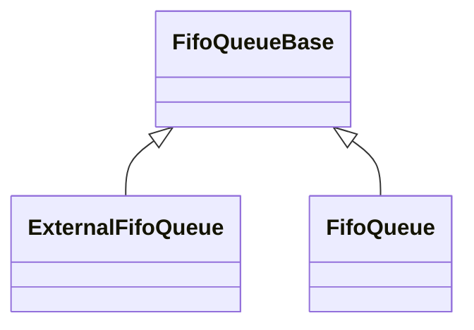

# Fw/DataStructures: Basic Data Structures

`Fw/DataStructures` contains a library of basic data structures.
All the definitions in this directory are in the
namespace `Fw`.

The data structures defined here use the following concepts:

* **size:** The number of elements currently stored in a data structure.

* **capacity:** The maximum number of elements stored in a data structure.

For a fixed-size array, the size and the capacity are the same.
For other data structures, the size and the capacity are not
in general the same.
For example, a map has a capacity _C_ and a size between 0 
and _C_.

## 1. Arrays

An **array** _A_ stores _S_ elements for _S > 0_ at indices
0, 1, ..., _S - 1_.
The elements are stored in **backing memory** _M_.
An array provides bounds-checked access to the array elements
stored in _M_.

`Fw/DataStructures` provides the following array templates:

* [`ExternalArray`](ExternalArray.md)

* [`Array`](Array.md)

## 2. FIFO Queues

A **FIFO queue** is a data structure backed by an array.
It supports enqueue and dequeue operations in
first in first out (FIFO) order.

### 2.1. Templates

`Fw/DataStructures` provides the following FIFO queue templates:

* [`FifoQueueBase`](FifoQueueBase.md)

* [`ExternalFifoQueue`](ExternalFifoQueue.md)

* [`FifoQueue`](FifoQueue.md)

The queue implementations use a template called [`CircularIndex`](CircularIndex.md)
for representing an index that wraps around modulo an integer.

### 2.2. Class Diagram

## 3. Maps

* [`MapBase`](MapBase.md)

* [`ExternalArrayMap`](ExternalArrayMap.md)

* [`ArrayMap`](ArrayMap.md)

* [`AvlTreeMap`](AvlTreeMap.md)

* [`ExternalAvlTreeMap`](ExternalAvlTreeMap.md)

## 4. Sets

* [`SetBase`](SetBase.md)

* [`ExternalArraySet`](ExternalArraySet.md)

* [`ArraySet`](ArraySet.md)

* [`ExternalAvlTreeSet`](ExternalAvlTreeSet.md)

* [`AvlTreeSet`](AvlTreeSet.md)
