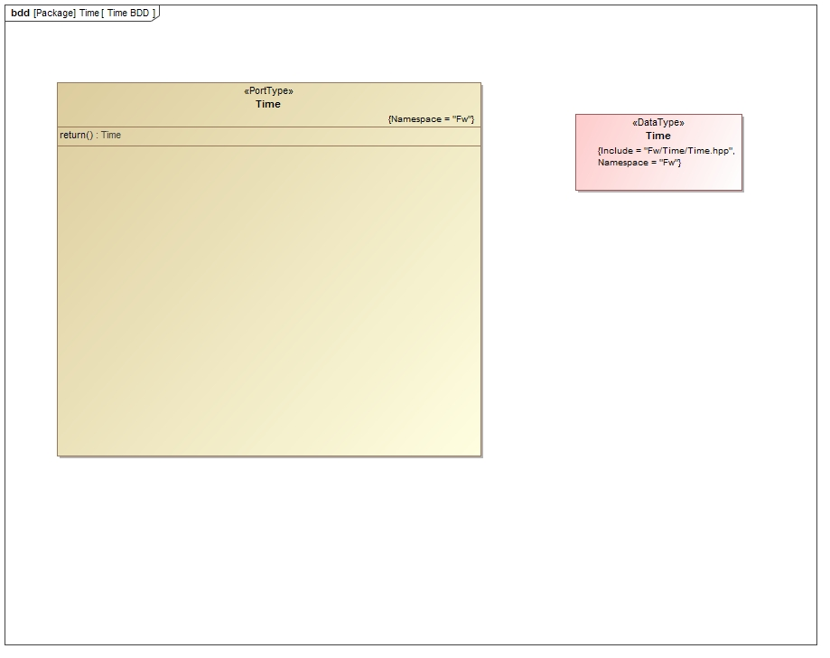

# Fw::Time Port

## 1. Introduction

The `Fw::Time` port is used to pass time stamps around the system, either for telemetry and events or other uses.

## 2. Design

### 2.1 Context

#### 2.1.1 Port Diagram

The `Fw::Time` port has the following port diagram:

#### 2.1.2 Serializables

The `Fw::Time` port uses the following serializable:

##### 2.1.2.1 Fw::Time

`Fw::Time` is a class that stores the time base (project specific), seconds and microseconds of the time stamp.

## 3. Change Log

Date | Description
---- | -----------
6/19/2015 |  Initial Version

