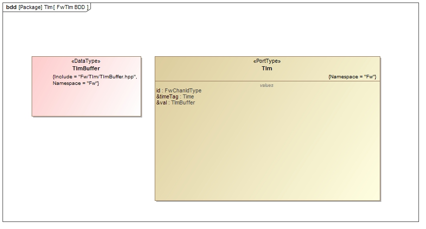

\page FwTlmPort Fw::Tlm Port
# Fw::Tlm Port

## 1. Introduction

The `Fw::Tlm` port is used to pass a serialized telemetry value. It also passes the telemetry channel IS as well a time tag representing the time the channel was written. 

## 2. Design

### 2.1 Context

#### 2.1.1 Port Diagram

The `Fw::Tlm` port has the following port diagram:

#### 2.1.2 Serializables

##### 2.1.2.1 Fw::ComBuffer

The `Fw::TlmBuffer` class contains a buffer that holds the serialized value of a telemetry channel. This buffer is passed as an argument to the `Fw::Tlm` port.

##### 2.1.2.2 Fw::ComPacket 

The `Fw::TlmPacket` class is a packet class derived from [`Fw::ComPacket`](../../Com/docs/sdd.md) that provides methods for encoding a telemetry packet. It contains an internal `Fw:ComBuffer` that holds serialized channel values.

To fill a packet with telemetry values, do the following:

1\. Instantiate an instance of the `TlmPacket` class.

2\. Invoke the `resetPktSer()` method to start adding telemetry values. This method will empty the buffer and add the channel descriptor to the beginning.

3\. Call the `addValue()` method with new entries until all entries are added or until the method returns the `Fw::FW_SERIALIZE_NO_ROOM_LEFT` status. That means that the buffer is full and the new entry was not added.

4\. Extract the `ComBuffer` with the `getBuffer()` method and send it to the ground system.

5\. Repeat steps 2-4 for additional channel values, not forgetting to include one potentially rejected in step 3.

The layout of the internal `ComBuffer` is as follows:

|Telemetry Packet Descriptor|Chan 1 ID|Chan 1 timestamp|Chan 1 Value|....|Chan N ID|Chan N timestamp|Chan N Value|Left over buffer space|
|---|---|---|---|---|---|---|----|---|

To extract telemetry values from a packet, do the following:

1\. Instantiate an instance of the `TlmPacket` class.

2\. Pass it the serialized channel `ComBuffer` data via the `setBuffer()` method.

3\. Call the `resetPktDeser()` method to start extracting data from the buffer. This will extract the packet descriptor and verify that it matches the one for telemetry.

4\. For each telemetry entry in the packet, invoke the `extractValue()` method. Note that the users must know the size of the telemetry value (hence the `bufferSize` argument) since the buffer does not contain information on the boundaries of values.

5\. Repeat steps 2-4 for any additional channels. The `extractValue()` method will return `Fw::FW_DESERIALIZE_BUFFER_EMPTY` when there is no more channel data in the buffer.

## 3. Change Log

Date | Description
---- | -----------
6/23/2015 |  Initial Version
6/23/2022 |  Updated implementation to hold multiple channel entries
