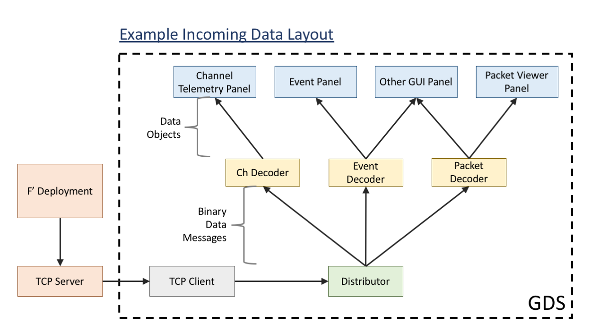
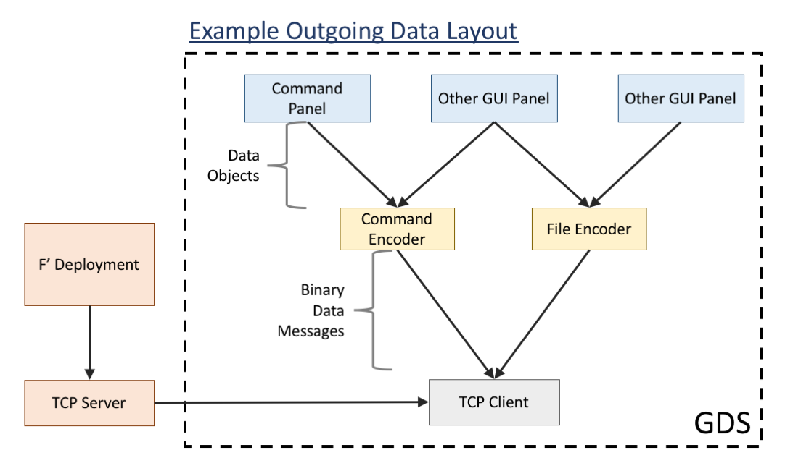

# GDS: How To

### Overview
The Gds provides a remote interface for fprime deployments, allowing users to view 
telemetry and events and send commands.

The Gds is a heavily refactored version of the fprime Gse. Both the Gse and Gds use 
the ThreadedTCPServer to receive data from the fprime deployment. They also have very 
similar looking GUIs and similar start up scripts. However, behind the scenes are very 
different. 

The Gds was designed to be adaptable, easily understanable, and easily expandable. 
To this end, it is built using publisher/subscriber relationships. 

The diagram below shows an example structure for incomming data. Data from the F' deployment 
first enters the Gds at the TCP client. Each packet is then passed directly to the 
distributor which is responsible for parsing the packets in to data messages and 
sending on each message type (currently only events, channels, and packetized telemetry 
are supported) to decoders registered for that type. The decoder is responsible for 
turning that data message into a data object which it passes along to all consumers 
registered to it. These consumers could be anything, but in the Gds they are gui 
panels that display the data. 

For outgoing data, the structure is similar. Currently, only commands are supported for
outgoing data. Command data objects are created in panels and then sent to all encoders
who are registered to that panel. The encoders take the data object and turn it into binary
data that can be sent to the fprime deployment. The binary data is then passed to the 
TCP client which is registered to the encoder. Finally, the TCP client send the data back
to the TCP server and the F' deployment.

All of these objects are created and registered to other objects when the Gds is initialized.
Thus, all of the structure of the Gds is created in one place, and can be easily modified.

## Classes

### Distributor

### Templates

### Data Types

### Loaders

### Decoders

### Encoders

### Consumers

## Notes
 - Currently, the models/common directory has command.py, event.py, and
   channel.py. These files must be present in order for the python dictionaries
   to be properly imported. However, they are empty and not used in the GDS. 
   When we switch to XML dictionaries, these can go away. 

