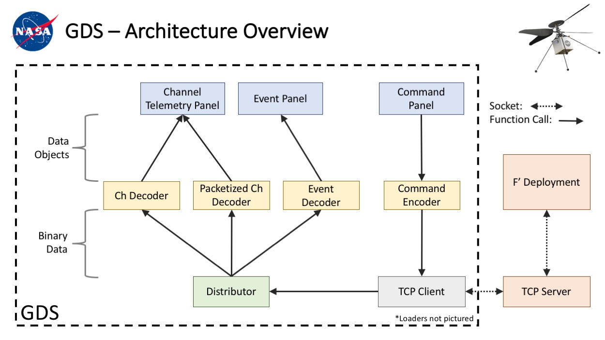

# GDS

Note: This README describes GDS internals. Refer to the [user's guide](https://nasa.github.io/fprime/UsersGuide/gds/gds-introduction.html)
for instructions on how to use the GDS.

## Overview
The GDS consists of a collection of classes and tools that provide an interface for fprime
deployments, allowing users to view telemetry and events and send commands.

The GDS HTML GUI is an almost completely rewritten version of the F´ GSE UI, our historical
ground system that has been deprecated due to its Python 2 requirement.

The GDS was designed to be adaptable, easily understandable, and easily expandable. To this end, it
is built using publisher/subscriber relationships.

The diagram below shows the basic layout of the GDS. Data from the F´ deployment first enters the
GDS at the TCP client. Each packet is then passed directly to the distributor which is responsible
for parsing the packets in to data messages and sending on each message type (currently only events,
channels, and packetized telemetry are supported) to decoders registered for that type. The decoder
is responsible for turning that data message into a data object which it passes along to all
consumers registered to it. These consumers could be anything, but in the GDS they are GUI panels
that display the data. For outgoing data, the structure is similar. Currently, commands are the only
output data type included. Command data objects are created in the command panel and then sent to
the command encoder registered to that panel. Encoders take a data object and turn it into binary
data that can be sent to the F´ deployment. The binary data is then passed to the TCP client
which is registered to the encoder. Finally, the TCP client send the data back to the TCP server and
the F´ deployment. 

All of these objects are created and registered to other objects when the GDS
is initialized. Thus, all of the structure of the GDS is created in one place,
and can be easily modified.

## GDS Tools
The GDS was designed to have flexible configurations of consumers for its various data decoders.
This has been used to support several additional tools.

### GDS Standard Pipeline
The standard pipeline can be thought of as a Python helper-layer to instantiate the GDS and connect
to an F´ deployment. The pipeline provides event, telemetry and command histories, sending
commands and registering consumers to the GDS decoders. The Standard Pipeline can be found
[here](src/fprime_gds/common/pipeline/standard.py).

### GDS Integration Test API
The Integration Test API is a tool that provides the ability to write integration-level tests for an
F´ deployment using the GDS. The tool provides history searches/asserts, command sending, a
detailed test log, sub-histories and convenient access to GDS data objects. The test API comes with
separate [documentation](../docs/UsersGuide/dev/testAPI/markdown/contents.md) and its own [user
guide](../docs/UsersGuide/dev/testAPI/user_guide.md) and is built on top of the Standard Pipeline.

## GDS GUI Usage

A guide for how to use the GDS is available in the [fprime documentation](https://nasa.github.io/fprime/UsersGuide/gds/gds-introduction.html)

## Classes
The GDS back end is composed of several different data processing units. For 
most of the units described below, a base class describes the interface and 
subclasses implement the interface for specific data types (such as events,
channels, etc).

To expand the GDS to accept more data types or have additional features, new classes 
can be written and registered into the existing structure.

### TCP Client
The TCP client is simply a passthrough for data coming from the TCP Server and 
the F´ Distribution. The client handles all the socket connection overhead and 
passes un-parsed data onto all objects registered with it.

### Distributor
The distributer is responsible for taking in raw binary data, parsing off the 
length and descriptor, and then passing the data to all decoders registered to 
that descriptor. Descriptor types include events, channels, packets, etc (a full
enumeration can be found in (src/utils/data_desc_type.py). The binary data that 
the descriptor receives should be of the form:

| Length (4 bytes) | Type Descriptor (4 bytes) | Message Data |
| ---------------- | ------------------------- | ------------ |

The distributor should then pass only the message data along to the decoders. 

### Templates
For each general data type (channel, event, etc) there is a template type. 
Instances of these classes hold information about specific channels or event 
types (ex. the NumPkts channel or the FirstPacketReceived event).

Template classes hold information such as the channel/event/packet's id, name, 
argument types, value type, format string, etc. This information is used by 
decoders when parsing data that they receive. 

### Data Types
For each general data type (channel, event, etc) there is a type class. 
Instances of these classes hold information about a specific channel reading or 
event. They contain the actual data parsed by the decoders. As such, they are 
the data type returned by encoders. All of these classes have a time field are 
derived from type SysData, which implements a compare function, allowing any list 
of SysData objects to be sorted by time. Each inherited type should also 
implement the __str__ method so the objects can be easily printed. 

Each instance of a type class also has a reference to the corresponding template
class for that channel or event type.

### Loaders
Loaders are used to construct dictionaries of channel and events. These 
dictionaries have template classes as values and ids or names as keys. 

Each dictionary type has their own loader, but subclassing is used to prevent
code duplication. For example, there are loaders for channel and event python
file dictionaries, but they both subclass the python loader class which provides
helper functions for reading python file dictionaries. 

### Decoders
Decoders are responsible for parsing the message data for a specific descriptor
type. 

Each decoder uses dictionaries produced by loaders to help with its parsing.
These are given to the decoder's constructor.

The knowledge for how to parse that descriptor type should stay within the 
decoder. Each decoder type takes in the binary message data, parses it, and 
sends the resulting data object to all consumers registered to it. 

### Encoders
Encoders are responsible for taking data objects from consumers (GUI panels), 
converting them to binary data, and passing them to the TCP client to send to 
the F´ deployment. 

Like the decoders, encoders use dictionaries produced by loaders to help craft
the binary output.

### Consumers
Consumers do not have a specific base class, but instead simply implement a data
callback method that is called by decoders with parsed data objects as the 
argument. In the case of the Gds, the consumers are the GUI panels that display 
data. Consumers can also produce data that is sent to encoders and eventually on
to the F´ deployment. 

### Main Frame Factory
This class is responsible for setting up the pipeline of data between different 
components in the publisher/subscriber interface - that is, it is 
responsible for registering all of the various components that wish to share
data. This class also supports the creation of multiple Gds GUI windows which
all share the same subscriptions and therefore receive the same data. 

### ConfigManager
The `ConfigManager` class is responsible for storing configurations used by GDS
classes. An instance of this class is passed to some GDS classes such as 
distributors and encoders (to indicate the types of some binary data fields) and
to some consumers (to indicate colors). The ConfigManager class sets the defaults
for each config, but a .ini file can also be passed into the constructor to set
the configs to custom values.

## Modify GDS Structure
To setup the structure of the GDS, instances of the above classes are first
created. Then, they are registered to one another by calling the data producer's
`register` function with the data consumer as the argument. The data consumer 
is expected to implement a callback function to receive the data (`data_callback`
for most classes, but check the base class's documentation for details).

An example of how to instantiate and register classes into the correct structure 
can be found in the `MainFrameFactory` class.

## Setup
The Gds requires the packages specified in [setup.py](setup.py).

These can be installed along the Gds package using the following commands:

```
pip install --upgrade fprime-gds
```

For full installation instructions, including virtual environment creation and installation verification, see [INSTALL.md](https://github.com/nasa/fprime/blob/devel/docs/INSTALL.md).

## Generate Documentation
You can generate a doxygen documentation page for the GDS source.
To do this, you will need to install `doxygen`, `doxypypy` and `graphviz`.

### Linux/Windows WSL
```
apt-get install doxygen graphviz
pip install doxypypy
```

### Mac
Install doxygen from the website (http://www.stack.nl/~dimitri/doxygen/download.html) or by using the following command if you have Homebrew
```
brew install doxygen
brew install graphviz
pip install doxypypy
```

Next, make `docs/py_filter` available in your system path however you see fit.
Now you can run `doxygen Doxyfile` in the root directory to generate documentation in `docs/doxy/index.html`

## Notes
 - Currently, the models/common directory has command.py, event.py, and
   channel.py. These files must be present in order for the python dictionaries
   to be properly imported. However, they are empty and not used in the GDS. 
   When we switch fully to XML dictionaries, these can go away. 

