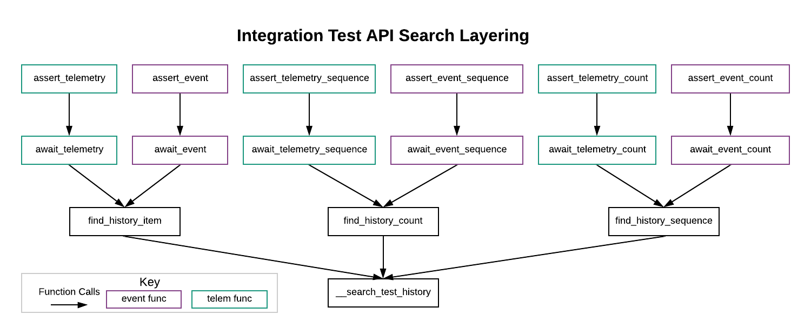
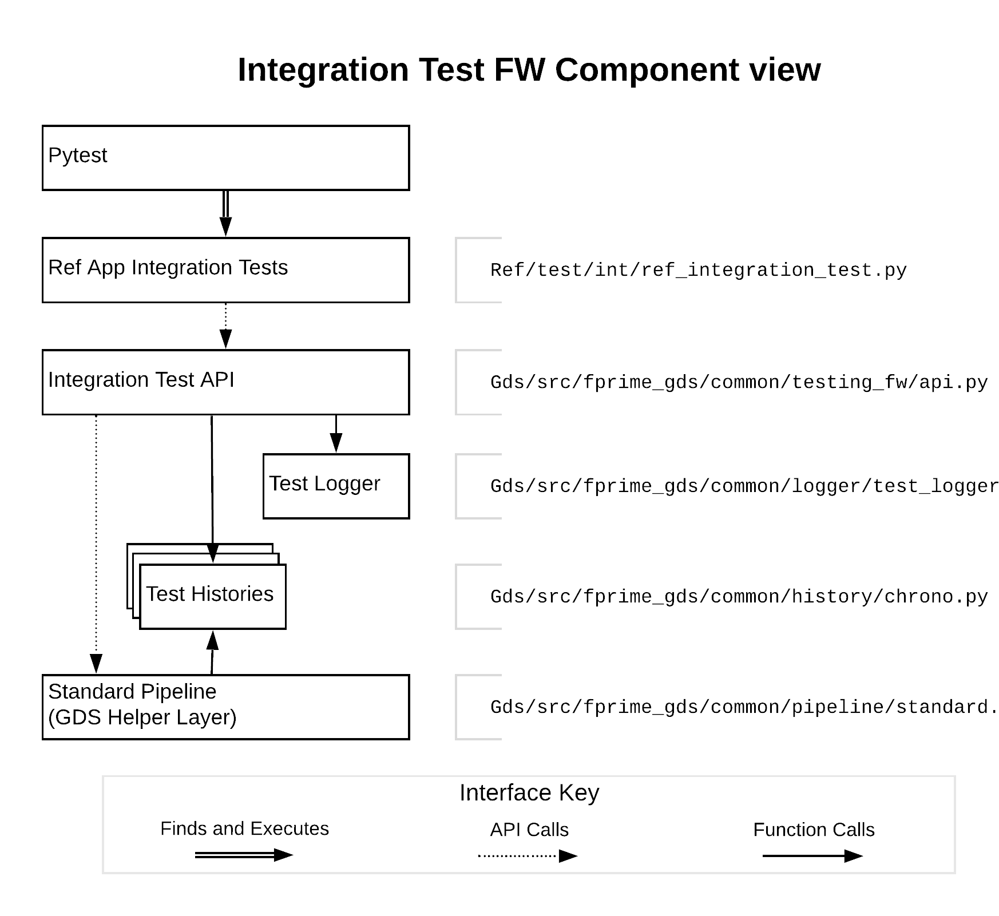
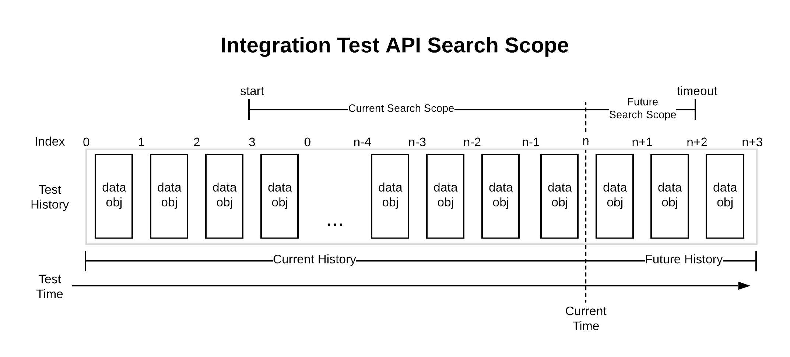
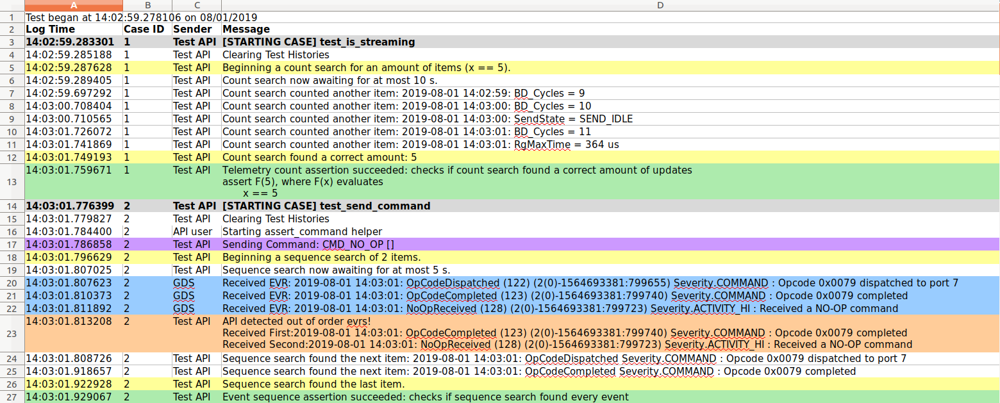

# GDS Integration Test API User Guide

The GDS integration test API is a GDS Tool that provides useful functions and asserts for creating integration-level tests on an FPrime deployment. This document hopes to give an overview of the main features associated with the Test API and demonstrates common use patterns and highlight some anti-patterns. See [this link](markdown/contents.md) for the IntegrationTestAPI's sphinx-generated documentation.

## Quick Start

To work with the integration test API, the user must first create an instance of the StandardPipeline and then instantiate the API. This is boiler plate code that should be [moved inside the TestAPI](#moving-standardpipeline-to-api-constructor). The following code snippet accomplishes directing the GDS to a deployment dictionary, connecting to a running deployment, and finally instantiating the test API. This snippet **DOES NOT** run the GDS TCP Server or run an FPrime deployment. An example script to run the Ref App deployment without a GDS Tool can be found [here](../../../Ref/scripts/run_ref_for_int_test.sh).

~~~~{.python}
from fprime_gds.common.pipeline.standard import StandardPipeline
from fprime_gds.common.utils.config_manager import ConfigManager
from fprime_gds.common.testing_fw.api import IntegrationTestAPI
from fprime_gds.common.testing_fw import predicates   # Recommended, but not required

# instantiate the GDS and connect to the Deployment
pipeline = StandardPipeline()
dict_path = "/path/to/AppDictionary.xml"  # user must replace with an actual path
pipeline.setup(ConfigManager(), dict_path)
pipeline.connect("127.0.0.1", 50000)  # user must replace with actual address and port

# instantiate Test API
log_path = "/path/to/api/output/directory"  # user must replace with an actual path
api = IntegrationTestAPI(pipeline, log_path)

# user can now use the Test API
api.assert_telemetry("SOME_CHANNEL_MNEMONIC")
~~~~

### How to use the API with a test framework

To use the test API with a testing framework like unittest or pytest there are four methods that should be called.

1. First, the test framework should call a **one-time** setup method to instantiate the API and connect to the deployment.
2. Second, the framework should call a setup method for each test case to call the API's start_test_case method that clears histories, and logs messages to denote test-case boundaries.
3. Third, the framework should call any number of associated test cases.
4. Finally, the test framework should call a **one-time** teardown method to save the API at.

Below is an example of these steps using unittest. For an example of this using pytest, see the Ref App [integration tests](../../../Ref/test/int/ref_integration_test.py).

~~~~{.python}
import unittest
from fprime_gds.common.pipeline.standard import StandardPipeline
from fprime_gds.common.utils.config_manager import ConfigManager
from fprime_gds.common.testing_fw.api import IntegrationTestAPI
from fprime_gds.common.testing_fw import predicates   # Recommended, but not required

class SomeTestCases(unittest.TestCase):
    @classmethod
    def setUpClass(cls):
        # this is used to generate a case_id
        cls.case_list = []

        # instantiate the GDS and connect to the deployment
        cls.pipeline = StandardPipeline()
        dict_path = "/path/to/AppDictionary.xml"  # user must replace with an actual path
        cls.pipeline.setup(ConfigManager(), dict_path)
        cls.pipeline.connect("127.0.0.1", 50000)

        # instantiate Test API
        log_path = "/path/to/api/output/directory"  # user must replace with an actual path
        cls.api = IntegrationTestAPI(cls.pipeline, log_path)

    def setUp(self):
        count = len(self.case_list)
        self.api.start_test_case(self._testMethodName, count)
        self.case_list.append(1)

    @classmethod
    def tearDownClass(cls):
        cls.pipeline.disconnect()
        cls.api.teardown()

    def test_case_one(self):
        self.api.test_assert(True, "The user has successfully set up the API.")

    def test_case_two(self):
        self.api.test_assert(False, "The user has successfully failed a test case.")

# used when this unit test were to be run as a python module
if __name__ == "__main__":
    unittest.main()
~~~~

## Usage Patterns

All usage patterns are written such that they would be compatible with the test framework example described above: each test case assumes that the histories were recently emptied and that the `self.api` field is a connected instance of the integration test API. For simplicity, usage examples will rely on mock flight software dictionaries that were used in the integration test API unit tests. This dictionary can be found [here](../../test/fprime_gds/common/testing_fw/UnitTestDictionary.xml).

If a user would like to play with the test API in a unit testing environment they could append their own test cases to the unit tests [here](../../test/fprime_gds/common/testing_fw/api_unit_test.py).
**NOTE**: there is no F Prime deployment in these unit tests so data objects need to be added manually.

If a user would like to experiment with integration tests on an actual F Prime application, they could modify the Ref app [integration tests](../../../Ref/test/int/ref_integration_test.py).
**NOTE**: running integration tests requires building and running the Ref app.

### Sending Commands

The Integration Test API provides several methods for sending commands to the user. The most simple is the send_command method. **NOTE**: The command arguments [must be strings](#-GDS-arguments-should-allow-non-string-types) (str) instead of a literal.

~~~~{.python}
self.api.send_command("TEST_CMD_1") # sending a command via mnemonic
self.api.send_command(0x01)         # sending the same command via opcode

self.api.send_command("TEST_CMD_2", ["235", "43"]) # sending a command with arguments
~~~~

### Searching for Telemetry

The integration Test API provides several different [types of searches](#-types-of-searches). Using a telemetry_predicate will enable the user to better specify the fields of the ChData object to be searched for.  **NOTE**: all searches in the API will return the results of the search. This is so the user may perform additional checks on the results. Whether or not the search was successful is left to the user to check.

~~~~{.python}
# awaits a telemetry update on the Counter Channel
result = self.api.await_telemetry("Counter")

# same search, but using an id
result = self.api.await_telemetry(3)

# awaits a Counter update with a value of 8
result = self.api.await_telemetry("Counter", 8)

# searches for an existing telemetry update on the Counter Channel
result = self.api.await_telemetry("Counter", start=0, timeout=0)

# awaits for 7 telemetry updates that are not guaranteed to be in order
results = self.api.await_telemetry_count(7, "Counter")

ch_seq = []
for i in range(0,10):
    ch_seq.append(self.api.get_telemetry_pred("Counter", i))

# awaits for 10 Counter updates with the values 0 through 9 (inclusive).
# the resulting sequence must follow the history's enforced order
results = self.api.await_telemetry_sequence(ch_seq)
~~~~

### Searching for Events

The integration Test API provides several different [types of searches](#-types-of-searches). Using an event_predicate will enable the user to better specify the fields of the EventData object to be searched for.  **NOTE**: all searches in the API will return the results of the search. This is so the user may perform additional checks on the results. Whether or not the search was successful is left to the user to check.

~~~~{.python}
# awaits a "CommandReceived" event
result = self.api.await_event("CommandReceived")

# same search, but using an id
result = self.api.await_event(0x01)

# awaits a "CommandReceived" event with arguments that match
result = self.api.await_event("CommandReceived", [0x01])

# searches for an existing "CommandReceived" event
result = self.api.await_event("CommandReceived", start=0, timeout=0)

# awaits for any 7 events updates that are not guaranteed to be in order
results = self.api.await_event_count(7)

evr_seq = []
for i in range(0,10):
    evr_seq.append(self.api.get_event_pred("CommandReceived", [i]))

# awaits for 10 "CommandReceived" events with the argument values 0 through 9 (inclusive).
# the resulting sequence must follow the history's enforced order
results = self.api.await_event_sequence(evr_seq)
~~~~

### Asserting on Telemetry

The integration Test API provides several different [types of searches](#-types-of-searches) that can be followed by an assert on whether the search succeeded. Using a telemetry_predicate will enable the user to better specify the fields of the ChData object to be searched for.  

**NOTE**: all successful search-then-assert calls in the API will return the results of the search. This is so the user may perform additional checks on the results. Because an assertion is raised on search failure, the user can be sure the results reflect a successful test.

~~~~{.python}
# asserts a telemetry update exists in the current history
result = self.api.assert_telemetry("Counter")

# same search, but using an id
result = self.api.assert_telemetry(3)

# asserts a "Counter" update with a value of 8 exists in the current history
result = self.api.assert_telemetry("Counter", 8)

# awaits and asserts a "Counter" update was received
result = self.api.assert_telemetry("Counter", start="END", timeout=5)

# asserts a count of exactly 7 "Counter" updates exist in the current history
results = self.api.assert_telemetry_count(7, "Counter")

ch_seq = []
for i in range(0,10):
    ch_seq.append(self.api.get_telemetry_pred("Counter", i))

# asserts the history contains a sequence of "Counter" updates with vals 0 through 9
# the resulting sequence must follow the history's enforced order
results = self.api.assert_telemetry_sequence(ch_seq)
~~~~

### Asserting on Events

The integration Test API provides several different [types of searches](#-types-of-searches) that can be followed by an assert on whether the search succeeded. Using a event_predicate will enable the user to better specify the fields of the EventData object to be searched for.  

**NOTE**: all successful search-then-assert calls in the API will return the results of the search. This is so the user may perform additional checks on the results. Because an assertion is raised on search failure, the user can be sure the results reflect a successful test.

~~~~{.python}
# asserts a "CommandReceived" event is in the history
result = self.api.assert_event("CommandReceived")

# same search, but using an id
result = self.api.assert_event(0x01)

# asserts a "CommandReceived" event with arguments is in the history
result = self.api.assert_event("CommandReceived", [0x01])

# awaits and asserts on a single "CommandReceived" event
result = self.api.assert_event("CommandReceived", start="END", timeout=5)

# asserts that exactly 7 of any event are in the history
results = self.api.assert_event_count(7)

evr_seq = []
for i in range(0,10):
    evr_seq.append(self.api.get_event_pred("CommandReceived", [i]))

# asserts tha history has a sequence of 10 "CommandReceived" events with the argument vals 0 through 9 (inclusive).
# the resulting sequence must follow the history's enforced order
results = self.api.assert_event_sequence(evr_seq)
~~~~

### Sending and Searching/Asserting

The Test API provides 4 versions of send and assert

### Using predicates effectively

### Using sub-histories

### Search returns

### Using TimeTypes

### Recording a point in the histories

## Anti-patterns

### Asserting None

### Specifying sequence timeStamps

### No-scope search

## API Usage Requirements

## Integration Test API Organization

### Integration Test API Outline

The actual Test API is a very long class that has helpful doc-strings, but these don't convey its organization while skimming. Below is a table of how the API is organized with a brief summary of each section:

| Test API Section| Section Description| Methods|
| :----| :----| :----|
| API Functions| These functions give access to helpful API features.| start_test_case, log, get_latest_time, test_assert, predicate_assert, clear_histories, set_event_log_filter|
| History Functions| These functions give the user access to test histories and the ability to create sub-histories.| get_command_test_history, get_telemetry_test_history, get_event_test_history, get_telemetry_subhistory, remove_telemetry_subhistory, get_event_subhistory, remove_event_subhistory|
| Command Functions| These functions provide the ability to send commands and search for events/telemetry.| translate_command_name, send_command, send_and_await_telemetry, send_and_await_event|
| Command Asserts| These functions send commands then perform search and asserts on the histories| send_and_assert_telemetry, send_and_assert_event|
| Telemetry Functions| These functions help specify and search for telemetry updates.| translate_telemetry_name, get_telemetry_pred, await_telemetry, await_telemetry_sequence, await_telemetry_count|
| Telemetry Asserts| These functions search and assert for telemetry updates.| assert_telemetry, assert_telemetry_sequence, assert_telemetry_count|
| Event Functions| These functions help specify and search for event messages.| translate_event_name, get_event_pred, await_event, await_event_sequence, await_event_count|
| Event Asserts| These functions search and assert for event messages.| assert_event, assert_event_sequence, assert_event_count|
| History Searches| These functions implement the various searches in the API. They aren't meant for the user, but are mentioned to highlight where searches are actually performed.| __search_test_history, find_history_item, find_history_sequence, find_history_count|

For detailed descriptions of the API's methods see the IntegrationTestAPI's sphinx documentation [here](markdown/contents.md). One thing to note about the API's implementation is that the API uses layering so that all searches can be defined by common arguments and share similar behaviors. A diagram of this layering is provided below. In the diagram, each box is an API call. The arrows show how the calls are layered.

The table below outlines the additional functionality provided by each layer in above diagram.

|Layer Name| Diagram Row| Delegated Functionality|
| :---| ---:| :---|
| Assert Layer| 1| This layer adds an assert to the end of the search to check if the search completed successfully.|
| Await Layer| 2| This layer differentiates whether the particular search is acting on the event or telemetry history.|
| Search Type Layer| 3| This layer determines what kind of search is being conducted. The API provides 3 types: item, count, and sequence.|
| Search Helper| 4| The search helper provides the logic, logging, search scoping. and sub-history functionality for all searches.|

### Integration Test Classes

The API uses several classes to support its features. They were organized within the already-present GDS class folder structure. A component view of the integration test API and its relationship to the Integration Tests and the GDS is shown in the diagram below. For simplicity, the predicates library has been left out, but it can be used by Integration tests and is used by the Test API and Test History layers.

## Important API Features

### Specifying Search Scope (start and timeout arguments)

All searches in the integration test API can be configured to search part of the existing history (Current Search Scope) and/or part of the future history (Future Search Scope). The API relies on two common variables to define the scope of what is searched: `start` and `timeout`.

The `start` argument specifies the Current Search Scope in an existing history. `start` is used to choose the earliest item that the search will evaluate in a given history's ordering. `start` can be either an index in the history's ordering, a predicate, or a TimeType timestamp. Because the Test API's histories support re-ordering, the TimeType timestamp is the most reliable marker for `start`. A predicate can also be used to specify a `start`. For example, if the assert is only to begin after a certain EVR was received then an event_predicate instance could be used to find the first element to search. If `start` is not specified, see the particular API function to learn the default behavior. For convenience, the API includes a member variable, `NOW`, that will begin the search after all existing history when `NOW` is passed as the `start` argument.

The `timeout` argument specifies the Future Search Scope (FSS) in seconds. FSS is how long a search should await until the search criteria is met. Searches that await a yet-to-be-received item can only specify how long in seconds. A `timeout` of zero seconds will skip awaiting at all.

All search methods can either be configured with CSS, FSS, or both.

### Types of searches

The integration test API defines three types of searches: item, count, and sequence. Each of these searches has an [assert version and an await version](#default-search-scope-for-await-and-assert-calls) as well as a version for both telemetry and event versions. This means the API has a total of 12 search calls.

| Search Type| Description|
| :---| :---|
| item search| an item search is searching for a specific item in the history. The result will return a single data object|
| count search| a count search is searching for a number of items in history. The result is a group of items that isn't necessarily ordered according to the history. |
| sequence search| a sequence search is searching for an ordered sequence of items in the history. The result is an ordered list of items that is ordered with respect to the given history's order.|

#### Default Search Scope for await and assert calls

The integration test API provides to versions of each type of search: the await version will always return results and the assert version will search and then assert on whether the search completed successfully. For any given combination of search type (item, count, sequence) and search behavior (await or assert), the API allows the user to reconfigure the search scope with CSS, FSS, or both. Because all search calls in the API can manipulate this scope, the API doesn't provide different combinations of search scopes as different API calls. However, the API does provide default arguments for its searches and name its searches accordingly. This was done to satisfy the common request to support await functionality explicitly even though this behavior is already being provided by all search types.

| Prefix| Default Behavior|
| :---| :---|
| `await_`| By default, all search-only calls begin with `await_` and will only search for future data objects for at most 5 seconds|
| `assert_`| By default, all search and assert calls begin with `assert_` and will search all current data objects from the beginning of the history|

### Substituting a history (history argument)

Another useful feature in the integration test API is the ability to create filtered sub-histories and substitute them into any regular API call. This feature provides the user with the ability to manage their own histories. The API methods that support this are get_telemetry_subhistory, remove_telemetry_subhistory, get_event_subhistory, remove_event_subhistory. There are several behaviors to know when creating sub-histories.

- When creating a sub-history, the get_ calls allow the user to specify whether the history will be ordered by receive order or by flight software time (FSW) order. This is done with the `fsw_order` argument (ordered by FSW time is default).
- When creating a sub-history, the get_ calls allow the user to optionally specify a predicate filter to determine which items to allow into the sub-history (allows all by default). These filters should be a predicate composed of either telemetry_predicate's or event_predicate's depending on the type of sub-history.
- A new subhistory WILL be registered with the GDS to automatically receive data objects from its respective decoder (event/telemetry).
- A new subhistory will NOT be managed by the Test API. It will not be cleared nor de-registered when a test case ends.

Removing a sub-history is currently permanent as sub-histories can not be re-registered. Removing a sub-history will unsubscribe it from the GDS and it will no longer receive new data objects.

### Data object specifiers (event and channel arguments)

Throughout the API specifying an event message or channel update to search for is very flexible. This is because all search types use predicates to specify a single or multiple objects when searching. The word used to describe this overloading behavior in the API is `specifier`. The phrases to look for in doc-strings are channel specifiers and event specifiers.

Providing this flexibility in the `event` and `channel` arguments is done via the get_event_predicate and get_telemetry_predicate calls. These calls provide argument-overloading when specifying different fields of ChData or EventData objects. The way this works for most fields is that if the user specifies the field as a value, the returned predicate will check that data object's corresponding field against that value; however, if the user specifies the field as a predicate, then the user's predicate will be called on that field instead. This enables using the predicates library to do more complex checks on certain fields.

In addition to specifying values by value or predicate, the get_event_predicate and get_telemetry_predicate calls also access the deployment dictionary to allow the user to specify a data object type by mnemonic or ID.

### API Test Log

When an output location is specified, the integration test API will generate a formatted test log as a .xlsx file.
There are four columns in this file. They are summarized in the table below:

| Log Column| Description|
| :---| :---|
| Log Time| A time stamp of when the message was logged. Format "HH:mm:ss.us"|
| Case ID| An identifier for a test case. This field will help navigate when looking through long logs.|
| Sender| Describes where the message originated (GDS, Test API, API user). Note: all log messages are still made through API calls.|
| Message| A string message recording test behavior.

The following image is an excerpt from an API log generated by the Ref App integration tests.

The following table summarizes the color meanings from API-generated messages.

| Color| Meaning|
| :---| :---|
| Red| red indicates failed asserts. If a red log message is from the Test API, then an assertion error was raised by an API call.|
| Orange| orange indicates failed expectations and warnings.|
| Yellow| yellow indicates the beginning and end of any search.|
| Green| green indicates successful asserts and expectations within API calls.|
| Blue| blue indicates interlaced EVR's.|
| Purple| purple indicates commands that were sent to flight software.|
| Gray| gray indicates the beginning of a new test case.|
| White| white or blank fill is used for diagnostic messages.|

### Assert Helpers

### Predicates

A user of the integration test API should be familiar with the [predicates library](../../src/fprime_gds/common/testing_fw/predicates.py) used by the API. The API uses Duck Typing to determine what can and cannot be used as a predicate; therefore, user of the API can very easily create their own predicates. Below is a table of how predicates are organized with a brief summary of each section:

| Predicate Section| Section Description| Functions/predicates|
| :----| :----| :----|
| Base class/helpers| This section contains the parent class for predicates and helpers to carry out duck-typing and string formatting.| class predicate, is_predicate(), get_descriptive_string()|
| Comparison Predicates| These predicates carry out basic rich-comparisons (<, =, >, !=).| less_than, greater_than, equal_to, not_equal_to, less_than_or_equal_to, greater_than_or_equal_to, within_range|
| Set Predicates| These predicates evaluate whether predicates belong to a set of objects.| is_a_member_of, is_not_a_member_of|
| Logic Predicates| These predicates can be used to combine/manipulate other predicates with basic boolean logic.| always_true, invert (not), satisfies_all (and), satisfies_any (or)|
| Test API Predicates| These predicates operate specifically on the fields on the ChData and EventData objects. They are used by the API to specify event and telemetry messages.| args_predicate, event_predicate, telemetry_predicate|

## Known bugs

## Idiosyncrasies

In this document, idiosyncrasies refer to needed-improvements and future features that should/could be in the Test API. The API in its present state is functional, but these were identified as nice-to-haves or potential issues to be revised later.

### Timeout implementation

### Better History Timestamps (future)

### Implementing ERT ordering in Chronological History and in the GDS (future)

### Adding CSV Logger to Test Log (make an issue)

### Color-coding interlaced Events in the API Log

### Moving StandardPipeline to API constructor

Presently, a user of the integration test API needs to instantiate the GDS manually before instantiating the API. This code should really be moved to inside the API. To do this, the IntegrationTestAPI's [constructor](https://github.jpl.nasa.gov/FPRIME/fprime-sw/blob/d0309a9e265b8650ca6be03b9132dfdc682e0622/Gds/src/fprime_gds/common/testing_fw/api.py#L27) should be modified to include the pipeline instantiation and the API's [teardown](https://github.jpl.nasa.gov/FPRIME/fprime-sw/blob/d0309a9e265b8650ca6be03b9132dfdc682e0622/Gds/src/fprime_gds/common/testing_fw/api.py#L64) method should be modified to disconnect from the FPrime deployment.

#### Modification to the Integration Test API

~~~~{.python}
# import statements on ~line 17 of api.py with other GDS includes
from fprime_gds.common.pipeline.standard import StandardPipeline
from fprime_gds.common.utils.config_manager import ConfigManager

# ~ IntegrationTestAPI constructor on ~line 29 of api.py
def __init__(self, dict_path, address, port, log_prefix=None, fsw_order=True):
    """
    Initializes API: constructs and registers test histories.
    Args:
        dict_path: dictionary path (str). Used to setup loading of dictionaries.
        address: address of middleware (str)
        port: port of middleware (int)
        log_prefix: an optional output destination for the api test log
        fsw_order: a flag to determine whether the API histories will maintain FSW time order.
    """
    # add these lines
    self.pipeline = StandardPipeline()
    self.pipeline.setup(ConfigManager(), dict_path)
    self.pipeline.connect(address, port)

    # ... the rest of IntegrationTestAPI.__init__

# ~ IntegrationTestAPI teardown on ~line 73 of api.py
def teardown(self):
    """
    To be called once at the end of the API's use. Disconnects from the deployment,
    closes the test log, and clears histories.
    """
    # add this line
    self.pipeline.disconnect()
    # ... the rest of IntegrationTestAPI.teardown
~~~~

#### Cleaned up version of how instantiating could look

~~~~{.python}
from fprime_gds.common.testing_fw.api import IntegrationTestAPI
from fprime_gds.common.testing_fw import predicates   # Recommended, but not required

# instantiate Test API
dict_path = "/path/to/AppDictionary.xml"
server_ip = "127.0.0.1"
port = 50000
log_prefix = "/path/to/api/output/directory"
api = IntegrationTestAPI( dict_path, server_ip, port, log_prefix)

# user can now use the Test API
api.assert_telemetry("SOME_CHANNEL_MNEMONIC")
~~~~

### Using GDS Prefix to output the test Logs (future)

### Better test markers using decorators

### GDS arguments should allow non-string types

### FPrime CI/CD Test Runner

## API Unit Tests

## Reference Application Integration Tests
