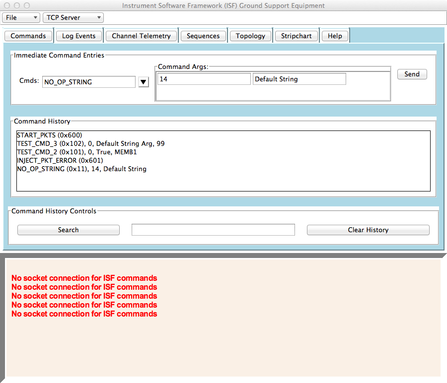

Instrument Software Framework (ISF)
===

ISF Git Repository

---
Release 1.6 Notes
===
Most of ISF Release 1.6 is documented in the [User's Guide](https://github.jpl.nasa.gov/ISF-Development/isf/tree/master/docs/UsersGuide).  This includes general organization and how to build a reference application [Ref](https://github.jpl.nasa.gov/ISF-Development/isf/tree/master/Ref) that comes with the distribution. The Ref application is an ISF C++ binary which includes examples of immediate commanding, event log messages, and channel telemetry examples.  The process for code generation of topologies, components, ports, commands, log events, and channel telemetry is discussed in the User's Guide.

There is a graphical user interface and general ["Ground Support Equipement"](https://github.jpl.nasa.gov/ISF-Development/isf/tree/Rel1.6/Gse) capability as well.  In this release it consists of two applications:

[ThreadedTCPServer.py](https://github.jpl.nasa.gov/ISF-Development/isf/blob/Rel1.6/Gse/bin/ThreadedTCPServer.py), a light weight threaded TCP socket server that allows the Ref application socket I/O to connect and any number of client support applications.  Currently there is only one client support application which is a general command and telemetry user interface (gse.py).

[gse.py] (https://github.jpl.nasa.gov/ISF-Development/isf/blob/Rel1.6/Gse/bin/gse.py), a light weight command and telemetry graphical user interface that is automatically configured when component commands, event log messages, and channel telemetry are generated.  The isf make system automatically places generated configuration Python modules in

```
$(BUILD_ROOT)/Gse/generated/<deployment>
```

In the case of the Ref applicaiton a directory named

```
$(BUILD_ROOT)/Gse/generated/Ref
```

is produced after ```make isf_dict_install``` is executed after building the Ref applicaiton.  When executing the gse.py application there must be this path specified on the command line using the '-d' option or the application picks up default configuration.

The gse.py basic panel looks like this:



The ```File:New``` menu in the upper left corner is used to instance addition identical panels of tabs for monitoring telemetry and commanding.  The ```Commands``` tab presents a panel for execution of immediate commands.  Within the panel a 'Command History' is maintained and any record can be double clicked to re-execute the command.  The ```Log Events``` tab presents a 'Log Event Messages' list of event log messages received.  The display can be filtered by entry of keywords into the 'Display Only Log Event Messages Containing Keywords' entry widget. The ```Channel Telemetry``` widget displays channel telemetry in an Excel like table.  The channel display can be filtered using the 'Select Channels' button to bring up a chooser dialog.  The remaining tabs are not yet fully complete and will be avaliable in future versions of ISF.

Local Startup
==
Currently the gse.py can be used to launch both the ThreadedTCPServer.py and Ref application from one command line execution.  One Mac OSX Terminal windows open running each application and on Linux Gnome Terminals are used.  The command line execution is:

`$BUILD_ROOT/Gse/bin/gse.py -d $BUILD_ROOT/Gse/generated/Ref -e $BUILD_ROOT/Ref/<deployment directory>/Ref`

Where all applications are executed on the local machine.  The Ref can be replaced by other speciallized prototype applications.  The BUILD_ROOT is the install path to the root isf directory.  It is expected that BUILD_ROOT environmental variable will be set when executing gse.py.

Python Environment
==
The gse.py and ThreadedTCPServer.py where develop and tested utlizing Python 2.7.9.  No attempt to port these applications to Python 3.x has been made.  gse.py currently requires [Pmw](http://pmw.sourceforge.net/) (Python Megawidgets), [enum34](https://pypi.python.org/pypi/enum34), and [tkintertable](https://pypi.python.org/pypi/tkintertable) packages to execute.  It is recommended that you use [virtualenv](https://virtualenv.pypa.io/en/latest/) to create a Python environment and install the [Required packages](https://github.jpl.nasa.gov/ISF-Development/isf/blob/master/Gse/bin/required.txt) using this link.  All packages can easilly be installed using pip or you can simpley execute 'pip install required.txt' to reduced our original development environment.

Log Files
==
When gse.py starts it looks for or creates an fprime_logs directory.  By default this is created as $(HOME)/isf_logs in the user's home directory but can be any place in the file system using the '-L' command line option.  Under isf_logs the following subdirectories are created holding log files for various output as discribed:

* app => contains log of stdout and stderr for ISF application executed using the '-e' command line option of gse.py.

* channel => contains continuous log of channel telemetry items received from ISF applicaiton.

* event => contains continuous log of log event messages items received from ISF application.

* status => contains continuous log of any messages displayed in the gse.py status 'grey' area.

* stdout => contains log of the gse.py stdout messages at start up.

* threaded_tcp_server => contains a continuous log of the stdout and stderr messages produced by ThreadedTCPServer.py.

Each log file directory contains a new log for each time the gse.py application is restarted.  The file naming is:

YYMMDDHHMMSS_ISF<desc. name>.log

where YYMMDDHHMMSS is the time the file was created and the _ISF<desc. name> describes what the file is logging.


GSE Issues And Plans
==
This is the initial version of gse.py and still has various issues that should be recorded when discovered by users. The current to be done list is:

1. When instancing the gse.py tabbed panels that application currently does not save user state so the current configuration of panels cannot be restarted directly.

2. The Commands, Log Events, and Channel Telemetry panels seem to be complete and have been tested with the Ref ISF applicaiton.  However, performance of the event and channel telemetry has not been characterized.

3. The Sequences panel is implemented for the purpose of assembling command sequences for ISF sequencer application use.  Currently the panel produces two types of sequencer command file. None of these files have been tested with actually sequencer and there is no sequencer in the Ref application.

4. The Topology panel is still TBD but the intent is for reading  ISF XML topology model files and creating a widget to monitor the system configuration of components defined in a graphic block diagram oriented way.

5. The Stripchart panel will contain a Matplotlib stripchart, allowing monitoring of any channel telemetry.

6. The Help panel will eventually contain HTML documentation pages about the gse.py application.


