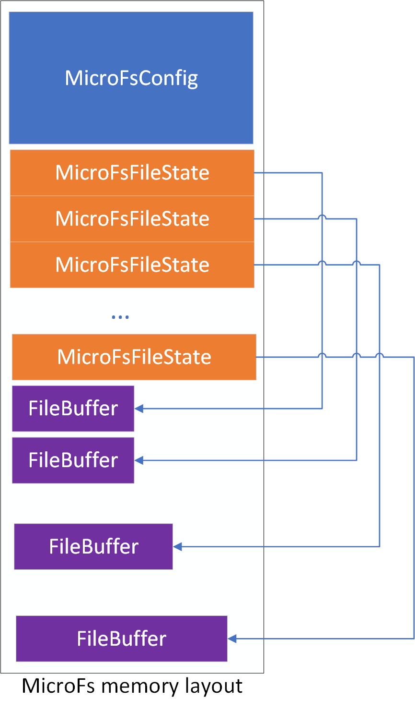

\page MicroFs SDD
# Os::MicroFs Library

## 1. Introduction

F Prime has a number of file-based service components like `Svc::CmdSequencer`, `Svc::FileDownLink`, and `Svc::FileUplink`. These components supply widely-used core features,
but they require a file system to operate. Many deeply embedded microcontrollers don't have file storage or a file system because of highly constrained resources. This library
was written to provide a very basic RAM-based file system that implements the F PRime `Os::File`, `Os::FileSystem`, and `Os::Directory` interfaces. Since it is RAM-based, any
data stored will be lost when the system is rebooted, but it will allow files to be stored, used, and uplinked/downlinked for as long as the system is up. Services that rely on
non-volatile files (like `Svc/PrmDb`) wouldn't make sense in this context.

## 2. Requirements

The requirements for `Os::MicroFs` are as follows:

Requirement | Description | Verification Method
----------- | ----------- | -------------------
MFS-001 | The `Os::MicroFs` library shall utilize only RAM for implementing the file system | Analysis
MFS-002 | The `Os::MicroFs` library shall utilize the `Fw::MemAllocator` base class to allocate memory | Analysis
MFS-003 | The `Os::MicroFs` library shall implement the `Os::File` class implementation | Analysis
MFS-004 | The `Os::MicroFs` library shall implement the `Os::FileSystem` class implementation | Analysis
MFS-005 | The `Os::MicroFs` library shall implement the `Os::Directory` class implementation | Analysis

## 3. Design

### 3.1 Context

#### 3.1.1 Class Diagram

The `Os::MicroFs` component has the following class diagram:


### 3.2 Design Description

#### 3.2.1 Overview

The file system creates fixed-size buffers to hold the file contents. The data in the files can grow to contain data up to the size of the buffer, but no larger. Any attempts to write beyond the end of the buffer will be truncated. The user can specify multiple "bins" of files at initialization time, where each bin can be configured to hold a specified number of files of a specified length. The files have specific names that map the file requested to a particular bin and file buffer. The user cannot open arbitrary files. They must match the naming schemes.

The naming scheme is as follows:

```
/<bin prefix><bin number>/<file prefix><file number>
```

`<bin prefix>` is defined by a macro in the `MicroFs` configuration file, and defaults to `bin`.
`<bin number>` is a sequential number increasing from 0 to the highest number of bins defined.
`<file prefix>` is defined by a macro in the `MicroFs` configuration file, and defaults to `file`.
`<file number>` is a sequential number increasing from 0 to the highest number of files defined in a given bin.

#### 3.2.2 Data Structures

During initialization, the library will request a block of memory from an allocator. The memory is then populated with:

1\) A copy of the `MicroFsConfig` file system configuration structure. This is copied from the structure provided by the 
user during initialization and is used for lookups later in the file system logic.

2\) A state structure for each file (see later for a description):

```c++
struct MicroFsFileState {
    PlatformIntType loc;       //!< location in file where last operation left off
    PlatformIntType currSize;  //!< current size of the file after writes were done
    PlatformIntType dataSize;  //!< alloted size of the file
    BYTE* data;                //!< location of file data
};
```

The state structures fill the memory after the copy of `MicroFsConfig`.

3\) The file buffers. As the file state structures are initialized, the memory after the array of state structures is allocated to the `data` pointers in the file structure.



#### 3.2.2 Initialization

`Os::MicroFs` requests memory from the `Fw::MemAlloctor` instance passed to the following call:

```c++
void MicroFsInit(const MicroFsConfig& cfg,      //!< the configuration of the memory space
                 const PlatformUIntType id,     //!< The memory id. Value doesn't matter if allocator doesn't need it
                 Fw::MemAllocator& allocator);  //!< Memory allocator to use for memory
``` 

The initialization call computes the memory needed by the data structures specifies in 3.2.2, and does the following:

1\) Requests the memory buffer via the allocator, passing the id in the event it is needed by the allocator.

2\) Copies the user `MicroFsConfig` structure into the beginning of the buffer.

3\) Allocates a location in the next section of the buffer for a `MicroFsFileState` state structure for each file defined in 
the configuration. As the file state structure is initialized, a file buffer of the required size is allocated out of the area 
after the state structures and assigned to the `data` pointer. The allocated size is assigned to the `dataSize` member. 
The file is initialized to be empty, which is considered by the file system to be nonexistent.

4\) Optionally clears the file data to zero.

#### 3.2.3 File Operations

Since none of the files initially exist, the file must be first opened for write with the `OPEN_CREATE` flag. Any other
operations will return an error flag. These calls implement the API in the `Os/File.hpp` class.

##### 3.2.3.1 Open

When the file is opened for write with `OPEN_CREATE` for the first time, the `loc` member of the data structure is initialized
to zero as well as the `currSize`. The file is now ready for writing and a file descriptor (in essence an array index) is returned. 
NOTE that at this point the file descriptor can be used for reads as well. If the file was previously created and is opened
with the `OPEN_READ` flag, the `loc` member is initialized to zero. An attempt to open a file for reading that does not exist yet will
return a `DOESNT_EXIST` error. An attempt to open a file that doesn't comply with the file naming scheme will return a `DOESNT_EXIST`
error.

##### 3.2.3.2 Write

When the file is written to, the data is copied into the file buffer starting at the `loc` offset, and the `loc` value is 
incremented by that value. If the remaining buffer space is smaller than the write request, only enough data to fill the
buffer is copied and the actual number of bytes copied is returned. Subsequent writes will not copy any data or move the 
`loc` value, and will return zero bytes written.

##### 3.2.3.3 Read

A read call will copy the requested data from the `loc` location into the provided buffer and will advance the `loc` value
by the amount read. If the amount requested is greater than the room left in the buffer, the remaining part of the buffer
will be copied and the number of bytes copied will be returned. If there is no room left, nothing will be copied and
a size of zero will be returned. 

##### 3.2.3.4 Seek

A seek call will move the `loc` value of the pointer the requested distance in the file buffer. If the seek would move
the `loc` value beyond the end of the file buffer, the call will return a `BAD_SIZE` error.

#### 3.2.4 File System Operations

These calls implement the API found in the `Os/FileSystem.hpp` API.

##### 3.2.4.1 Create/Remove Directory

The `createDirectory()` and `removeDirectory()` calls will return success if the directory name matches the file bin
(see section 3.2.1) naming scheme, but do not affect the state of any files. This is to support generated
sequences that may attempt to clean up directories.

##### 3.2.4.2 Read Directory

The `readDirectory()` call will work with two arguments. The first is the root `/` where it will return a list of
the file bins that were configured by the user. The second is when the argument gives a particular bin name. It will
return a list of the files that have been created in that bin. Any other arguments will return a `NO_PERMISSION` error.

##### 3.2.4.3 Remove File

This call will reinitialize the file state data to the state that indicates it doesn't exist, and subsequent calls
will follow the rules for nonexistent files.

##### 3.2.4.4 Move/Copy/Append Files

This call will copy data from the source to destination file buffers. If the destination buffer is smaller than 
the source(s), the data will be truncated to fit in the destination buffer. A `NO_PERMISSION` error will be 
returned if source or destination file names do not match the naming scheme.

##### 3.2.4.5 Get File Size

This call will return the current file size from the file state structure.

##### 3.2.4.6 Get File Count

This call will return the number of bins if the path is `/`, or the number of created file in a bin if a valid bin
pathname is given.

##### 3.2.4.7 Change Working Directory

This call has no effect.

##### 3.2.4.8 Get Free Space

This call will add up the sizes of uncreated files. It will not count created and partially filled files.

## 5. Module Checklists

Document | Link
-------- | ----

## 6. Unit Testing

To see unit test coverage run fprime-util check --coverage

## 7. Change Log

Date | Description
---- | -----------
2/15/2023 | Initial design edits
