# Reference Deployment

## 1. Description

The reference deployment application is to demonstrate a collection of ISF components interconnected to form a deployment. The deployment represents a "reference" spacecraft that includes commanding, events, telemetry channels and parameters.

The application illustrates some example application components:

|Component|Description|Link
|---|---|---|
|SendBuffApp | A component that sends a buffer | [HTML](../SendBuffApp/docs/sdd.html) [MD](../SendBuffApp/docs/sdd.md) |
|RecvBuffApp | A component that receives a buffer | [HTML](../RecvBuffApp/docs/sdd.html) [MD](../RecvBuffApp/docs/sdd.md) |
|BlockDriver  | A notional driver that relays buffers from SendBuffApp to RecvBuffApp | [HTML](../../Drv/BlockDriver/docs/sdd.html) [MD](../../Drv/BlockDriver/docs/sdd.md)|
|SignalGen | A component that generates telemetry following a waveform| [HTML](../SignalGen/docs/sdd.html) [MD](../SignalGen/docs/sdd.md)|
|PingReceiver|A test component that gets health pings that can be turned off|[HTML](../SignalGen/docs/sdd.html) [MD](../SignalGen/docs/sdd.md)| 

It interconnects those application components with reusable service components:

|Component|Description|Link
|---|---|---|
|ActiveLogger|Logs events for downlink|[HTML](../../Svc/ActiveLogger/docs/sdd.html) [MD](../../Svc/ActiveLogger/docs/sdd.md)|
|ActiveRateGroup|Executes a rate group by calling components|[HTML](../../Svc/ActiveRateGroup/docs/sdd.html) [MD](../../Svc/ActiveRateGroup/docs/sdd.md)|
|BufferManager|Manages a pool of buffers|[HTML](../../Svc/BufferManager/docs/sdd.html) [MD](../../Svc/BufferManager/docs/sdd.md)|
|CmdSequencer|Loads a set of commands from a binary file and executes them|[HTML](../../Svc/CmdSequencer/docs/sdd.html) [MD](../../Svc/CmdSequencer/docs/sdd.md)|
|CmdDispatcher|Dispatches commands from a ground system to registered components|[HTML](../../Svc/CmddDispatcher/docs/sdd.html) [MD](../../Svc/CmdDispatcher/docs/sdd.md)|
|FileDownlink|Component to downlink files to ground system|[HTML](../../Svc/FileDownlink/docs/sdd.html) [MD](../../Svc/FileDownlink/docs/sdd.md)|
|FileManager|Component to perform various file operations|[HTML](../../Svc/FileManager/docs/sdd.html) [MD](../../Svc/FileManager/docs/sdd.md)|
|FileUplink|Component to receive uplinked files from ground system|[HTML](../../Svc/FileUplink/docs/sdd.html) [MD](../../Svc/FileUplink/docs/sdd.md)|
|FPManager|Component to handle fault events|[HTML](../../Svc/FPManager/docs/sdd.html) [MD](../../Svc/FPManager/docs/sdd.md)|
|FPStateMgr|Component to exercise fault behaviors|[HTML](../../Svc/FPStateMgr/docs/sdd.html) [MD](../../Svc/FPStateMgr/docs/sdd.md)|
|Health|Pings active components in the topology to verify their aliveness|[HTML](../../Svc/Health/docs/sdd.html) [MD](../../Svc/Health/docs/sdd.md)|
|PrmDb|Loads sets of parameters from storage at startup and provides them to components|[HTML](../../Svc/PrmDb/docs/sdd.html) [MD](../../Svc/PrmDb/docs/sdd.md)|
|RateGroupDriver|Sends messages to ActiveRateGroup instances to run a cycle|[HTML](../../Svc/RateGroupDriver/docs/sdd.html) [MD](../../Svc/RateGroupDriver/docs/sdd.md)|
|TlmChan|Provides storage for telemetry channels and periodically sends them to the ground system|[HTML](../../Svc/TlmChan/docs/sdd.html) [MD](../../Svc/TlmChan/docs/sdd.md)|
|PolyDb|Manages a database of polymorphic data values|[HTML](../../Svc/PolyDb/docs/sdd.html) [MD](../../Svc/PolyDb/docs/sdd.md)|

There is a set of application-level components developed on previous projects that can be used:

|Component|Description|Link
|---|---|---|
|ThermalControl|Provided PID loops for thermal monitor and control|[HTML](../../Apps/ThermalControl/docs/sdd.html) [MD](../../Apps/ThermalControl/docs/sdd.md)|

There is a set of useful utility components that can be used on supported operating systems:

|Component|Description|Link
|---|---|---|
|PosixTime|Provides time stamps for telemetry on a posix systems|[HTML](../../Svc/PosixTime/docs/sdd.html) [MD](../../Svc/PosixTime/docs/sdd.md)|
|PassiveConsoleTextLogger|Prints the text form of events to standard output|[HTML](../../Svc/PassiveConsoleTextLogger/docs/sdd.html) [MD](../../Svc/PassiveConsoleTextLogger/docs/sdd.md)|
|SocketGndIf|Provides a socket for communicating with the ground system|[HTML](../../Svc/SocketGndIf/docs/sdd.html) [MD](../../Svc/SocketGndIf/docs/sdd.md)|

Each software module that has a Software Design Document written can be found here: [HTML](deployment.html) [MD](Ref.md)

## 2. Topology

The topology of the reference example is the interconnection of all the components used in the reference deployment (a deployment is a set of components connected together and compiled into a binary). There are a large number of connections so it is not feasible to show them all in one diagram. The following sections have views of the topology that show the connections for a particular purpose. The topology diagrams will be broken down into the core set of Command and Data Handling (C&DH) connections that would be reused from project to project as well as the connections unique to the reference example. The diagrams were generated using MagicDraw, while the [XML](../Top/RefTopologyAppAi.xml) defining the topology connections was generated using the MagicDraw plug-in developed for ISF.

### 2.1 Commanding

The commanding view consists of connections for components to register commands, the dispatching of commands and the return of command execution status. 

#### 2.1.1 C&DH Commanding

The connections for the C&DH commanding are as follows:

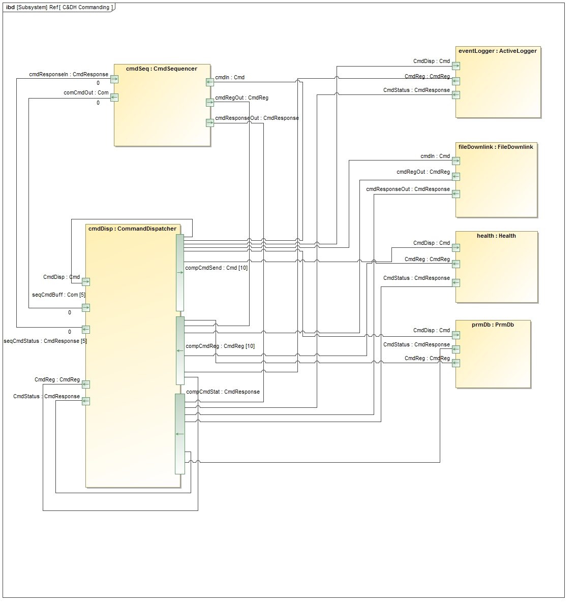

#### 2.1.2 Reference Deployment Commanding

The connections for the reference deployment commanding are as follows:

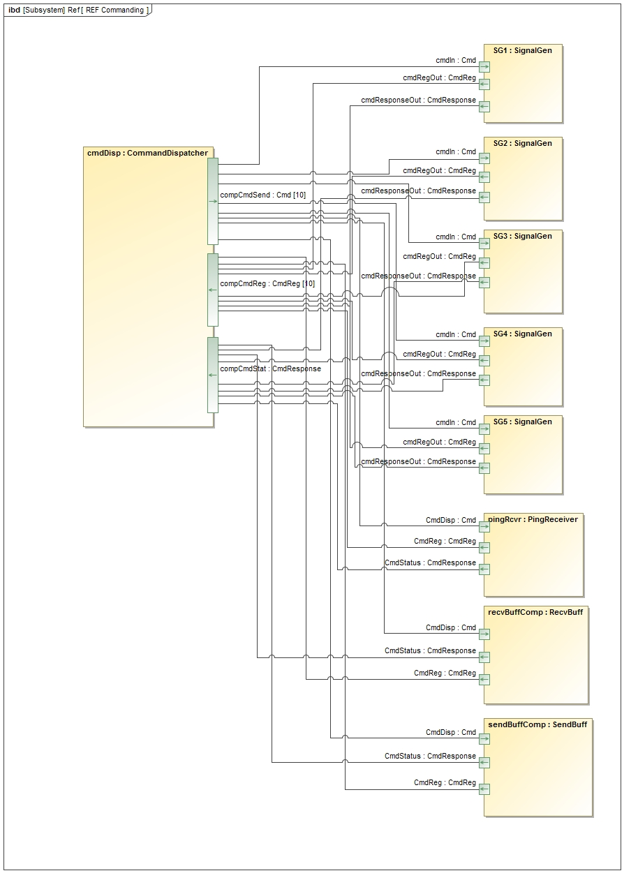

### 2.2 Telemetry

The telemetry view consists of connections for components to update telemetry channels in the `TlmChan` component. 

#### 2.2.1 C&DH Telemetry

The connections for the C&DH telemetry are as follows:

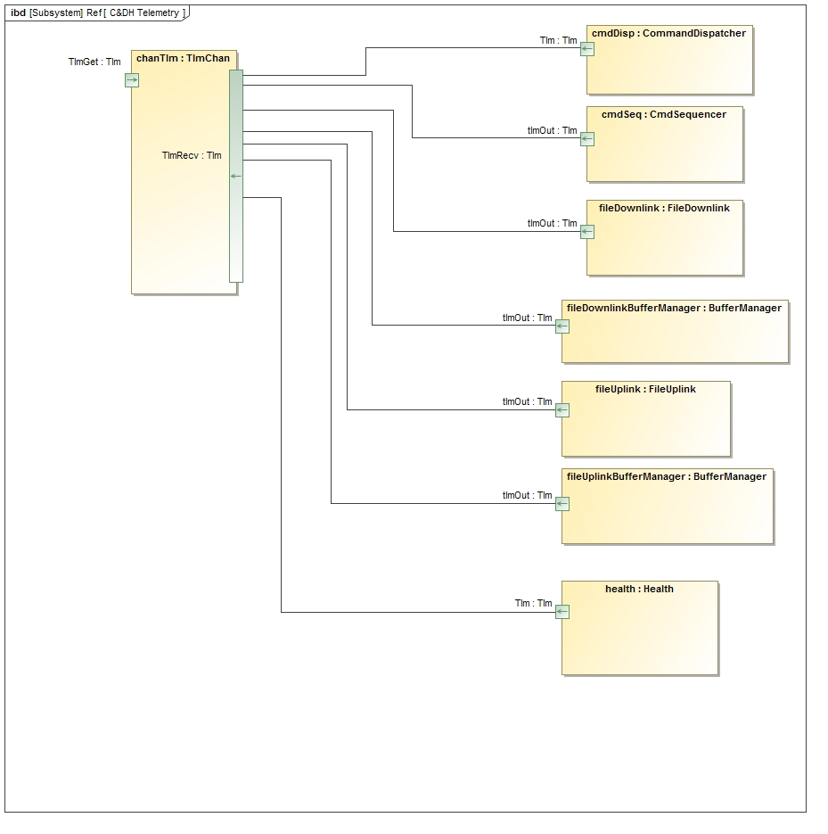

#### 2.2.2 Reference Deployment Telemetry

The connections for the reference deployment telemetry are as follows:

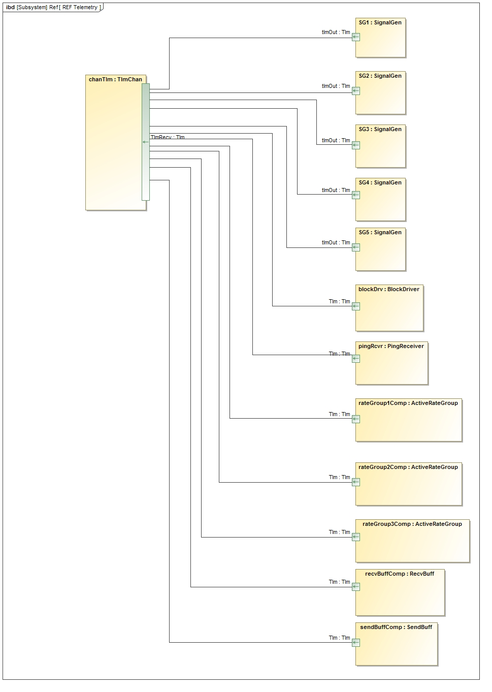

### 2.3 Logging

The logging view consists of connections for components to send events for logging to the `ActiveLogger` component. 

#### 2.3.1 C&DH Logging

The connections for the C&DH logging are as follows:

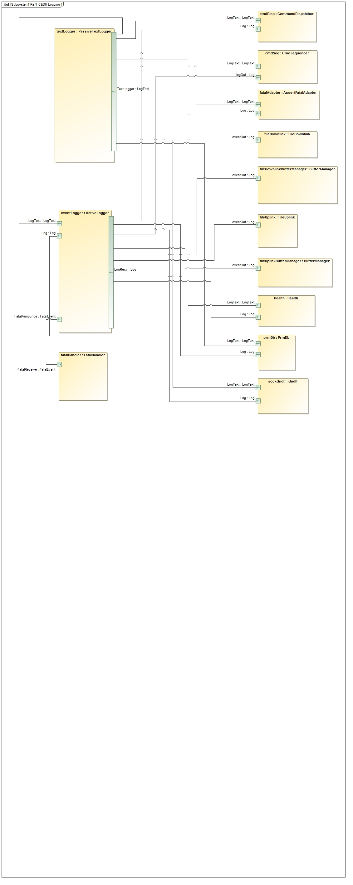

#### 2.3.2 Reference Deployment Logging

The connections for the reference deployment logging are as follows:

### 2.4 Parameters

The parameters view consists of connections for components to retrieve and update parameters stored in the `PrmDb` component. 

#### 2.3.1 C&DH Parameters

The core C&DH components do not have any parameters.

#### 2.3.2 Reference Deployment Parameters

The connections for the reference deployment parameters are as follows:

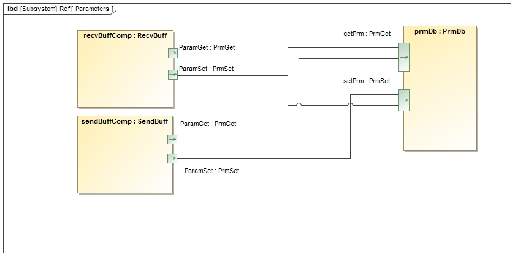

### 2.5 Time

The time view consists of connections for components to get time for time-tagging events and telemetry. 

#### 2.5.1 C&DH Time

The connections for the C&DH time are as follows:

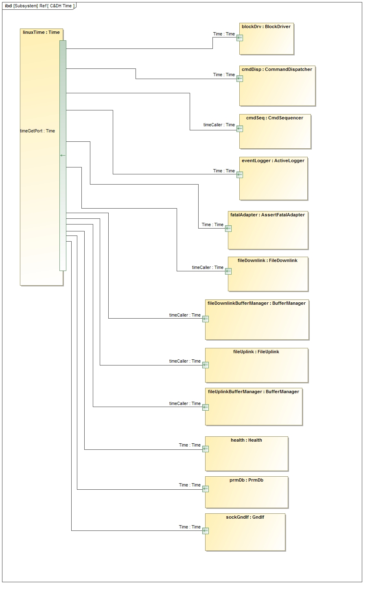

#### 2.5.2 Reference Deployment Time

The connections for the reference deployment time are as follows:

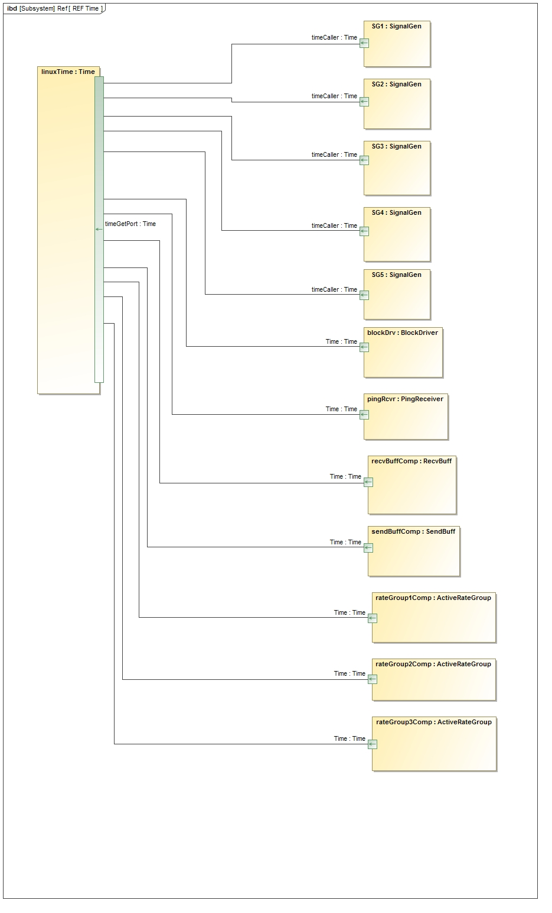

### 2.6 Health

The health view consists of connections for components to respond to pings from `Health`to verify their threads are alive. 

#### 2.6.1 C&DH Time

The connections for the C&DH health are as follows:

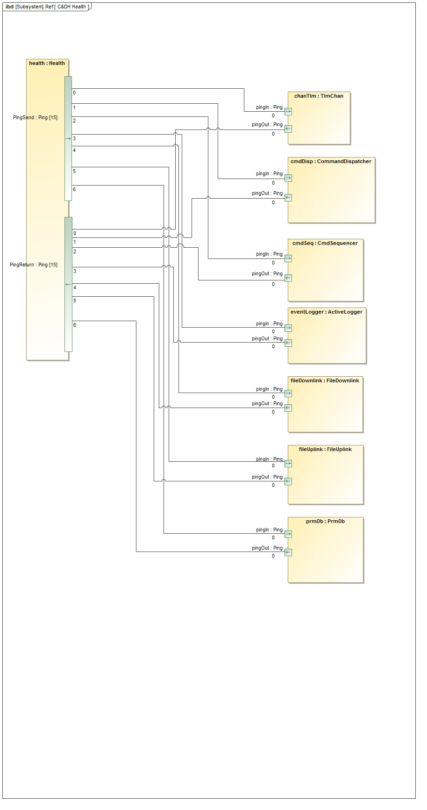

#### 2.6.2 Reference Deployment Health

The connections for the reference deployment health are as follows:

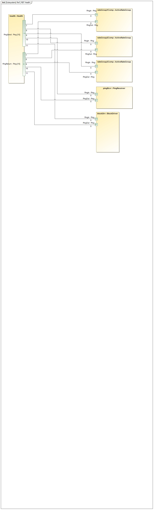

### 2.7 Rate Groups

The rate group view consists of connections for components to be executed at different rates in the reference topology. 

The connections for the rate groups are as follows:

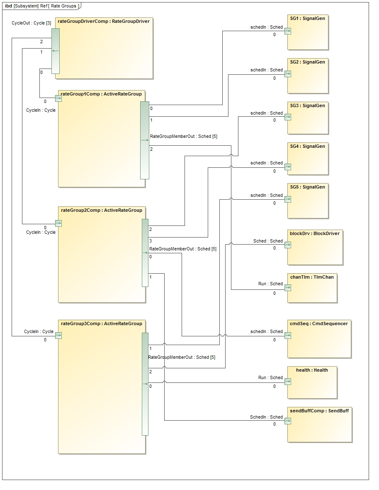

### 2.8 Ground

The ground view consists of connections for C&DH components to receive commands from and send telemetry to a ground system. The ground system in the reference example is communicated with via a TCP/IP socket. 

The connections for the ground system are as follows:

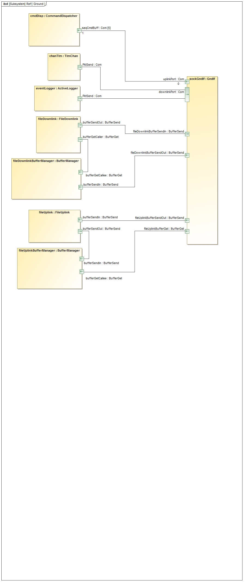

### 2.9 Drivers

The drivers view consists of connections for the reference components to send packets to and from the example "driver." The driver also provides ticks to the `RateGroupDriver` component that cycles the rate groups.

The connections for the drivers are as follows:

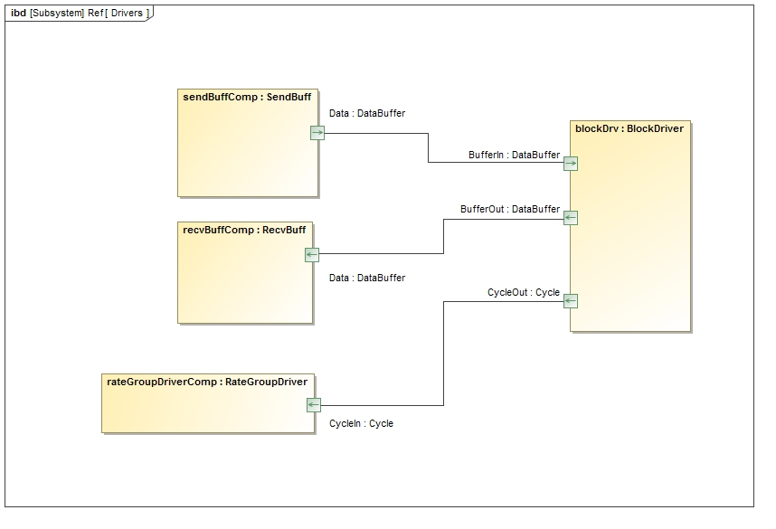

## 3. Change Log

Date | Description
---- | -----------
6/19/2015 | Initial version
4/20/2017 | Rel1.9

