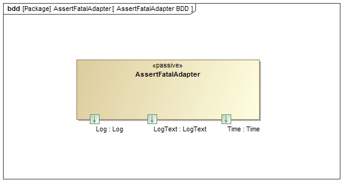

\page SvcAssertFatalAdapterComponent Svc::AssertFatalAdapter Component
# Svc::AssertFatalAdapter Component

## 1. Introduction

`Svc::AssertFatalAdapter` is an passive component that intercepts calls to FW_ASSERT and issues FATAL events for each.

## 2. Requirements

The requirements for `Svc::AssertFatalAdapter` are as follows:

Requirement | Description | Verification Method
----------- | ----------- | -------------------
AF-001 | The `Svc::AssertFatalAdapter` component shall convert all calls to FW_ASSERT to FATAL events | Unit test

## 3. Design

### 3.1 Context

#### 3.1.1 Component Diagram

The `Svc::AssertFatalAdapter` component has the following component diagram:

#### 3.1.2 Ports

The `Svc::AssertFatalAdapter` component uses only the log infrastructure ports.

Port Data Type | Name | Direction | Kind | Usage
-------------- | ---- | --------- | ---- | -----

#### 3.2 Functional Description

The `Svc::AssertFatalAdapter` component contains a private implementation of the `Fw::AssertHook` base class (`AssertFatalAdapter`). Upon instantiation, the derived class registers itself to receive calls the FW_ASSERT. When it receives any one of them, it issues a FATAL event corresponding to the number of arguments to FW_ASSERT. Whatever mechanism in the system that deals with FATAL events will handle the asserts via that mechanism.    

### 3.3 Scenarios

#### 3.3.1 FW_ASSERT calls

As described in the Functional Description section, the `Svc::ActiveRateGroup` component accepts calls to the CycleIn and invokes the RateGroupMemberOut ports:

 

### 3.4 State

`Svc::AssertFatalAdapter` has no state machines.

### 3.5 Algorithms

`Svc::AssertFatalAdapter` has no significant algorithms.

## 4. Dictionaries

Dictionaries: [HTML](AssertFatalAdapter.html) [MD](AssertFatalAdapter.md)

## 5. Module Checklists

Document | Link
-------- | ----
None yet

## 6. Unit Testing

The unit test results are as follows:

Log|Link
---|----
Test Output|[Link](../test/ut/output/test.txt)
Coverage Output|[Link](../test/ut/output/AssertFatalAdapterComponentImpl.cpp.gcov)

## 7. Change Log

Date | Description
---- | -----------
10/16/2016 | Implementation and unit tests

