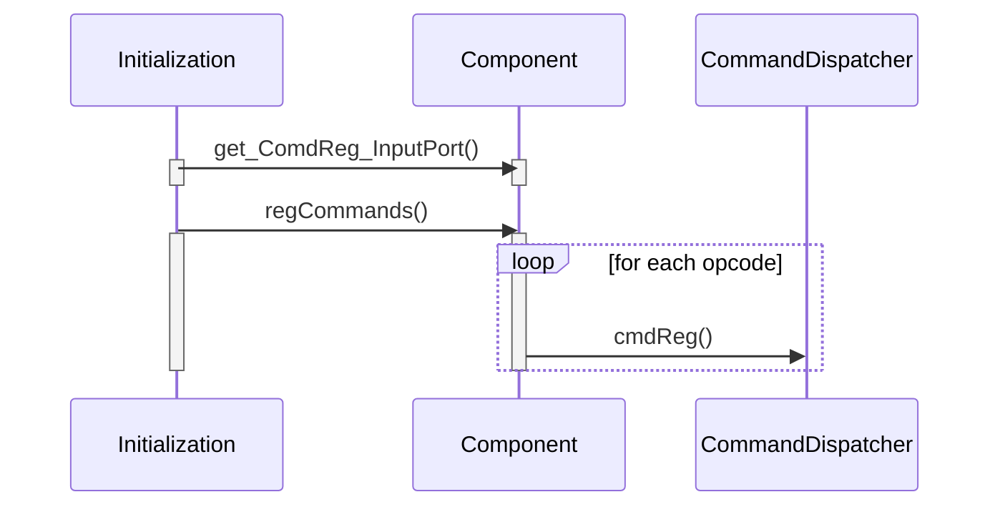
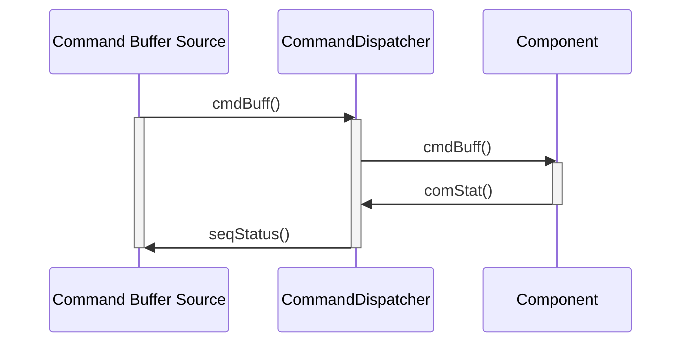

\page SvcCmdDispatcherComponent Svc::CmdDispatcher Component
# Svc::CmdDispatcher Component

## 1. Introduction

The `Svc::CmdDispatcher` is responsible for dispatching incoming commands to the components that implement those commands. The commands are sent in encoded `Fw::Com` form from an external sender like a ground system or a sequencer. The dispatcher decodes the packet and extracts the opcode. This opcode is looked up in a table and dispatched to the component via a port indicated in the table. The output port for each opcode is set by a call to a registration port.

## 2. Requirements

The requirements for `Svc::CmdDispatcher` are as follows:

Requirement | Description | Verification Method
----------- | ----------- | -------------------
CD-001 | The `Svc::CmdDispatcher` component shall accept command buffers and decode them into commands | Inspection, Unit Test
CD-002 | The `Svc::CmdDispatcher` component shall dispatch commands to components | Unit Test
CD-003 | The `Svc::CmdDispatcher` component shall provide an interface to register commands | Inspection
CD-004 | The `Svc::CmdDispatcher` component shall process command status from components and report the results to the command buffer sender. | Unit Test 

## 3. Design

### 3.1 Context

#### 3.1.1 Component Diagram

The `Svc::CmdDispatcher` component has the following component diagram:

#### 3.1.2 Ports

The `Svc::CmdDispatcher` component uses the following port types:

Port Data Type | Name | Direction | Kind | Usage
-------------- | ---- | --------- | ---- | -----
[`Fw::Cmd`](../../../Fw/Cmd/docs/sdd.html) | cmdSend | Output | n/a | Send commands to components
[`Fw::CmdResponse`](../../../Fw/Cmd/docs/sdd.html) | compStat | Input | Asynchronous | Port for components to report command status
[`Fw::CmdResponse`](../../../Fw/Cmd/docs/sdd.html) | seqStatus | Output | n/a | Send command status to command buffer source
[`Fw::Com`](../../../Fw/Com/docs/sdd.html) | cmdBuff | Input | Asynchronous | Receive command buffer
[`Fw::CmdReg`](../../../Fw/Cmd/docs/sdd.html) | cmdReg | Input | Synchronous | Command Registration 

### 3.2 Functional Description

The `Svc::CmdDispatcher` component provides command dispatching. The architecture autocoder generates port instances for components that specify commands that implement the commanding pattern. `Svc::CommandDispatcher` implements the command decoding and dispatching to supply the components with commands.

#### 3.2.1 Command Registration

An autogenerated function on components create a public function `regCommands` that tells components to register the set of op codes that are implemented by the component. The autogenerated port is connected to the `compCmdReg` input port on `Svc::CmdDispatcher` that corresponds to the number of the `compCmdSend` port used to dispatch commands. The port handler looks through the dispatch table for an unused entry and adds the opcode. It maps the opcode to the dispatch port number corresponding to the registration port number.

#### 3.2.2 Command Dispatch

When the command dispatcher receives a command buffer, it decodes the opcode. It searches the dispatch table for the opcode, then assigns a sequence number to the command and stores the opcode, sequence number, context value and source port in a pending command table. The command is then dispatched to the component that implements the command. When the component completes execution of the command, it reports the status back via the `compStat` port. The sequence number is matched to the entry in the pending command table, and the `seqStatus` output port corresponding to the source port is called (if it is connected) with the status and the context value. Note that this requires that the component sending the command buffer have connections to the same `cmdBuff` and `seqStatus` port numbers.

### 3.3 Scenarios

#### 3.3.1 Command Registration

The `Svc::CmdDispatcher` component accepts command registration from other components:

#### 3.3.1 Dispatch Commands

The `Svc::CmdDispatcher` component dispatches commands to other components:

### 3.4 State

`Svc::CmdDispatcher` has no state machines.

### 3.5 Algorithms

`Svc::CmdDispatcher` has no significant algorithms.

## 4. Dictionary

Dictionaries: [HTML](CmdDispatcher.html)

## 4. Module Checklists

Document | Link
-------- | ----
Design Checklist | [Link](Checklist_Design.xlsx)
Code Checklist | [Link](Checklist_Code.xlsx)
Unit Test Checklist | [Link](Checklist_Unit_Test.xls)

## 5. Unit Testing

To see unit test coverage run `fprime-util check --coverage`

## 6. Change Log

Date | Description
---- | -----------
6/25/2015 | Design review edits
7/22/2015 | Design review actions 
9/16/2015 | Unit Test additions
1/28/2016 | Added context value discussion
5/17/2021 | Added CMD Reregistration option

