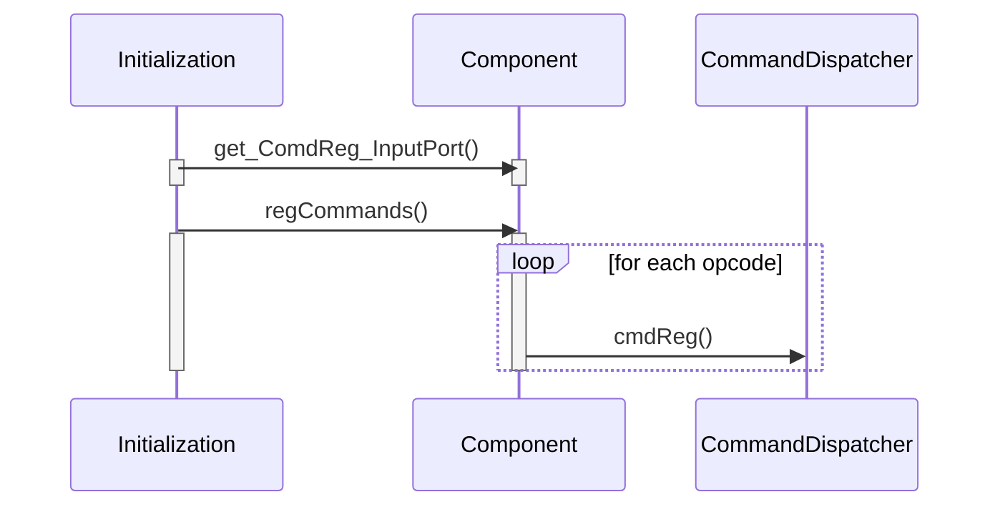
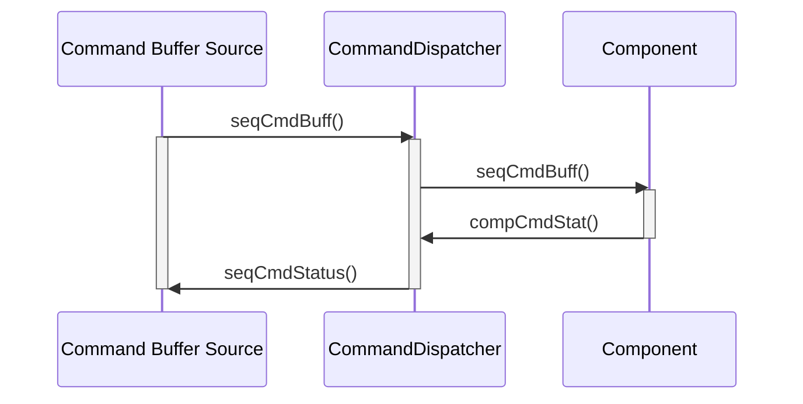

# Svc::CmdDispatcher Component

## 1. Introduction

The `Svc::CmdDispatcher` is responsible for dispatching incoming commands to the components that implement those commands. The commands are sent in encoded `Fw::Com` form from an external sender like a ground system or a sequencer. The dispatcher decodes the packet and extracts the opcode. This opcode is looked up in a table and dispatched to the component via a port indicated in the table. The output port for each opcode is set by a call to a registration port.

## 2. Requirements

The requirements for `Svc::CmdDispatcher` are as follows:

Requirement | Description | Verification Method
----------- | ----------- | -------------------
CD-001 | The `Svc::CmdDispatcher` component shall accept command buffers and decode them into commands | Inspection, Unit Test
CD-002 | The `Svc::CmdDispatcher` component shall dispatch commands to components | Unit Test
CD-003 | The `Svc::CmdDispatcher` component shall provide an interface to register commands | Inspection
CD-004 | The `Svc::CmdDispatcher` component shall process command status from components and report the results to the command buffer sender. | Unit Test
CD-005 | The `Svc::CmdDispatcher` component shall drop incoming commands to avert a queue overflow (DOS attack). | Unit Test

## 3. Design

### 3.1 Context

#### 3.1.1 Component Diagram

The `Svc::CmdDispatcher` component has the following component diagram:

#### 3.1.2 Ports

The `Svc::CmdDispatcher` component uses the following port types:

Port Data Type | Name | Direction | Kind | Usage
-------------- | ---- | --------- | ---- | -----
[`Fw::Cmd`](../../../Fw/Cmd/docs/sdd.md) | cmdSend | Output | n/a | Send commands to components
[`Fw::CmdResponse`](../../../Fw/Cmd/docs/sdd.md) | compCmdStat | Input | Asynchronous | Port for components to report command status
[`Fw::CmdResponse`](../../../Fw/Cmd/docs/sdd.md) | seqCmdStatus | Output | n/a | Send command status to command buffer source
[`Fw::Com`](../../../Fw/Com/docs/sdd.md) | seqCmdBuff | Input | Asynchronous | Receive command buffer
[`Fw::CmdReg`](../../../Fw/Cmd/docs/sdd.md) | cmdReg | Input | Synchronous | Command Registration
[`Svc::Sched`](../../Sched/docs/sdd.md) | run | Input | Asynchronous | Report telemetry

### 3.2 Functional Description

The `Svc::CmdDispatcher` component provides command dispatching. The architecture autocoder generates port instances for components that specify commands that implement the commanding pattern. `Svc::CommandDispatcher` implements the command decoding and dispatching to supply the components with commands.

#### 3.2.1 Command Registration

An autogenerated function on components create a public function `regCommands` that tells components to register the set of op codes that are implemented by the component. The autogenerated port is connected to the `compCmdReg` input port on `Svc::CmdDispatcher` that corresponds to the number of the `compCmdSend` port used to dispatch commands. The port handler looks through the dispatch table for an unused entry and adds the opcode. It maps the opcode to the dispatch port number corresponding to the registration port number.

#### 3.2.2 Command Dispatch

When the command dispatcher receives a command buffer, it decodes the opcode. It searches the dispatch table for the opcode, then assigns a sequence number to the command and stores the opcode, sequence number, context value and source port in a pending command table. The command is then dispatched to the component that implements the command. When the component completes execution of the command, it reports the status back via the `compCmdStat` port. The sequence number is matched to the entry in the pending command table, and the `seqCmdStatus` output port corresponding to the source port is called (if it is connected) with the status and the context value.
Note #1: this requires that the component sending the command buffer have connections to the same `seqCmdBuff` and `seqCmdStatus` port numbers.
Note #2: the `seqCmdStatus` port utilize the same type as the `compCmdStat`, the `Fw::CmdResponse`. This has been done to avoid creation of similar types for status ports. However, the `Fw::CmdResponse::cmdSeq` argument of the `seqCmdStatus` doesn't have any meaning for the calling sequencer. Therefore, as it has been mentioned before, instead of forwarding a command sequence number, the context value is transferred.

### 3.3 Scenarios

#### 3.3.1 Command Registration

The `Svc::CmdDispatcher` component accepts command registration from other components:

```mermaid
sequenceDiagram
    Initialization->>Component: get_ComdReg_InputPort()
    activate Initialization
    deactivate Initialization
    activate Component
    deactivate Component
    Initialization->>Component: regCommands()
    activate Initialization
    activate Component
    loop for each opcode
        Component->>CommandDispatcher: cmdReg()
    end
    deactivate Initialization
    deactivate Component
```

#### 3.3.1 Dispatch Commands

The `Svc::CmdDispatcher` component dispatches commands to other components:

```mermaid
sequenceDiagram
    Command Buffer Source->>CommandDispatcher: seqCmdBuff()
    activate Command Buffer Source
    activate CommandDispatcher
    CommandDispatcher->>Component: seqCmdBuff()
    activate Component
    Component->>CommandDispatcher: compCmdStat()
    deactivate Component
    CommandDispatcher->>Command Buffer Source: seqCmdStatus()
    deactivate CommandDispatcher
    deactivate Command Buffer Source
```

### 3.4 State

`Svc::CmdDispatcher` has no state machines.

### 3.5 Algorithms

`Svc::CmdDispatcher` has no significant algorithms.

## 4. Module Checklists

Checklist |
-------- |
[Design](Checklist_Design.xlsx) |
[Code](Checklist_Code.xlsx) |
[Unit Test](Checklist_Unit_Test.xls) |

## 5. Unit Testing

To see unit test coverage run `fprime-util check --coverage`

## 6. Change Log

Date | Description
---- | -----------
6/25/2015 | Design review edits
7/22/2015 | Design review actions
9/16/2015 | Unit Test additions
1/28/2016 | Added context value discussion
5/17/2021 | Added CMD Reregistration option
5/05/2025 | Added a note about Fw::CmdResponse::cmdSeq usage in seqCmdStatus

<!-- fpp-dictionary-begin -->
## Component Dictionary

The following tables are derived from the component's FPP model.

### Port Descriptions

| Name | Kind | Port Type | Description |
|---|---|---|---|
| `compCmdSend` | `output` | `[CmdDispatcherComponentCommandPorts] Fw.Cmd` | Command dispatch port |
| `compCmdReg` | `guarded input` | `[CmdDispatcherComponentCommandPorts] Fw.CmdReg` | Command Registration Port. max_number should match dispatch port. |
| `compCmdStat` | `async input` | `Fw.CmdResponse` | Input Command Status Port |
| `seqCmdStatus` | `output` | `[CmdDispatcherSequencePorts] Fw.CmdResponse` | Output Command Status Port |
| `seqCmdBuff` | `async input` | `[CmdDispatcherSequencePorts] Fw.Com` | Command buffer input port for sequencers or other sources of command buffers |
| `pingIn` | `async input` | `Svc.Ping` | Ping input port |
| `run` | `async input` | `Svc.Sched` | Run port used to emit telemetry |
| `pingOut` | `output` | `Svc.Ping` | Ping output port |

### Commands

| Name | Kind | Description |
|---|---|---|
| `CMD_NO_OP` | `async` | No-op command |
| `CMD_NO_OP_STRING` | `async` | No-op string command |
| `CMD_TEST_CMD_1` | `async` | No-op command |
| `CMD_CLEAR_TRACKING` | `async` | Clear command tracking info to recover from components not returning status |

### Events

| Name | Severity | Description |
|---|---|---|
| `OpCodeRegistered` | `diagnostic` |  |
| `OpCodeDispatched` | `command` | Op code dispatched event |
| `OpCodeCompleted` | `command` | Op code completed event |
| `OpCodeError` | `command` | Op code completed with error event |
| `MalformedCommand` | `warning high` | Received a malformed command packet |
| `InvalidCommand` | `warning high` | Received an invalid opcode |
| `TooManyCommands` | `warning high` | Exceeded the number of commands that can be simultaneously executed |
| `NoOpReceived` | `activity high` | The command dispatcher has successfully received a NO-OP command |
| `NoOpStringReceived` | `activity high` | The command dispatcher has successfully received a NO-OP command from GUI with a string |
| `TestCmd1Args` | `activity high` | This log event message returns the TEST_CMD_1 arguments. |
| `OpCodeReregistered` | `diagnostic` | Op code reregistered event |
| `CommandDroppedQueueOverflow` | `warning high` | This log event reports the Command Sequence Buffer port queue has overflowed. |

### Telemetry

| Name | Type | Description |
|---|---|---|
| `CommandsDispatched` | `U32` | Number of commands dispatched |
| `CommandErrors` | `U32` | Number of command errors |
| `CommandsDropped` | `U32` | Number of commands drooped due to buffer overflow |

<!-- fpp-dictionary-end -->
