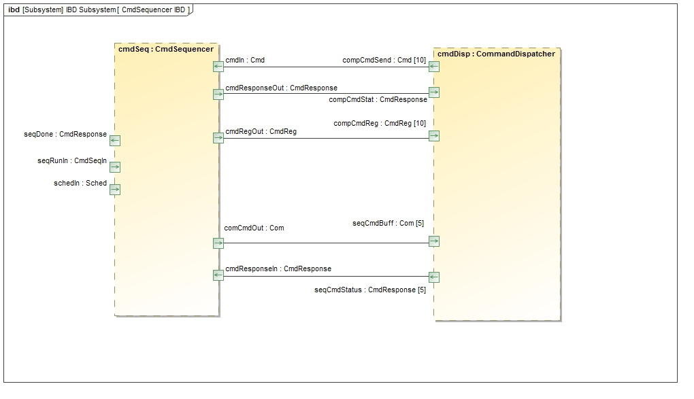
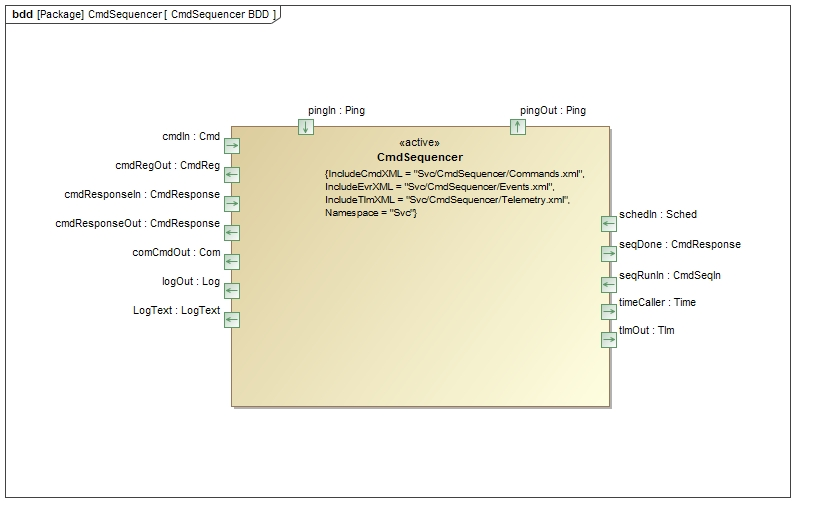
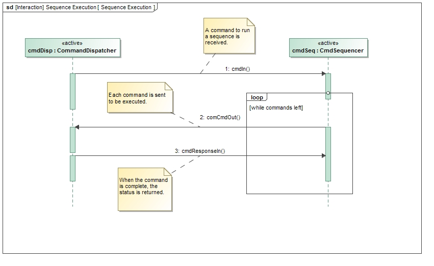

\page SvcCmdSequencerComponent Svc::CmdSequencer Component
# Svc::CmdSequencer Component

## 1 Introduction

The command sequencer is a component that iterates through a set of commands contained in binary form in a file located in a file system available to the sequencer. A command to the sequencer specifies the file to execute. The file can contain commands that execute immediately, after a delay, or at an absolute time. The sequence will abort if any given command in the sequence returns a failed status.

## 2 Requirements

The requirements for `Svc::CmdSequencer` are as follows:

Requirement | Description | Verification Method | Rationale
----------- | ----------- | ------------------- | --------
ISF-CMDS-001 | The `Svc::CmdSequencer` component shall read sequence files. | Unit Test | CmdSequencer gets commands from the sequence file.
ISF-CMDS-002 | The `Svc::CmdSequencer` component shall validate the sequence files with a CRC. | Unit Test | CmdSequencer need to know it has a valid file.
ISF-CMDS-003 | The `Svc::CmdSequencer` component shall provide a command to validate the sequence file. | Unit Test | Waiting to validate the file only when running it can cause operational issues
ISF-CMDS-004 | The `Svc::CmdSequencer` component shall cancel the sequence upon receiving a failed command status. | Unit Test | A sequence should not continue if a command fails since subsequent commands may depend on the outcome
ISF-CMDS-005 | The `Svc::CmdSequencer` component shall provide a command to cancel the existing sequence | Unit Test | Operator should be able to cancel the sequence if it is hung or needs to be stopped.
ISF-CMDS-006 | The `Svc::CmdSequencer` component shall provide an overall sequence timeout. | Unit Test | Sequencer should quit if a component fails to send a command response

## 3 Design

### 3.1 Component Context

### 3.2 Component Interface

#### 3.2.1 Port description table

Port Name|Type|Direction|Usage
---------|----|---------|-----
cmdRegOut|Fw::CmdReg|output|Framework command registration
cmdIn|Fw::Cmd|input|Framework command input port
cmdResponseOut|Fw::CmdResponse|output|Framework command status port
logOut|Fw::Log|output|Framework binary log output port
LogText|Fw::LogText|output|Framework text log output port
tlmOut|Fw::Tlm|output|Framework telemetry port
timeCaller|Fw::Time|output|Framework time port
pingIn|Svc::Ping|async input|Input ping call
pingOut|Svc::Ping|output|Reply for ping
schedIn|Svc::Sched|async input|Scheduler input - timed commands will be checked
comCmdOut|Fw::Com|output|Sends command buffers for each command in sequence
cmdResponseIn|Fw::CmdResponse|async input|Received status of last dispatched command
seqRunIn|Svc::CmdSeqIn|async input|Receives requests for running sequences from other components
seqDone|Fw::CmdResponse|output|outputs status of sequence run; meant to be used with `seqRunIn`

#### 3.2.2 Command Handlers

##### 3.2.2.1 CS_Validate
The `CS_Validate` command will validate that the format and checksum of a sequence file are correct without executing any commands in the file. This allows operators to validate a file prior to executing it.
##### 3.2.2.2 CS_Run
The `CS_Run` command will execute a sequence. If a prior sequence is still running, it will be canceled. If a command returns a failed status, the sequence will be aborted.
##### 3.2.2.3 CS_Cancel
The `CS_Cancel` command will cancel an existing sequence. If there is no sequence currently executing, the command will emit a warning event but not fail.
##### 3.2.2.4 CS_Manual
The `CS_Manual` command will put the sequencer in a manual stepping mode, where the commands will be advanced by the `CS_Step` command. After entering this mode, the operator should issue a `CS_Run` command to load the sequence. In this mode, the sequence will be validated and loaded, but will not execute any commands until receiving the `CS_Start` command
##### 3.2.2.5 CS_Start
The `CS_Start` command will execute the first command in the sequence in manual mode.
##### 3.2.2.6 CS_Step
The `CS_Step` command will execute subsequent commands after receiving the `CS_Start` command.
##### 3.2.2.7 CS_Auto
The `CS_Auto` command will change the sequencing mode from manual to automatic, which means that the sequencer will automatically execute commands upon loading. This command can only be run when there are no currently executing sequences. If a sequence is executing, a `CS_Cancel` followed by a `CS_Auto` will get the sequencer back to executing sequences automatically.

#### 3.2.3 Port Handlers

##### 3.2.3.1 schedIn

The `schedIn` port checks to see if there is a timed command pending. If the timer for a pending command has expired, the command is dispatched. If there is a command being executed, the command timeout timer is also checked. If it has expired, a warning event is emitted and the sequence is aborted.

##### 3.2.3.2 cmdResponseIn

The `cmdResponseIn` port is called when a command in a sequence is completed. If the command status is successful, the next command in the sequence is executed.

##### 3.2.3.3 seqRunIn

This port takes a single argument `filename` of type `Fw::String`. In
general, sending `filename` on this port has the same  effect as issuing
a `CS_Run` command with `filename` as the file name argument.

If `filename` is empty, then `CmdSequencer` runs the sequence stored in the
sequence buffer, without loading a sequence first. In order for this to work:

* You must already have called [`loadSequence`](#loadSequence).

* There must be a valid sequence in the buffer, i.e., `loadSequence` must have succeeded.

* You must not have validated or run any sequences since calling `loadSequence`, since
these operations clear the buffer.

##### 3.2.3.4 pingIn

The `pingIn` port is called by the `Svc::Health` component to verify that the `CmdSequencer` thread is still functional. The handler simply takes the provided code and calls the `pingOut` port.

### 3.3 Component Structure

#### 3.3.1 Types

The `CmdSequencer` class defines the following types:

* <a name="Sequence">`Sequence`</a>:
An abstract class representing a command sequence.
It provides the following pure virtual functions, which
its concrete subclasses must implement:

    * `loadFile`: Open a named sequence file from the disk and
validate the file. Fill in the member variable
`m_header` of type [`Sequence::Header`](#Sequence_Header)
with the header information for the current sequence.

    * `hasMoreRecords:` Return true if and only if there are more records
available in the current sequence.

    * `nextRecord`: Return a [`Sequence::Record`](#Sequence_Record)
object corresponding to the next record of the current sequence.
This function should succeed if `hasMoreRecords` returns `true`;
otherwise it should assert.

    * `reset`: Reset the current sequence to the beginning.
After calling this function, `hasMoreRecords` should return `true`,
unless the sequence has zero records.

    * `clear`: Clear the current sequence.
After calling this function, `hasMoreRecords` should return `false`.

* <a name="Sequence_Header">`Sequence::Header`</a>:
A class representing a sequence header.
It contains member variables corresponding to the header fields
of the [F Prime sequence format](#F_Prime_Sequence_Format).

* <a name="Sequence_Record">`Sequence::Record`</a>:
A class representing a sequence record.
It contains member variables corresponding to the record fields
of the [F Prime sequence format](#F_Prime_Sequence_Format).

* <a name="F_Prime_Sequence">`FPrimeSequence`</a>:
A concrete subclass of [`Sequence`](#Sequence)
that implements the virtual functions as follows:

    * `loadFile`: Open a named sequence file from the disk.
Read, deserialize, and store the header.
Read the binary records into a serial buffer *B*.
Extract the stored CRC from the file.
Check that the file format is valid according to the binary format
specified in [**F Prime Sequence Format**](#F_Prime_Sequence_Format).
Compute the CRC value of the binary header and records
and check it against the stored CRC value.

    * `hasMoreRecords`: Return `true` if and only if *B* has more data.

    * `nextRecord`: Deserialize and return the next record stored
in the serial buffer.

    * `reset`: Reset *B* for deserialization.

    * `clear`: Reset *B* for serialization.

#### 3.3.2 Configuration

##### 3.3.2.1 setTimeout (Optional)

The `setTimeout()` public method sets the command timeout value. When a command is being executed by a component, this value specifies a timeout in seconds that will abort the sequence if exceeded. The default value of zero means that there will be no timeout.

##### 3.3.2.2 setSequenceFormat (Optional)

This function has a single argument of type [`CmdSequencer::Sequence&`](#Sequence).
By default, `CmdSequencer` uses an instance of
[`FPrimeSequence`](#F_Prime_Sequence) to load and run binary sequences
conforming to the specification given in
[**F Prime Sequence Format**](#F_Prime_Sequence_Format).
After you call `setSequenceFormat`, `CmdSequencer` uses the object
passed in as its argument to load and run sequences.
By defining a suitable subclass of [`CmdSequencer::Sequence&`](#Sequence)
and passing in an instance of this subclass,
you can use a project-specific sequence format. You can also change
the internal representation for the sequence: for example, you can have
the `Sequence` subclass read the next record from the disk instead of loading
the entire sequence into memory (in this case, the `loadFile` operation would load
just the fixed-length header).

##### 3.3.2.3 allocateBuffer

The `allocateBuffer()` public method passes a memory allocator to provide memory for the sequence buffer needed by `cmdSequencer`. The user will provide an instance of a sub-class of `Fw::MemAllocator` that implements memory allocation. An example of this using the heap can be found in `Fw/Types/MallocAllocator.hpp`.

##### 3.3.2.4 loadSequence (Optional)

This function takes a single argument `fileName` of type `Fw::String`.
When you call this function, `CmdSequencer` loads the sequence file `fileName`
into its buffer so that you can execute it later by calling
[`seqRunIn`](#seqRunIn).

This function issues events, so you must connect the event topology before
calling this function.

##### 3.3.2.5 deallocateBuffer

The `deallocateBuffer()` method is used to deallocate the buffer supplied in `allocateBuffer()` method. It should be called before the destructor.

#### 3.3.3 Data formats

##### 3.3.3.1 F Prime Sequence Format

An F Prime sequence file consists of a header followed by a list of records and a CRC value.

**Header:**
The format for the header is as follows. All numbers must be stored in big-endian format.

Header Field | Size (bytes) | Description
------------ | ------------ | -----------
File Size | 4 | Size of command record buffer following header
Number of records | 4 | Number of records in the file
Time Base | 2 | Time Base for sequence (0xFFFF = don't care)
Context | 1 | Context for sequence (project specific) 0xFF = don't care

**Records:**
The format for each record is as follows:

Record Field | Size (bytes) | Description
------------ | ------------ | -----------
Descriptor | 1 | What kind of record it is. 0 = absolute time command, 1 = relative time command, 2 = end of sequence
Command Time | 8 | Start time of command. Depending on descriptor, will be relative or absolute. First four bytes are seconds of command, second four bytes are microseconds of command.
Record Size | 4 | Size of command buffer
Command Buffer | >= 4 | Buffer containing command packet descriptor, command opcode, and zero or more serialized arguments.

**CRC value:**
The last 4 bytes of the file is a CRC of the entire file as computed by Utils/Hash.hpp

##### 3.3.3.2 Sequence File Generator

A utility is provided that will convert a text file listing of commands and their argument to a binary sequence file.

It can be run by invoking:

`Gse/bin/run_tinyseqgen.sh <input text file>`

The syntax of the file is as follows:

`;` - Comment Character. Any text after this will be ignored. Can be anywhere on a line.

__Relative Time Command:__

`RHH:MM::SS.FFFF MNEMONIC A1,A2...AN`

where:

`R` - Relative time descriptor

`HH` - delay in hours

`MM` - delay in minutes

`SS` - delay in seconds

`.FFFF` - delay in fractions of a second (optional)

`MNEMONIC` - Command mnemonic in dictionary

`A1,A2...AN` - any arguments for the command

__Immediate Command:__

A no delay command is a special case of a relative delay with zero delay specified:

`R00:00:00 MNEMONIC A1,A2...AN`

__Absolute Command:__

`AYYYY-DOYTHH:MM:SS.FFFF MNEMONIC A1,A2...AN`

where:

`R` - Relative time descriptor

`YYYY` - Year

`DOY` - Day of Year

`HH` - delay in hours

`MM` - delay in minutes

`SS` - delay in seconds

`.FFFF` - delay in fractions of a second (optional)

`MNEMONIC` - Command mnemonic in dictionary

`A1,A2...AN` - any arguments for the command

Note that the time is encoded in UTC with an epoch of 1/1/1970.

An example can be seen in [Gse/bin/simple_sequence.seq](../../../Gse/bin/simple_sequence.seq)

### 3.4 Component State

The `CmdSequencer` does not have any significant state machines.

### 3.5 Component Dictionary

TBD

### 3.6 Component Sequences

## 4 Module Checklists

[Design Checklist](Checklist_Design.xlsx)

[Code Checklist](Checklist_Code.xlsx)

[Unit Test Checklist](Checklist_Unit_Test.xls)

## 5 Unit Testing

To see unit test coverage run fprime-util check --coverage

## 6 Change log
Date | Change Description
---- | ------------------
2/26/2017|Version for Design/Code Review
4/6/2017|Version for Unit test
10/30/2017|Revise design to make sequence format configurable
