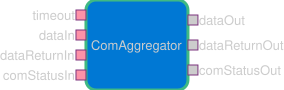

# Svc::ComAggregator

Aggregates buffers in the downlink chain. This is for use with systems that have fixed size frames (e.g. CCSDS TM) that needed internal aggregation.

> [!CAUTION]
> `Svc::ComAggregator` does not preserve context.

## Requirements

| ID                    | Description                                                                                                                                                   | Verification |
| --------------------- | ------------------------------------------------------------------------------------------------------------------------------------------------------------- | ------------ |
| Svc-ComAggregator-001 | ComAggregator shall accept incoming downlink data as `Fw::Buffer`, `ComCfg::FrameContext` pairs and append the buffer into the aggregate space permitting     | Unit-Test    |
| Svc-ComAggregator-002 | ComAggregator shall hold the incoming buffer when there is insufficient space in the aggregate buffer.                                                        | Unit-Test    |
| Svc-ComAggregator-003 | ComAggregator shall send the current aggregate buffer when the incoming buffer is held due to overflow.                                                       | Unit-Test    |
| Svc-ComAggregator-004 | ComAggregator shall send the current aggregate buffer when it receives a timeout trigger if and only if the aggregate is non-empty.                           | Unit-Test    |
| Svc-ComAggregator-005 | ComAggregator shall clear aggregation state when a `Fw::Success::SUCCESS` communication status is received back.                                                             | Unit-Test    |
| Svc-ComAggregator-006 | ComAggregator shall preserve the order of received buffers when forming each aggregate and across aggregate sends.                                            | Unit-Test    |
| Svc-ComAggregator-007 | ComAggregator shall interoperate with the [Communication Adapter Interface protocol](../../../docs/reference/communication-adapter-interface.md). Specifically, it shall pass through `Fw::Success::SUCCESS` and `Fw::Success::FAILURE` statuses per the [Framer Status Protocol](../../../docs/reference/communication-adapter-interface.md#framer-status-protocol), including the initial start-up SUCCESS and any recovery SUCCESS following a FAILURE.   | Unit-Test    |
| Svc-ComAggregator-008 | ComAggregator shall provide a packet spanning configuration, disabled by default; with spanning disabled, incoming buffers shall never be split.              | Unit-Test    |
| Svc-ComAggregator-009 | With spanning enabled, when an incoming buffer does not fit in the remaining aggregate space, ComAggregator shall fill the remaining space with the buffer's leading bytes, send the full aggregate, and retain the remainder for subsequent aggregates. | Unit-Test    |
| Svc-ComAggregator-010 | With spanning enabled, a retained remainder shall be able to span one or more complete subsequent aggregates, which are sent as continuation-only aggregates. | Unit-Test    |
| Svc-ComAggregator-011 | With spanning enabled, ComAggregator shall report the CCSDS TM First Header Pointer for each aggregate via `ComCfg::FrameContext.firstHeaderPointer`: the offset of the first packet header starting in the aggregate, or `0x7FF` when no packet header starts in the aggregate (CCSDS 132.0-B-3 4.1.2.7.6). | Unit-Test    |
| Svc-ComAggregator-012 | ComAggregator shall fill residual aggregate space with an SPP idle packet before sending so that every emitted aggregate is exactly the configured aggregation size; with spanning enabled, the idle packet spans into the next aggregate when the residual space is smaller than a minimum idle packet. | Unit-Test    |
| Svc-ComAggregator-013 | ComAggregator shall take its aggregation size, spanning setting, and aggregate storage (from an `Fw::MemAllocator`) per instance at initialization via `configure()`, and shall release the storage via `cleanup()`. | Unit-Test    |


## Design



`Svc.ComAggregator` implements `Svc.Framer`.  Additionally, it has a `Svc.Sched` timeout port enabling timeout to be driven via a rate group.

### Threading Model

`Svc.ComAggregator` is an active component whose input ports are all `sync`: port handlers run on the caller's thread and do no work beyond sending a signal to the `AggregationMachine` state machine instance. State machine signals are internally enqueued on the component's message queue, so all state machine actions and guards execute serially on the component's own thread. This keeps callers non-blocking while ensuring the aggregation state (frame buffer, held buffer, last context) is only touched from one thread. The only state shared across threads is the buffer ownership flag, which is an atomic exchanged in `dataReturnIn_handler` (caller thread) and `doSend` (component thread).

### Configuration

Each instance is configured at initialization, before any data is aggregated:

```c++
void configure(FwSizeType aggregationSize, bool spanningEnabled, FwEnumStoreType allocationId, Fw::MemAllocator& allocator);
void cleanup();
```

`aggregationSize` is the size of every emitted aggregate and of the storage obtained from `allocator` (released by
`cleanup()` at teardown). For CCSDS TM this is the TM Transfer Frame Data Field (`Svc.Ccsds.TmDataFieldSize`), minus
the bytes of any layer inserted between the aggregator and the framer (e.g. `Svc.Ccsds.SdlsSaIndexSize`). In
`Svc.Subtopologies.ComCcsds` it is set by `ComCcsdsConfig.Aggregator.aggregationSize`. `configure()` asserts when
called again without an intervening `cleanup()`, when the allocator does not return `aggregationSize` bytes, and when
`aggregationSize` violates the mode-specific limits below. `cleanup()` releases the storage and detaches the
aggregate buffer from it; it must only be called once the downstream framer has returned the aggregate and no
further data or status can arrive (i.e. after the component's task has stopped).

### Idle Filling

Every emitted aggregate is exactly `aggregationSize` bytes: residual space at send time is filled with an SPP idle
packet (APID `0x7FF`, CCSDS 133.0-B-2 4.1.3.3.4), so the downstream framer receives a complete data field and no layer
between the aggregator and the framer (e.g. SDLS encryption) has to handle padding. With spanning disabled, incoming
buffers are never split, so a buffer is only added to the current aggregate when it either completes it exactly or
leaves at least a minimum idle packet (header + 1 byte, 7 bytes) of residual; otherwise the aggregate is sent as is
(idle-filled) and the buffer starts the next one. A single buffer may therefore be at most `aggregationSize - 7`
bytes. `configure()` asserts unless a full-size `Fw::ComBuffer` or file buffer Space Packet fits within that limit,
and unless the largest possible residual (`aggregationSize - 1`) is expressible in the idle packet's SPP length field
(`aggregationSize <= 65544`).

### Packet Spanning

Configuring with `spanningEnabled` set enables CCSDS TM packet spanning. In this mode a buffer of any size is accepted
and `aggregationSize` must not exceed 2046 (`0x7FE`), the TM First Header Pointer range:

- A packet that does not fit in the remaining space is split: its leading bytes complete the current aggregate and
  the remainder is retained. Retention of the underlying buffer (and its return) follows normal buffer ownership;
  the buffer is only returned once fully consumed.
- After a successful send, if the retained remainder completely fills the next aggregate, that aggregate is sent
  immediately as a continuation-only aggregate (First Header Pointer = `0x7FF`), allowing a packet to span any
  number of complete frames.
- Residual space at send time (e.g. on timeout) is filled with an SPP idle packet (APID `0x7FF`). When fewer bytes
  remain than a minimum idle packet (header + 1 byte), the idle packet itself spans into the next aggregate.
- Idle bytes carried into the next aggregate do not by themselves make it eligible for a timeout send, so idle-only
  frames are never emitted.
- The First Header Pointer (the data-field offset of the first packet header starting in the aggregate) is
  reported through `ComCfg::FrameContext.firstHeaderPointer` and written into the TM Data Field Status by
  `Svc::Ccsds::TmFramer`, per CCSDS 132.0-B-3 section 4.1.2.7.6.

Spanning support makes the component depend on `Svc.Ccsds` (`Svc/Ccsds/Types` for the First Header Pointer limits and
`Svc/Ccsds/Utils` for the SPP idle packet); this dependency is present regardless of whether spanning is enabled.

With spanning disabled, incoming buffers are never split; a buffer larger than `aggregationSize - 7` (the largest
buffer that leaves room for an idle packet) is rejected by assertion rather than truncated, and the First Header
Pointer reported via `ComCfg::FrameContext.firstHeaderPointer` is always 0.

If a downstream frame is reported as failed, the unsent aggregate is dropped. With spanning enabled, the remainder
of a packet whose head was in the dropped aggregate is dropped too; its buffer is returned and SUCCESS is emitted, so
no orphan continuation data is downlinked. This relies on the dropping layer reporting FAILURE; a layer that drops
the frame but reports SUCCESS, such as `Svc::Ccsds::CcsdsSdlsFramer` on encryption or allocation failure, lets the
remainder go out as continuation bytes that the ground discards.
