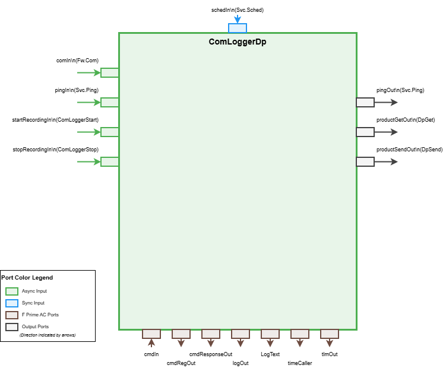

# Svc::ComLoggerDp

## 1. Introduction

The ComLoggerDp component logs `Fw::ComBuffer` buffers (e.g., framed telemetry, events, or command packets) to F Prime Data Product records. The component can be commanded to start recording data products, stop recording data product, or modify the priority of existing data products in progress. This component is meant to replace the `ComLogger` in deployments where data product management of `Fw::ComBuffers` is desired.

## 2. Requirements

| Name | Description | Validation |
|---|---|---|
| SVC-COMLOGGERDP-001 | The ComLoggerDp component shall log the contents of Com buffers received on its `comIn` port | unit test |
| SVC-COMLOGGER-002 | The ComLoggerDp component shall have a command to start recording packets, specifying the number of packets per container|
| SVC-COMLOGGER-003 | The ComLoggerDp component shall have a command to stop recording packets|
| SVC-COMLOGGER-004 | The ComLoggerDp component shall have a command to modify the priority of existing data products|
| SVC-COMLOGGER-005 | If the provided container buffer is not large enough to fit the requested number of records per container, emit a WARNING_LO event and adjust to the smaller size. The event should have a throttle value defined in an FPP configuration file with adefault of 1. Increment a DpBufferOverflow counter|
| SVC-COMLOGGER-006 | A public `configure` function will specify whether data product logging is initially enabled|


## 3. Design



The ComLoggerDp is an active component. Com buffers arriving on the async `comIn` port are dispatched on the component's thread and written synchronously to data product records. The component maintains state for whether logging is enabled, the current container being filled, and the number of packets to pack per container.

### 3.1 Component Architecture

*Figure 1: ComLoggerDp component interface showing input/output ports and data flow directions.*

The component uses a stateful design that:
1. Allocates a data product container when logging is enabled and the first packet arrives
2. Serializes incoming Com buffers as records into the container
3. Sends the container when it reaches the configured packet count
4. Flushes any partial container when recording is stopped

### 3.2 Port Description

#### 3.2.1 Input Ports

| Port | Type | Description |
|---|---|---|
| `comIn` | `Fw.Com` | Async port receiving Com buffers to be logged |
| `pingIn` | `Svc.Ping` | Async port for health ping requests |
| `schedIn` | `Svc.Sched` | Async port for periodic telemetry updates |
| `startRecordingIn` | `Svc.ComLoggerStart` | Async port to start recording via port interface |
| `stopRecordingIn` | `Svc.ComLoggerStop` | Async port to stop recording via port interface |
| `cmdIn` | Command receive | Standard command receive port |

#### 3.2.2 Output Ports

| Port | Type | Description |
|---|---|---|
| `pingOut` | `Svc.Ping` | Ping response port |
| `productGetOut` | Data product get | Port to request container buffers |
| `productSendOut` | Data product send | Port to send filled containers |
| `logOut` | Event | Event output port |
| `LogText` | Text event | Text event output port |
| `timeCaller` | Time get | Time stamp request port |
| `tlmOut` | Telemetry | Telemetry output port |
| `cmdResponseOut` | Command response | Standard command response port |
| `cmdRegOut` | Command registration | Standard command registration port |

### 3.3 State Variables

| Variable | Type | Initial Value | Description |
|---|---|---|---|
| `m_enabled` | `bool` | `false` | Whether data product logging is currently active |
| `m_container` | `DpContainer` | - | Current data product container being filled |
| `m_packetsPerContainer` | `U32` | `0` | Target number of packets per container |
| `m_currentPacketCount` | `U32` | `0` | Current count of packets in the active container |
| `m_numBuffersLogged` | `U32` | `0` | Total number of buffers logged since initialization |
| `m_numBuffersDropped` | `U32` | `0` | Number of buffers dropped due to allocation failure |
| `m_priority` | `FwDpPriorityType` | `5` | Priority for data product containers |

### 3.4 Configuration

The component uses FPP constants defined in `ComLoggerDpCfg.fpp` for configuration:

| Constant | Type | Default | Description |
|---|---|---|---|
| `DpBufferErrorThrottle` | `U32` | `1` | Throttle value for `DpBufferError` event - limits the number of times the event can be emitted consecutively |

These constants can be overridden in deployment-specific configuration files to tune behavior without modifying the component source.

### 3.5 Initialization

The component requires calling `configure(bool enabled)` during initialization to set the initial enabled state. Typically this is set to `false`, and logging is started later via command or port.

### 3.5 Commands

| Command | Opcode | Parameters | Description |
|---|---|---|---|
| `StartComDp` | 0x00 | `packetsPerContainer: U32`<br>`priority: U32` | Starts recording Com buffers into data products with the specified configuration. Validates that `packetsPerContainer > 0`. Logs `ComDpStarted` event on success. |
| `UpdatePriority` | 0x01 | `priority: U32` | Updates the priority of the currently active container (if any) and stores the priority for future containers. Logs `PriorityUpdated` event. |
| `StopComDp` | 0x02 | None | Stops recording and sends any partial container. Logs `ComDpStopped` event with count of partial containers sent. |
| `CLEAR_COUNTERS` | 0x03 | None | Clears the `NumBuffersLogged` and `NumBuffersDropped` telemetry counters to 0 and resets the `DpBufferError` event throttle. Logs `CountersCleared` event. |

### 3.6 Events

| Event | ID | Severity | Parameters | Throttle | Description |
|---|---|---|---|---|---|
| `DpBufferError` | 0x00 | WARNING_HI | `size: U32` | `DpBufferErrorThrottle` (default: 1) | Error getting data product buffer of the requested size |
| `ComDpStarted` | 0x01 | ACTIVITY_HI | `packetsPerContainer: U32` | None | Recording started with specified configuration |
| `ComDpStopped` | 0x02 | ACTIVITY_HI | `numSent: U32` | None | Recording stopped, partial container sent if any |
| `PriorityUpdated` | 0x03 | ACTIVITY_LO | `priority: U32` | None | Data product priority updated |
| `CountersCleared` | 0x04 | ACTIVITY_LO | None | None | Counters and throttles cleared |

### 3.7 Telemetry

| Channel | ID | Type | Description |
|---|---|---|---|
| `LoggingEnabled` | 0x00 | `bool` | Whether data product logging is currently active |
| `NumBuffersLogged` | 0x01 | `U32` | Total number of Com buffers logged since initialization |
| `NumBuffersDropped` | 0x02 | `U32` | Number of Com buffers dropped due to container allocation failure |

Telemetry is written periodically when the `schedIn` port is invoked (typically connected to a rate group).

### 3.8 Data Products

#### 3.8.1 Records

| Record | ID | Type | Description |
|---|---|---|---|
| `ComBufferRecord` | 0 | `U8 array` | Variable-length array containing Com buffer data |

#### 3.8.2 Containers

| Container | ID | Default Priority | Description |
|---|---|---|---|
| `ComBuffContainer` | 0 | 5 | Container holding multiple Com buffer records |

### 3.9 Internal Helper Functions

The component uses private helper functions to share logic between command handlers and port handlers:

- `startRecordingInternal(U32 packetsPerContainer, U32 priority)`: Validates parameters, stores configuration, enables logging, and logs event. Returns `true` on success, `false` on validation failure.
- `stopRecordingInternal()`: Sends any partial container, disables logging, logs event, and returns the number of partial containers sent.
- `handleBufferDrop(U32 size)`: Logs `DpBufferError` event and increments `m_numBuffersDropped` counter. Called when a buffer must be dropped due to allocation or serialization failure.

This design allows both command-based and port-based control to use the same implementation, and provides consistent error handling across different failure modes.

### 3.10 Operational Flow

#### 3.10.1 Starting Recording

1. `StartComDp` command or `startRecordingIn` port is invoked
2. `startRecordingInternal()` validates `packetsPerContainer > 0`
3. Configuration is stored and logging is enabled
4. `ComDpStarted` event is logged
5. Component awaits incoming Com buffers

#### 3.10.2 Recording Com Buffers

1. Com buffer arrives on `comIn` port
2. If not enabled, return immediately
3. If `m_currentPacketCount == 0`, allocate a new container via `productGetOut`
   - If allocation fails, call `handleBufferDrop()` and return
4. Set container priority to `m_priority`
5. Serialize Com buffer data into container as a `ComBufferRecord`
   - If serialization fails (container may be full):
     - Send current partial container if it has packets
     - Reset `m_currentPacketCount`
     - Allocate a new container
     - If new allocation fails, call `handleBufferDrop()` and return
     - Set priority on new container
     - Retry serialization
     - If retry fails, call `handleBufferDrop()` and return
6. Increment `m_currentPacketCount` and `m_numBuffersLogged`
7. If container is full (`m_currentPacketCount >= m_packetsPerContainer`):
   - Send container via `productSendOut`
   - Reset `m_currentPacketCount` to 0

#### 3.10.3 Stopping Recording

1. `StopComDp` command or `stopRecordingIn` port is invoked
2. `stopRecordingInternal()` checks for partial container
3. If partial container exists, send it via `productSendOut`
4. Disable logging
5. Log `ComDpStopped` event with count of partial containers sent

## 4. Unit Tests

The component includes comprehensive unit tests covering all functionality:

| Test | Description | Requirements Validated |
|---|---|---|
| `ComLogging` | Tests basic Com buffer logging with container allocation and sending when full | SVC-COMLOGGERDP-001 |
| `StartComDp` | Tests `StartComDp` command with valid and invalid parameters, verifies event logging | SVC-COMLOGGER-002 |
| `StopComDp` | Tests `StopComDp` command and verifies partial container is sent | SVC-COMLOGGER-003 |
| `UpdatePriority` | Tests `UpdatePriority` command and verifies priority is updated on active container | SVC-COMLOGGER-004 |
| `Ping` | Tests ping functionality via `pingIn` port | - |
| `ContainerFill` | Tests that containers are sent at the correct boundary and partial containers are not sent prematurely | SVC-COMLOGGERDP-001 |
| `AllocationFailure` | Tests error handling when container allocation fails, verifies `DpBufferError` event | SVC-COMLOGGER-005 |
| `Telemetry` | Tests that `LoggingEnabled` and `NumBuffersLogged` telemetry is written correctly via `schedIn` | - |
| `PriorityPreserved` | Tests that priority from `StartComDp` is preserved and applied even when starting from disabled state | SVC-COMLOGGER-002, SVC-COMLOGGER-004 |
| `StartRecordingPort` | Tests starting recording via `startRecordingIn` port with encoded configuration | SVC-COMLOGGER-002 |
| `StopRecordingPort` | Tests stopping recording via `stopRecordingIn` port | SVC-COMLOGGER-003 |
| `ClearCounters` | Tests `CLEAR_COUNTERS` command, verifies `NumBuffersLogged` and `NumBuffersDropped` are reset and `DpBufferError` throttle is cleared | - |
| `BufferOverflow` | Tests that large buffers are handled correctly and serialization status is checked | - |

All tests verify:
- Correct port behavior
- Event generation
- Telemetry updates
- Data product container allocation and sending
- Memory cleanup (no leaks detected by AddressSanitizer)

## 5. Usage

### 5.1 Component Instantiation

```cpp
Svc::ComLoggerDp comLogger("comLogger");
```

### 5.2 Initialization

```cpp
// Initialize component with queue depth and instance ID
comLogger.init(QUEUE_DEPTH, INSTANCE_ID);

// Configure initial state (typically disabled)
comLogger.configure(false);
```

### 5.3 Port Connections

#### Typical Deployment Connections

```cpp
// Connect Com input from framer or other Com source
framer.comOut[0].connect(comLogger.comIn[0]);

// Connect command ports
cmdDisp.compCmdSend[ID].connect(comLogger.cmdIn[0]);
comLogger.cmdRegOut[0].connect(cmdDisp.compCmdReg[ID]);
comLogger.cmdResponseOut[0].connect(cmdDisp.compCmdStat[ID]);

// Connect data product ports
comLogger.productGetOut[0].connect(dpWriter.bufferGetIn[0]);
comLogger.productSendOut[0].connect(dpWriter.bufferSendIn[0]);

// Connect event and telemetry ports
comLogger.logOut[0].connect(eventLogger.LogRecv[ID]);
comLogger.tlmOut[0].connect(chanTlm.TlmRecv[ID]);
comLogger.timeCaller[0].connect(timeSource.timeGetPort[ID]);

// Connect sched port for periodic telemetry updates
rateGroup1Hz.RateGroupMemberOut[ID].connect(comLogger.schedIn[0]);

// Optional: Connect ping ports for health monitoring
health.PingOut[ID].connect(comLogger.pingIn[0]);
comLogger.pingOut[0].connect(health.PingIn[ID]);

// Optional: Connect port-based start/stop for external control
externalControl.startOut[0].connect(comLogger.startRecordingIn[0]);
externalControl.stopOut[0].connect(comLogger.stopRecordingIn[0]);
```

### 5.4 Command Usage

#### Starting Recording via Command

```
StartComDp(packetsPerContainer: 100, priority: 5)
```

This starts recording with 100 Com buffers per data product container at priority 5.

#### Updating Priority via Command

```
UpdatePriority(priority: 10)
```

This updates the current container's priority (if active) and all future containers to priority 10.

#### Stopping Recording via Command

```
StopComDp()
```

This stops recording and sends any partial container.

### 5.5 Port-Based Control

The component can also be controlled via ports for integration with autonomous flight software or other components:

```cpp
// Start recording: encode config as (packetsPerContainer << 16) | priority
U32 config = (100 << 16) | 5;  // 100 packets per container, priority 5
comLogger.get_startRecordingIn_InputPort(0)->invoke(config);

// Stop recording
comLogger.get_stopRecordingIn_InputPort(0)->invoke();
```

### 5.6 Telemetry Monitoring

Monitor the following telemetry channels:

- `LoggingEnabled`: Boolean indicating if logging is active
- `NumBuffersLogged`: Total count of Com buffers logged since initialization
- `NumBuffersDropped`: Count of Com buffers dropped due to allocation failures

### 5.7 Typical Use Case: Downlink Recording

A common deployment pattern:

1. System boots with `comLogger.configure(false)` - logging disabled
2. Ground sends command to start high-rate telemetry recording when radio link is lost:
   ```
   StartComDp(packetsPerContainer: 200, priority: 10)
   ```
3. Component records all Com traffic (telemetry, events) to data products
4. When link is re-established, ground commands:
   ```
   StopComDp()
   ```
5. Data products are downlinked via the data product manager
6. Ground can reconstruct the full telemetry stream from the data products

## 6. Change Log

| Date | Description |
|---|---|
| 2026-09-04 | Initial implementation with commands, ports, events, telemetry, and comprehensive unit tests |
