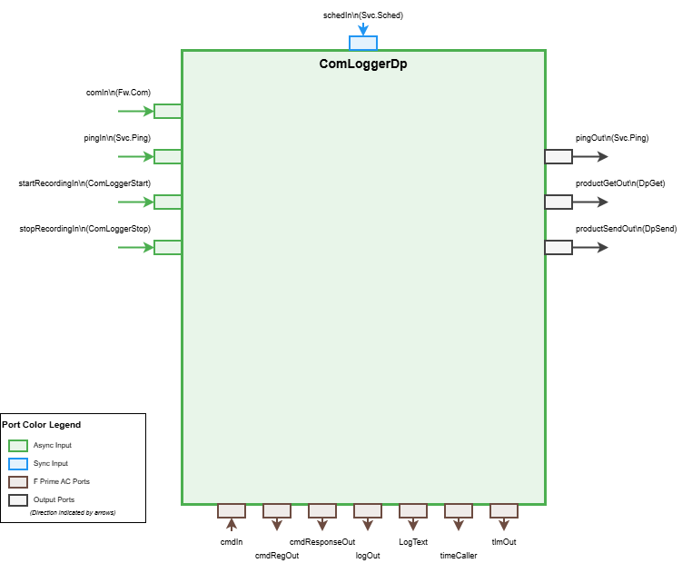

# Svc::ComLoggerDp

## 1. Introduction

The ComLoggerDp component logs `Fw::ComBuffer` buffers (e.g., framed telemetry, events, or command packets) to F Prime Data Product records. The component can be commanded to start recording data products, stop recording data product, or modify the priority of existing data products in progress. This component is meant to replace the `ComLogger` in deployments where data product management of `Fw::ComBuffers` is desired.

## 2. Requirements

| Name | Description | Validation |
|---|---|---|
| SVC-COMLOGGERDP-001 | The ComLoggerDp component shall log the contents of Com buffers received on its `comIn` port | unit test |
| SVC-COMLOGGER-002 | The ComLoggerDp component shall have a command to start recording packets, specifying the number of packets per container|
| SVC-COMLOGGER-003 | The ComLoggerDp component shall have a command to stop recording packets|
| SVC-COMLOGGER-004 | The ComLoggerDp component shall have a command to modify the priority of existing data products|
| SVC-COMLOGGER-005 | A public `configure` function will specify whether data product logging is initially enabled, and if enabled, the initial packets per container and priority|


## 3. Design



The ComLoggerDp is an active component. Com buffers arriving on the async `comIn` port are dispatched on the component's thread and written synchronously to data product records. The component maintains state for whether logging is enabled, the current container being filled, and the number of packets to pack per container.

### 3.1 Component Architecture

The component uses a stateful design that:
1. Allocates a data product container when logging is enabled and the first packet arrives
2. Serializes incoming Com buffers as records into the container
3. Sends the container when it reaches the configured packet count
4. Flushes any partial container when recording is stopped
5. Flushes any partial container after `flushTimeout` consecutive `schedIn` calls with no packet received (`flushTimeout` is the last argument of `configure()`, 0 disables auto-flush; with the 1 Hz rate group of §5.3, `flushTimeout = 10` is a 10 s inactivity flush). A continuous stream never idles, so its containers close only at `packetsPerContainer`; a sparse stream with gaps longer than the timeout produces one data product per burst regardless of `packetsPerContainer`, each occupying a full `ComLoggerDpBuffSize(packetsPerContainer)` buffer and one `DpCatalog` file slot.

### 3.2 Port Description

#### 3.2.1 Input Ports

| Port | Type | Description |
|---|---|---|
| `comIn` | `Fw.Com` | Async port receiving Com buffers to be logged. Queue-full policy is `drop`: when the component queue is full, incoming buffers are discarded with no event; the cumulative count is reported in `NumQueueDrops` on the next `schedIn` cycle and is not reset by `CLEAR_COUNTERS`. Size the instance queue depth for the largest expected com burst between component task executions |
| `pingIn` | `Svc.Ping` | Async port for health ping requests |
| `schedIn` | `Svc.Sched` | Async port for periodic telemetry updates |
| `startRecordingIn` | `Svc.ComLoggerStart` | Async port to start recording via port interface. Parameters: `packetsPerContainer` (FwSizeType), `priority` (FwDpPriorityType). Logs `StartRecordingFailed` event on validation failure. |
| `stopRecordingIn` | `Svc.ComLoggerStop` | Async port to stop recording via port interface |
| `cmdIn` | Command receive | Standard command receive port |

#### 3.2.2 Output Ports

| Port | Type | Description |
|---|---|---|
| `pingOut` | `Svc.Ping` | Ping response port |
| `productGetOut` | Data product get | Port to request container buffers |
| `productSendOut` | Data product send | Port to send filled containers |
| `logOut` | Event | Event output port |
| `LogText` | Text event | Text event output port |
| `timeCaller` | Time get | Time stamp request port |
| `tlmOut` | Telemetry | Telemetry output port |
| `cmdResponseOut` | Command response | Standard command response port |
| `cmdRegOut` | Command registration | Standard command registration port |

### 3.3 State Variables

| Variable | Type | Initial Value | Description |
|---|---|---|---|
| `m_enabled` | `bool` | `false` | Whether data product logging is currently active |
| `m_container` | `DpContainer` | - | Current data product container being filled |
| `m_packetsPerContainer` | `FwSizeType` | `0` | Target number of packets per container |
| `m_currentPacketCount` | `FwSizeType` | `0` | Current count of packets in the active container |
| `m_numBuffersLogged` | `U32` | `0` | Total number of buffers logged since initialization |
| `m_numBuffersDropped` | `U32` | `0` | Number of buffers dropped due to allocation failure |
| `m_priority` | `FwDpPriorityType` | `5` | Priority for data product containers |
| `m_recordBuffer` | `U8[MAX_RECORD_DATA_SIZE]` | - | Buffer for building records with sentry value followed by ComBuffer data |
| `m_schedCallsSinceLastPacket` | `U32` | `0` | Counter for schedIn calls since last packet received (used for auto-flush) |
| `m_flushTimeout` | `U32` | `0` | Number of schedIn calls without packets before auto-flush (0 = disabled) |

### 3.4 Configuration

The component uses constants defined in `default/config/ComLoggerDpCfg.fpp` and `default/config/ComLoggerDpCfg.hpp` for configuration:

| Constant | Defined in | Type | Default | Description |
|---|---|---|---|---|
| `DpBufferErrorThrottle` | `ComLoggerDpCfg.fpp` | `U32` | `1` | Throttle value for `DpBufferError` event - limits the number of times the event can be emitted consecutively |
| `ComLoggerDpSentry` | `ComLoggerDpCfg.hpp` | `U32` | `0xDEADBEEF` | Sentry value prepended to each ComBuffer record for corruption detection during deserialization; must match the `--sentry` value given to `scripts/decode_comlogger_dp.py` |

These constants can be overridden in deployment-specific configuration files to tune behavior without modifying the component source.

**Note on Sentry Values**: Each ComBuffer record now includes a 4-byte sentry value prepended to the data. This sentry serves as a corruption detection mechanism that allows downstream deserialization code to validate record integrity. The sentry is serialized using F Prime's serialization to handle endianness correctly across platforms.

### 3.5 Initialization

The component requires calling `configure(bool enabled, FwSizeType packetsPerContainer, FwDpPriorityType priority, U32 flushTimeout)` during initialization to set the initial state:

- `enabled`: Whether to enable logging immediately
- `packetsPerContainer`: Number of packets per container (validated > 0 if enabled)
- `priority`: Data product priority
- `flushTimeout`: Number of schedIn calls without packets before auto-flushing partial container (0 = disabled)

If `enabled` is `true`, the function validates `packetsPerContainer` exactly as `StartComDp` does (`> 0` and the resulting container size fits in a `U32`) and enables logging with the specified configuration; an invalid value is a programming error and triggers `FW_ASSERT` (no `StartRecordingFailed` event is emitted). If `enabled` is `false`, the `packetsPerContainer` and `priority` parameters are ignored but `flushTimeout` is still stored. Typically `enabled` is set to `false`, and logging is started later via command or port.

### 3.5 Commands

| Command | Opcode | Parameters | Description |
|---|---|---|---|
| `StartComDp` | 0x00 | `packetsPerContainer: FwSizeType`<br>`priority: FwDpPriorityType` | Starts recording Com buffers into data products with the specified configuration. Validates that `packetsPerContainer > 0` and that the resulting container size fits in a `U32` (`packetsPerContainer <= (U32 max - Fw::DpContainer::MIN_PACKET_SIZE) / RECORD_SIZE`, where `RECORD_SIZE = SIZE_OF_ComBufferRecord_RECORD(MAX_RECORD_DATA_SIZE)` and `MAX_RECORD_DATA_SIZE = FW_COM_BUFFER_MAX_SIZE + sizeof(ComLoggerDpSentry)`). If validation fails, logs `StartRecordingFailed` event and returns `VALIDATION_ERROR`. If recording is already active with a partial container, sends the partial container before reconfiguring. Logs `ComDpStarted` event on success. |
| `UpdatePriority` | 0x01 | `priority: FwDpPriorityType` | Updates the priority of the currently active container (if any) and stores the priority for future containers. Logs `PriorityUpdated` event. |
| `StopComDp` | 0x02 | None | Stops recording and sends any partial container. Logs `ComDpStopped` event indicating whether a partial container was sent. |
| `CLEAR_COUNTERS` | 0x03 | None | Clears the `NumBuffersLogged` and `NumBuffersDropped` telemetry counters to 0 and resets the `DpBufferError` event throttle. Logs `CountersCleared` event. |

### 3.6 Events

| Event | ID | Severity | Parameters | Throttle | Description |
|---|---|---|---|---|---|
| `DpBufferError` | 0x00 | WARNING_HI | `size: U32` | `DpBufferErrorThrottle` (default: 1) | Error getting data product buffer of the requested size |
| `ComDpStarted` | 0x01 | ACTIVITY_HI | `packetsPerContainer: FwSizeType` | None | Recording started with specified configuration |
| `ComDpStopped` | 0x02 | ACTIVITY_HI | `partialContainer: PartialContainerStatus` | None | Recording stopped; `SENT` if a partial container was sent, `NOT_SENT` otherwise |
| `PriorityUpdated` | 0x03 | ACTIVITY_LO | `priority: FwDpPriorityType` | None | Data product priority updated |
| `CountersCleared` | 0x04 | ACTIVITY_LO | None | None | Counters and throttles cleared |
| `StartRecordingFailed` | 0x05 | WARNING_LO | `packetsPerContainer: FwSizeType` | None | Failed to start recording due to invalid configuration (`packetsPerContainer` is 0 or exceeds the container-size limit given for `StartComDp`) |

### 3.7 Telemetry

| Channel | ID | Type | Description |
|---|---|---|---|
| `LoggingEnabled` | 0x00 | `bool` | Whether data product logging is currently active |
| `NumBuffersLogged` | 0x01 | `U32` | Total number of Com buffers logged since initialization |
| `NumBuffersDropped` | 0x02 | `U32` | Number of Com buffers dropped due to container allocation failure |
| `NumQueueDrops` | 0x04 | `U32` | Number of messages dropped from the component's queue due to queue full condition |

Telemetry is written periodically when the `schedIn` port is invoked (typically connected to a rate group).

**Note on Auto-Flush**: If `flushTimeout` is configured > 0, the `schedIn` handler also checks for auto-flush conditions. When logging is enabled with a partial container and no packets have arrived for `flushTimeout` consecutive schedIn calls, the partial container is automatically flushed. This prevents stale data from sitting indefinitely in memory.

### 3.8 Data Products

#### 3.8.1 Records

| Record | ID | Type | Description |
|---|---|---|---|
| `ComBufferRecord` | 0 | `U8 array` | Variable-length array containing a 4-byte sentry value (serialized with proper endianness) followed by Com buffer data |

#### 3.8.2 Containers

| Container | ID | Default Priority | Description |
|---|---|---|---|
| `ComBuffContainer` | 0 | 5 | Container holding multiple Com buffer records |

### 3.9 Internal Helper Functions

The component uses private helper functions to share logic between command handlers and port handlers:

- `startRecordingInternal(FwSizeType packetsPerContainer, FwDpPriorityType priority)`: Validates parameters, stores configuration, enables logging, and logs event. If recording is already active with a partial container, sends the partial container before reconfiguring. On validation failure, disables logging and returns `Fw::Success::FAILURE`. Returns `Fw::Success::SUCCESS` on success.
- `stopRecordingInternal()`: Sends any partial container, disables logging, logs event, and returns a `PartialContainerStatus` indicating whether a partial container was sent.
- `handleBufferDrop(U32 size)`: Logs `DpBufferError` event (with throttling) and increments `m_numBuffersDropped` counter. Called when a buffer must be dropped due to allocation failure.
- `allocateAndSetupContainer()`: Allocates a new data product container with size calculated to hold `m_packetsPerContainer` records (each with sentry + ComBuffer data), sets the priority to `m_priority`, and returns `Fw::Success::SUCCESS` on success. On allocation failure, calls `handleBufferDrop()` and returns `Fw::Success::FAILURE`.
- `serializePacket(const U8* dataPtr, FwSizeType dataSize)`: Builds a record with sentry value followed by ComBuffer data in `m_recordBuffer`, then serializes it into the current container. Uses assertions to ensure serialization succeeds (containers are pre-sized correctly).
- `sendContainerIfNonEmpty()`: Sends the current container if logging is enabled and it has any packets via `productSendOut`, resets `m_currentPacketCount` to 0, and returns a `PartialContainerStatus` indicating whether a container was sent. Handles both full and partial containers. Note that `dpSend()` invalidates the container; a new one will be allocated when the next packet arrives.
- `finalizeContainer()`: Delegates to `sendContainerIfNonEmpty()` to send the current container.

This design allows both command-based and port-based control to use the same implementation, provides consistent error handling across different failure modes, and encapsulates the complexity of sentry value handling and container management.

### 3.10 Operational Flow

#### 3.10.1 Starting Recording

1. `StartComDp` command or `startRecordingIn` port is invoked
2. `startRecordingInternal()` validates `packetsPerContainer > 0`
   - If validation fails, disable logging and return failure
   - Command handler sends `VALIDATION_ERROR` response and logs `StartRecordingFailed` event
   - Port handler logs `StartRecordingFailed` event
3. If recording is already active with a partial container, send it before reconfiguring
4. Configuration is stored and logging is enabled
5. `ComDpStarted` event is logged
6. Component awaits incoming Com buffers

#### 3.10.2 Recording Com Buffers

1. Com buffer arrives on `comIn` port
2. If not enabled, return immediately
3. Reset auto-flush counter: `m_schedCallsSinceLastPacket = 0`
4. If `m_currentPacketCount == 0`, call `allocateAndSetupContainer()`
   - Allocates a new container with size for `m_packetsPerContainer` records (including sentry overhead)
   - Sets container priority to `m_priority`
   - If allocation fails, `handleBufferDrop()` is called and handler returns
5. Call `serializePacket()` to serialize the packet with sentry:
   - Build record in `m_recordBuffer`: serialize sentry value (handles endianness), then append ComBuffer data
   - Serialize the record into the container
   - Assertions ensure serialization succeeds (containers are pre-sized correctly)
6. Increment `m_currentPacketCount` and `m_numBuffersLogged`
7. If container is full (`m_currentPacketCount >= m_packetsPerContainer`):
   - Call `finalizeContainer()` to send container and reset count

#### 3.10.3 Auto-Flush on Inactivity

If `flushTimeout` is configured > 0 during `configure()`:

1. `schedIn` port is invoked periodically (typically 1 Hz)
2. Check auto-flush conditions:
   - Logging must be enabled (`m_enabled == true`)
   - Partial container must exist (`m_currentPacketCount > 0`)
   - Timeout must be configured (`m_flushTimeout > 0`)
3. If all conditions met, increment `m_schedCallsSinceLastPacket`
4. If `m_schedCallsSinceLastPacket >= m_flushTimeout`:
   - Call `finalizeContainer()` to send the partial container
   - Reset `m_schedCallsSinceLastPacket = 0`
5. Write telemetry channels

**Important**: The `m_flushTimeout > 0` check is critical. Without it, setting `flushTimeout = 0` would cause immediate flush on every schedIn call (since `0 >= 0` is true). With the check, `flushTimeout = 0` completely disables auto-flush.

**Counter Resets**: The `m_schedCallsSinceLastPacket` counter is reset to 0 when:
- A packet arrives via `comIn` (activity detected)
- `startRecordingInternal()` is called (recording starts/reconfigures)
- `stopRecordingInternal()` is called (recording stops)
- Auto-flush triggers and sends a container

**Example**: With `flushTimeout = 10` and schedIn connected to a 1 Hz rate group:
- Packets arrive and fill container to 3 of 10 capacity
- No more packets arrive for 10 seconds
- On the 10th schedIn call, the partial container with 3 packets is automatically flushed
- This prevents stale data from sitting indefinitely in memory

#### 3.10.4 Stopping Recording

1. `StopComDp` command or `stopRecordingIn` port is invoked
2. `stopRecordingInternal()` checks for partial container
3. If partial container exists, send it via `productSendOut`
4. Disable logging and reset auto-flush counter
5. Log `ComDpStopped` event indicating whether a partial container was sent

## 4. Unit Tests

Unit tests are located in `test/ut/`. Each test case that validates a requirement records it with the `REQUIREMENT` macro from `Fw/Test/UnitTest.hpp`, so requirement traceability is derived from the test code.

## 5. Usage

### 5.1 Component Instantiation

```cpp
Svc::ComLoggerDp comLogger("comLogger");
```

### 5.2 Initialization

```cpp
// Initialize component with queue depth and instance ID
comLogger.init(QUEUE_DEPTH, INSTANCE_ID);

// Configure initial state (typically disabled)
// Parameters: enabled, packetsPerContainer, priority, flushTimeout
// flushTimeout: Number of schedIn calls without packets before auto-flush (0 = disabled)
comLogger.configure(false, 0, 0, 10);  // Auto-flush after 10 idle schedIn calls

// Alternative: Configure with logging initially enabled
// comLogger.configure(true, 100, 5, 10);  // 100 packets per container at priority 5, auto-flush after 10 idle cycles

// Alternative: Disable auto-flush
// comLogger.configure(false, 0, 0, 0);  // flushTimeout=0 disables auto-flush
```

Use the public helper function `ComLoggerDpBuffSize` to get the size
of buffers needed to support the ComBuffer data products. This size
can be used for Svc::BufferManager or equivalent.


### 5.3 Port Connections

#### Typical Deployment Connections

```cpp
// Connect Com input from framer or other Com source
framer.comOut[0].connect(comLogger.comIn[0]);

// Connect command ports
cmdDisp.compCmdSend[ID].connect(comLogger.cmdIn[0]);
comLogger.cmdRegOut[0].connect(cmdDisp.compCmdReg[ID]);
comLogger.cmdResponseOut[0].connect(cmdDisp.compCmdStat[ID]);

// Connect data product ports
comLogger.productGetOut[0].connect(dpWriter.bufferGetIn[0]);
comLogger.productSendOut[0].connect(dpWriter.bufferSendIn[0]);

// Connect event and telemetry ports
comLogger.logOut[0].connect(eventLogger.LogRecv[ID]);
comLogger.tlmOut[0].connect(chanTlm.TlmRecv[ID]);
comLogger.timeCaller[0].connect(timeSource.timeGetPort[ID]);

// Connect sched port for periodic telemetry updates
rateGroup1Hz.RateGroupMemberOut[ID].connect(comLogger.schedIn[0]);

// Optional: Connect ping ports for health monitoring
health.PingOut[ID].connect(comLogger.pingIn[0]);
comLogger.pingOut[0].connect(health.PingIn[ID]);

// Optional: Connect port-based start/stop for external control
externalControl.startOut[0].connect(comLogger.startRecordingIn[0]);
externalControl.stopOut[0].connect(comLogger.stopRecordingIn[0]);
```

### 5.4 Command Usage

#### Starting Recording via Command

```
StartComDp(packetsPerContainer: 100, priority: 5)
```

This starts recording with 100 Com buffers per data product container at priority 5.

#### Updating Priority via Command

```
UpdatePriority(priority: 10)
```

This updates the current container's priority (if active) and all future containers to priority 10.

#### Stopping Recording via Command

```
StopComDp()
```

This stops recording and sends any partial container.

### 5.5 Port-Based Control

The component can also be controlled via ports for integration with autonomous flight software or other components:

```cpp
// Start recording with separate parameters
FwSizeType packetsPerContainer = 100;
FwDpPriorityType priority = 5;
comLogger.get_startRecordingIn_InputPort(0)->invoke(packetsPerContainer, priority);

// Stop recording
comLogger.get_stopRecordingIn_InputPort(0)->invoke();
```

### 5.6 Telemetry Monitoring

Monitor the following telemetry channels:

- `LoggingEnabled`: Boolean indicating if logging is active
- `NumBuffersLogged`: Total count of Com buffers logged since initialization
- `NumBuffersDropped`: Count of Com buffers dropped due to allocation failures

### 5.7 Typical Use Case: Downlink Recording

A common deployment pattern:

1. System boots with `comLogger.configure(false, 0, 0, 10)` - logging disabled, auto-flush after 10 idle `schedIn` calls
2. Ground sends command to start high-rate telemetry recording when radio link is lost:
   ```
   StartComDp(packetsPerContainer: 200, priority: 10)
   ```
3. Component records all Com traffic (telemetry, events) to data products
4. When link is re-established, ground commands:
   ```
   StopComDp()
   ```
5. Data products are downlinked via the data product manager
6. Ground can reconstruct the full telemetry stream from the data products using [`decode_comlogger_dp.py](../scripts/decode_comlogger_dp.py) in the [scripts](../scripts/) directory.

## 6. Change Log

| Date | Description |
|---|---|
| 2026-09-23 | Initial implementation with commands, ports, events, telemetry, and comprehensive unit tests |
