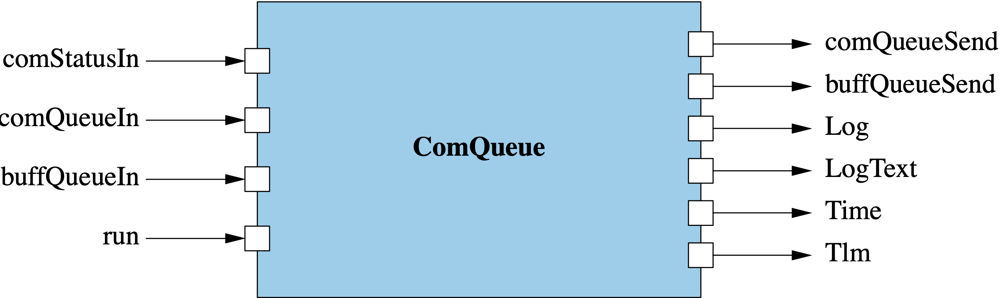

\page SvcComQueueComponent Svc::ComQueue Component
# Svc::ComQueue (Active Component)

## 1. Introduction

`Svc::ComQueue` is an  F´ active component that functions as a priority queue of buffer types. Messages are dequeued and
forwarded when a `Fw::Success::SUCCESS` signal is received in order of priority. Messages that result in a
`Fw::Success::FAILURE` signal are stored and retried on the first following `Fw::Success::SUCCESS` signal.

`Svc::ComQueue` is configured with a queue depth and queue priority for each incoming `Fw::Com` and `Fw::Buffer` port by
passing in a configuration table at initialization. Queued messages from the highest priority source port are serviced
first and a round-robin algorithm is used to balance between ports of shared priority.

`Svc::ComQueue` is designed to follow the
[communication adapter interface](https://nasa.github.io/fprime/Design/communications-adapter-interface.html).

## 2. Assumptions

1. Incoming buffers to a given port are in priority order
2. Data is considered to be successfully sent when a `Fw::Success::SUCCESS` signal was received
3. The system includes a downstream
 [communications adapter](https://nasa.github.io/fprime/Design/communications-adapter-interface.html)

## 3. Requirements

| Requirement      | Description                                                                                                                             | Rationale                                                               | Verification Method |
|------------------|-----------------------------------------------------------------------------------------------------------------------------------------|-------------------------------------------------------------------------|---------------------|
| SVC-COMQUEUE-001 | `Svc::ComQueue` shall queue `Fw::Buffer` and `Fw::ComBuffer` received on incoming ports.                                                | The purpose of the queue is to store messages.                          | Unit Test           |
| SVC-COMQUEUE-002 | `Svc::ComQueue` shall output exactly one `Fw::Buffer` or `Fw::ComBuffer` message on a received `Fw::Success::SUCCESS` signal  .         | `Svc::ComQueue` obeys the communication adapter interface protocol.     | Unit Test           |
| SVC-COMQUEUE-003 | `Svc::ComQueue` shall retry sending the last sent message on the first `Fw::Success::SUCCESS` signal following `Fw::Success::FAILURE`.  | In the case of failure messages shall not be lost.                      | Unit Test           |
| SVC-COMQUEUE-004 | `Svc::ComQueue` shall have a configurable number of `Fw::Com` and `Fw::Buffer` input ports.                                             | `Svc::ComQueue` should be adaptable for a number of projects.           | Inspection          |
| SVC-COMQUEUE-005 | `Svc::ComQueue` shall select and send the next priority `Fw::Buffer` and `Fw::ComBuffer` message in response to `Fw::Success::SUCCESS`. | `Svc::ComQueue` obeys the communication adapter interface protocol.     | Unit test           |
| SVC-COMQUEUE-006 | `Svc::ComQueue` shall periodically telemeter the number of queued messages per-port in response to a `run` port invocation.             | `Svc::ComQueue` should provide useful telemetry.                        | Unit Test           | 
| SVC-COMQUEUE-007 | `Svc::ComQueue` shall emit a queue overflow event for a given port when the configured depth is exceeded. Messages shall be discarded.  | `Svc::ComQueue` needs to indicate off-nominal events.                   | Unit Test           | 
| SVC-COMQUEUE-008 | `Svc::ComQueue` shall implement a round robin approach to balance between ports of the same priority.                                   | Allows projects to balance between a set of queues of similar priority. | Unit Test           |
| SVC-COMQUEUE-009 | `Svc::ComQueue` shall keep track and throttle queue overflow events per port.                                                           | Prevents a flood of queue overflow events.                              | Unit test           | 

## 4. Design
The diagram below shows the `Svc::ComQueue` component.

### 4.1. Ports
`Svc::ComQueue` has the following ports:

| Kind          | Name              | Port Type                             | Usage                                                  |
|---------------|-------------------|---------------------------------------|--------------------------------------------------------|
| `output`      | `comQueueSend`    | `Fw.Com`                              | Fw::ComBuffer output port                              |
| `output`      | `buffQueueSend`   | `Fw.BufferSend`                       | Fw::Buffer output port                                 |
| `async input` | `comStatusIn`     | `Fw.SuccessCondition`                 | Port for receiving the status signal                   |
| `async input` | `comQueueIn`      | `[ComQueueComPorts] Fw.Com`           | Port array for receiving Fw::ComBuffers                |
| `async input` | `buffQueueIn`     | `[ComQueueBufferPorts] Fw.BufferSend` | Port array for receiving Fw::Buffers                   |
| `async input` | `run`             | `Svc.Sched`                           | Port for scheduling telemetry output                   |
| `sync input`  | `retryReturn`     | `Fw.BufferSend`                       | Port for receiving Fw.Buffers back for retry           |
| `output`      | `retryDeallocate` | `Fw.BufferSend`                       | Port for deallocating Fw.Buffers after potential retry |
| `event`       | `Log`             | `Fw.Log`                              | Port for emitting events                               |
| `text event`  | `LogText`         | `Fw.LogText`                          | Port for emitting text events                          |
| `time get`    | `Time`            | `Fw.Time`                             | Port for getting the time                              |
| `telemetry`   | `Tlm`             | `Fw.Tlm`                              | Port for emitting telemetry                            |

### 4.2. State
`Svc::ComQueue` maintains the following state:
1. `m_queues`: An array of `Types::Queue` used to queue per-port messages.
2. `m_comRetry`: An instance of `Fw::ComBuffer` storing the last sent `Fw::ComBuffer` message.
3. `m_previouslySentBuffer`: An instance of `Fw::Buffer` for storing the last sent `Fw::Buffer` message.
4. `m_prioritizedList`: An instance of `Svc::ComQueue::QueueMetadata` storing the priority-order queue metadata.
5. `m_lastIndex`: Incoming port index of last sent message.
6. `m_state`: Instance of `Svc::ComQueue::SendState` representing the state of the component. See: 4.3.1 State Machine
7. `m_throttle`: An array of flags that throttle the per-port queue overflow messages.

### 4.2.1 State Machine

The `Svc::ComQueue` component runs the following state machine. It has three states:

| State   | Description                                                                                            |
|---------|--------------------------------------------------------------------------------------------------------|
| WAITING | `Svc::ComQueue` is waiting on status from downstream components, and will attempt to send a new buffer |
| RETRY   | `Svc::ComQueue` is waiting on status from downstream components, but will retry the previous buffer    |
| READY   | `Svc::ComQueue` had no queued buffers and will send the next buffer received                           |

The state machine will transition between states when a status is received and will transition from `READY` when a new
buffer is received. `FAILURE` statuses transition into the `RETRY` state whereas a `SUCCESS` status will either send a
buffer and transition to `WAITING` or will have no buffers to send transitioning into `READY` state. In `WAITING` and
`RETRY` states buffers are queued for future sending.

### 4.3 Model Configuration
`Svc::ComQueue` has the following constants, that are configured in `AcConstants.fpp`:
1. `ComQueueComPorts`: number of ports of `Fw.Com` type in the `comQueueIn` port array.
2. `ComQueueBufferPorts`: number of ports of `Fw.BufferSend` type in the `buffQueueIn` port array.

### 4.4 Runtime Setup
To set up an instance of `ComQueue`, the following needs to be done: 
1. Call the constructor and the init method in the usual way for an F Prime active component. 
2. Call the `configure` method, passing in an array of `QueueConfiguration` type, the size of the array, 
and an allocator of `Fw::MemAllocator`. The `configure` method foes the following:

   1. Ensures that the total size and config size are the same value
   2. Ensures that priority values range from 0 to the total size value
   3. Ensures that every entry in the queue containing the prioritized order of the com buffer and buffer data have been 
   initialized. 
   4. Ensures that there is enough memory for the com buffer and buffer data we want to process

### 4.5 Port Handlers

#### 4.5.1 buffQueueIn
The `buffQueueIn` port handler receives an `Fw::Buffer` data type and a port number. 
It does the following:
1. Ensures that the port number is between zero and the value of the buffer size 
2. Enqueue the buffer onto the `m_queues` instance 
3. Returns a warning if `m_queues` is full

In the case where the component is already in `READY` state, this will process the queue immediately after the buffer
is added to the queue.

#### 4.5.2 comQueueIn
The `comQueueIn` port handler receives an `Fw::ComBuffer` data type and a port number. 
It does the following:
1. Ensures that the port number is between zero and the value of the com buffer size
2. Enqueue the com buffer onto the `m_queues` instance
3. Returns a warning if `m_queues` is full

In the case where the component is already in `READY` state, this will process the
queue immediately after the buffer is added to the queue.

#### 4.5.3 comStatusIn
The `comStatusIn` port handler receives a `Fw::Success` status. This triggers the component's state machine to change
state. For a full description see [4.2.1 State Machine](#4.2.1-State-Machine).
 
#### 4.5.4 run
The `run` port handler does the following: 
1. Report the high-water mark for each queue since last `run` invocation via telemetry
2. Clear each queue's high-water mark

#### 4.5.5 retryReturn
The `retryReturn` port accepts and stores returned `Fw::Buffer` messages for the purposes of retry. When the downstream
component (e.g. Framer) has finished with the previously sent `Fw::Buffer` it is returned to `Svc::ComQueue` via this
port. 

### 4.6 Telemetry

| Name           | Type               | Description                                               |
|----------------|--------------------|-----------------------------------------------------------|
| comQueueDepth  | Svc.ComQueueDepth  | High-water mark depths of queues handling `Fw::ComBuffer` |
| buffQueueDepth | Svc.BuffQueueDepth | High-water mark depths of queues handling `Fw::Buffer`    |

### 4.7 Events

| Name           | Description                                                                     |
|----------------|---------------------------------------------------------------------------------|
| QueueOverflow  | WARNING_HI event triggered when a queue can no longer hold the incoming message |

### 4.8 Dynamic Buffer Handling

`Svc::ComQueue` must handle the ownership of incoming `Fw::Buffer` and ensure these are deallocated. This is complicated
as these buffers need to be retained for the purposes of retrying the transmission after a `FAILURE` status is received.
The buffer management is shown in the sequence diagram below.

The key features of this management are:
1. When transmitting a buffer, ownership transferred to the downstream component (typically `Svc::Framer`)
2. Ownership of the buffer must be returned to `Svc::ComQueue` before that buffer may be used for retrying
3. Since `Svc::ComQueue` receives returned buffers, it must ensure these buffers are deallocated after all retries

> Note: this diagram contains typical downstream work done by `Svc::Framer` and other standard components for larger
> context.

**`Svc::ComQueue` Dynamic Buffer Handling Sequence**

### 4.9 Helper Functions

#### 4.9.1 sendComBuffer
Stores the com buffer message, sends the com buffer message on the output port, and then sets the send state to waiting.

#### 4.9.2 sendBuffer
Stores the buffer message, sends the buffer message on the output port, and then sets the send state to waiting.

#### 4.9.3 retryQueue
Depending on the size of the last entry that is a type `QueueMetadata`, com buffer data
or buffer data will be sent out again. 

#### 4.9.4 processQueue
In a bounded loop that is constrained by the total size of the queue that contains both 
buffer and com buffer data, do:

   1. Check if there are any items on the queue, and continue with the loop if there are none. 
   2. Store the entry point of the queue based on the index of the array that contains the prioritized data.
   3. Compare the entry index with the value of the size of the queue that contains com buffer data.
      1. If it is less than the size value, then invoke the sendComBuffer function.
      2. If it is greater than the size value, then invoke the sendBuffer function. 
   4. Break out of the loop, but enter a new loop that starts at the next entry and linearly swap the remaining items in
the prioritized list. 
