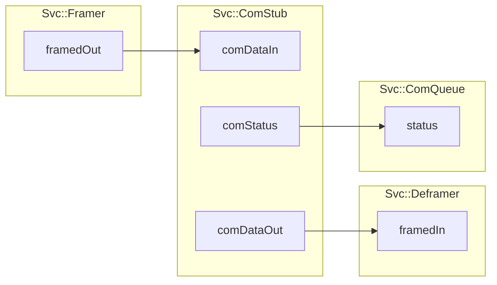
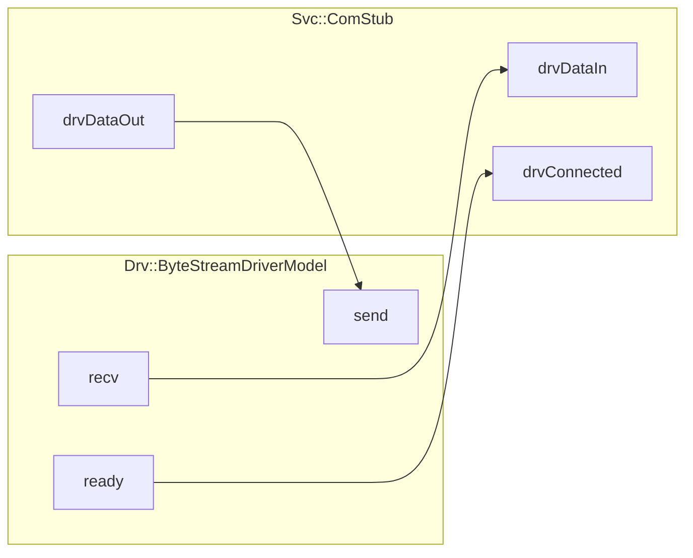

\page SvcComStubComponent Svc::ComStub Component
# Svc::ComStub (Passive Component)

## 1. Introduction

`Svc::ComStub` is an example  F´ component implementing the minimal communication interface required to work within F´.
Projects and users may choose to replace this with a complete communication implementation (i.e. a component managing
a specific radio) once ready. As long as any communication implementation has at-least this same interface it can
drop in and work with the standard F´ uplink and downlink chains.

## 2. Assumptions

Using `Svc::ComStub` directly assumes that the driver layer (e.g. `Drv::TcpClient`) provides all capability needed to
establish communications. In other words, the project communications strategy is `Tcp` then this stub will be
sufficient.  If this assumption does not hold, then the project or user should consider implementing a communication
component with this interface, but matches the specific communication needs (e.g. initializing a radio).

## 3. Requirements

| Requirement     | Description                                                                                                   | Rationale                                                   | Verification Method |
|-----------------|---------------------------------------------------------------------------------------------------------------|-------------------------------------------------------------|---------------------|
| SVC-COMSTUB-001 | `Svc::ComStub` shall accept `Fw::Buffer` for transmission and  pass them to a `Drv::ByteStreamSend` port      | The comm interface must send `Fw::Buffer`s through a driver | Unit Test           |
| SVC-COMSTUB-002 | `Svc::ComStub` shall emit a `Svc::ComStatus::READY` signal on `Drv::ByteStreamSend` success                   | Successful sends must notify any attached `Svc::ComQueue`   | Unit Test           |
| SVC-COMSTUB-003 | `Svc::ComStub` shall emit a `Svc::ComStatus::FAIL` signal on `Drv::ByteStreamSend` failure                    | Failed sends must notify any attached `Svc::ComQueue`       | Unit Test           |
| SVC-COMSTUB-004 | `Svc::ComStub` shall retry sending to `Drv::ByteStreamSend` on `Drv::ByteStreamSend` retry                    | Sends indicating `RETRY` should be retried.                 | Unit Test           |
| SVC-COMSTUB-005 | `Svc::ComStub` shall pass-through `Fw::Buffer` from a  `Drv::ByteStreamRead` on `Drv::ByteStreamSend` success | A Comm interface must receive `Fw::Buffer`s from a driver   | Unit Test           | 

## 4. Design
The diagram below shows the `Svc::ComStub` port interface. Any communications interface implementing or extending this
port interface can be used alongside the other F´ communication components (`Svc::Framer`, `Svc::Deframer`,
`Svc::ComQueue`). This interface is described below.

**Svc::ComStub Uplink and Downlink Interface**

`Svc::ComStub`'s specific implementation delegates to a `Drv::ByteStreamDriverModel` as a way to transmit data and
receive data. Other communication implementations may follow-suite.

### 4.1. Ports

`ComQueue` has the following ports.  The first three ports are required for the interface, the second three are optional
if the communication implementation attaches to an F´ driver for the device interface. i.e. a communication component
may directly interact with device hardware, or it may pass through send and receive buffers to a UART for actual
transmission.

| Required | Kind         | Name           | Port Type             | Usage                                                                             |
|----------|--------------|----------------|-----------------------|-----------------------------------------------------------------------------------|
| Yes      | `sync input` | `comDataIn`    | `Drv.ByteStreamSend`  | Port receiving `Fw::Buffer`s for transmission out `drvDataOut`                    |
| Yes      | `output`     | `comStatus`    | `Svc.ComStatus`       | Port indicating ready or failed to possibly attached `Svc::ComQueue`              |
| Yes      | `output`     | `comDataOut`   | `Drv.ByteStreamRecv`  | Port providing received `Fw::Buffers` to a potential `Svc::Deframer`              |
| No       | `sync input` | `drvConnected` | `Drv.ByteStreamReady` | Port called when the underlying driver has connected                              |
| No       | `sync input` | `drvDataIn`    | `Drv.ByteStreamRecv`  | Port receiving `Fw::Buffers` from underlying communications bus driver            |
| No       | `output`     | `drvDataOut`   | `Drv.ByteStreamSend`  | Port providing received `Fw::Buffers` to the underlying communications bus driver |

### 4.2. State, Configuration, and Runtime Setup

`Svc::ComStub` has no state, no requires external configuration. However, other communication implementations are not
precluded from having state nor requiring configuration. The component uses the standard constructor setup for F´
passive components.

### 4.3. Port Handlers

#### 4.3.1 comDataIn

The `comDataIn` port handler receives an `Fw::Buffer` from the F´ system for transmission to the ground. Typically, it
is connected to the output of the `Svc::Framer` component. In this `Svc::ComStub` implementation, it passes this
`Fw::Buffer` directly to the `drvDataOut` port. It will retry when that port responds with a `RETRY` request. Otherwise, 
 the `comStatus` port will be invoked to indicate success or failure. Retries attempts are limited before the port
asserts.

#### 4.3.1 drvConnected

This port receives the connected signal from the driver and responds with exactly one `READY` invocation to the
`comStatus` port. This starts downlink. This occurs each time the driver reconnects.

#### 4.3.1 drvDataIn

The `drvDataIn` handler receives data read from the driver and supplies it out the `comDataOut` port. It usually is
connected to the `Svc::Deframer` component

## 5. Change Log

| Date       | Description   |
|------------|---------------|
| 2022-07-22 | Initial Draft |
