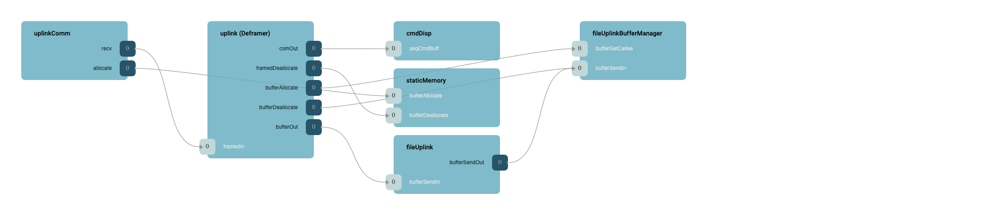
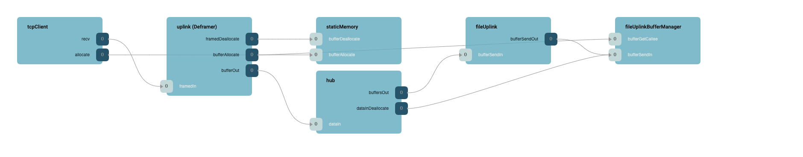
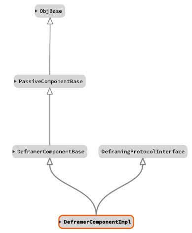

\page SvcDeframer Deframer Component
# Svc::Deframer Deframer Component

Deframer takes a stream of bytes from ground, checks the header and footer, and then extracts message data from the stream. The extracted data usually is passed to the service layer (typically CmdDisp, FileUplink, or a GenericHub). The Deframer uses a `DeframingProtocol` for the same abstraction that the Framer uses `FramingProtocol`. Deframer is backed by a circular buffer such that incomplete messages are reassembled. It also can be hooked up in two ways: 
1. Polling (for drivers without their own thread/scheduling): In this configuration Deframer will poll the driver looking for new data.
2. Callback (for drivers with a thread/scheduling): In this configuration the driver pushes data to the Deframer.

Note: User should hook up only one of the configurations at a time.

## Design
 
1. Deframer will accept incoming buffers.
2. Upon buffer receipt, it will delegate processing to a `DeframingInstance`.
    1. If that delegation returns an error, it will discard the first byte and keep processing.
    2. If that delegation returns need more status, it will accumulate more buffers until it has the size specified, and then rerun the processing.
    3. If that delegation returns success, it will discard `size` bytes and start at the next message.
3. When a `route` call is called-back to the Deframer, it will send the message to the `Fw::Com` output port of the `Fw::Buffer` output port based on the specified type in the route call.
4. If an allocate callback is made, it will delegate that allocation to the bufferAllocate call.
5. If step three is routing to `Fw::Com`, it must pass the buffer to the `bufferDeallocate` port.

## Usage Examples

When Deframer component receives the data from a manager component (typically a service layer such as ground uplinkComm or TcpClient) via polling or a callback, the Deframer will perform the deserialization per `DeframingProtocol` and will transfer the stream via `bufferOut` or `comOut` port to components such as `CmdDisp`, `FileUplink`, or a `GenericHub`.

The following diagram is an example of Deframer usage with and `uplinkComm` component:



The following diagram is an example of Deframer usage with a `TcpClient` and `GenericHub` component:



The following is a typical Deframing setup:

```c++
Svc::FprimeDeframing deframing_obj; // Deframing protocol obj;
Svc::DeframerComponentImpl uplink_obj("Deframer"); // Deframer obj

uplink_obj.init(0);
uplink_obj.setup(deframing_obj);

```

## Class Diagram



## Requirements

| Name | Description | Validation |
|---|---|---|
| TBD | TBD | TBD |

## Change Log

| Date | Description |
|---|---|
| 2021-01-30 | Initial Draft |