\page SvcDeframerComponent Svc::Deframer Component
# Svc::Deframer (Passive Component)

## 1. Introduction

`Svc::Deframer` is a passive component.
It accepts as input a sequence of byte buffers, which
typically come from a ground data system via a
[byte stream driver](../../../Drv/ByteStreamDriverModel/docs/sdd.md).
It interprets the concatenated data of the buffers
as a sequence of uplink frames.
The uplink frames need not be aligned on the
buffer boundaries, and each frame may span one or more buffers.
`Deframer` extracts the frames from the sequence of buffers.
For each complete frame _F_ received, `Deframer`
validates _F_ and extracts a data packet from _F_.
It sends the data packet to another component in the service layer, e.g.,
an instance of [`Svc::CommandDispatcher`](../../CmdDispatcher/docs/sdd.md),
[`Svc::FileUplink`](../../FileUplink/docs/sdd.md),
or [`Svc::GenericHub`](../../GenericHub/docs/sdd.md).

When instantiating Deframer, you must provide an implementation
of [`Svc::DeframingProtocol`](../../FramingProtocol/docs/sdd.md).
This implementation specifies exactly what is
in each frame; typically it is a frame header, a data packet, and a hash value.

On receiving a buffer _FB_ containing framed data, `Deframer`
(1) copies the data from _FB_ into a circular buffer _CB_ owned by `Deframer` and (2)
calls the `deframe` method of the `Svc::DeframingProtocol` implementation,
passing a reference to _CB_ as input.
If _FB_ holds more data than will fit in _CB_,
then `Deframer` repeats this process until _FB_ is empty.
If the protocol implementation reports that the data in _CB_
represents an incomplete frame, then `Deframer` postpones deframing
until the next buffer _FB_ becomes available.

Deframer supports two configurations for streaming data:

1. **Poll:** This configuration works with a passive byte stream driver.
   In this configuration, `Deframer` polls the driver for buffers
   on its `schedIn` cycle.
   No buffer allocation occurs when polling.
   _FB_ is a buffer owned by `Deframer`.

2. **Push:** This configuration works with an active byte stream driver.
   In this configuration the driver invokes a guarded port of `Deframer` to
   send a buffer _FB_ to `Deframer`.
   The invocation transfers ownership of _FB_ from the driver to `Deframer`.
   Deframing occurs on the thread of the byte stream driver.
   `Deframer` deallocates _FB_ before it returns from
   the guarded port call.

## 2. Assumptions

1. For any deployment _D_ that uses an instance _I_ of `Deframer`, the
   deframing protocol used with _I_ matches the uplink protocol of
   any ground system that sends frames to _I_.

1. In any topology _T_, for any instance _I_ of `Deframer` in _T_,
   at any one time, framed data arrives on the poll interface of _I_ or on
   the push interface of _I_, but not on both concurrently.
   The push and poll interfaces are guarded by a mutual exclusion lock,
   so there is no concurrency safety issue.
   However, ordinarily it does not make sense to interleave framed data
   concurrently on two different interfaces.

1. Each frame received by `Deframer` contains an F Prime command packet
   or file packet _P_.
   The first _n_ bytes of the packet hold the packet descriptor value
   `Fw::ComPacket::FW_PACKET_COMMAND` (for a command packet) or
   `Fw::ComPacket::FW_PACKET_FILE` (for a file packet),
   serialized as an unsigned integer in big-endian byte order.
   The number of bytes _n_ matches the size of the type defined by the
   C preprocessor symbol `FwPacketDescriptorType` in the F Prime FSW.

## 3. Requirements

Requirement | Description | Rationale | Verification Method
----------- | ----------- | ----------| -------------------
SVC-DEFRAMER-001 | `Svc::Deframer` shall accept a sequence of byte buffers and interpret their concatenated data as a sequence of uplink frames. | The purpose of the component is to do uplink deframing. | Unit test
SVC-DEFRAMER-002 | `Svc::Deframer` shall accept byte buffers containing uplink frames that are not aligned on a buffer boundary. | For flexibility, we do not require that the frames be aligned on a buffer boundary. | Unit test
SVC-DEFRAMER-003 | `Svc::Deframer` shall accept byte buffers containing uplink frames that span one or more buffers. | For flexibility, we do not require each frame to fit in a single buffer. | Unit test
SVC-DEFRAMER-004 | `Svc::Deframer` shall provide a port interface that a threaded driver can use to push byte buffers to be deframed. | This interface supports applications in which the byte stream driver has its own thread. | Unit test
SVC-DEFRAMER-005 | `Svc::Deframer` shall provide a port interface that Deframer can use to poll for byte buffers to be deframed. | This interface supports applications in which byte stream driver does not have its own thread. | Unit test
SVC-DEFRAMER-006 | If the polling interface is connected, then `Svc::Deframer` shall poll for byte buffers on its `schedIn` port. | This requirement allows the system scheduler to drive the periodic polling. | Unit test
SVC-DEFRAMER-007 | `Svc::Deframer` shall use an instance of `Svc::DeframingProtocol`, supplied when the component is instantiated, to validate the frames and extract their packet data. | Using the `Svc::DeframingProtocol` interface allows the same Deframer component to operate with different protocols. | Unit test
SVC-DEFRAMER-008 | `Svc::Deframer` shall interpret the initial bytes of the packet data as a value of type `FwPacketDescriptorType`. | `FwPacketDescriptorType` is the type of an F Prime packet descriptor. The size of the type is configurable in the F Prime framework. | Test
SVC-DEFRAMER-009 | `Svc::Deframer` shall extract and send packets with the following types: `Fw::ComPacket::FW_PACKET_COMMAND`, `Fw::ComPacket::FW_PACKET_FILE`. | These are the packet types used for uplink. | Unit test
SVC-DEFRAMER-010 | `Svc::Deframer` shall send command packets and file packets on separate ports. | Command packets and file packets are typically handled by different components. | Unit test
SVC-DEFRAMER-011 | `Svc::Deframer` shall operate nominally when its port for sending file packets is unconnected, even if it receives a frame containing a file packet. | Some applications do not use file uplink. Sending a file uplink packet to `Deframer` should not crash the application because of an unconnected port. | Unit test

## 4. Design

### 4.1. Component Diagram

The diagram below shows the `Deframer` component.

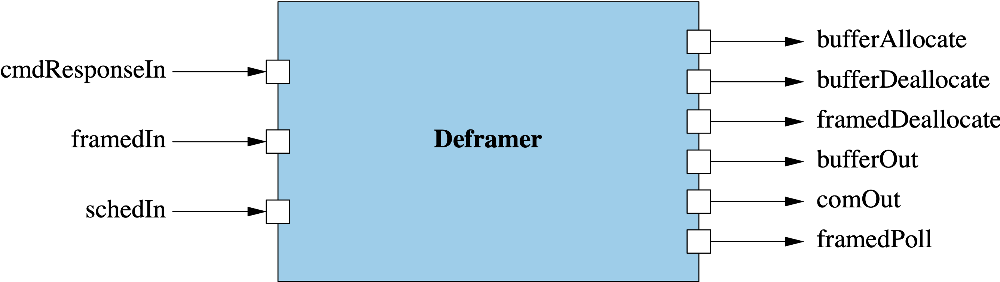

### 4.2. Ports

`Deframer` has the following ports:

| Kind | Name | Port Type | Usage |
|------|------|-----------|-------|
| `guarded input` | `framedIn` | `Drv.ByteStreamRecv` | Port for receiving frame buffers FB pushed from the byte stream driver. After using a buffer FB received on this port, Deframer deallocates it by invoking framedDeallocate.|
| `output` | `framedDeallocate` | `Fw.BufferSend` | Port for deallocating buffers received on framedIn. |
| `guarded input` | `schedIn` | `Svc.Sched` | Schedule in port, driven by a rate group.|
| `output` | `framedPoll` | `Drv.ByteStreamPoll` | Port that polls for data from the byte stream driver. Deframer invokes this port on its schedIn cycle, if it is connected. No allocation or occurs when invoking this port. The data transfer uses a pre-allocated frame buffer owned by Deframer. |
| `output` | `bufferAllocate` | `Fw.BufferGet` | Port for allocating Fw::Buffer objects from a buffer manager. When Deframer invokes this port, it receives a packet buffer PB and takes ownership of it. It uses PB internally for deframing. Then one of two things happens:  1. PB contains a file packet, which Deframer sends on bufferOut. In this case ownership of PB passes to the receiver.  2. PB does not contain a file packet, or bufferOut is unconnected. In this case Deframer deallocates PB on bufferDeallocate. |
| `output` | `bufferOut` | `Fw.BufferSend` | Port for sending file packets (case 1 above). The file packets are wrapped in Fw::Buffer objects allocated with bufferAllocate. Ownership of the Fw::Buffer passes to the receiver, which is responsible for the deallocation. |
| `output` | `bufferDeallocate` | `Fw.BufferSend` | Port for deallocating temporary buffers allocated with bufferAllocate (case 2 above). Deallocation occurs here when there is nothing to send on bufferOut. |
| `output` | `comOut` | `Fw.Com` | Port for sending command packets as Com buffers. |
| `sync input` | `cmdResponseIn` | `Fw.CmdResponse` | Port for receiving command responses from a command dispatcher. Invoking this port does nothing. The port exists to allow the matching connection in the topology. |

### 4.3. Derived Classes

`Deframer` is derived from `DeframerComponentBase` as usual.
It is also derived (via C++ multiple inheritance) from
[`Svc::DeframingProtocolInterface`](../../FramingProtocol/docs/sdd.md).
The multiple inheritance makes the `Deframer` instance into the
instance of `Svc::DeframingProtocolInterface` that is required
to use `Svc::DeframingProtocol`.
See <a href="#dpi-impl">below</a> for a description of how `Deframer` implements
`DeframingProtocolInterface`.

Here is a class diagram for `Deframer`:

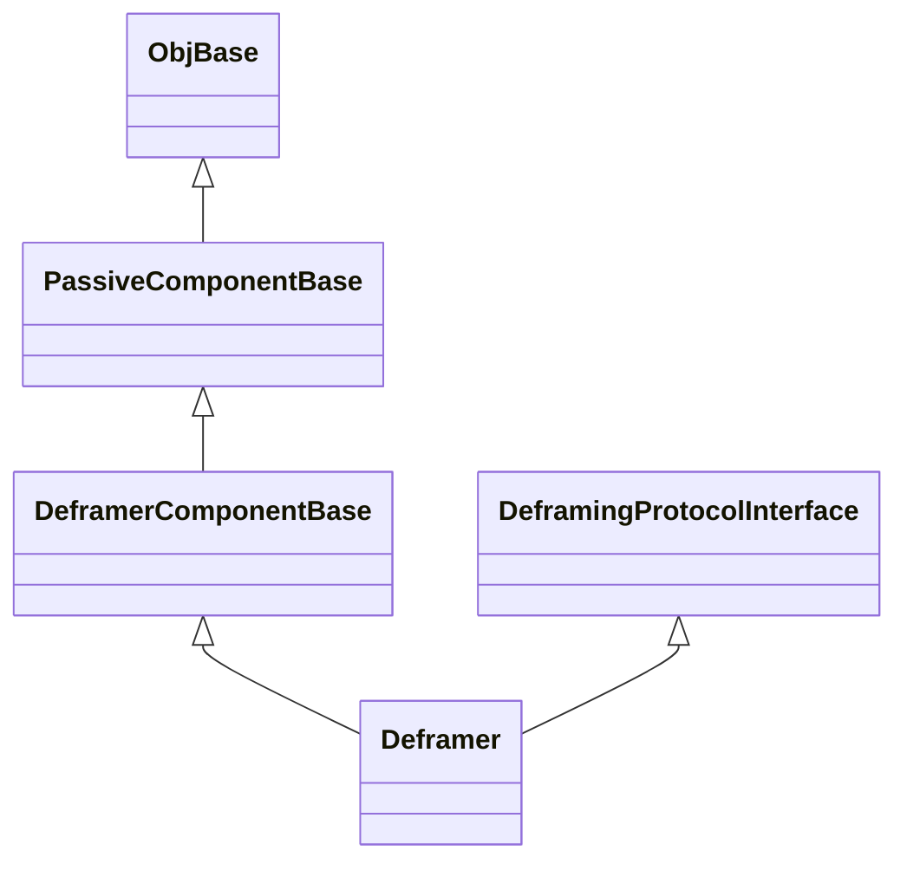

### 4.4. State

`Deframer` maintains the following state:

1. `m_protocol`: A pointer to the implementation of `DeframingProtocol`
   used for deframing.

1. `m_inRing`: An instance of `Types::CircularBuffer` for storing data to be deframed.

1. `m_ringBuffer`: The storage backing the circular buffer: an array of `RING_BUFFER_SIZE`
`U8` values.

1. `m_pollBuffer`: The buffer used for polling input: an array of 1024 `POLL_BUFFER_SIZE`
values.

### 4.5. Header File Configuration

The `Deframer` header file provides the following configurable constants:

1. `Svc::Deframer::RING_BUFFER_SIZE`: The size of the circular buffer.
The capacity of the circular buffer must be large enough to hold a
complete frame.

1. `Svc::Deframer::POLL_BUFFER_SIZE`: The size of the buffer used for polling data.

### 4.6. Runtime Setup

To set up an instance of `Deframer`, you do the following:

1. Call the constructor and the `init` method in the usual way
for an F Prime passive component.

1. Call the `setup` method, passing in an instance _P_ of `Svc::DeframingProtocol`.
The `setup` method does the following:

   1. Store a pointer to _P_ in `m_protocol`.

   1. Pass `*this` into the setup method for _P_.
      As noted <a href="#derived-classes">above</a>, `*this`
      is the instance of `Svc::DeframingProtocolInterface`
      used by _P_.

For an example of setting up a `Deframer` instance, see the
`uplink` instance in [`Ref/Top/instances.fpp`](../../../Ref/Top/instances.fpp).

### 4.7. Port Handlers

#### 4.7.1. framedIn

The `framedIn` port handler receives an `Fw::Buffer` _FB_ and a receive status _S_.
It does the following:

1. If _S_ = `RECV_OK`, then call
   <a href="#processBuffer">`processBuffer`</a>, passing in _FB_.

2. Deallocate _FB_ by invoking `framedDeallocate`.

#### 4.7.2. schedIn

The `schedIn` port handler does the following:

1. Construct an `Fw::Buffer` _FB_ that wraps `m_pollBuffer`.

1. If `framedPoll` is connected, then

   1. Invoke `framedPollOut`, passing in _FB_, to poll for new data.

   1. If new data is available, then call
       <a href="#processBuffer">`processBuffer`</a>, passing in _FB_.

#### 4.7.3. cmdResponseIn

The `cmdResponseIn` handler does nothing.
It exists to provide the necessary symmetry in the topology
(every component that sends a command to the dispatcher should
accept a matching response).

### 4.8. Implementation of Svc::DeframingProtocolInterface

#### 4.8.1. allocate

The implementation of `allocate` invokes `bufferAllocate`.

#### 4.8.2. route

The implementation of `route` takes a reference to an
`Fw::Buffer` _PB_ (a packet buffer) and does the following:

1. Set `deallocate = true`.

1. Let _N_ = `sizeof(FwPacketDescriptorType)`.
Deserialize the first _N_ bytes of _PB_ as a value of type
`FwPacketDescriptorType`.

1. If the deserialization succeeds, then switch on the packet type _T_.

   1. If _T_ = `FW_PACKET_COMMAND`, then send the contents
      of _PB_ as a Com buffer on `comOut`.

   1. Otherwise if _T_ = `FW_PACKET_FILE` and `bufferOut` is connected,
      then

      1. Shift the pointer of _PB_ _N_ bytes forward and
         reduce the size of _PB_ by _N_ to skip the packet type.
         This step is necessary to accommodate the `FileUplink` component.

      1. Send _B_ on `bufferOut`.

      1. Set `deallocate = false`. This step causes ownership
         of the buffer to pass to the receiver.

1. If `deallocate = true`, then invoke `bufferDeallocate`
   to deallocate _PB_.

### 4.9. Helper Functions

#### 4.9.1. processBuffer

`processBuffer` accepts a reference to an `Fw::Buffer` _FB_
(a frame buffer).
It does the following:

1. Set `buffer_offset` = 0.

1. Set _S_ = `buffer.getSize()`.

1. In a bounded loop, while `buffer_offset` < _S_, do:

   1. Compute the amount of remaining data in _FB_.
      This is _R_ = _S_ - `buffer_offset`.

   1. Compute _C_, the number of bytes to copy from _FB_ into the
      circular buffer `m_inRing`.

      1. Let _F_ be the number of free bytes in `m_inRing`.

      1. If _R_ < _F_, then _C_ = _R_.

      1. Otherwise _C_ = _F_.

   1. Copy _C_ bytes from _FB_ starting at `buffer_offset`
      into `m_inRing`.

   1. Advance `buffer_offset` by _C_.

   1. Call <a href="#processRing">`processRing`</a>
      to process the data stored in `m_inRing`.

#### 4.9.2. processRing

In a bounded loop, while there is data remaining in `m_inRing`, do:

1. Call the `deframe` method of `m_protocol` on `m_inRing`.
   The `deframe` method calls <a href="#allocate">`allocate`</a> and
   <a href="#route">`route`</a> as necessary.
   It returns a status value _S_ and the number _N_ of bytes
   needed for successful deframing.

1. If _S_ = `SUCCESS`, then _N_ represents the number of bytes
   used in a successful deframing. Rotate `m_inRing` by _N_ bytes (i.e.,
   deallocate _N_ bytes from the head of `m_inRing`).

1. Otherwise if _S_ = `MORE_NEEDED`, then do nothing.
   Further processing will occur on the next call, after more
   data goes into `m_inRing`.

1. Otherwise something is wrong.
   Rotate `m_inRing` by one byte, to skip byte by byte over
   bad data until we find a valid frame.

## 5. Ground Interface

None.

## 6. Example Uses

### 6.1. Topology Diagrams

The following topology diagrams show how to connect `Svc::Deframer`
to a byte stream driver, a command dispatcher, and a file uplink component.
The diagrams use the following instances:

* `activeComm`: An active instance of
[`Drv::ByteStreamDriverModel`](../../../Drv/ByteStreamDriverModel/docs/sdd.md), for example,
[`Drv::TcpClient`](../../../Drv/TcpClient/docs/sdd.md).

* `buffMgr`: An instance of [`Svc::BufferManager`](../../BufferManager/docs/sdd.md)

* `cmdDisp`: An instance of [`Svc::CommandDispatcher`](../../CmdDispatcher/docs/sdd.md)

* `deframer`: An instance of `Svc::Deframer`.

* `fileUplink`: An instance of [`Svc::FileUplink`](../../FileUplink/docs/sdd.md).

* `passiveComm`: A passive instance of
[`Drv::ByteStreamDriverModel`](../../../Drv/ByteStreamDriverModel/docs/sdd.md).

* `rateGroup`: An instance of [`Svc::ActiveRateGroup`](../../ActiveRateGroup/docs/sdd.md).

Topologies 1a and 1b are alternate topologies.
You should use one or the other.
In topology 3, the `fileUplink` instance and its connections are
optional.

**Topology 1a: Buffers containing framed data (active byte stream driver):**

**Topology 1b: Buffers containing framed data (passive byte stream driver):**

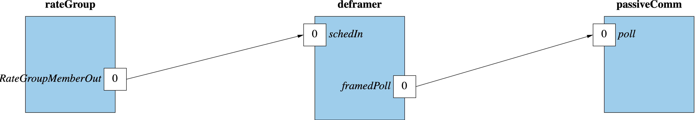

Revise the port number of `rateGroup.RateGroupMemberOut` as
appropriate for your application.

**Topology 2: Command packets and command responses:**

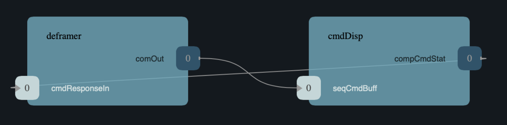

Revise the port numbers of `cmdDisp.seqCmdBuff` and
`cmdDisp.compCmdStat` as appropriate for your application.
If you model your topology in FPP, then FPP can automatically
assign these numbers.

**Topology 3: Buffers containing packet data:**

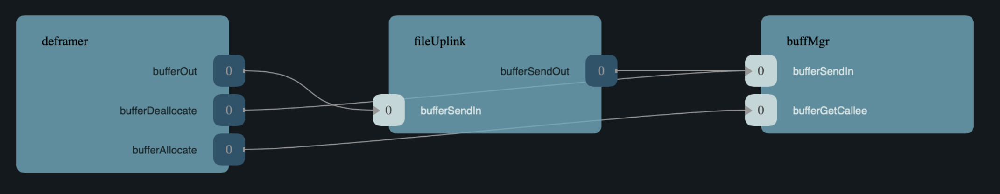

### 6.2. Sequence Diagrams

#### 6.2.1. Active Byte Stream Driver

**Sending a command packet:**
The following sequence diagram shows what happens when `activeComm`
sends data to `deframer`, and `deframer`
decodes the data into a command packet.
Open vertical rectangles represent threads.
Vertical dashed lines represent component code.
Solid horizontal arrows represent synchronous port invocations, and open
horizontal arrows represent asynchronous port invocations.

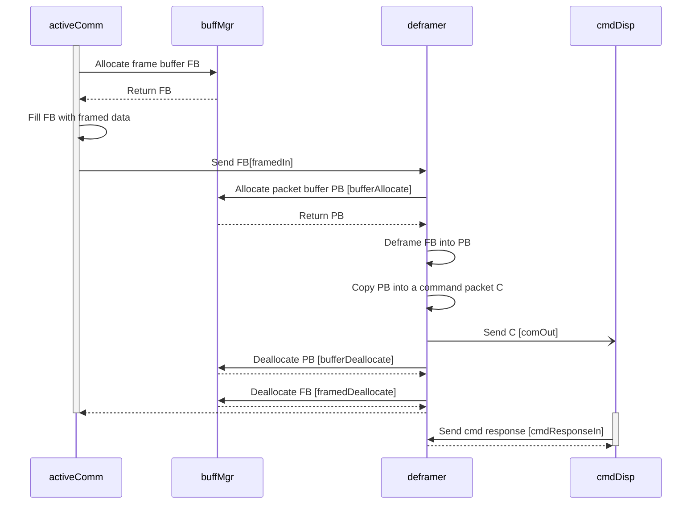

**Sending a file packet:**
The following sequence diagram shows what happens when `activeComm`
sends data to `deframer`, and `deframer` decodes the data into a file packet.

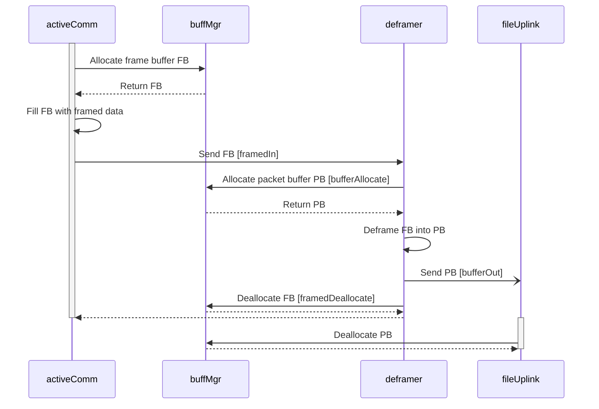

#### 6.2.2. Passive Byte Stream Driver

**Sending a command packet:** The following sequence diagram shows what
happens when `passiveComm` sends data to `deframer`, and
`deframer` decodes the data into a command packet.

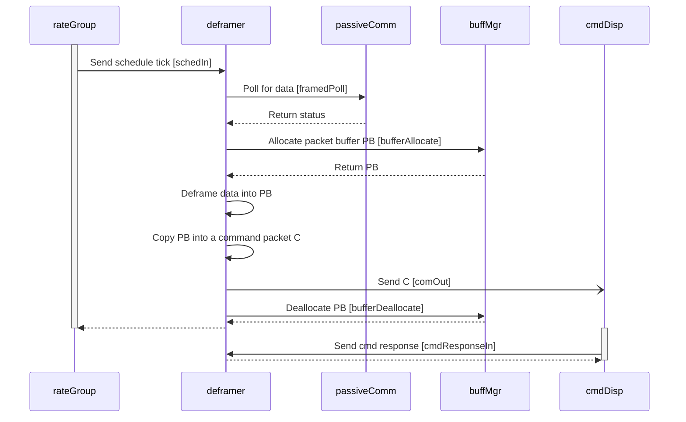

**Sending a file packet:** The following sequence diagram shows what
happens when `passiveComm` sends data to `deframer`, and
`Deframer` decodes the data into a file packet.

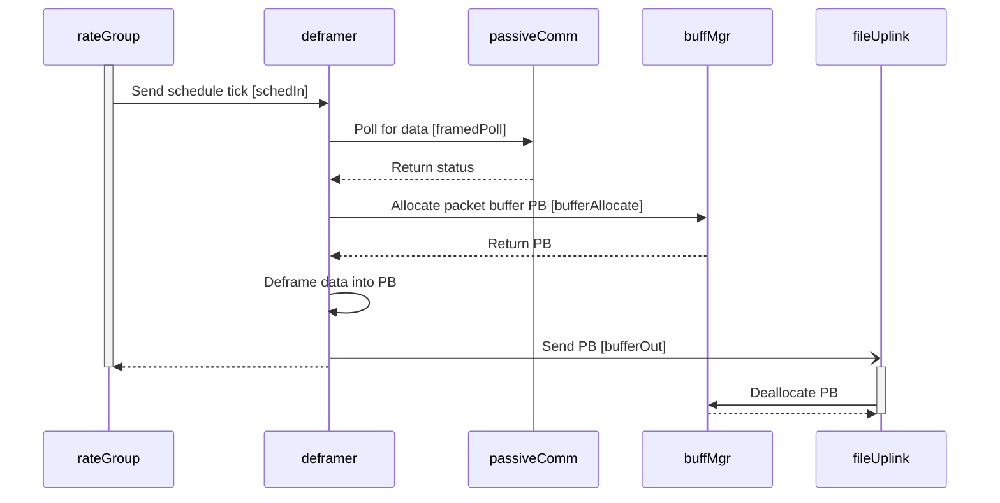

### 6.3. Using Svc::GenericHub

You can use `Deframer` with an instance of
[`Svc::GenericHub`](../../GenericHub/docs/sdd.md) to send deframed
command packets and file packets across a network connection, instead of
directly to a command dispatcher or file uplink component.
To send deframed packets this way, do the following:

1. In the topology described <a href="#top-diagrams">above</a>,
instead of the `cmdDisp` and `fileUplink` instances, use an
instance `hub` of type `Svc::GenericHub`.

1. Revise topologies 2 and 3 as shown below.

**Topology 2: Command packets**

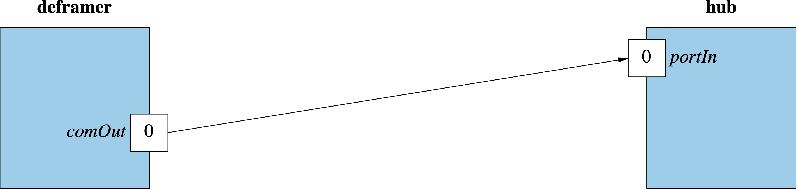

Revise the port number of `hub.portIn` as appropriate for your application.

**Topology 3: Buffers containing packet data**

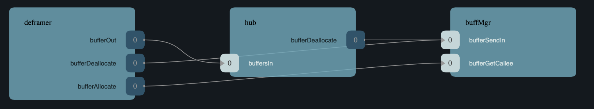

Revise the port number of `hub.buffersIn` as appropriate for your application.
When `hub` receives a buffer on `buffersIn`, it copies the data across
the connection to the other hub and deallocates the buffer.

If you don't need to transmit file packets across the hub, then you can
omit the `hub` connections shown in this topology.

## 7. Change Log

| Date | Description |
|---|---|
| 2021-01-30 | Initial Draft |
| 2022-04-04 | Revised |
