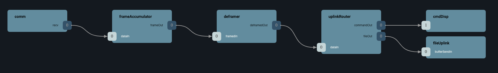
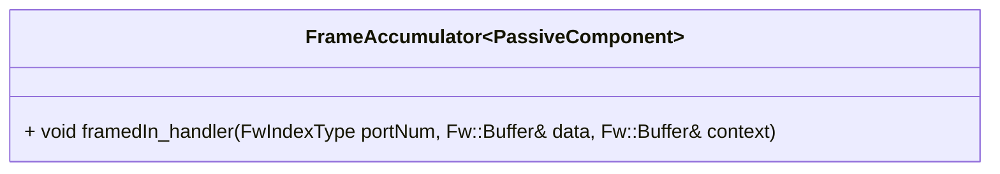

# Svc::Deframer

The `Svc::Deframer` component receives F´ frames, takes off the header and trailer, and passes the payload to other components of the system.

## Internals

The `Svc::Deframer` component is an implementation of the [DeframerInterface](../../Interfaces/DeframerInterface.fppi) for the F´ communications protocol. It receives an F´ frame (in a [Fw::Buffer](../../../Fw/Buffer/docs/sdd.md) object) on its `framedIn` input port, modifies the input buffer to remove the header and trailer, and sends it out through its `deframedOut` output port.

The `Svc::Deframer` component does not perform any validation of the frame. It is expected that the frame is valid and well-formed. The validation should be performed by an upstream component, such as [`Svc::FrameAccumulator`](../../FrameAccumulator/docs/sdd.md).

The `Svc::Deframer` does not support deframing multiple packets in a single frame (i.e. concatenated packets) as this is not supported by the F´ communications protocol.

## Usage Examples

The `Svc::Deframer` component is used in the uplink stack of many reference F´ application such as [the tutorials source code](https://github.com/fprime-community#tutorials).

## Diagrams

The below diagram shows a typical configuration in which the `Svc::Deframer` can be used. This is the configuration used in the [the tutorials source code](https://github.com/fprime-community#tutorials). It is receiving accumulated frames from a [Svc::FrameAccumulator](../../FrameAccumulator/docs/sdd.md) and passes packets to a [Svc::Router](../../Router/docs/sdd.md) for routing to other components.

## Class Diagram

```mermaid
classDiagram
    class FrameAccumulator~PassiveComponent~ {
        + void framedIn_handler(FwIndexType portNum, Fw::Buffer& data, Fw::Buffer& context)
    }
```

## Requirements

Requirement | Description | Rationale | Verification Method
----------- | ----------- | ----------| -------------------
SVC-DEFRAMER-001 | `Svc::Deframer` shall remove the header and trailer from and F´ frame | Purpose of the component | Unit test |

## Port Descriptions

| Kind | Name | Type | Description |
|---|---|---|---|
| `guarded input` | framedIn | `Fw.DataWithContext` | Receives a frame with optional context data |
| `output` | deframedOut | `Fw.DataWithContext` | Receives a frame with optional context data |
