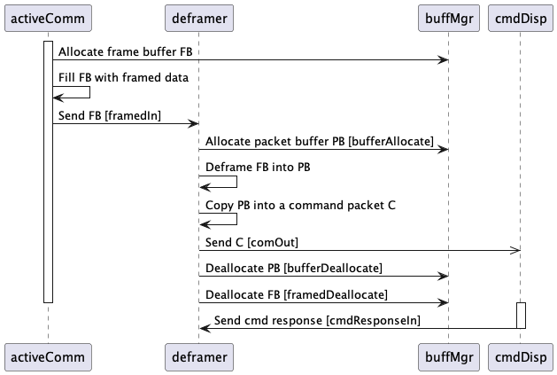
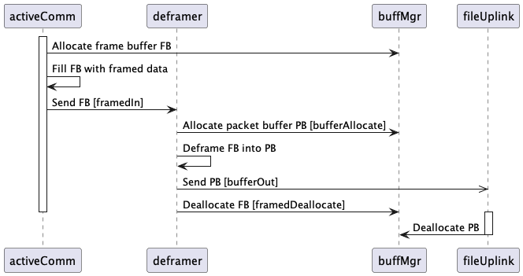

\page SvcDeframer Deframer Component

# Svc::Deframer (Passive Component)

## 1. Introduction

`Svc::Deframer` is a passive component.
It accepts as input a sequence of byte buffers, which
typically come from a ground data system via a
[byte stream driver](../../../Drv/ByteStreamDriverModel/docs/sdd.md).
It interprets the concatenated data of the buffers
as a sequence of uplink frames.
The uplink frames need not be aligned on the
buffer boundaries, and each frame may span one or more buffers.
For each complete frame _F_ received, `Deframer`
validates _F_ and extracts a data packet from _F_.
It sends the data packet to another component in the service layer, e.g., 
an instance of [`Svc::CommandDispatcher`](../../CmdDispatcher/docs/sdd.md),
[`Svc::FileUplink`](../../FileUplink/docs/sdd.md),
or [`Svc::GenericHub`](../../GenericHub/docs/sdd.md).

When instantiating Deframer, you must provide an implementation
of [`Svc::DeframingProtocol`](../../FramingProtocol/docs/sdd.md).
This implementation specifies exactly what is
in each frame; typically it is a frame header, a data packet, and a hash value.
By instantiating `Svc::Framer` with a matching implementation of
`Svc::FramingProtocol`, you will get matching framing (for downlink)
and deframing (for uplink).

On receiving a buffer _F_ containing framed data, `Deframer` 
(1) copies the data from _F_ into a circular buffer _CB_ owned by `Deframer` and (2)
calls the `deframe` method of the `Svc::DeframingProtocol` implementation,
passing a reference to _CB_ as input.
If _F_ holds more data than will fit in _CB_,
then `Deframer` repeats this process until _F_ is empty.
If the protocol implementation reports that it needs more data
than is available in _F_,
then `Deframer` defers deframing until the next buffer is available.

Deframer supports two configurations for streaming data:

1. **Poll:** This configuration works with a passive byte stream driver.
   In this configuration, `Deframer` polls the driver for buffers
   on its `schedIn` cycle.
   No buffer allocation occurs when polling.
   The polling uses a 1024-byte buffer owned by `Deframer`.

2. **Push:** This configuration works with an active byte stream driver.
   In this configuration the driver pushes buffers to the Deframer.
   The Deframer takes ownership of each buffer _F_ that it receives.
   It deallocates _F_ when it is finished processing the data in _F_.

## 2. Assumptions

1. If you use `Deframer` together with `Svc::Framer`, then the deframing
protocol used with `Deframer` (a)
must match the framing protocol used with `Framer` and (b) must match
the protocol used by the ground data system.

1. In any topology that uses an instance _D_ of `Deframer`, you must connect
the poll interface of _D_ or the push interface of _D_, but not both.

## 3. Requirements

Requirement | Description | Rationale | Verification Method
----------- | ----------- | ----------| -------------------
SVC-DEFRAMER-001 | `Svc::Deframer` shall accept a sequence of byte buffers and interpret their concatenated data as a sequence of uplink frames. | The purpose of the component is to do uplink deframing. | Test
SVC-DEFRAMER-002 | `Svc::Deframer` shall accept byte buffers containing uplink frames that are not aligned on a buffer boundary. | For flexibility, we do not require that the frames be aligned on a buffer boundary. | Test
SVC-DEFRAMER-003 | `Svc::Deframer` shall accept byte buffers containing uplink frames that span one or more buffers. | For flexibility, we do not require each frame to fit in a single buffer. | Test
SVC-DEFRAMER-004 | `Svc::Deframer` shall provide a port interface for pushing the byte buffers to be deframed. | This interface supports applications in which the byte stream driver has its own thread. | Test
SVC-DEFRAMER-005 | `Svc::Deframer` shall provide a port interface for polling for byte buffers to be deframed. | This interface supports the applications in which that byte stream driver does not have its own thread. | Test
SVC-DEFRAMER-006 | If the polling interface is connected, then `Svc::Deframer` shall poll for byte buffers on its `schedIn` port. | This requirement allows the system scheduler to drive the periodic polling. | Test
SVC-DEFRAMER-007 | `Svc::Deframer` shall use an instance of `Svc::DeframingProtocol`, supplied when the component is instantiated, to validate the frames and extract their packet data. | Using the `Svc::DeframingProtocol` interface provides flexibility and ensures that the deframing protocol matches the framing protocol. | Test
SVC-DEFRAMER-008 | `Svc::Deframer` shall interpret the first four bytes of the packet data as a 32-bit signed integer holding the packet type. | 32 bits should be enough to hold any packet type. Fixing the size at 32 bits keeps the implementation simple. | Test
SVC-DEFRAMER-009 | `Svc::Deframer` shall extract and send packets with the following types: `Fw::ComPacket::FW_PACKET_COMMAND`, `Fw::ComPacket::FW_PACKET_FILE`. | These are the packet types used for uplink. | Test
SVC-DEFRAMER-010 | `Svc::Deframer` shall send command packets and file packets on separate ports. | Command packets and file packets are typically handled by different components. | Test
SVC-DEFRAMER-011 | `Svc::Deframer` shall operate nominally when its port for sending file packets is unconnected, even if it receives a frame containing a file packet. | Some applications do not use file uplink. Sending a file uplink packet to `Deframer` should not crash the application because of an unconnected port. | Test

### 3.1. Component Diagram

The diagram below shows the `Deframer` component.

### 3.2. Ports

`Deframer` has the following ports:

| Kind | Name | Port Type | Usage |
|------|------|-----------|-------|
| `guarded input` | `framedIn` | `Drv.ByteStreamRecv` | Port for receiving data pushed from the byte stream driver. After using a buffer received on this port, Deframer deallocates it by invoking framedDeallocate. _TBD: Why is this port guarded? By assumption framedIn and framedPoll should never both be connected._ |
| `output` | `framedDeallocate` | `Fw.BufferSend` | Port for deallocating buffers received on framedIn. |
| `guarded input` | `schedIn` | `Svc.Sched` | Schedule in port, driven by a rate group. _TBD: Why is this port guarded? By assumption framedIn and framedPoll should never both be connected._ |
| `output` | `framedPoll` | `Drv.ByteStreamPoll` | Port that polls for data from the byte stream driver. Deframer invokes this port on its schedIn cycle, if it is connected. No allocation or occurs when invoking this port. The data transfer uses a 1024-byte pre-allocated buffer owned by Deframer. |
| `output` | `bufferAllocate` | `Fw.BufferGet` | Port for allocating Fw::Buffer objects from a buffer manager. When Deframer invokes this port, it receives a buffer B and takes ownership of it. It uses B internally for deframing. Then one of two things happens:  1. B contains a file packet, which Deframer sends on bufferOut. In this case ownership of B passes to the receiver.  2. B does not contain a file packet, or bufferOut is unconnected. In this case Deframer deallocates B on bufferDeallocate. |
| `output` | `bufferOut` | `Fw.BufferSend` | Port for sending file packets (case 1 above). The file packets are wrapped in Fw::Buffer objects allocated with bufferAllocate. Ownership of the Fw::Buffer passes to the receiver, which is responsible for the deallocation. |
| `output` | `bufferDeallocate` | `Fw.BufferSend` | Port for deallocating temporary buffers allocated with bufferAllocate (case 2 above). Deallocation occurs here when there is nothing to send on bufferOut. |
| `output` | `comOut` | `Fw.Com` | Port for sending command packets as Com buffers to the command dispatcher. |
| `sync input` | `cmdResponseIn` | `Fw.CmdResponse` | Port for receiving command responses from the command dispatcher. Invoking this port does nothing. The port exists to allow the matching connection in the topology. |

### 3.3. Derived Classes

`Deframer` is derived from `DeframerComponentBase` as usual.
It is also derived (via C++ multiple inheritance) from 
[`Svc::DeframingProtocolInterface`](../../FramingProtocol/docs/sdd.md).
The multiple inheritance makes the `Deframer` instance into the
instance of `Svc::DeframingProtocolInterface` that is required
to use `Svc::DeframingProtocol`.
See <a href="#dpi-impl">below</a> for a description of how `Deframer` implements
`DeframingProtocolInterface`.

Here is a class diagram for `Deframer`:

### 3.4. State

`Deframer` maintains the following state:

1. `m_protocol`: A pointer to the implementation of `DeframingProtocol`
   used for deframing.

1. `m_in_ring`: An instance of `Types::CircularBuffer` for storing data to be deframed.

1. `m_ring_buffer`: The storage backing the circular buffer: an array of 1024 `U8` values.

1. `m_poll_buffer`: The buffer used for polling input: an array of 1024 `U8` values.

### 3.5. Setup

To set up an instance of `Deframer`, you do the following:

1. Call the constructor and the `init` method in the usual way
for an F Prime passive component.

1. Call the `setup` method and passing in an instance _P_ of `Svc::DeframingProtocol`.
The `setup` method does the following:

   1. Store a pointer to _P_ in `m_protocol`.

   1. Pass `*this` into the setup method for _P_.
      As noted <a href="#derived-classes">above</a>, `*this`
      is the instance of `Svc::DeframingProtocolInterface`
      used by _P_.

For an example of setting up a `Deframer` instance, see the
`uplink` instance in [`Ref/Top/instances.fpp`](../../../Ref/Top/instances.fpp).

### 3.6. Port Handlers

#### 3.6.1. framedIn

The `framedIn` port handler receives an `Fw::Buffer` _F_ and a receive status _S_.
It does the following:

1. If _S_ = `RECV_OK`, then call
   <a href="#processBuffer">`processBuffer`</a>, passing in _F_.

2. Deallocate _F_ by invoking `framedDeallocate`.

_TBD: It seems to me that the `framedIn` handler should assert that 
framedPoll is not connected, since we are supposed to use one or the other._

#### 3.6.2. schedIn

The `schedIn` port handler does the following:

1. Construct an `Fw::Buffer` _F_ that wraps `m_poll_buffer`.
   _TBD: B could be a component member, or it could move into the conditional._

1. If `framedPoll` is connected, then 

   1. Invoke `framedPollOut`, passing in _F_, to poll for new data.

   1. If new data is available, then call 
       <a href="#processBuffer">`processBuffer`</a>, passing in _B_.

_TBD: It seems to me that the `schedIn` handler should assert that
`framedIn` is not connected, since we are supposed to use one or the other._

#### 3.6.3. cmdResponseIn

The `cmdResponseIn` handler does nothing.
It exists to provide the necessary symmetry in the topology
(every component that sends a command to the dispatcher should
accept a matching response).

### 3.7. Implementation of Svc::DeframingProtocolInterface

#### 3.7.1. allocate

The implementation of `allocate` invokes `bufferAllocate`.

#### 3.7.2. route

The implementation of `route` takes a reference to an
`Fw::Buffer` _B_ and does the following:

1. Set `deallocate = true`.

1. Deserialize the first four bytes of _B_ as an `I32` packet type.

1. If the deserialization succeeds, then switch on the packet type _P_.

   1. If _P_ = `FW_PACKET_COMMAND`, then send the contents
      of _B_ as a Com buffer on `comOut`.

   1. Otherwise if _P_ = `FW_PACKET_FILE` and `bufferOut` is connected,
      then

      1. Shift the pointer of _B_ four bytes forward and
         reduce the size of _B_ by four to skip the size.

      1. Send _B_ on `bufferOut`.

      1. Set `deallocate = false`. This step causes ownership
         of the buffer to pass to the receiver.

1. If `deallocate = true`, then invoke `bufferDeallocate`
   to deallocate _B_.

### 3.8. Helper Functions

#### 3.8.1. processBuffer

`processBuffer` accepts a reference to an `Fw::Buffer` _B_.
It does the following:

1. Set `buffer_offset` = 0.

1. Set _S_ = `buffer.getSize()`.

1. In a bounded loop, while `buffer_offset` < _S_, do:

   1. Compute the amount of remaining data in _B_.
      This is _R_ = _S_ - `buffer_offset`.

   1. Compute _C_, the number of bytes to copy from _B_ into the
      circular buffer `m_in_ring`.

      1. Let _F_ be the number of free bytes in `m_in_ring`.
      
      1. If _R_ < _F_, then _C_ = _R_.
      
      1. Otherwise _C_ = _F_.
      
   1. Copy _C_ bytes from _B_ starting at `buffer_offset`
      into `m_in_ring`.

   1. Advance `buffer_offset` by _C_.

   1. Call <a href="#processRing">`processRing`</a>
      to process the data stored in `m_in_ring`.

_TBD: The assertion at the end of the loop doesn't look right.
I don't see how the condition can ever fail._

#### 3.8.2. processRing

In a bounded loop, while there is data remaining in `m_in_ring`, do:

1. Call the `deframe` method of `m_protocol` on `m_in_ring`.
   The `deframe` method calls <a href="#allocate">`allocate`</a> and
   <a href="#route">`route`</a> as necessary.
   It returns a status value _S_ and the number _N_ of bytes
   needed for successful deframing.

1. If _S_ = `SUCCESS`, then _N_ represents the number of bytes
   used in a successful deframing. Rotate `m_in_ring` by _N_ bytes (i.e.,
   deallocate _N_ bytes from the head of `m_in_ring`).

1. Otherwise if _S_ = `MORE_NEEDED`, then do nothing.
   Further processing will occur on the next call, after more
   data goes into `m_in_ring`.

1. Otherwise something is wrong.
   Rotate `m_in_ring` by one byte, to skip byte by byte over
   bad data until we find a valid frame.

### 3.9. Commands, Telemetry, Events, and Parameters

None.

## 4. Example Uses

### 4.1. With an Active Byte Stream Driver

#### 4.1.1. Sending a Command Packet

The following sequence diagram shows the steps that occur when an
active byte stream driver sends data to `Deframer`, and `Deframer`
decodes the data into a command packet.
Vertical bars represent threads.
Solid arrows represent synchronous port calls, and open arrows
represent asynchronous port calls.

#### 4.1.2. Sending a File Packet

The following sequence diagram shows the steps that occur when an
active byte stream driver sends data to `Deframer`, and `Deframer`
decodes the data into a file packet.

### 4.2. With a Passive Byte Stream Driver

#### 4.2.1. Sending a Command Packet

The following sequence diagram shows the steps that occur when an
active byte stream driver sends data to `Deframer`, and `Deframer`
decodes the data into a command packet.

#### 4.2.2. Sending a File Packet

TODO

## 5. Change Log

| Date | Description |
|---|---|
| 2021-01-30 | Initial Draft |
| 2022-03-28 | Revised |
