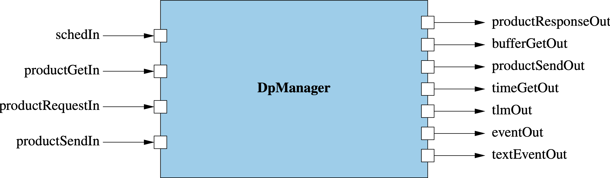
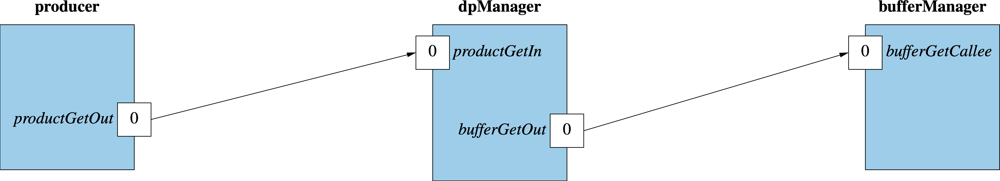
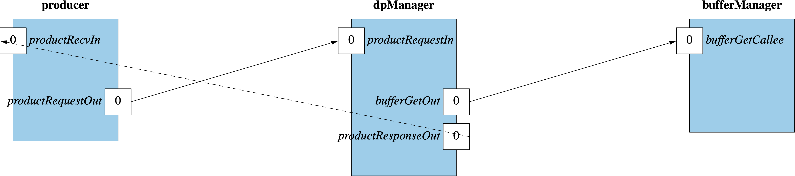
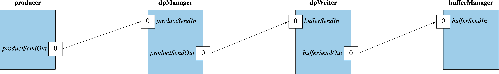
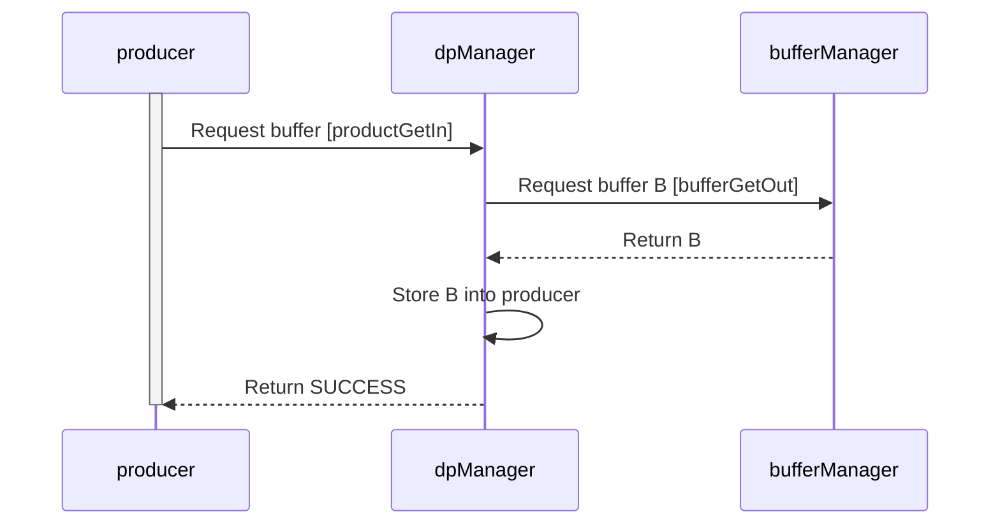
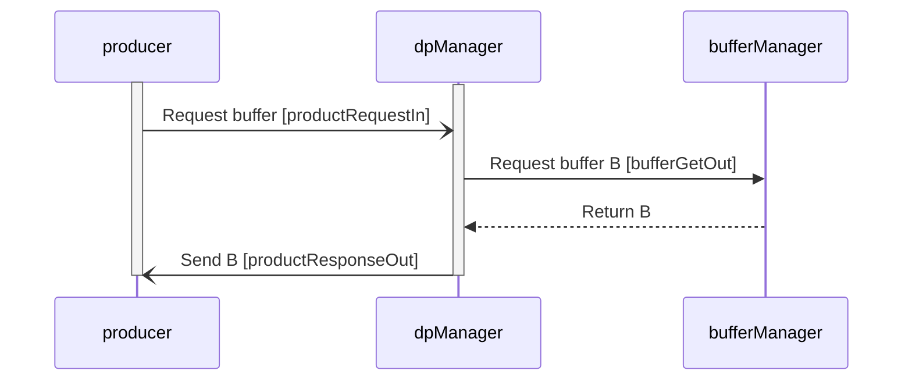
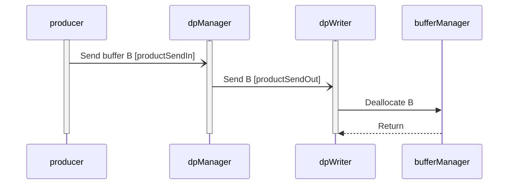

\page SvcDpManagerComponent Svc::DpManager Component
# Svc::DpManager (Active Component)

## 1. Introduction

`Svc::DpManager` is an active component for managing data products.
It does the following:

1. Receive requests for buffers to hold data products.

   1.  When a client component synchronously requests a data product buffer,
       request an [`Fw::Buffer`](../../../Fw/Buffer/docs/sdd.md)
       from a buffer manager.
       Return the buffer to the client component so the component can fill it.

   1.  When a client component asynchronously requests a data product buffer,
       request an [`Fw::Buffer`](../../../Fw/Buffer/docs/sdd.md)
       from a buffer manager.
       Send the buffer to the client component so the component can fill it.

1. Receive buffers filled with data products by
client components.
Upon receiving a buffer, send the buffer out on a port.
Another component such as
[`Svc::BufferAccumulator`](../../BufferAccumulator/docs/BufferAccumulator.md)
or [`Svc::DpWriter`](../../DpWriter/docs/sdd.md)
will process the buffer and then send it back to the buffer manager
for deallocation.

## 2. Requirements

Requirement | Description | Rationale | Verification Method
----------- | ----------- | ----------| -------------------
SVC-DPMANAGER-001 | `Svc::DpManager` shall provide an array of ports for synchronously requesting and receiving data product buffers. | This capability supports the `product` `get` port in the auto-generated code for components that define data products. | Unit test
SVC-DPMANAGER-002 | `Svc::DpManager` shall provide arrays of ports for receiving and asynchronously responding to requests for data product buffers. | This capability supports the `product` `request` and `product` `recv` ports in the auto-generated code for components that define data products. | Unit test
SVC-DPMANAGER-003 | `Svc::DpManager` shall receive data product buffers and forward them for further processing. | This requirement provides a pass-through capability for sending data product buffers to downstream components. `Svc::DpManager` receives data product input on a port of type  `Fw::DpSend`. This input consists of a container ID and an `Fw::Buffer` _B_. `Svc::DpManager` sends _B_ on a port of type `Fw::BufferSend`. This port type is used by the standard F Prime components for managing and logging data, e.g., `Svc::BufferAccumulator`, `Svc::DpWriter`. | Unit test
SVC-DPMANAGER-004 | `Svc::DpManager` shall provide telemetry that reports the number of successful allocations, the number of failed allocations, and the volume of data handled. | This requirement establishes the telemetry interface for the component. | Unit test

## 3. Design

### 3.1. Component Diagram

The diagram below shows the `DpManager` component.

### 3.2. Ports

`DpManager` has the following ports:

| Kind | Name | Port Type | Usage |
|------|------|-----------|-------|
| `async input` | `schedIn` | `Svc.Sched` | Schedule in port |
| `sync input` | `productGetIn` | `[DpManagerNumPorts] Fw.DpGet` | Ports for responding to a data product get from a client component |
| `async input` | `productRequestIn` | `[DpManagerNumPorts] Fw.DpRequest` | Ports for receiving data product buffer requests from a client component |
| `output` | `productResponseOut` | `[DpManagerNumPorts] Fw.DpResponse` | Ports for sending requested data product buffers to a client component |
| `output` | `bufferGetOut` | `[DpManagerNumPorts] Fw.BufferGet` | Ports for getting buffers from a Buffer Manager |
| `async input` | `productSendIn` | `[DpManagerNumPorts] Fw.DpSend` | Ports for receiving filled data product buffers from a client component |
| `output` | `productSendOut` | `[DpManagerNumPorts] Fw.BufferSend` | Ports for sending filled data product buffers to a downstream component |
| `time get` | `timeGetOut` | `Fw.Time` | Time get port |
| `telemetry` | `tlmOut` | `Fw.Tlm` | Telemetry port |
| `event` | `eventOut` | `Fw.Log` | Event port |
| `text event` | `textEventOut` | `Fw.LogText` | Text event port |

### 3.3. State

`DpManager` maintains the following state:

1. `numSuccessfulAllocations (U32)`: The number of successful buffer
   allocations.

1. `numFailedAllocations (U32)`: The number of failed buffer allocations.

1. `numDataProducts (U32)`: The number of data products handled.

1. `numBytes (U64)`: The number of bytes handled.

### 3.4. Compile-Time Setup

The configuration constant [`DpManagerNumPorts`](../../../config/AcConstants.fpp)
specifies the number of ports for
requesting data product buffers and for sending filled data products.

### 3.5. Runtime Setup

No special runtime setup is required.

### 3.6. Port Handlers

#### 3.6.1. schedIn

The handler for this port sends out the state variables as telemetry.

#### 3.6.2. productGetIn

This handler receives a port number `portNum`, a container ID `id`, a requested
buffer size `size`, and a mutable reference to a buffer `B`.
It does the following:

1. Set `status = getBuffer(portNum, id, size, B)`.

1. Return `status`.

#### 3.6.3. productRequestIn

This handler receives a port number `portNum`, a container ID `id` and a
requested buffer size `size`.
It does the following:

1. Initialize a local variable `B` with an invalid buffer.

1. Set `status = getBuffer(portNum id, size, B)`.

1. Send `(id, B, status)` on port `portNum` of `productResponseOut`.

#### 3.6.4. productSendIn

This handler receives a port number `portNum`, a data product ID `I` and a
buffer `B`.
It does the following:

1. Update `numDataProducts` and `numBytes`.

1. Send `B` on port `portNum` of `productSendOut`.

### 3.7. Helper Methods

#### 3.7.1. getBuffer

This function receives a port number `portNum`, a container ID `id`, a
requested buffer size `size`, and a mutable reference to a buffer `B`.
It does the following:

1. Set `status = FAILURE`.

1. Set `B = bufferGetOut_out(portNum, size)`.

1. If `B` is valid, then atomically increment `numSuccessfulAllocations` and
   set `status = SUCCESS`.

1. Otherwise atomically increment `numFailedAllocations` and emit a warning event.

1. Return `status`.

## 4. Ground Interface

### 4.1. Telemetry

| Name | Type | Description |
|------|------|-------------|
| `NumSuccessfulAllocations` | `U32` | The number of successful buffer allocations |
| `NumFailedAllocations` | `U32` | The number of failed buffer allocations |
| `NumDataProds` | `U32` | Number of data products handled |
| `NumBytes` | `U32` | Number of bytes handled |

### 4.2. Events

| Name | Severity | Description |
|------|----------|-------------|
| `BufferAllocationFailed` | `warning high` | Buffer allocation failed |

## 5. Example Uses

### 5.1. Topology Diagrams

The following topology diagrams show how to connect `Svc::DpManager`
to a client component, a buffer manager, and a data product writer.
The diagrams use the following instances:

* `bufferManager`: An instance of [`Svc::BufferManager`](../../BufferManager/docs/sdd.md).

* `dpManager`: An instance of `Svc::DpManager`.

* `dpWriter`: An instance of [`Svc::DpWriter`](../../DpWriter/docs/sdd.md).

* `producer`: A client component that produces data products.
`productRequestOut` is the special `product request` port.
`productRecvIn` is the special `product recv` port.

The connections shown use port zero for requesting, receiving,
and sending data product buffers.
If `DpManagerNumPorts` is greater than one, then you can also use other ports,
e.g., port one or port two.
That way you can use one `DpManager` instance to support multiple sets of
connections.

#### 5.1.1. Synchronously Getting Data Product Buffers

#### 5.1.2. Asynchronously Requesting Data Product Buffers

#### 5.1.3. Sending Data Products

### 5.2. Sequence Diagrams

#### 5.2.1. Synchronously Getting a Data Product Buffer

#### 5.2.2. Asynchronously Requesting a Data Product Buffer

#### 5.2.3. Sending a Data Product

