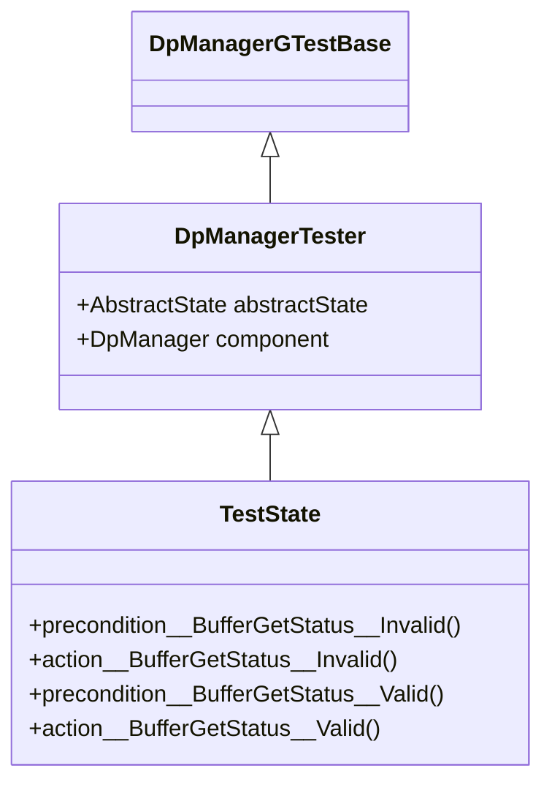
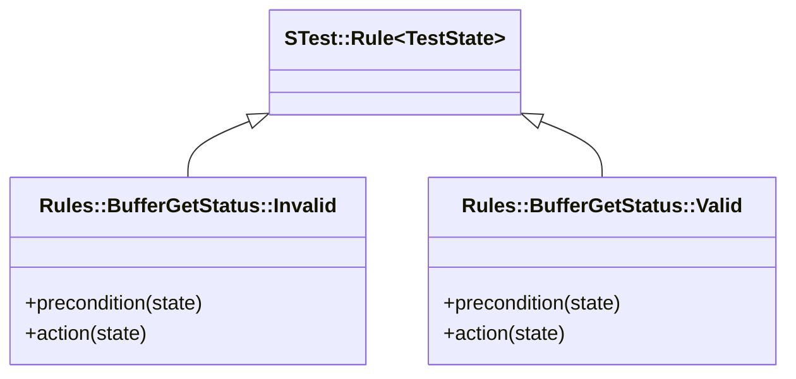
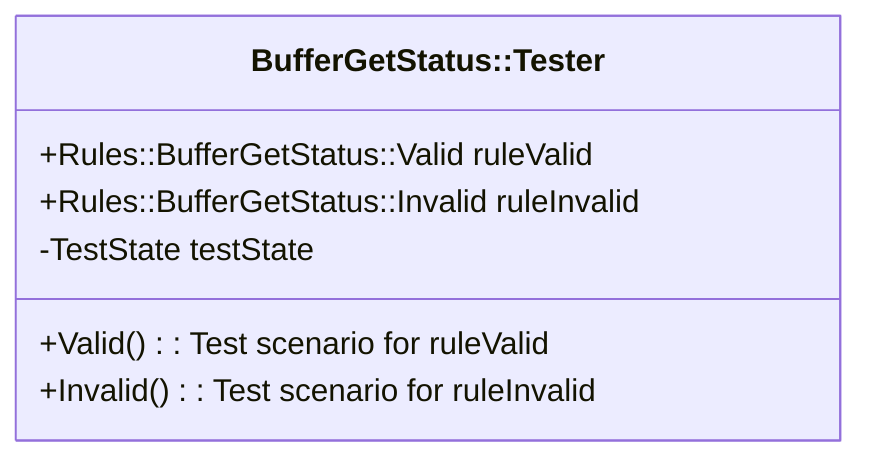
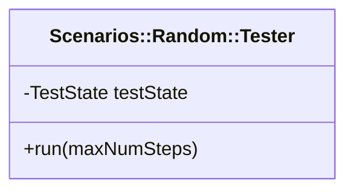

# DpManager Component Tests

## 1. Abstract State

### 1.1. Types

* `BufferGetStatus`: The status of the `bufferGet` response in
  the test harness (`VALID` or `INVALID`).

### 1.2. Variables

| Variable | Type | Description | Initial Value |
|----------|------|-------------|---------------|
| `bufferGetStatus` | `BufferGetStatus` | The buffer get status | `VALID` |
| `bufferSize` | `Option<FwSizeType>` | The current buffer size | `none` |
| `NumSuccessfulAllocations` | `OnChangeChannel<U32>` | The number of successful buffer allocations | 0 |
| `NumFailedAllocations` | `OnChangeChannel<U32>` | The number of failed buffer allocations | 0 |
| `NumDataProducts` | `OnChangeChannel<U32>` | The number of data products handled | 0 |
| `NumBytes` | `OnChangeChannel<U64>` | The number of bytes handled | 0 |
| `bufferGetOutPortNumOpt` | `Option<FwIndexType>` | The last port number used for `bufferGetOut`. Updated in the port handler for `from_bufferGetOut`. | `none` |
| `productResponseOutPortNumOpt` | `Option<FwIndexType>` | The last port number used for `productResponseOut`. Updated in the port handler for `from_productResponseOut`. | `none` |
| `productSendOutPortNumOpt` | `Option<FwIndexType>` | The last port number used for `productSendOut`. Updated in the port handler for `from_productSendOut`. | `none` |
| `bufferAllocationFailedEventCount` | `FwSizeType` | The number of buffer allocation failed events since the last throttle clear |0 |

## 2. Rule Groups

### 2.1. BufferGetStatus

This rule group manages the buffer get status in the test harness.

#### 2.1.1. Valid

This rule sets the buffer get status to `VALID`, simulating a system state
in which buffers are available.

**Precondition:**
`bufferGetStatus != VALID`.

**Action:**
`bufferGetStatus = VALID`.

**Test:**

1. Apply rule `BufferGetStatus::Invalid`.
1. Apply rule `BufferGetStatus::Valid`.

**Requirements tested:**
None (helper rule).

#### 2.1.2. Invalid

This rule sets the buffer get status to `INVALID`, simulating a system
state in which no buffers are available.

**Precondition:**
`bufferGetStatus != INVALID`.

**Action:**
`bufferGetStatus = INVALID`.

**Test:**
Apply rule `BufferGetStatus::Invalid`.

**Requirements tested:**
None (helper rule).

### 2.2. ProductGetIn

This rule group sends test input to the `productGetIn` port.

#### 2.2.1. BufferInvalid

This rule invokes `productGetIn` in a state where the test harness returns
an invalid buffer.

**Precondition:**
`bufferGetStatus == INVALID`.

**Action:**

1. Clear the history.
1. Let _S_ be `bufferSize`, or a random value if `bufferSize == none`.
   Invoke `productGetIn` with a random port number _N_, with a random id _I_,
   and with size _S_.
1. Assert that the status returned from the invocation is `FAILURE`.
1. If `bufferAllocationFailedEventCount` < `DpManagerComponentBase::EVENTID_BUFFERALLOCATIONFAILED_THROTTLE`,
   then
   1. Assert that the event history contains one element.
   1. Assert that the event history for `BufferAllocationFailed` contains one element.
   1. Assert that the event history for `BufferAllocationFailed` contains _I_ at index zero.
   1. Increment `bufferAllocationFailedEventCount`.
1. Otherwise assert that the event history is empty.
1. Increment `NumFailedAllocations`.
1. Assert that the from port history contains one item.
1. Assert that the history for `bufferGetOut` contains one item.
1. Assert that the `bufferGetOut` history contains size _S_
   at index zero.
1. Assert that `bufferGetOutPortNumOpt` is _N_.

**Test:**

1. Apply rule `BufferGetStatus::Invalid`.
1. Set `bufferSize` to `MIN_BUFFER_SIZE`.
1. Apply rule `ProductGetIn::BufferInvalid`.
1. Apply rule `SchedIn::OK`.
1. Set `bufferSize` to `MAX_BUFFER_SIZE`.
1. Apply rule `ProductGetIn::BufferInvalid`.
1. Apply rule `SchedIn::OK`.

**Requirements tested:**
`SVC-DPMANAGER-001`, `SVC-DPMANAGER-004`.

#### 2.2.2. BufferValid

This rule invokes `productRequestIn` in a state where the test harness returns
a valid buffer.

**Precondition:**
`bufferGetStatus == VALID`.

**Action:**

1. Clear history.
1. Let _S_ be `bufferSize`, or a random value if `bufferSize == none`.
   Invoke `productRequestIn` with a random port number _N_, with a random id _I_,
   and with size _S_.
1. Assert that the status returned from the invocation is `SUCCESS`.
1. Assert that the event history is empty.
1. Increment `NumSuccessfulAllocations`.
1. Assert that the from port history contains one item.
1. Assert that the `bufferGetOut` history contains one item.
1. Assert that the `bufferGetOut` history contains size _S_.
   at index zero.
1. Assert that `bufferGetOutPortNumOpt` is _N_.

**Test:**

1. Set `bufferSize` to `MIN_BUFFER_SIZE`.
1. Apply rule `ProductGetIn::BufferValid`.
1. Apply rule `SchedIn::OK`.
1. Set `bufferSize` to `MAX_BUFFER_SIZE`.
1. Apply rule `ProductGetIn::BufferValid`.
1. Apply rule `SchedIn::OK`.

**Requirements tested:**
`SVC-DPMANAGER-001`, `SVC-DP-MANAGER-004`.

### 2.3. ProductRequestIn

This rule group sends test input to the `productRequestIn` port.

#### 2.3.1. BufferInvalid

This rule invokes `productRequestIn` in a state where the test harness returns
an invalid buffer.

**Precondition:**
`bufferGetStatus == INVALID`.

**Action:**

1. Clear the history.
1. Let _S_ be `bufferSize`, or a random value if `bufferSize == none`.
   Invoke `productRequestIn` with a random port number _N_, with a random id _I_,
   and with size _S_.
1. If `bufferAllocationFailedEventCount` < `DpManagerComponentBase::EVENTID_BUFFERALLOCATIONFAILED_THROTTLE`,
   then
   1. Assert that the event history contains one element.
   1. Assert that the event history for `BufferAllocationFailed` contains one element.
   1. Assert that the event history for `BufferAllocationFailed` contains _I_ at index zero.
   1. Increment `bufferAllocationFailedEventCount`.
1. Otherwise assert that the event history is empty.
1. Increment `NumFailedAllocations`.
1. Assert that the from port history contains two items.
1. Assert that the history for `bufferGetOut` contains one item.
1. Assert that the `bufferGetOut` history contains size _S_
   at index zero.
1. Assert that `bufferGetOutPortNumOpt` is _N_.
1. Assert that the history for `productResponseOut` contains one item.
1. Assert that the history for `productResponseOut` contains the expected invalid buffer
   and status `FAILURE` at index zero.
1. Assert that `productResponseOutPortNumOpt` is _N_.

**Test:**

1. Apply rule `BufferGetStatus::Invalid`.
1. Set `bufferSize` to `MIN_BUFFER_SIZE`.
1. Apply rule `ProductRequestIn::BufferInvalid`.
1. Apply rule `SchedIn::OK`.
1. Set `bufferSize` to `MAX_BUFFER_SIZE`.
1. Apply rule `ProductRequestIn::BufferInvalid`.
1. Apply rule `SchedIn::OK`.

**Requirements tested:**
`SVC-DPMANAGER-002`, `SVC-DPMANAGER-004`.

#### 2.3.2. BufferValid

This rule invokes `productRequestIn` in a state where the test harness returns
a valid buffer.

**Precondition:**
`bufferGetStatus == VALID`.

**Action:**

1. Clear history.
1. Let _S_ be `bufferSize`, or a random value if `bufferSize == none`.
   Invoke `productRequestIn` with a random port number _N_, with a random id _I_,
   and with size _S_.
1. Assert that the event history is empty.
1. Increment `NumSuccessfulAllocations`.
1. Assert that the from port history contains two items.
1. Assert that the `bufferGetOut` history contains one item.
1. Assert that the `bufferGetOut` history contains size _S_.
   at index zero.
1. Assert that `bufferGetOutPortNumOpt` is _N_.
1. Assert that the `productResponseOut` history contains one item.
1. Assert that the `productResponseOut` history contains the
   expected valid buffer value and status `SUCCESS` at index zero.
1. Assert that `productResponseOutPortNumOpt` is _N_.

**Test:**

1. Set `bufferSize` to `MIN_BUFFER_SIZE`.
1. Apply rule `ProductRequestIn::BufferValid`.
1. Apply rule `SchedIn::OK`.
1. Set `bufferSize` to `MAX_BUFFER_SIZE`.
1. Apply rule `ProductRequestIn::BufferValid`.
1. Apply rule `SchedIn::OK`.

**Requirements tested:**
`SVC-DPMANAGER-002`, `SVC-DP-MANAGER-004`.

### 2.4. ProductSendIn

This rule group sends test input to the `productSendIn` port.

#### 2.4.1. OK

This rule invokes `productSendIn` with nominal input.

**Precondition:** `true`.

**Action:**

1. Clear history.
1. Let _S_ be `bufferSize`, or a random value if `bufferSize == none`.
   Invoke `productSendIn` with a random port number _N_, with a random id _I_,
   and with a buffer _B_ of of size _S_.
1. Assert that the event history is empty.
1. Increment `NumDataBroducts`.
1. Increase `NumBytes` by the size of _B_.
1. Assert that the from port history contains one item.
1. Assert that the `productSendOut` history contains one item.
1. Assert that the `productSendOut` history contains _B_ at index zero.
1. Assert that `productSendOutPortNumOpt` is _N_.

**Test:**
1. Set `bufferSize` to `MIN_BUFFER_SIZE`.
1. Apply rule `ProductSendIn::OK`.
1. Apply rule `SchedIn::OK`.
1. Set `bufferSize` to `MAX_BUFFER_SIZE`.
1. Apply rule `ProductSendIn::OK`.
1. Apply rule `SchedIn::OK`.

**Requirements tested:**
`SVC-DPMANAGER-003`, `SVC-DPMANAGER-004`.

### 2.5. SchedIn

This rule group sends test input to the `schedIn` port.

#### 2.5.1. OK

This rule invokes `schedIn` with nominal input.

**Precondition:** `true`

**Action:**

1. Clear history.
1. Invoke `schedIn` with a random context.
1. Check telemetry.

**Test:**

1. Apply rule `SchedIn::OK`.

**Requirements tested:**
`SVC-DPMANAGER-004`.

### 2.6. CLEAR_EVENT_THROTTLE

This rule group tests the `CLEAR_EVENT_THROTTLE` command.

#### 2.6.1. OK

This rule sends the `CLEAR_EVENT_THROTTLE` command.

**Precondition:** `true`

**Action:**

1. Clear the history.
1. Send command `CLEAR_EVENT_THROTTLE`.
1. Check the command response.
1. Assert `DpManagerComponentBase::m_BufferAllocationFailedThrottle` == 0.
1. Set `bufferAllocationFailedEventCount` = 0.

**Test:**

1. Apply rule `BufferGetStatus::Invalid`.
1. Apply rule `ProductRequestIn::BufferInvalid` `DpManagerComponentBase::EVENTID_BUFFERALLOCATIONFAILED_THROTTLE` + 1 times.
1. Apply rule `CLEAR_EVENT_THROTTLE::OK`.
1. Apply rule `ProductRequestIn::BufferInvalid`

**Requirements tested:**
`SVC-DPMANAGER-006`

## 3. Implementation

### 3.1. DpManagerTester and TestState

The abstract state and the component under test are members of the `DpManagerTester` class.
`TestState` is a derived class of `DpManagerTester`.
The preconditions and actions of the rules are defined in `TestState` so they can use the functions
and macros defined in `DpManagerGTestBase`.
The header file for `TestState` is boilerplate and is defined using macro expansion.
The function definitions for `TestState` are handwritten.
They encode the preconditions and actions described above.

The preconditions and actions for the `BufferGetStatus` rule group are shown.

### 3.2. Rules

The classes derived from `STest::Rule` are boilerplate.
The precondition and action functions turn around and call the corresponding
functions in `TestState`.
The boilerplate is defined using macro expansion.

The rules for the `BufferGetStatus` rule group are shown.

### 3.3. Rule Group Testers

There is one tester for each rule group.
Each tester defines the rules for the group, defines a test state,
and provides one test scenario for each rule.
The tester for the `BufferGetStatus` rule group is shown.

### 3.4. Random Scenario Tester

The random scenario tester instantiates all the rules and uses them to provide
a random scenario.

