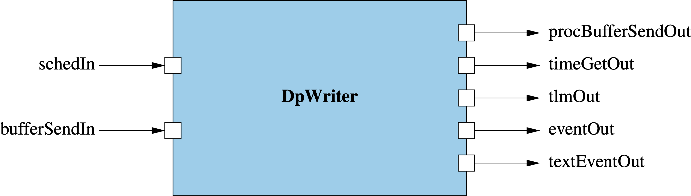
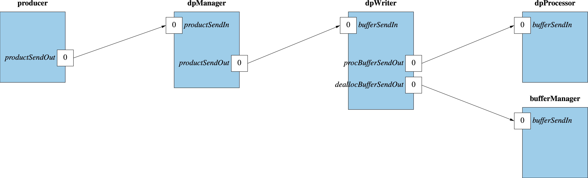
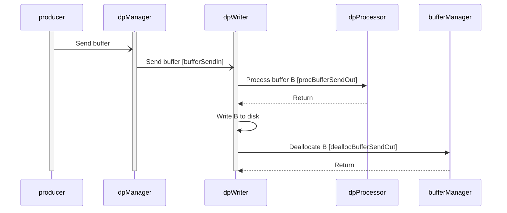

\page SvcDpWriterComponent Svc::DpWriter Component
# Svc::DpWriter (Active Component)

## 1. Introduction

`Svc::DpWriter` is an active component for writing data products to disk.
It does the following:

1. Receive buffers containing filled data product containers.
The buffers typically come from one or more components that produce
data products.
They typically pass through an instance of
[`Svc::DpManager`](../../DpManager/docs/sdd.md), and possibly through
an instance of
[`Svc::BufferAccumulator`](../../BufferAccumulator/docs/BufferAccumulator.md),
before reaching `DpWriter`.

1. For each buffer _B_ received in step 1:

   1. Perform any requested processing, such as data compression, on _B_.

   1. Write _B_ to disk.

   1. If a notification port is connected, then send out a notification
that the write occurred.
An instance of [`Svc::DpCatalog`](../../DpCatalog/docs/sdd.md) can
receive this notification and use it to update the data product catalog.

## 2. Requirements

Requirement | Description | Rationale | Verification Method
----------- | ----------- | ----------| -------------------
SVC-DPWRITER-001 | `Svc::DpWriter` shall provide a port for receiving `Fw::Buffer` objects pointing to filled data product containers. | The purpose of `DpWriter` is to write the data products to disk. | Unit Test
SVC-DPWRITER-002 | `Svc::DpWriter` shall provide an array of ports for sending `Fw::Buffer` objects for processing. | This requirement supports downstream processing of the data in the buffer. | Unit Test
SVC-DPWRITER-003 | On receiving a data product container _C_, `Svc::DpWriter` shall use the processing type field of the header of _C_ to select zero or more processing ports to invoke, in port order. | The processing type field is a bit mask. A one in bit `2^n` in the bit mask selects port index `n`. | Unit Test
SVC-DPWRITER-004 | On receiving an `Fw::Buffer` _B_, and after performing any requested processing on _B_, `Svc::DpWriter` shall write _B_ to disk. | The purpose of `DpWriter` is to write data products to the disk. | Unit Test
SVC-DPWRITER-005 | `Svc::DpWriter` shall provide a port for notifying other components that data products have been written. | This requirement allows `Svc::DpCatalog` or a similar component to update its catalog in real time. | Unit Test
SVC-DPWRITER-006 | `Svc::DpManager` shall provide telemetry that reports the number of buffers received, the number of data products written, the number of bytes written, the number of failed writes, and the number of errors. | This requirement establishes the telemetry interface for the component. | Unit test

## 3. Design

### 3.1. Component Diagram

The diagram below shows the `DpWriter` component.

### 3.2. Ports

`DpWriter` has the following ports:

| Kind | Name | Port Type | Usage |
|------|------|-----------|-------|
| `async input` | `schedIn` | `Svc.Sched` | Schedule in port |
| `async input` | `bufferSendIn` | `Fw.BufferSend` | Port for receiving data products to write to disk |
| `output` | `procBufferSendOut` | `[DpWriterNumProcPorts] Fw.BufferSend` | Port for processing data products |
| `output` | `dpWrittenOut` | `DpWritten` | Port for sending `DpWritten` notifications |
| `output` | `deallocBufferSendOut` | `Fw.BufferSend` | Port for deallocating data product buffers |
| `time get` | `timeGetOut` | `Fw.Time` | Time get port |
| `telemetry` | `tlmOut` | `Fw.Tlm` | Telemetry port |
| `event` | `eventOut` | `Fw.Log` | Event port |
| `text event` | `textEventOut` | `Fw.LogText` | Text event port |

### 3.3. State

`DpWriter` maintains the following state:

1. `numDataProducts (U32)`: The number of data products written.

1. `numBytes (U64)`: The number of bytes written.

### 3.4. Compile-Time Setup

1. The configuration constant [`DpWriterNumProcPorts`](../../../config/AcConstants.fpp)
   specifies the number of ports for connecting components that perform
   processing.

1. The configuration [`DP_FILENAME_FORMAT`](../../../config/DpCfg.hpp)
   specifies the file name format.

### 3.5. Runtime Setup

No special runtime setup is required.

### 3.6. Port Handlers

#### 3.6.1. schedIn

This handler sends out the state variables as telemetry.

#### 3.6.2. bufferSendIn

This handler receives a mutable reference to a buffer `B`.
It does the following:

1. Check that `B` is valid. If not, emit a warning event.

1. If the previous step succeeded, then check that the size of `B` is large enough to
   hold a data product container packet. If not, emit a warning event.

1. If the previous steps succeeded, then check that the packet
   header of `B` can be successfully deserialized.
   If not, emit a warning event.

1. If the previous steps succeeded, then check that the header
   hash of `B` is valid.
   If not, emit a warning event.

1. If the previous steps succeeded, then check that the data
   size recorded in the packet header fits within the buffer.
   If not, emit a warning event.

1. If the previous steps succeeded, then

   1. Read the `ProcType` field out of the container header stored in the
      memory pointed to by `B`. Let the resulting bit mask be `M`.

   1. Visit the port numbers of `procBufferSendOut` in order.
      For each port number `N`, if `N` is set in `M`, then invoke
      `procBufferSendOut` at port number `N`, passing in `B`.
      This step updates the memory pointed to by `B` in place.

   1. Write `B` to a file, using the format described in the [**File
      Format**](#file_format) section. For the time stamp, use the time
      provided by `timeGetOut`.

1. If the file write succeeded and `dpWrittenOut` is connected, then send the
   file name, priority, and file size out on `dpWrittenOut`.

1. If `B` is valid, then send `B` on `deallocBufferSendOut`.

## 4. File Format

### 4.1. Data Format

Each file stores a serialized data product record,
with the format described in the
[data products documentation](../../../Fw/Dp/docs/sdd.md#serial-format).

### 4.2. File Name

The name of each file is formatted with the configurable format string
[`DP_FILENAME_FORMAT`](../../../config/DpCfg.hpp).
The format string must contain format specifications for the following arguments,
in order.

Format Specifier | Type |
---------------- | -----|
Container ID | `PRI_FwDpIdType`
Time seconds | `PRI_u32`
Time microseconds | `PRI_u32`

## 5. Ground Interface

### 5.1. Commands

| Kind | Name | Description |
|------|------|-------------|
| `async` | `CLEAR_EVENT_THROTTLE` | Clear event throttling |

### 5.2. Telemetry

| Name | Type | Description |
|------|------|-------------|
| `NumDataProducts` | `U32` | The number of data products handled |
| `NumBytes` | `U64` | The number of bytes handled |

### 5.3. Events

| Name | Severity | Description |
|------|----------|-------------|
| `BufferInvalid` | `warning high` | Incoming buffer is invalid |
| `BufferTooSmall` | `warning high` | Incoming buffer is too small to hold a data product container |
| `InvalidPacketDescriptor` | `warning high` | Incoming buffer has an invalid packet descriptor |
| `FileOpenError` | `warning high` | An error occurred when opening a file |
| `FileWriteError` | `warning high` | An error occurred when writing to a file |

## 6. Example Uses

### 6.1. Topology Diagrams

The following topology diagram shows how to connect `Svc::DpWriter`
to a `DpManager` component and a processor component.
The diagrams use the following instances:

* `dpManager`: An instance of [`Svc::DpManager`](../../DpManager/docs/sdd.md).

* `dpProcessor`: A component that processes data product containers.

* `dpWriter`: An instance of `Svc::DpWriter`.

* `producer`: A component that produces data products.

### 6.2. Sequence Diagrams

The following diagram shows what happens when a buffer is sent to `DpWriter`,
is processed, and is written to disk.

