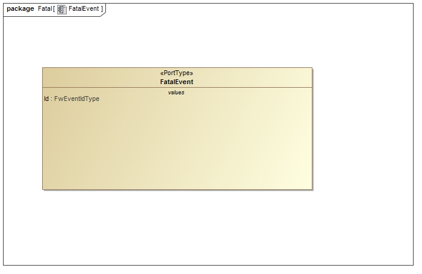

\page SvcFatalHandlerComponent Svc::FatalHandler Component
# Svc::FatalHandler Component

## 1. Introduction

The `Svc::FatalHandler` is responsible for handling FATAL event notifications from the system. 

## 2. Requirements

The requirements for `Svc::FatalHandler` are as follows:

Requirement | Description | Verification Method
----------- | ----------- | -------------------
FH-001 | The `Svc::FatalHandler` component shall handle FATAL notifications | Unit Test
FH-002 | The `Svc::FatalHandler` component shall shut down the Unix process | Unit Test
FH-002 | The `Svc::FatalHandler` component shall suspend the thread calling FATAL | Unit Test

## 3. Design

### 3.1 Context

#### 3.1.1 Component Diagram

The `Svc::FatalHandler` component has the following component diagram:

> TODO

#### 3.1.2 Ports

The `Svc::FatalHandler` component uses the following port types:

Port Data Type | Name | Direction | Kind | Usage
-------------- | ---- | --------- | ---- | -----
[`Svc::Fatal`](../../Fatal/docs/sdd.md) | FatalReceive | Input | Synch | Receive FATAL notifications

### 3.2 Functional Description

For Unix variants, it delays for one second before exiting with a segmentation fault. This allows time for the FATAL to propagate to the ground system so the user can see what event occurred and also generates a core for debugging (assuming ulimit is set correctly). For VxWorks, it suspends the calling thread. Projects can replace this component with another that does project-specific behavior like resets.

### 3.3 Scenarios

#### 3.3.1 FATAL Notification

The `Svc::FatalHandler` handles FATAL notifications:

 

### 3.4 State

`Svc::FatalHandler` has no state machines.

### 3.5 Algorithms

`Svc::FatalHandler` has no significant algorithms.

## 4. Dictionary

TBD

## 4. Module Checklists

## 5. Unit Testing

To see unit test coverage run fprime-util check --coverage

## 6. Change Log

Date | Description
---- | -----------
9/26/2016 | Design review edits

