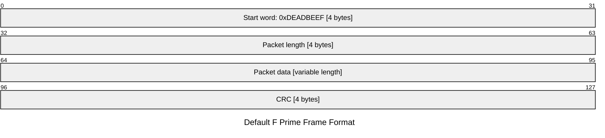
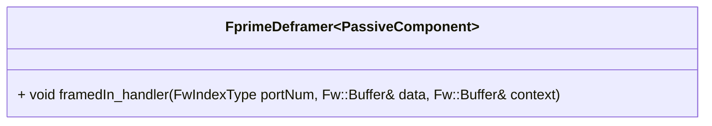

# Svc::FprimeDeframer

The `Svc::FprimeDeframer` component receives F´ frames on its input port, takes off the header and trailer (or "footer"), and passes the encapsulated payload to other components of the system.

## F Prime frame format

Following this frame specification, in its default configuration, the `Svc::FprimeDeframer` removes the header (32-bit start word, 32-bit packet length) and the trailer (32-bit CRC) from the frame, and outputs the encapsulated packet data.

## Internals

The `Svc::FprimeDeframer` component is an implementation of the [DeframerInterface](../../Interfaces/DeframerInterface.fppi) for the F´ communications protocol. It receives an F´ frame (in a [Fw::Buffer](../../../Fw/Buffer/docs/sdd.md) object) on its `framedIn` input port, modifies the input buffer to remove the header and trailer, and sends it out through its `deframedOut` output port. 

Ownership of the buffer is transferred to the component connected to the `deframedOut` output port. The input buffer is modified by subtracting the header and trailer size from the buffer's length, and offsetting the buffer's data pointer to point to the start of the packet data.

The `Svc::FprimeDeframer` component does not perform any validation of the frame. It is expected that the frame is valid and well-formed. The validation should be performed by an upstream component, such as [`Svc::FrameAccumulator`](../../FrameAccumulator/docs/sdd.md).

The `Svc::FprimeDeframer` does not support deframing multiple packets in a single frame (i.e. concatenated packets) as this is not supported by the F´ communications protocol.

### Custom Configuration

## Usage Examples

The `Svc::FprimeDeframer` component is used in the uplink stack of many reference F´ application such as [the tutorials source code](https://github.com/fprime-community#tutorials).

## Diagrams

The below diagram shows a typical configuration in which the `Svc::FprimeDeframer` can be used. This is the configuration used in the [the tutorials source code](https://github.com/fprime-community#tutorials). It is receiving accumulated frames from a [Svc::FrameAccumulator](../../FrameAccumulator/docs/sdd.md) and passes packets to a [Svc::FprimeRouter](../../FprimeRouter/docs/sdd.md) for routing to other components.

## Class Diagram

## Requirements

Requirement | Description | Rationale | Verification Method
----------- | ----------- | ----------| -------------------
SVC-DEFRAMER-001 | `Svc::FprimeDeframer` shall remove the header and trailer from an F´ frame | Purpose of the component | Unit test |

## Port Descriptions

| Kind | Name | Type | Description |
|---|---|---|---|
| `guarded input` | framedIn | `Fw.DataWithContext` | Receives a frame with optional context data |
| `output` | deframedOut | `Fw.DataWithContext` | Receives a frame with optional context data |
