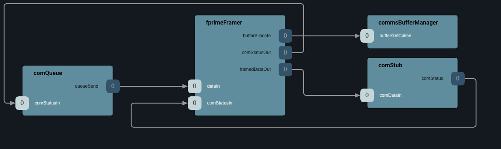

# Svc::FprimeFramer

The `Svc::FprimeFramer` is an implementation of the [FramerInterface](../../Interfaces/docs/sdd.md#svcframerinterface) for the F Prime protocol. 

It receives data (an F´ packet) on input and produces an [F´ frame](../../FprimeProtocol/docs/sdd.md) on its output port as a result. Please refer to the [F´ frame specification](../../FprimeProtocol/docs/sdd.md) for details on the frame format.

## Internals

### Diagrams

Below is the common configuration in which the `Svc::FprimeFramer` can be used. It is receiving packets from a [`Svc::ComQueue`](../../ComQueue/docs/sdd.md) and passes frames to a [Communications Adapter](../../Interfaces/docs/sdd.md#svccominterface), such as a Radio manager component (or a [`Svc::ComStub`](../../ComStub/docs/sdd.md)), for transmission.

## Port Descriptions

| Kind  | Name  | Port Type | Usage    |
|---|---|---|---|
| `guarded input` | `dataIn` | `Fw.DataWithContext` | Port to receive data to frame, in a Fw::Buffer with optional context|
| `output` | `framedDataOut` | `Fw.DataWithContext` | Port to output framed data, with optional context, for follow-up framing|
| `sync input` | `comStatusIn` | `Fw.SuccessCondition` | Port receiving the general status from the downstream component|
| `output` | `comStatusOut` | `Fw.SuccessCondition` | Port receiving indicating the status of framer for receiving more data|

## Requirements

| Name | Description | Validation |
|---|---|---|
| SVC-FPRIME_FRAMER-001 | `Svc::FprimeFramer` shall accept data buffers (packets) stored in `Fw::Buffer` through its `dataIn` input port | Unit Test |
| SVC-FPRIME_FRAMER-002 | `Svc::FprimeFramer` shall emit one F Prime frame on its `framedOut` output port for each packet received on `dataIn` input port | Unit Test |
| SVC-FPRIME_FRAMER-003 | `Svc::FprimeFramer` shall emit F Prime frames that conforms to the [F´ frame specification](../../FprimeProtocol/docs/sdd.md) | Unit Test |

