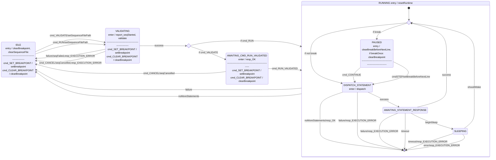

# Svc::FpySequencer

**The FpySequencer is currently in development. Use at own risk**

The FpySequencer loads, validates and runs up to one Fpy sequence at a time.

The FpySequencer is primarily composed of a state machine and a runtime environment. The state machine controls the loading, validation, starting and stopping of the sequence, and the actual execution takes place in a sectioned-off runtime.

The FpySequencer runs files compiled by `fprime-fpyc` (in the `fprime-gds` package). See the compiler documentation for the details of the Fpy language.

> [!CAUTION]
> The FpySequencer depends on `float` and `double` conforming to IEEE-754 standard on the target system. Users should ensure `SKIP_FLOAT_IEEE_754_COMPLIANCE` is defined as `0` to guarantee compliance.

> [!CAUTION]
> The FpySequencer depends on a 2's complement representation of integers.

## Requirements

| **ID**      | **Requirement**                                                                                                                                   | **Verification**                |
| ----------- | ------------------------------------------------------------------------------------------------------------------------------------------------- | ------------------------------- |
| FPY-SEQ-001 | The sequencer shall support branching on conditionals.                                                                                            | Unit Test                       |
| FPY-SEQ-002 | The sequencer shall support arithmetic and logical operations on 64bit signed, unsigned, and floating point numbers.                              | Unit Test                       |
| FPY-SEQ-003 | The sequencer shall support accessing telemetry.                                                                                                  | Unit Test                       |
| FPY-SEQ-004 | The sequencer shall support accessing the parameter database.                                                                                     | Unit Test                       |
| FPY-SEQ-005 | The sequencer shall support calling subroutines with arguments and a single return value.                                                         | Unit Test                       |
| FPY-SEQ-006 | The sequencer shall support scoped variables.                                                                                                     | Unit Test                       |
| FPY-SEQ-007 | The sequencer shall support executing directives at relative times.                                                                               | Unit Test                       | 
| FPY-SEQ-008 | The sequencer shall support executing directives at absolute times.                                                                               | Unit Test                       | 
| FPY-SEQ-009 | The sequencer shall support sequence-local variables.                                                                                             | Unit Test                       |
| FPY-SEQ-010 | The sequencer shall support dispatching commands with dynamic and constant arguments.                                                             | Unit Test                       |
| FPY-SEQ-011 | The sequencer shall support running sequences with arguments.                                                                                     | Unit Test                       |
| FPY-SEQ-012 | The sequencer shall read a binary-encoded sequence file of the format described in [TBD]()                                                        | Unit Test                       |
| FPY-SEQ-013 | The sequencer shall support sending commands for dispatch.                                                                                        | Unit Test                       |
| FPY-SEQ-014 | The sequencer shall support parameterized sequences.                                                                                              | Unit Test                       |
| FPY-SEQ-015 | The sequencer shall support conversions between F Prime signed, unsigned, and floating-point primitive types and their equivalent 64-bit types.   | Unit Test                       |
| FPY-SEQ-016 | The sequencer shall support exiting the sequence execution with a specified exit code.                                                            | Unit Test                       |
| FPY-SEQ-017 | The sequencer shall support looping constructs.                                                                                                   | Unit Test                       |
| FPY-SEQ-018 | The sequencer shall support NO OP functionality.                                                                                                  | Unit Test                       |
| FPY-SEQ-019 | The sequencer shall support working with complex modeled data structures (Arrays, Serializables).                                                 | Unit Test                       |
| FPY-SEQ-020 | The sequencer shall support setting flags as described in the [Flags](#flags) section via command and sequence directive.                  | Unit Test                       |
| FPY-SEQ-021 | The sequencer shall support the directives described in the [Directives](#directives) section.                                                    | Unit Test                       |

## States

The following diagram represents the states of the `FpySequencer`.

## Flags
The FpySequencer supports certain boolean flags which control the behavior of the sequencer while running a sequence. The flags can be accessed and modified by the sequence itself, or by command while a sequence is running. When a sequence starts running, the flags are initialized to a value configured by the FLAG_DEFAULT_XYZ parameters.

| Name | Description | Default value (configurable) |
|---|------------|---|
|EXIT_ON_CMD_FAIL|if true, the sequence will exit with an error if a command fails|false|

## Commands
| Name | Description |
|-----|-----|
| RUN | Loads, validates and runs a sequence |
| VALIDATE | Loads and validates a sequence. Mutually exclusive with RUN |
| RUN_VALIDATED | Must be called after VALIDATE. Runs the sequence that was validated. |
| CANCEL | Cancels a running or validated sequence. After running CANCEL, the sequencer should return to IDLE |
| SET_FLAG | Sets the value of a flag |

## Debugging Commands
The FpySequencer has a set of debugging commands which can be used to pause and step through sequences. They should not be necessary for nominal use cases.

| Name | Description |
|-----|-----|
| SET_BREAKPOINT | Sets a breakpoint at the specified statement index. When reached, execution will pause before dispatching that statement. |
| BREAK | Immediately pauses execution before dispatching the next statement. Will break once, then continue normal execution. |
| CONTINUE | Continues automatic execution of the sequence after it has been paused. If a breakpoint is still set, execution may pause again. |
| CLEAR_BREAKPOINT | Clears any set breakpoint, but does not continue executing the sequence. |
| STEP | When paused, executes the next statement then returns to paused state. Not valid during automatic execution. |
| DUMP_STACK_TO_FILE | Writes the contents of the stack to a file. Not valid during automatic execution. |

## Directives
See `directives.md` for documentation on all directives.

<!-- fpp-dictionary-begin -->
## Component Dictionary

The following tables are derived from the component's FPP model.

### Port Descriptions

| Name | Kind | Port Type | Description |
|---|---|---|---|
| `cmdOut` | `output` | `Fw.Com` | output port for commands from the seq |
| `cmdResponseIn` | `async input` | `Fw.CmdResponse` |  |
| `pingIn` | `async input` | `Svc.Ping` |  |
| `checkTimers` | `async input` | `Svc.Sched` |  |
| `tlmWrite` | `async input` | `Svc.Sched` |  |
| `seqRunIn` | `async input` | `Svc.CmdSeqIn` |  |
| `seqCancelIn` | `async input` | `Svc.CmdSeqCancel` |  |
| `seqStartOut` | `output` | `Svc.CmdSeqIn` | called when a sequence begins running |
| `seqDoneOut` | `output` | `Fw.CmdResponse` | called when a sequence finishes running, either successfully or not |
| `pingOut` | `output` | `Svc.Ping` | Ping out port |
| `getTlmChan` | `output` | `Fw.TlmGet` | port for getting telemetry channel values and storing them in sequence serRegs |
| `getParam` | `output` | `Fw.PrmGet` | port for getting param values and storing them in sequence serRegs |
| `serialOut` | `output` | `[Svc.Fpy.SerialPortIndex.MAX_SERIAL_PORTS] serial` | Output ports for popping serializable data from stack to downstream components |

### Commands

| Name | Kind | Description |
|---|---|---|
| `RUN` | `async` |  |
| `RUN_ARGS` | `async` |  |
| `VALIDATE` | `async` |  |
| `VALIDATE_ARGS` | `async` |  |
| `RUN_VALIDATED` | `async` |  |
| `CANCEL` | `async` |  |
| `SET_BREAKPOINT` | `async` | Sets the breakpoint which will pause the execution of the sequencer when reached, until unpaused by the CONTINUE command. Will pause just before dispatching the specified directive. This command is valid in all states. Breakpoint settings are cleared after a sequence ends execution. |
| `BREAK` | `async` | Pauses the execution of the sequencer, just before it is about to dispatch the next directive, until unpaused by the CONTINUE command, or stepped by the STEP command. This command is only valid substates of the RUNNING state that are not RUNNING.PAUSED. |
| `CONTINUE` | `async` | Continues the automatic execution of the sequence after it has been paused. If a breakpoint is still set, it may pause again on that breakpoint. This command is only valid in the RUNNING.PAUSED state. |
| `CLEAR_BREAKPOINT` | `async` | Clears the breakpoint, but does not continue executing the sequence. This command is valid in all states. This happens automatically when a sequence ends execution. |
| `STEP` | `async` | Dispatches and awaits the result of the next directive, or ends the sequence if no more directives remain. Returns to the RUNNING.PAUSED state if the directive executes successfully. This command is only valid in the RUNNING.PAUSED state. |
| `DUMP_STACK_TO_FILE` | `async` | Writes the contents of the stack to a file. This command is only valid in the RUNNING.PAUSED state. |

### Events

| Name | Severity | Description |
|---|---|---|
| `InvalidCommand` | `warning high` |  |
| `InvalidSeqRunCall` | `warning high` |  |
| `InvalidSeqCancelCall` | `warning high` |  |
| `FileOpenError` | `warning high` |  |
| `FileWriteError` | `warning high` |  |
| `FileReadError` | `warning high` |  |
| `EndOfFileError` | `warning high` |  |
| `FileReadDeserializeError` | `warning high` |  |
| `WrongSchemaVersion` | `warning high` |  |
| `WrongCRC` | `warning high` |  |
| `ExtraBytesInSequence` | `warning high` |  |
| `InsufficientBufferSpace` | `warning high` |  |
| `FileApiError` | `warning high` |  |
| `SequenceFilePathTooLong` | `warning high` |  |
| `CommandFailed` | `warning high` |  |
| `SequenceDone` | `activity high` |  |
| `SequenceCancelled` | `activity high` |  |
| `SequenceExitedWithError` | `warning high` |  |
| `UnknownSequencerDirective` | `warning high` |  |
| `CmdResponseWhileNotRunningSequence` | `warning low` |  |
| `CmdResponseFromOldSequence` | `warning low` |  |
| `CmdResponseWhileNotAwaiting` | `warning high` |  |
| `CmdResponseWhileAwaitingDirective` | `warning high` |  |
| `WrongCmdResponseOpcode` | `warning high` |  |
| `WrongCmdResponseIndex` | `warning high` |  |
| `DirectiveDeserializeError` | `warning high` |  |
| `MismatchedTimeBase` | `warning high` |  |
| `MismatchedTimeContext` | `warning high` |  |
| `CommandTimedOut` | `warning high` |  |
| `DirectiveTimedOut` | `warning high` |  |
| `TooManySequenceArgs` | `warning high` |  |
| `TooManySequenceDirectives` | `warning high` |  |
| `ArgSizeMismatch` | `warning high` |  |
| `ArgSizeExceedsCapacity` | `warning high` |  |
| `ArgTotalSizeExceedsStackLimit` | `warning high` |  |
| `SequencePaused` | `activity high` |  |
| `BreakpointSet` | `activity high` |  |
| `BreakpointCleared` | `activity high` |  |
| `LogFatal` | `fatal` |  |
| `LogWarningHi` | `warning high` |  |
| `LogWarningLo` | `warning low` |  |
| `LogCommand` | `command` |  |
| `LogActivityHi` | `activity high` |  |
| `LogActivityLo` | `activity low` |  |
| `LogDiagnostic` | `diagnostic` |  |

### Telemetry

| Name | Type | Description |
|---|---|---|
| `State` | `FwEnumStoreType` | the current state of the sequencer |
| `SequencesSucceeded` | `U64` | the number of sequences successfully completed |
| `SequencesFailed` | `U64` | the number of sequences that failed to validate or execute |
| `SequencesCancelled` | `U64` | the number of sequences that were cancelled |
| `StatementsDispatched` | `U64` | the number of statements dispatched (successfully or otherwise) total. Note this is distinct from the number of statements executed. This number just tracks how many we've sent out |
| `StatementsFailed` | `U64` | the number of statements that failed to execute |
| `LastDirectiveError` | `Fpy.DirectiveErrorCode` | the error code of the last directive that ran |
| `DirectiveErrorIndex` | `U64` | the index of the last directive to error |
| `DirectiveErrorId` | `Fpy.DirectiveId` | the id of the last directive to error |
| `SeqPath` | `string size FileNameStringSize` | the currently running sequence |
| `Debug_ReachedEndOfFile` | `bool` | true if there are no statements remaining in the sequence file |
| `Debug_NextStatementReadSuccess` | `bool` | true if we were able to deserialize the next statement successfully |
| `Debug_NextStatementOpcode` | `U8` | the opcode of the next statement to dispatch. |
| `Debug_NextStatementIndex` | `U32` | the index of the next statement to be executed |
| `Debug_NextCmdOpcode` | `FwOpcodeType` | if the next statement is a cmd directive, the opcode of that cmd |
| `Debug_StackSize` | `Fpy.StackSizeType` | the size of the stack in bytes |
| `BreakpointInUse` | `bool` | whether or not to break at the breakpoint index |
| `BreakpointIndex` | `U32` | the current breakpoint index. The sequence will break at this point just before dispatching the directive at this index |
| `BreakOnlyOnceOnBreakpoint` | `bool` | whether or not to remove the breakpoint after breaking on it |
| `BreakBeforeNextLine` | `bool` | whether or not to break before dispatching the next line, independent of what line it is. can be used in combination with breakpointIndex |
| `PRM_STATEMENT_TIMEOUT_SECS` | `F32` | value of prm STATEMENT_TIMEOUT_SECS |
| `PRM_SEQ_BASE_DIR` | `string size FileNameStringSize` | value of prm SEQ_BASE_DIR |

### Parameters

| Name | Type | Description |
|---|---|---|
| `STATEMENT_TIMEOUT_SECS` | `F32` | the number of seconds to wait before giving up on a directive or command. if <= 0 or greater than U32 max, never time out. accuracy of this timeout is determined by the rate group driving this component. it will be rounded up |
| `SEQ_BASE_DIR` | `string size FileNameStringSize` | the base directory relative to which sequence file paths are resolved. a '/' separator is always inserted between this base dir and the input sequence file path before resolution occurs following the rules of Os::File::open. |

<!-- fpp-dictionary-end -->
