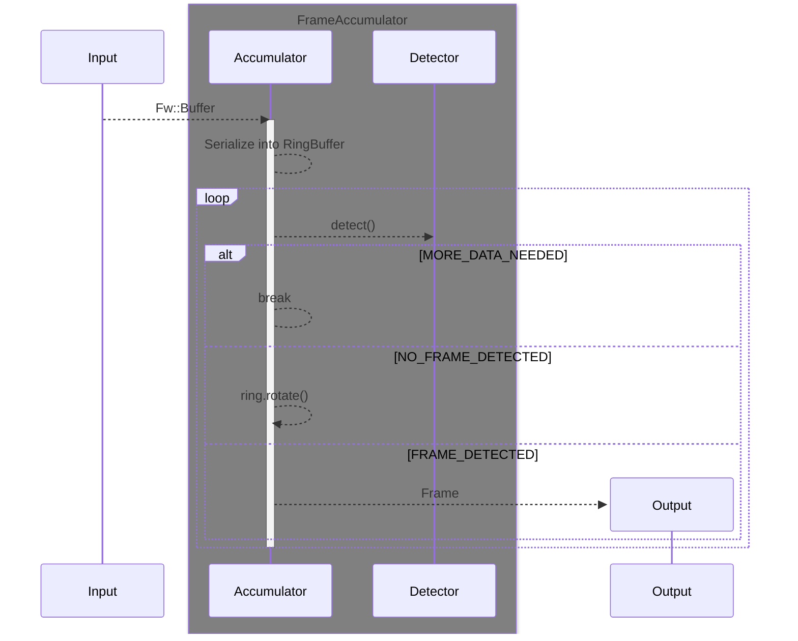
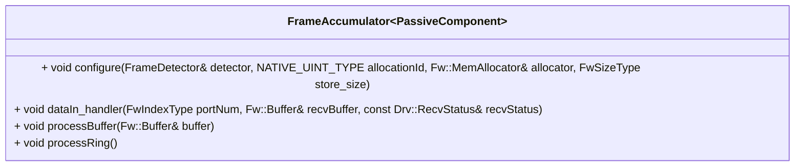

# Svc::FrameAccumulator

The `Svc::FrameAccumulator` component accumulates a stream of data (sequence of [Fw::Buffer](../../../Fw/Buffer/docs/sdd.md) objects) to extract full frames.

The `Svc::FrameAccumulator` accepts as input a sequence of byte buffers, which typically come from a ground data system via a [ByteStreamDriver](../../../Drv/ByteStreamDriverModel/docs/sdd.md). It extracts the frames from the sequence of buffers and emits them on the `frameOut` output port.

## Internals

The `Svc::FrameAccumulator` accumulates the [Fw::Buffer](../../../Fw/Buffer/docs/sdd.md) objects into a circular buffer ([Utils::CircularBuffer](../../../Utils/Types/CircularBuffer.hpp)). 

The component must be configured with with a [`Svc::FrameDetector`](../FrameDetector.hpp) which is responsible for detecting frames in the circular buffer. An implementation of this for the F´ communications protocol is provided by `Svc::FrameDetectors::FprimeFrameDetector`. When the configured `Svc::FrameDetector` detects a frame in the circular buffer, it emits the frame on its output port.

The uplink frames need not be aligned on the buffer boundaries, and each frame may span one or more buffers.

## Usage Examples

The `Svc::FrameAccumulator` component is used in the uplink stack of many reference F´ application such as [the tutorials source code](https://github.com/fprime-community#tutorials).

## Diagrams

## Class Diagram

## Requirements

Requirement | Description | Rationale | Verification Method
----------- | ----------- | ----------| -------------------
SVC-FRAMEACCUMULATOR-001 | `Svc::FrameAccumulator` shall accumulate a sequence of byte buffers until a full frame is received | FrameAccumulator is designed to re-assemble frames from sequence of bytes | Unit test |
SVC-FRAMEACCUMULATOR-002 | `Svc::FrameAccumulator` shall detect once the accumulated buffers form a full frame and emit said frame | Pass frames to other parts of the system | Unit test |
SVC-FRAMEACCUMULATOR-003 | `Svc::FrameAccumulator` shall accept byte buffers containing frames that are not aligned on a buffer boundary. | For flexibility, we do not require that the frames be aligned on a buffer boundary. | Unit test |
SVC-FRAMEACCUMULATOR-004 | `Svc::FrameAccumulator` shall accept byte buffers containing frames that span one or more buffers. | For flexibility, we do not require each frame to fit in a single buffer. | Unit test |

## Port Descriptions

| Kind | Name | Type | Description |
|---|---|---|---|
| `guarded input` | dataIn | `Drv.ByteStreamRecv` | Receives raw data from a ByteStreamDriver, ComStub, or other buffer producing component |
| `output` | frameOut | `Fw.DataWithContext` | Port for sending an extracted frame out |
| `output` | frameAllocate | `Fw.BufferGet` | Port for allocating buffer to hold extracted frame |
| `output`| dataDeallocate | `Fw.BufferSend` | Port for deallocating buffers received on dataIn. |
