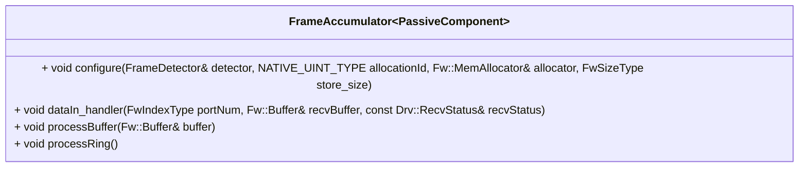

# Svc::FrameAccumulator

The `Svc::FrameAccumulator` component accumulates a stream of data into frames.

## Usage Examples

The `Svc::FrameAccumulator` component is used in the uplink stack of many reference F´ application such as the tutorials reference code.

### Diagrams

## Class Diagram

## Requirements

Requirement | Description | Rationale | Verification Method
----------- | ----------- | ----------| -------------------
SVC-FRAMEACCUMULATOR-001 | `Svc::FrameAccumulator` shall accumulate a sequence of byte buffers until their sequence forms a full frame | FrameAccumulator is designed to re-assemble frames from sequence of bytes | Unit test
SVC-FRAMEACCUMULATOR-002 | `Svc::FrameAccumulator` shall detect once the accumulated buffers form a full frame and emit said frame | Pass frames to other parts of the system | Unit test
SVC-FRAMEACCUMULATOR-003 | `Svc::FrameAccumulator` shall accept byte buffers containing frames that are not aligned on a buffer boundary. | For flexibility, we do not require that the frames be aligned on a buffer boundary. | Unit test
SVC-FRAMEACCUMULATOR-004 | `Svc::FrameAccumulator` shall accept byte buffers containing frames that span one or more buffers. | For flexibility, we do not require each frame to fit in a single buffer. | Unit test
