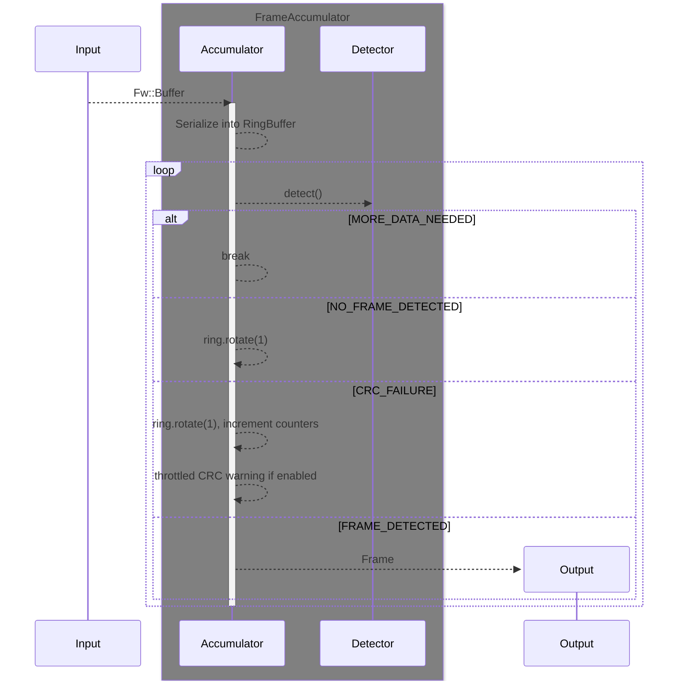
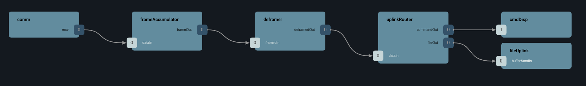
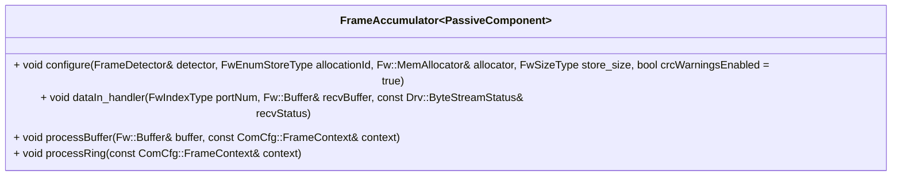

# Svc::FrameAccumulator

The `Svc::FrameAccumulator` component accumulates a stream of data (sequence of [Fw::Buffer](../../../Fw/Buffer/docs/sdd.md) objects) to extract full frames from.

The `Svc::FrameAccumulator` accepts as input a sequence of byte buffers, which typically come from a ground data system via a [ByteStreamDriver](../../../Drv/ByteStreamDriverModel/docs/sdd.md). It extracts the frames from the sequence of buffers and emits them on the `dataOut` output port.

## Internals

### Overview and configuration

The `Svc::FrameAccumulator` accumulates the [Fw::Buffer](../../../Fw/Buffer/docs/sdd.md) objects into a circular buffer ([Utils::CircularBuffer](../../../Utils/Types/CircularBuffer.hpp)). 

The component must be configured with a [`Svc::FrameDetector`](../FrameDetector.hpp) which is responsible for detecting frames in the circular buffer. An implementation of this for the F´ communications protocol is provided by `Svc::FrameDetectors::FprimeFrameDetector`.

The uplink frames need not be aligned on the buffer boundaries, and each frame may span one or more buffers.

The optional trailing `configure()` argument `crcWarningsEnabled` defaults to `true`. Set it to `false` during startup to suppress CRC warnings for this instance without disabling rejection or counting. Configure before processing input; this option is not an in-flight command or parameter.

### Frame detection

The `Svc::FrameAccumulator` receives `Fw::Buffer` objects on its `dataIn` input port. These buffers are accumulated in a `Utils::CircularBuffer`. Every time a new buffer is accumulated into the circular buffer, the `Svc::FrameAccumulator` enters a loop to `detect()` a frame within the circular buffer, starting at the current head of the circular buffer. The `Svc::FrameDetector` returns one of four results:

- `NO_FRAME_DETECTED`: indicates no valid frame is present at the head of the circular buffer (for example, start word does not match the current head of the circular buffer). The `Svc::FrameAccumulator` rotates the circular buffer one byte and loops over to `detect()` again, or break the loop if the circular buffer is exhausted.
- `FRAME_DETECTED`: indicates there is a frame at the current head of the circular buffer. The `Svc::FrameAccumulator` allocates a new `Fw::Buffer` object to hold the frame, copies the detected frame from the circular buffer into the new `Fw::Buffer` object, and emits the new `Fw::Buffer` object (containing the frame) on its `dataOut` output port along with the `ComCfg::FrameContext` from the most recent `dataIn` call. The `Svc::FrameAccumulator` then rotates the circular buffer to remove the data that was just extracted, and deallocates the original `Fw::Buffer` that was received on the `dataIn` input port.
- `MORE_DATA_NEEDED`: indicates that more data is needed to determine whether there is a valid frame. The `Svc::FrameAccumulator` deallocates the original `Fw::Buffer` that was received on the `dataIn` input port and halts execution, effectively waiting for the next `Fw::Buffer` to be received on the `dataIn` input port.
- `CRC_FAILURE`: a complete candidate has failed its CRC check. The detector sets `size_out` to zero. The accumulator rotates only one byte, increments its CRC-failure counter, and requests a throttled `FrameCrcFailure` warning if enabled. Searching then continues, allowing a valid frame embedded within or following the rejected candidate to be recovered. Ordinary non-frame data, invalid lengths and incomplete candidates are not counted as CRC failures. Existing detectors may continue to return only the original three results; their names and numeric values are preserved.

`FprimeFrameDetector` reports `CRC_FAILURE`. The CCSDS `CcsdsTcFrameDetector` continues to return `NO_FRAME_DETECTED` for a CRC mismatch, so it does not increment the CRC-failure counter or emit `FrameCrcFailure`. Its actual resynchronization-byte removals still contribute to the byte counter.

### CRC diagnostics and accounting

`FrameCrcFailure` is a `WARNING_LO` event with two cumulative `U64` arguments:

- `crcFailures`: number of complete candidates rejected specifically for a CRC mismatch, not a count of presumed unique physical packets. Overlapping candidates at different offsets are separate checks.
- `resyncBytesDiscarded`: bytes actually rotated out while searching after non-frame, CRC-failed or oversized detections. A CRC failure initially adds one byte, not the candidate's length. Successfully forwarded frames and whole valid frames dropped for lack of an output buffer are excluded; the latter already produce `FrameDetectionValidFrameDropped`.

The byte argument is a total resynchronization count, not a count of bytes proven to have failed a CRC. It includes search discards before and after a CRC rejection.

Both counters start at zero in each component instance, saturate at the maximum `U64` value, and keep counting when warnings are disabled or throttled. Valid frames and throttle re-arming do not clear them. No reset command or continuous telemetry channel is provided. A warning reports a snapshot immediately after the CRC-rejection byte is removed; later resynchronization bytes are reflected in subsequent warnings, not retroactively in that snapshot.

Deployment-overridable constants in `FrameAccumulatorCfg.fpp` set the positive warning quota `Svc.FrameAccumulatorCfg.CrcFailureWarningThrottle` (default `1`) and positive period `Svc.FrameAccumulatorCfg.CrcFailureWarningPeriodSeconds` (default `60` seconds). The FPP-generated time-based throttle starts its period at the first emission and re-arms an exhausted quota when a later failure occurs at or after the period has elapsed. Connect the existing time port to a progressing time source. If it is unconnected or does not advance, an exhausted quota does not re-arm while that condition persists, even though both counters continue to accrue. Successful frames do not re-arm the quota. Counter updates and buffer handling do not depend on event emission.

Diagnostic state uses fixed-size members and adds no dynamic allocation after initialization. Existing output-buffer pool requests for valid frames are unchanged. Detection remains bounded by circular-buffer capacity; each rejection advances the ring by one byte.

> [!NOTE]
> If the `Svc::FrameDetector` reports a `size_out` that is larger than the capacity of the internal accumulation buffer, the frame will cannot be processed. The `Svc::FrameAccumulator` logs a warning event, and continues searching for a new frame.

```mermaid
sequenceDiagram
    participant I as Input
    box Grey FrameAccumulator
    participant A as Accumulator
    participant D as Detector
    end

    I-->>A: Fw::Buffer
    activate A
    A-->A: Serialize into RingBuffer
    loop 
        A-->>D: detect()
        alt MORE_DATA_NEEDED
            A-->A: break
        else NO_FRAME_DETECTED
            A-->>A: ring.rotate(1)
        else CRC_FAILURE
            A-->>A: ring.rotate(1), increment counters
            A-->>A: throttled CRC warning if enabled
        else FRAME_DETECTED
            create participant Z as Output
            A-->>Z: Frame
        end
    end
    deactivate A
    destroy O
```

### Cleanup

The `cleanup()` method must be called to deallocate the memory used by the `Svc::FrameAccumulator` component safely before shutdown. This method deallocates the circular buffer that was set up during the `configure()` method.

## Usage Examples

The `Svc::FrameAccumulator` component is used in the uplink stack of many reference F´ application such as [the tutorials source code](https://github.com/fprime-community#tutorials). The below diagram shows the canonical configuration in which it is used.

## Class Diagram

```mermaid
classDiagram
    class FrameAccumulator~PassiveComponent~ {
        + void configure(FrameDetector& detector, FwEnumStoreType allocationId, Fw::MemAllocator& allocator, FwSizeType store_size, bool crcWarningsEnabled = true)
        + void dataIn_handler(FwIndexType portNum, Fw::Buffer& recvBuffer, const Drv::ByteStreamStatus& recvStatus)
        + void processBuffer(Fw::Buffer& buffer, const ComCfg::FrameContext& context)
        + void processRing(const ComCfg::FrameContext& context)
    }
```

## Requirements

Requirement | Description | Rationale | Verification Method
----------- | ----------- | ----------| -------------------
SVC-FRAME-ACCUMULATOR-001 | `Svc::FrameAccumulator` shall accumulate a sequence of byte buffers until a full frame is received | FrameAccumulator is designed to re-assemble frames from sequence of bytes | Unit test |
SVC-FRAME-ACCUMULATOR-002 | `Svc::FrameAccumulator` shall detect once the accumulated buffers form a full frame and emit said frame | Pass frames to other parts of the system | Unit test |
SVC-FRAME-ACCUMULATOR-003 | `Svc::FrameAccumulator` shall accept byte buffers containing frames that are not aligned on a buffer boundary. | For flexibility, we do not require that the frames be aligned on a buffer boundary. | Unit test |
SVC-FRAME-ACCUMULATOR-004 | `Svc::FrameAccumulator` shall accept byte buffers containing frames that span one or more buffers. | For flexibility, we do not require each frame to fit in a single buffer. | Unit test |
SVC-FRAME-ACCUMULATOR-005 | A complete F Prime candidate with a CRC mismatch shall be reported distinctly; incomplete candidates and ordinary non-frame data shall not be CRC failures. | Diagnose actual checked CRC rejection. | Unit test; live GDS (see below) |
SVC-FRAME-ACCUMULATOR-006 | Enabled CRC warnings shall include cumulative failure and resynchronization-byte counts and obey a deployment-configurable positive quota and period. | Preserve fault visibility without flooding events. | Unit test; live GDS (see below) |
SVC-FRAME-ACCUMULATOR-007 | Failure and resynchronization-byte counters shall continue when warnings are disabled or throttled. | Event suppression shall not lose accounting. | Unit test; live GDS (see below) |
SVC-FRAME-ACCUMULATOR-008 | Resynchronization accounting shall count actual byte removal, preserve embedded/following valid frames, and exclude valid-frame allocation drops. | Avoid attributing an entire candidate's size to a one-byte rejection. | Unit test; live GDS (see below) |
SVC-FRAME-ACCUMULATOR-009 | Each instance shall initialize counts to zero and enable warnings by default with a startup disable option; valid frames and throttle re-arming shall not reset counts. | Deliberate, independent instance state. | Unit test; live GDS (see below) |
SVC-FRAME-ACCUMULATOR-010 | Diagnostic counters shall saturate at U64 maximum; diagnostic processing shall remain bounded and require no post-initialization dynamic allocation. | Counter rollover and corruption shall not impede recovery. | Unit test and inspection |

## Integration Testing

The reusable test in [`test/int/`](../test/int/README.md) exercises a running
F Prime-framed deployment through the GDS and a raw-uplink injection hook. It
checks partial-candidate suppression, the warning severity and count snapshots,
the default one-per-60-second throttle, continued counting while throttled, and
command recovery after rejected frames. The later snapshot verifies that valid
frames and throttle re-arming do not clear either cumulative counter.

The live scenario requires the default warning configuration. Disabled warnings,
alternate quotas/periods, embedded-frame recovery, allocation exhaustion,
independent instances and counter saturation are covered by unit tests. No
hardware or flight validation is implied.

## Port Descriptions

| Kind | Name | Type | Description |
|---|---|---|---|
| `guarded input` | dataIn | `Svc.ComDataWithContext` | Receives a stream of byte buffers from a [Communication Adapter](../../Interfaces/docs/sdd.md) |
| `output` | dataOut | `Svc.ComDataWithContext` | Port for sending an extracted frame out |
| `output` | bufferAllocate | `Fw.BufferGet` | Port for allocating buffer to hold extracted frame |
| `output`| bufferDeallocate | `Fw.BufferSend` | Port for deallocating buffers received on dataIn. |
| `output` | dataReturnOut | `Svc.ComDataWithContext` | Port for returning ownership of buffers received on dataIn |
| `sync input` | dataReturnIn | `Svc.ComDataWithContext` | Receiving back ownership of buffers sent on dataOut |
