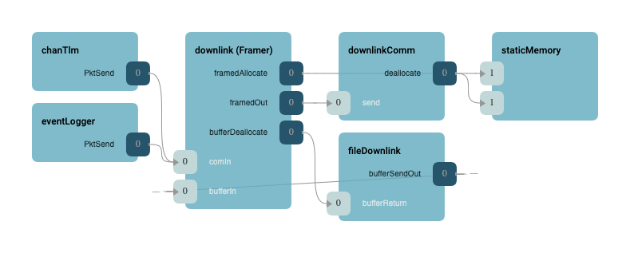
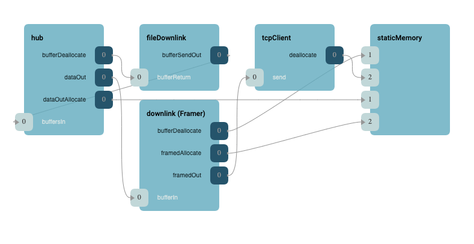
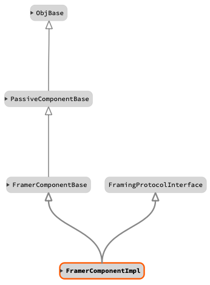

\page SvcFramerComponent Svc::Framer Component
# Svc::Framer Framer Component

The Framer component is used to frame packets for downlink. It translates between the service layer (typically TlmChan, ActiveLogger, and FileDownlink) and the driver layer (Drv), where service typically deals with F´ types and the driver layer deals in streams of bytes. Framer serializes the F´ types into a stream of bytes and adds header/footer information to ensure transmission integrity. As an argument to `setup()` function Framer accepts a reference to a `FramingProtocol` to do the actual header/data/footer serialization. Users may substitute the framing protocol without changing the F´ topology hook-ups. 

## Usage Examples
When using Framer component, the manager component (typically a service layer or a generic hub) initiates the transfer of data by calling bufferIn port. The Framer component will perform the serialization per `FramingProtocol` and will transfer the stream via bufferOut port.

The following diagram is an example of framer usage with chanTlm and eventLogger:



The following diagram is an example of framer usage with a generic hub and TcpClient:



The following is a typical example of Framer usage:

```c++
Svc::FprimeFraming framing_obj; // Framing protocol obj;
Svc::FramerComponentImpl downlink_obj("Framer"); // Framer obj

downlink_obj.init(0);
downlink_obj.setup(framing_obj);

...

Fw::Buffer buf; // This could be data from bufferIn port
downlink_obj.send(buf); // Send framed buffer to a port connected to bufferOut
```

## Class Diagram



## Requirements

| Name | Description | Validation |
|---|---|---|
| TBD | TBD | TBD |

## Change Log

| Date | Description |
|---|---|
| 2021-01-29 | Initial Draft |