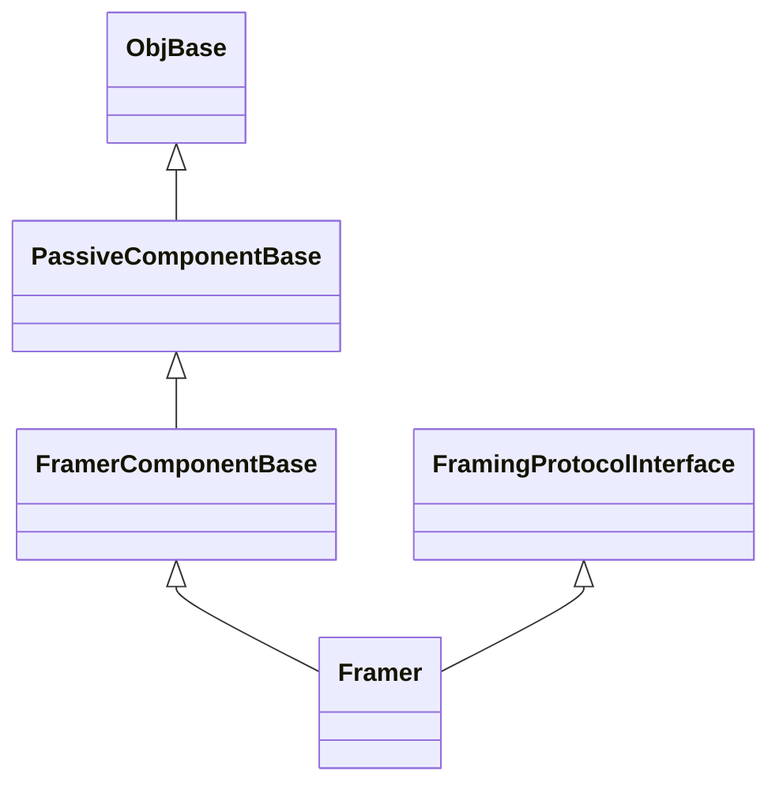

\page SvcFramerComponent Svc::Framer Component
# Svc::Framer (Passive Component)

## 1. Introduction

`Svc::Framer` is a passive component.
It is part of the standard path for F Prime data downlink.
It accepts data packets from service layer components, typically
instances of [`Svc::TlmChan`](../../TlmChan/docs/sdd.md),
[`Svc::ActiveLogger`](../../ActiveLogger/docs/sdd.md),
or [`Svc::FileDownlink`](../../FileDownlink/docs/sdd.md).
For each packet _P_ received, it wraps _P_ in a frame _F_
and sends _F_ to a component instance that downlinks frames,
for example, [`Drv::TcpClient`](../../../Drv/TcpClient/docs/sdd.md).

When instantiating `Framer`, you must provide an implementation
of [`Svc::FramingProtocol`](../../FramingProtocol/docs/sdd.md).
This implementation specifies exactly what is
in each frame; typically it is a frame header, a data packet, and a hash value.

## 2. Assumptions

1. For any deployment _D_ that uses an instance _I_ of `Framer`, the
   deframing protocol used with _I_ matches the downlink protocol of
   any ground system that receives frames from _I_.

## 3. Requirements

Requirement | Description | Rationale | Verification Method
----------- | ----------- | ----------| -------------------
SVC-FRAMER-001 | `Svc::Framer` shall accept data packets of unspecified type stored in `Fw::Com` buffers. | `Svc::ActiveLogger` and `Svc::ChanTlm` emit packets as `Fw::Com` buffers.| Unit test
SVC-FRAMER-002 | `Svc::Framer` shall accept file packets stored in `Fw::Buffer` objects. | `Svc::FileDownlink` emits packets as `Fw::Buffer` objects. | Unit test
SVC-FRAMER-003 | `Svc::Framer` shall use an instance of `Svc::FramingProtocol`, supplied when the component is instantiated, to wrap packets in frames. | The purpose of `Svc::Framer` is to frame data packets. Using the `Svc::FramingProtocol` interface allows the same Framer component to operate with different protocols. | Unit test

## 4. Design

### 4.1. Component Diagram

The diagram below shows the `Framer` component.

<div>

</div>

### 4.2. Ports

| Kind | Name | Port Type | Usage |
|------|------|-----------|-------|
| `guarded input` | `comIn` | `Fw.Com` | Port for receiving data packets of unspecified type stored in statically-sized Fw::Com buffers |
| `guarded input` | `bufferIn` | `Fw.BufferSend` | Port for receiving file packets stored in dynamically-sized Fw::Buffer objects |
| `output` | `bufferDeallocate` | `Fw.BufferSend` | Port for deallocating buffers received on bufferIn, after copying packet data to the frame buffer |
| `output` | `framedAllocate` | `Fw.BufferGet` | Port for allocating buffers to hold framed data |
| `output` | `framedOut` | `Drv.ByteStreamSend` | Port for sending buffers containing framed data. Ownership of the buffer passes to the receiver. |

<a name="derived-classes"></a>
### 4.3. Derived Classes

`Framer` is derived from `FramerComponentBase` as usual.
It is also derived (via C++ multiple inheritance) from
[`Svc::FramingProtocolInterface`](../../FramingProtocol/docs/sdd.md).
The multiple inheritance makes the `Framer` instance into the
instance of `Svc::FramingProtocolInterface` that is required
to use `Svc::FramingProtocol`.
See <a href="#fpi-impl">below</a> for a description of how `Framer` implements
`DeframingProtocolInterface`.

Here is a class diagram for `Framer`:



### 4.4. State

`Framer` maintains the following state:

1. `m_protocol`: A pointer to the implementation of `FramingProtocol`
   used for framing.

### 4.5. Header File Configuration

None.

### 4.6. Runtime Setup

To set up an instance of `Framer`, you do the following:

1. Call the constructor and the `init` method in the usual way
for an F Prime passive component.

1. Call the `setup` method, passing in an instance _P_ of `Svc::FramingProtocol`.
The `setup` method does the following:

   1. Store a pointer to _P_ in `m_protocol`.

   1. Pass `*this` into the setup method for _P_.
      As noted <a href="#derived-classes">above</a>, `*this`
      is the instance of `Svc::FramingProtocolInterface`
      used by _P_.

For an example of setting up a `Framer` instance, see the
`downlink` instance in [`Ref/Top/instances.fpp`](../../../Ref/Top/instances.fpp).

### 4.7. Port Handlers

#### 4.7.1. comIn

The `comIn` port handler receives an `Fw::Com` buffer _B_ and an integer
context value.
It calls the `frame` method of `m_protocol`, passing in the
address and length of _B_ and the packet type
`Fw::ComPacket::FW_PACKET_UNKNOWN`.

#### 4.7.2. bufferIn

The `bufferIn` port handler receives an `Fw::Buffer` object _B_.
It calls the `frame` method of `m_protocol`, passing in the
data address and size of _B_ and the packet type
`Fw::ComPacket::FW_PACKET_FILE`.

<a name="fpi-impl"></a>
### 4.8. Implementation of Svc::DeframingProtocolInterface

<a name="allocate"></a>
#### 4.8.1. allocate

The implementation of `allocate` invokes `framedAllocate`.

<a name="send"></a>
#### 4.8.2. send

The implementation of `send` takes a reference to an `Fw::Buffer`
_B_ representing framed data and does the following:

1. Invoke `framedOut`, passing in _B_ as the argument.

1. Check the return status of the invocation. 
If the return status is not `Drv::SendStatus::SEND_OK`, then
use `Fw::Logger::logMsg` to log an error message.
Don't send an event report in this case, because downlink is
apparently not working.

### 4.9. Helper Functions

TODO

## 5. Ground Interface

TODO

## 6. Example Uses

### 6.1. Topology Diagrams

When using Framer component, the manager component (typically a service layer
or a generic hub) initiates the transfer of data by calling bufferIn port. The
Framer component will perform the serialization per `FramingProtocol` and will
transfer the stream via bufferOut port.

The following diagram is an example of framer usage with chanTlm and eventLogger:


The following diagram is an example of framer usage with a generic hub and TcpClient:


The following is a typical example of Framer usage:

```c++
Svc::FprimeFraming framing_obj; // Framing protocol obj;
Svc::FramerComponentImpl downlink_obj("Framer"); // Framer obj

downlink_obj.init(0);
downlink_obj.setup(framing_obj);

...

Fw::Buffer buf; // This could be data from bufferIn port
downlink_obj.send(buf); // Send framed buffer to a port connected to bufferOut
```

### 6.2. Sequence Diagrams

TODO

## 7. Change Log

| Date | Description |
|---|---|
| 2021-01-29 | Initial Draft |
