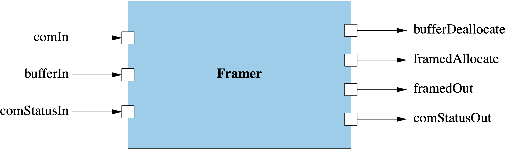

\page SvcFramerComponent Svc::Framer Component
# Svc::Framer (Passive Component)

## 1. Introduction

`Svc::Framer` is a passive component.
It is part of the standard path for F Prime data downlink.
It accepts data packets from service layer components, for example
instances of [`Svc::TlmChan`](../../TlmChan/docs/sdd.md),
[`Svc::ActiveLogger`](../../ActiveLogger/docs/sdd.md),
or [`Svc::FileDownlink`](../../FileDownlink/docs/sdd.md).
For each packet _P_ received, it wraps _P_ in a frame _F_
and sends _F_ to a byte stream driver that downlinks frames,
for example, [`Drv::TcpClient`](../../../Drv/TcpClient/docs/sdd.md).

When instantiating `Framer`, you must provide an implementation
of [`Svc::FramingProtocol`](../../FramingProtocol/docs/sdd.md).
This implementation specifies exactly what is
in each frame; typically it is a frame header, a data packet, and a hash value.
You can use the standard F Prime downlink protocol implementation.
This implementation works with the F Prime ground data system (GDS).

`Svc::Framer` is designed to act alongside instances of the
[communication adapter interface](https://nasa.github.io/fprime/Design/communication-adapter-interface.html). In order
to work well with communication adapters, `Svc::Framer` implements the framer status
[protocol](https://nasa.github.io/fprime/Design/communication-adapter-interface.html#framer-status-protocol).

## 2. Assumptions

1. For any deployment _D_ that uses an instance _I_ of `Framer`, the
   framing protocol used with _I_ matches the downlink protocol of
   any ground system that receives frames from _I_.

## 3. Requirements

| Requirement      | Description                                                                                                                            | Rationale                                                                                                                                                               | Verification Method |
|------------------|----------------------------------------------------------------------------------------------------------------------------------------|-------------------------------------------------------------------------------------------------------------------------------------------------------------------------|---------------------|
| SVC-FRAMER-001   | `Svc::Framer` shall accept data packets of any type stored in `Fw::Com` buffers.                                                       | `Svc::ActiveLogger` and `Svc::ChanTlm` emit packets as `Fw::Com` buffers.                                                                                               | Unit test           |
| SVC-FRAMER-002   | `Svc::Framer` shall accept file packets stored in `Fw::Buffer` objects.                                                                | `Svc::FileDownlink` emits packets as `Fw::Buffer` objects.                                                                                                              | Unit test           |
| SVC-FRAMER-003   | `Svc::Framer` shall use an instance of `Svc::FramingProtocol`, supplied when the component is instantiated, to wrap packets in frames. | The purpose of `Svc::Framer` is to frame data packets. Using the `Svc::FramingProtocol` interface allows the same Framer component to operate with different protocols. | Unit test           |
| SVC-FRAMER-004   | `Svc::Framer` shall emit a status of `Fw::Success::SUCCESS`  when no framed packets were sent in response to incoming buffer.          | `Svc::Framer` implements the framer status protocol.                                                                                                                    | Unit Test           |
| SVC-FRAMER-005   | `Svc::Framer` shall forward `Fw::Success` status messages received                                                                     | `Svc::Framer` implements the framer status protocol.                                                                                                                    | Unit Test           |

## 4. Design

### 4.1. Component Diagram

The diagram below shows the `Framer` component.

### 4.2. Ports

| Kind            | Name               | Port Type             | Usage                                                                                             |
|-----------------|--------------------|-----------------------|---------------------------------------------------------------------------------------------------|
| `guarded input` | `comIn`            | `Fw.Com`              | Port for receiving data packets of any type stored in statically-sized Fw::Com buffers            |
| `guarded input` | `bufferIn`         | `Fw.BufferSend`       | Port for receiving file packets stored in dynamically-sized Fw::Buffer objects                    |
| `guarded input` | `comStatusIn`      | `Fw.SuccessCondition` | Port for receiving status of last send for implementing communication adapter interface protocol  |
| `output`        | `bufferDeallocate` | `Fw.BufferSend`       | Port for deallocating buffers received on bufferIn, after copying packet data to the frame buffer |
| `output`        | `framedAllocate`   | `Fw.BufferGet`        | Port for allocating buffers to hold framed data                                                   |
| `output`        | `framedOut`        | `Drv.ByteStreamSend`  | Port for sending buffers containing framed data. Ownership of the buffer passes to the receiver.  |
| `output`        | `comStatusOut`     | `Fw.SuccessCondition` | Port for sending communication adapter interface protocol status messages                         |

### 4.3. Derived Classes

`Framer` is derived from `FramerComponentBase` as usual.
It is also derived (via C++ multiple inheritance) from
[`Svc::FramingProtocolInterface`](../../FramingProtocol/docs/sdd.md).
The multiple inheritance makes the `Framer` instance into the
instance of `Svc::FramingProtocolInterface` that is required
to use `Svc::FramingProtocol`.
See <a href="#fpi-impl">below</a> for a description of how `Framer` implements
`FramingProtocolInterface`.

Here is a class diagram for `Framer`:

### 4.4. State

`Framer` maintains the following state:

1. `m_protocol`: A pointer to the implementation of `FramingProtocol`
   used for framing.

### 4.5. Header File Configuration

None.

### 4.6. Runtime Setup

To set up an instance of `Framer`, you do the following:

1. Call the constructor and the `init` method in the usual way
for an F Prime passive component.

1. Call the `setup` method, passing in an instance _P_ of `Svc::FramingProtocol`.
The `setup` method does the following:

   1. Store a pointer to _P_ in `m_protocol`.

   1. Pass `*this` into the setup method for _P_.
      As noted <a href="#derived-classes">above</a>, `*this`
      is the instance of `Svc::FramingProtocolInterface`
      used by _P_.

For an example of setting up a `Framer` instance, see the
`downlink` instance in [`Ref/Top/instances.fpp`](../../../Ref/Top/instances.fpp).

### 4.7. Port Handlers

#### 4.7.1. comIn

The `comIn` port handler receive a reference to an `Fw::Com` buffer _B_
and an integer context value.
It calls the `frame` method of `m_protocol`, passing in the
address and length of _B_ and the packet type
`Fw::ComPacket::FW_PACKET_UNKNOWN`.

#### 4.7.2. bufferIn

The `bufferIn` port handler receives a reference to an  `Fw::Buffer`
object _B_.
It calls the `frame` method of `m_protocol`, passing in the
data address and size of _B_ and the packet type
`Fw::ComPacket::FW_PACKET_FILE`.

#### 4.7.2. comStatusIn

The `comStatusIn` port handler receives com status messages and forwards them out `comStatusOut`.

### 4.8. Implementation of Svc::FramingProtocolInterface

#### 4.8.1. allocate

The implementation of `allocate` invokes `framedAllocate`.

#### 4.8.2. send

The implementation of `send` takes a reference to an `Fw::Buffer`
_B_ representing framed data and does the following:

1. Invoke `framedOut`, passing in _B_ as the argument.

1. Check the return status of the invocation. 
If the return status is not `Drv::SendStatus::SEND_OK`, then
use `Fw::Logger::logMsg` to log an error message.
Don't send an event report in this case, because downlink is
apparently not working.

## 5. Ground Interface

None.

If an error occurs, `Framer` writes to the system log.
The rationale is that if something is wrong with the framing, then
downlink of events is unlikely to work.

## 6. Example Uses

### 6.1. Topology Diagrams

The following topology diagrams show how to connect `Svc::Framer`
to a telemetry database, an event collector, a file downlink component,
and a byte stream driver.
The diagrams use the following instances:

* `comm`: An instance of
[`Drv::ByteStreamDriverModel`](../../../Drv/ByteStreamDriverModel/docs/sdd.md), for example
[`Drv::TcpClient`](../../../Drv/TcpClient/docs/sdd.md).

* `buffMgr`: An instance of [`Svc::BufferManager`](../../BufferManager/docs/sdd.md)

* `fileDownlink`: An instance of [`Svc::FileDownlink`](../../FileDownlink/docs/sdd.md).

* `framer`: An instance of `Svc::Framer`.

* `chanTlm`: An instance of [`Svc::TlmChan`](../../TlmChan/docs/sdd.md).

* `eventLogger`: An instance of [`Svc::ActiveLogger`](../../ActiveLogger/docs/sdd.md).

**Topology 1: Telemetry packets:**

The `chanTlm` instance sends telemetry packets to the `framer` instance.

**Topology 2: Event packets:**

The `eventLogger` instance sends event packets to the `framer` instance.

**Topology 3: File packets:**

The `fileDownlink` instance sends a sequence of file packets,
representing a complete file, to the `framer` instance.
The sending happens in the following sequence:

1. `fileDownlink` sends a buffer _PB_ containing a file packet.

1. `framer` receives and processes _PB_.
When it is done, it returns _PB_ to `fileDownlink`.

1. Upon receipt of _PB_, if another file packet is available,
`fileDownlink` sends it.

Exchanging the buffer controls the rate at which
`fileDownlink` sends file packets.
It ensures that the rate does not exceed the rate at which `framer`
can handle the packets.

**Topology 4: Framed data:**

`framer` allocates frame buffers from `buffMgr`.
It sends buffers containing frames to `comm`.
`comm` processes the buffers and sends them to
`buffMgr` for deallocation.

### 6.2. Sequence Diagrams

In the following diagrams, open vertical rectangles represent threads.
Vertical dashed lines represent component code.
Solid horizontal arrows represent synchronous port invocations, and open
horizontal arrows represent asynchronous port invocations.

These diagrams assume that, in the
<a href="#runtime-setup">implementation of `Svc::FramingProtocol`
passed in at initialization</a>,
each downlink frame contains a single packet.
This is a common use case; for example, the F Prime standard downlink protocol
is implemented this way.

#### 6.2.1. Sending a Telemetry Packet

The following diagram shows what happens when `chanTlm`
sends a telemetry packet to `framer`.

#### 6.2.2. Sending an Event Packet

The following diagram shows what happens when `eventLogger`
sends an event packet to `framer`.

#### 6.2.3. Sending a File Packet

The following diagram shows what happens when `fileDownlink`
sends a file packet to `framer`.

