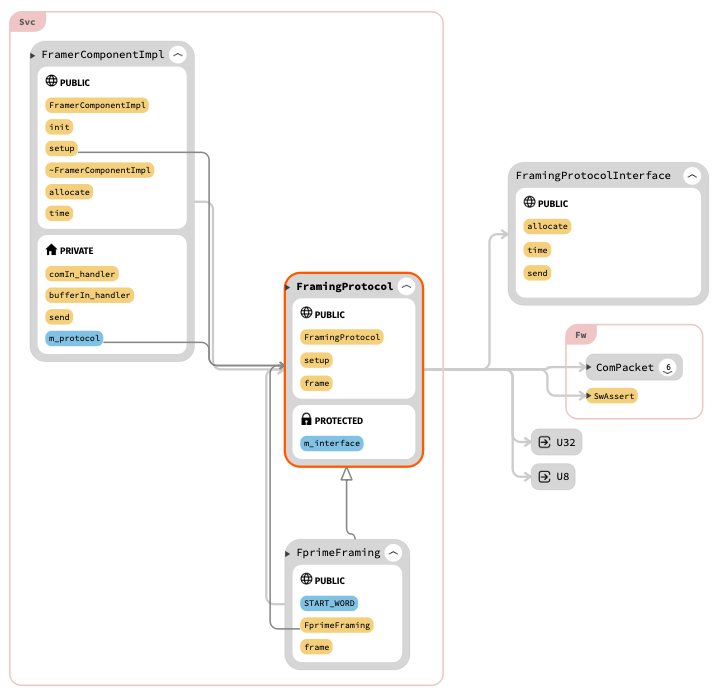
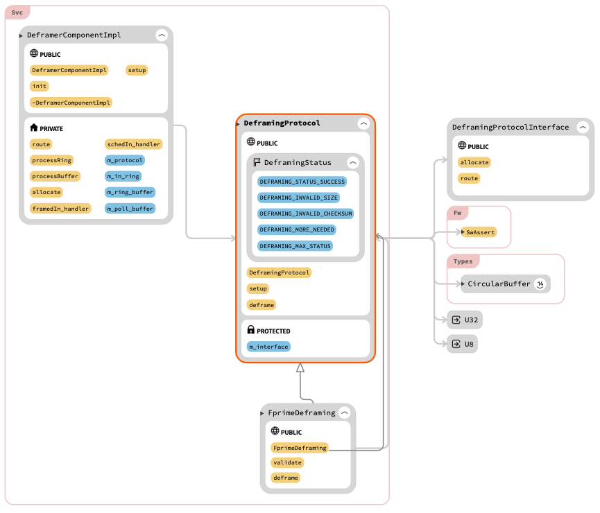

\page SvcFramingProtocol Svc::FramingProtocol Protocol
# Svc::FramingProtocol Library

The `FramingProtocol` library defines the interfaces to the
framing and deframing
protocols used by the `Svc::Framer` and `Svc::Deframer` components.
`Svc::Framer` uses a framing protocol to wrap data in frames
for transmission to the ground.
`Svc::Deframer` uses a deframing protocol to extract
data from frames received from the ground.
The `FramingProtocol` library allows each of these components to operate with
any one of several protocols.
Each protocol corresponds to a different implementation
of an interface provided by this library.

This library implements default F' protocols that work with
the F' Ground Data System (GDS).
The F' protocols use the following frame format: frame
header, data, hash value.
A frame header consists of a four-byte start word `0xDEADBEEF`
and a four byte data size.
The hash value is defined by the `Utils::Hash` library.

Users may provide new protocols by implementing the abstract classes
defined in the `FramingProtocol` library.

## 1. Requirements

| Requirement             | Description                                                                                                                 | Verification Method |
|-------------------------|-----------------------------------------------------------------------------------------------------------------------------|---------------------|
| Svc-FramingProtocol-001 | `Svc::FramingProtocol` shall provide the interface to a protocol for wrapping data in frames for transmission to the ground | Unit test           |
| Svc-FramingProtocol-002 | `Svc::FramingProtocol` shall provide the interface to a protocol for extracting data from frames received from the ground   | Unit test           |
| Svc-FramingProtocol-003 | `Svc::FramingProtocol` shall implement the framing and deframing protocols used by the F Prime GDS                          | Unit test           |

## 2. Using the Interface

### 2.1. Framing

To use the F' framing protocol, do the following:

1. Instantiate the class `FprimeFraming` defined in this library.

1. Instantiate the `Svc::Framer` component, passing the instance
created in step 1 to its `setup` method.

For an example, see the definition of the instance `downlink`
at `Ref/Top/instances.fpp`.

To implement and use a new framing protocol, do the following:

1. Implement the abstract class `FramingProtocolInterface`
as discussed in Section 3.1.
This class defines helper operations used when framing a packet.

1. Implement the abstract class `FramingProtocol` as discussed
in Section 3.1.
This class defines the operation of framing a data packet.

1. Instantiate the class implemented in step 1.

1. Instantiate the class implemented in step 2, passing
the instance created in step 3 to its `setup` method.

1. Instantiate the `Svc::Framer` component, passing the instance created
in step 4 to its `setup` method.

### 2.2. Deframing

To use the F' deframing protocol, do the following:

1. Instantiate the class `FprimeDeframing` defined in this library.

1. Instantiate the `Svc::Deframer` component, passing the instance
created in step 1 to its `setup` method.

For an example, see the definition of the instance `uplink`
at `Ref/Top/instances.fpp`.

To implement and use a new deframing protocol, do the following:

1. Implement the abstract class `DeframingProtocolInterface`
as discussed in Section 3.2.
This class defines helper operations used when deframing a framed
packet.

1. Implement the abstract class `DeframingProtocol` as discussed
in Section 3.2.
This class defines the operation of deframing a framed packet.

1. Instantiate the class implemented in step 1.

1. Instantiate the class implemented in step 2, passing
the instance created in step 3 to its `setup` method.

1. Instantiate the `Svc::Deframer` component, passing the instance created
in step 4 to its `setup` method.

## 3. Implementing a Protocol

### 3.1. Framing

To implement a framing protocol, do the following:

1. Implement the abstract class `FramingProtocolInterface`.

2. Use the implementation in step 1 to implement the abstract class
`FramingProtocol`.

Implementations of the framing protocol are allowed to produce zero or one frame
for each incoming packet. Producing zero packets is useful when aggregating packets
into a larger frame. Producing more than one packet is not permitted.

#### 3.1.1. Implementing `FramingProtocolInterface`

`FramingProtocolInterface` defines helper methods for framing data.
Typically these methods are implemented by an F Prime component (e.g., `Svc::Framer`),
because they require port invocations.
The component `Svc::Framer` provides an implementation of `FramingProtocolInterface`
that you can use.
It does this by inheriting from `FramingProtocolInterface` and implementing
its abstract methods.

To implement `FramingProtocolInterface`, you must implement the following
pure virtual methods:

```c++
    virtual Fw::Buffer allocate(const U32 size) = 0;

    virtual void send(Fw::Buffer& outgoing) = 0;
```

The method `allocate` should accept a size in bytes and return an `Fw::Buffer`
that (1) points to a memory allocation of at least that size if the allocation
succeeded; or (2) has size zero if the allocation failed.
A typical implementation invokes a port connected to a memory allocation
component.

The method `send` should send the data stored in the buffer.
A typical implementation invokes an `Fw::BufferSend` port.

#### 3.1.2. Implementing `FramingProtocol`

`FramingProtocol` defines the operation of framing a packet.
To implement `FramingProtocol`, you must implement the following pure
virtual method:

```c++
virtual void frame(const U8* const data, const U32 size, Fw::ComPacket::ComPacketType packet_type) = 0;
```

This method is called with the following arguments:

* `data`: A pointer to the data to frame.

* `size`: The number of bytes to frame.

* `packet_type`: The type of data to frame.

The abstract class `FramingProtocol` provides a protected member `m_interface`.
This member is a pointer, initially null.
After the `setup` method of `FramingProtocol` is called, it
points to a concrete instance of `FramingProtocolInterface`.

Your implementation of `frame` should do the following:

1. Use `m_interface->allocate` to allocate a buffer to hold the framed data.

2. Frame the data into the buffer allocated in step 1.

3. Use `m_interface->send` to send the buffer. `m_interface->send` should be called at most once in any
single invocation of `frame`. Aggregating protocols may only call `m_interface->send` for occasional
invocations of `frame`.

### 3.2. Deframing

To implement a deframing protocol, do the following:

1. Implement the abstract class `DeframingProtocolInterface`.

1. Use the implementation in step 1 to implement the abstract class
`DeframingProtocol`.

#### 3.2.1. Implementing `DeframingProtocolInterface`

`DeframingProtocolInterface` defines helper methods for deframing data.
Typically these methods are implemented by an F Prime component (e.g., `Svc::Deframer`),
because they require port invocations.
The component `Svc::Deframer` provides an implementation of `DeframingProtocolInterface`
that you can use.
It does this by inheriting from `DeframingProtocolInterface` and implementing
its abstract methods.

To implement `DeframingProtocolInterface`, you must implement the following
pure virtual methods:

```c++
virtual Fw::Buffer allocate(const U32 size) = 0;

virtual void route(Fw::Buffer& data) = 0;
```

The method `allocate` should allocate memory, as described in
Section 3.1.1.

The method `route` should send (route) the data stored in the buffer.
A typical implementation invokes either an `Fw::Com` port (e.g., for sending
commands) or a `Fw::BufferSend` port (e.g., for sending file packets).

#### 3.2.2. Implementing `DeframingProtocol`

`DeframingProtocol` defines the operation of deframing a packet.
To implement `DeframingProtocol`, you must implement the following pure
virtual method:

```c++
virtual DeframingStatus deframe(Types::CircularBuffer& buffer, U32& needed) = 0;
```

This method is called with the following arguments:

* `buffer`: A circular buffer holding the data to deframe.

* `needed`: A reference for returning the number of bytes needed
for deframing.

`deframe` returns a value of type `DeframingStatus` indicating what happened.

The abstract class `DeframingProtocol` provides a protected member `m_interface`.
It operates as described in Section 3.1.2.

Your implementation of `deframe` should do the following:

1. Determine how many bytes are needed for deframing, peeking into
the circular buffer if necessary (e.g., to read a length).

1. If that many bytes are available in the circular buffer:

   1. Use `m_interface->allocate` to allocate an `Fw::Buffer`
to hold the deframed data.

   1. Deframe the data into the allocated buffer.
The deframing operation should read, but not delete bytes from,
the buffer.

   1. Use `m_interface->route` to send the buffer.

1. Set `needed` to record the number of bytes needed.

1. Return status.

## 4. Default F' Implementation

### 4.1. Framing

The F Prime framing protocol operates as follows:

1. Compute the size of the data stored in the frame (the "frame data size")

   1. If `packet_type` is `Fw::ComPacket::FW_PACKET_UNKNOWN`, then the frame data
size is the size of the provided data.

   1. Otherwise the frame data size is the size of the provided data plus four
bytes for the serialized packet type.

1. Compute the frame size: frame data size plus frame header size plus hash value size.

1. Allocate a buffer large enough to hold the frame.

1. Serialize the start word and frame data size into the buffer.
This operation forms the frame header.

1. Serialize the frame data:

   1. Serialize the packet type if known.

   1. Serialize the provided data.
**Note: The F Prime GDS assumes that the first four bytes of data are
the serialized packet type.
Therefore, if the packet type is unknown (no serialization in the previous step),
then the first four bytes of the incoming data must contain the
serialized packet type.**

1. Calculate and serialize the hash value.

1. Set the buffer size to the frame size, in case the allocator
returned a larger buffer.

1. Send the buffer.

### 4.2. Deframing

The F Prime deframing protocol operates as follows:

1. Check whether at least 8 bytes (the frame header size)
are available in the circular buffer.
If not, report that many bytes needed and return status.

1. Read the start word and data size out of the circular buffer.

1. Compute the frame size: frame header size plus data size plus hash value size.

1. Check that the frame size is valid.
If not, return with error.

1. Check that the circular buffer has enough bytes for the rest of the
frame.
If not, report the number of bytes needed and return status.

1. Validate the hash value.
If it is not valid, return status.

1. Allocate a buffer large enough to hold the frame data.
Set its size to be exactly the frame data size.

1. Serialize the frame data into the buffer.

1. Send the buffer.

1. Return success status.

## 5. Class Diagrams



Diagram view of DeframingProtocol:



*Diagrams generated with [SourceTrail](https://github.com/CoatiSoftware/Sourcetrail)*

## 6. Change Log

| Date | Description |
|---|---|
| 2021-01-30 | Initial Draft |
| 2021-02-15 | Revised |
