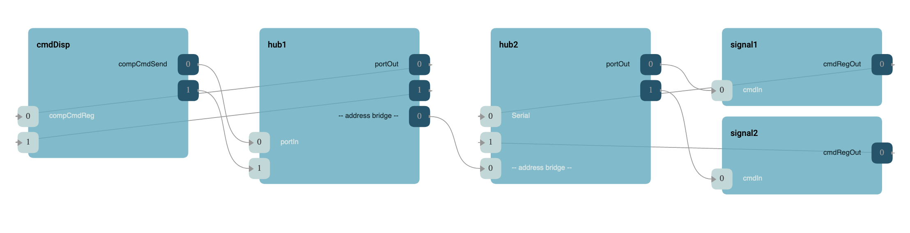
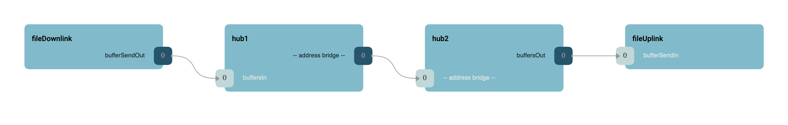
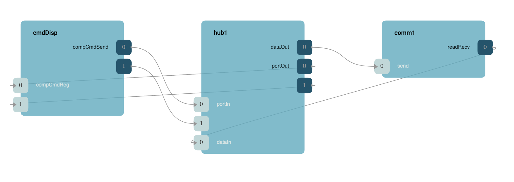
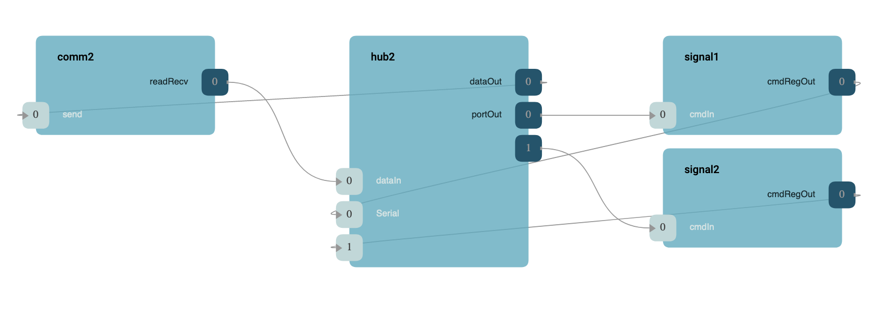

\page SvcGenericHubComponent Svc::GenericHub Component
# Svc::GenericHub Generic Hub Component

The Generic Hub component is an implementation of the F´ [hub pattern](https://nasa.github.io/fprime/UsersGuide/best/hub-pattern.html).
This pattern (and component) is used to bridge across an address space barrier between F´ deployments and route F´ port
calls to the remote deployment. It also receives incoming port calls from the remote component. Essentially, it is a
port multiplexer/demultiplexer that serializes the port calls to an `Fw::Buffer` object and outputs this data to an 
implementation of the `Drv::ByteStreamDriverModel` for transport out of the current deployment's address space.

**Note:** At this time, the hub drops send/receive errors.
Individual projects that need to monitor send/receive errors may need to add this functionality to the GenericHub [see idiosyncrasies](#idiosyncrasies)

## Design

The generic hub accepts incoming port calls using an array of Serial input ports. This allows any port call to be
bridged across the connection. There is also an incoming set of ports supporting `Fw::Buffer` type allowing the generic
hub to send generic byte data across (e.g. file packets) the connection. These connections are serialized into the outgoing 
connections to the driver. On the far side of the byte driver, another generic hub deserializes these port calls and buffer 
calls into normal F´ port calls on the new deployment as if they were made locally. 

Generic hub inputs on one hub should be parallel to the outputs on the other hub and vise-versa. 
It is also essential that users never pass a **pointer** into the generic hub, as pointer data will become invalid when it 
leaves the current address space. A sample configuration is shown below. Finally, the generic hub is bidirectional, so it
can operate on inputs and produce outputs as long as its remote counterpart is hooked up in parallel.

The hub also provides specific handlers for events and telemetry such that it can be used with telemetry and event
pattern specifiers in the topology.

### Example Formations

This section shows how to set up the generic hub component. It is broken into several separate views. This first shows
the top level of the formation. Here we connect a component on the left (command dispatcher) to several components on
the right (two signal generators). Both forward and reverse connections are shown. Notice the parallelism from the left
port calls from the command dispatcher to the port outputs to the components being commanded.



The next diagram show a similar setup to the first, except here we are using buffer transmission to support a file
downlink and uplink pair to show how the left deployment may "downlink" files to the right deployment. Both this and the
first diagram can be connected at the same time, and are split only to keep the diagrams less complex. Here the reverse
connections are omitted for simplicity.



The following diagram dives into the specific connections on the left side. Here incoming connection reach the hub and
the hub is connected to a driver. This driver carries the port calls to the other address space.



Finally, the following diagram shows the right side where the connections come out of the right side's driver and goes
into the hub which expands the port to the various right-side components.



## Configuration

Generic hub maximum output and input ports are configured using `AcConstants.ini` as shown below. Since hubs work in
tandem with another hub, the input ports on the first must match the output ports on the second. Both the number of port
and buffer inputs/outputs may be configured.

```ini
; Hub connections. Connections on all deployments should mirror these settings.
GenericHubInputPorts = 10
GenericHubOutputPorts = 10
GenericHubInputBuffers = 10
GenericHubOutputBuffers = 10
```

The above configuration may be used with both deployments hubs as the input/output pairs match.

To use the hub in a pattern specifier, include this in your topology:

```
    event connections instance hub
    telemetry connections instance hub
```

## Idiosyncrasies 

Currently, the `Drv::ByteStreamDriverModel` can report errors and failures. This generic hub component drops these errors.
Users who expect the driver to error should adapt this component to handle this issue. Future versions of this component
may correct this issue by calling to a fault port on error.

Connections are still required from the telemetry and event output ports to the system-wide event log and telemetry
handling components as the hub is not designed to look like a telemetry nor event source.

## Requirements

| Name | Description | Validation |
|---|---|---|
| GENHUB-001 | The generic hub shall receive incoming port and buffer calls | unit test |
| GENHUB-002 | The generic hub shall serialize the incoming port and buffer calls to an output port | unit test |
| GENHUB-003 | The generic hub shall deserialize the incoming serialize calls to output port and buffer calls | unit test |
| GENHUB-004 | The generic hub shall work with another generic hub to send port and buffer calls | unit test |

## Change Log

| Date | Description |
|---|---|
| 2020-12-21 | Initial Draft |
| 2021-01-29 | Updated |
| 2023-06-09 | Added telemetry and event helpers |
